# SSIS Package: WMS_DynamicsTransferOrderSalesOrderExtract

**Project:** WMS_DynamicsTransferAndSalesOrderExtract  
**Folder:** WMS  

## Architecture Diagram

```mermaid
flowchart TD
    subgraph Connections
        Azure_Service_Bus_conn(["Azure Service Bus [Azure Service Bus (KingswaySoft)]"])
        BearData_conn(["BearData [OLEDB]"])
        IntegrationStaging_conn(["IntegrationStaging [OLEDB]"])
        SMTP_conn(["SMTP [SMTP]"])
    end
    subgraph ControlFlow
        WMS_DynamicsTransferOrderSalesOrderExtract_task["WMS_DynamicsTransferOrderSalesOrderExtract"]
        SeqCont___New_task["SeqCont - New"]
        WMS_DynamicsTransferOrderSalesOrderExtract_task --> SeqCont___New_task
        Data_Flow___OutboundSOExport_task[/"Data Flow - OutboundSOExport"/]
        SeqCont___New_task --> Data_Flow___OutboundSOExport_task
        Data_Flow___OutboundTOExport_task[/"Data Flow - OutboundTOExport"/]
        Data_Flow___OutboundSOExport_task --> Data_Flow___OutboundTOExport_task
        Merge_Address_Dim_task["Merge Address Dim"]
        Data_Flow___OutboundTOExport_task --> Merge_Address_Dim_task
        Merge_Header_and__Detail_Rows_task["Merge Header and  Detail Rows"]
        Merge_Address_Dim_task --> Merge_Header_and__Detail_Rows_task
        Merge_Distribution_Detail_task["Merge Distribution Detail"]
        Merge_Header_and__Detail_Rows_task --> Merge_Distribution_Detail_task
        Merge_Distribution_Header_task["Merge Distribution Header"]
        Merge_Distribution_Detail_task --> Merge_Distribution_Header_task
        Truncate_Tables_task["Truncate Tables"]
        Merge_Distribution_Header_task --> Truncate_Tables_task
        SeqCont___Original_task["SeqCont - Original"]
        Truncate_Tables_task --> SeqCont___Original_task
        Data_Flow___OutboundSOExport_task[/"Data Flow - OutboundSOExport"/]
        SeqCont___Original_task --> Data_Flow___OutboundSOExport_task
        Data_Flow___OutboundSOExport____NO_line_number_task[/"Data Flow - OutboundSOExport  - NO line number"/]
        Data_Flow___OutboundSOExport_task --> Data_Flow___OutboundSOExport____NO_line_number_task
        Data_Flow___OutboundTOExport_task[/"Data Flow - OutboundTOExport"/]
        Data_Flow___OutboundSOExport____NO_line_number_task --> Data_Flow___OutboundTOExport_task
        Data_Flow___OutboundTOExport___no_line_number_task[/"Data Flow - OutboundTOExport - no line number"/]
        Data_Flow___OutboundTOExport_task --> Data_Flow___OutboundTOExport___no_line_number_task
        Merge_Address_Dim_task["Merge Address Dim"]
        Data_Flow___OutboundTOExport___no_line_number_task --> Merge_Address_Dim_task
        Merge_Header_and__Detail_Rows_task["Merge Header and  Detail Rows"]
        Merge_Address_Dim_task --> Merge_Header_and__Detail_Rows_task
        Merge_Distribution_Detail_task["Merge Distribution Detail"]
        Merge_Header_and__Detail_Rows_task --> Merge_Distribution_Detail_task
        Merge_Distribution_Header_task["Merge Distribution Header"]
        Merge_Distribution_Detail_task --> Merge_Distribution_Header_task
        Truncate_Tables_task["Truncate Tables"]
        Merge_Distribution_Header_task --> Truncate_Tables_task
        Send_Mail_Task_task["Send Mail Task"]
        Truncate_Tables_task --> Send_Mail_Task_task
    end
```

## Connection Managers

| Connection Name | Type |
|---|---|
| Azure Service Bus | Azure Service Bus (KingswaySoft) |
| BearData | OLEDB |
| IntegrationStaging | OLEDB |
| SMTP | SMTP |

## Control Flow Tasks

| Task Name | Type |
|---|---|
| WMS_DynamicsTransferOrderSalesOrderExtract | Microsoft.Package |
| SeqCont - New | STOCK:SEQUENCE |
| Data Flow - OutboundSOExport | Microsoft.Pipeline |
| Data Flow - OutboundTOExport | Microsoft.Pipeline |
| Merge Address Dim | Microsoft.ExecuteSQLTask |
| Merge Header and  Detail Rows | STOCK:SEQUENCE |
| Merge Distribution Detail | Microsoft.ExecuteSQLTask |
| Merge Distribution Header | Microsoft.ExecuteSQLTask |
| Truncate Tables | Microsoft.ExecuteSQLTask |
| SeqCont - Original | STOCK:SEQUENCE |
| Data Flow - OutboundSOExport | Microsoft.Pipeline |
| Data Flow - OutboundSOExport  - NO line number | Microsoft.Pipeline |
| Data Flow - OutboundTOExport | Microsoft.Pipeline |
| Data Flow - OutboundTOExport - no line number | Microsoft.Pipeline |
| Merge Address Dim | Microsoft.ExecuteSQLTask |
| Merge Header and  Detail Rows | STOCK:SEQUENCE |
| Merge Distribution Detail | Microsoft.ExecuteSQLTask |
| Merge Distribution Header | Microsoft.ExecuteSQLTask |
| Truncate Tables | Microsoft.ExecuteSQLTask |
| Send Mail Task | Microsoft.SendMailTask |

## Data Flow: Sources

| Component | Tables Referenced | SQL Preview |
|---|---|---|
|  |  | select distinct cast(PrimaryAddressDescription as varchar) PrimaryAddressDescription -- nvarchar 255 from erp.WarehouseMaster with (nolock) where PrimaryAddressDescription is not null |
|  |  | select Location_name as ShipToName from tblCostcoLocations |
|  |  | select  	api.StoreShipmentNumber,  	cast( 			case  				when api.ResponseBody like '%Transfer order%was created successully%' 					then substring(api.ResponseBody, charindex('Transfer order ', api.ResponseBody, 1)+15, 12) 				when api.ResponseBody like '%Intercompany sales order%has been created%' 					then replace(substring(api.ResponseBody, charindex('Intercompany sales order ', api.ResponseBody, |
|  |  | select  	api.StoreShipmentNumber,  	cast( 			case  				when api.ResponseBody like '%Transfer order%was created successully%' 					then substring(api.ResponseBody, charindex('Transfer order ', api.ResponseBody, 1)+15, 12) 				when api.ResponseBody like '%Intercompany sales order%has been created%' 					then replace(substring(api.ResponseBody, charindex('Intercompany sales order ', api.ResponseBody, |
|  |  | select distinct cast(PrimaryAddressDescription as varchar) PrimaryAddressDescription -- nvarchar 255 from erp.WarehouseMaster with (nolock) where PrimaryAddressDescription is not null |
|  |  | select Location_name as ShipToName from tblCostcoLocations |
|  |  | select  	api.StoreShipmentNumber,  	cast( 			case  				when api.ResponseBody like '%Transfer order%was created successully%' 					then substring(api.ResponseBody, charindex('Transfer order ', api.ResponseBody, 1)+15, 12) 				when api.ResponseBody like '%Intercompany sales order%has been created%' 					then replace(substring(api.ResponseBody, charindex('Intercompany sales order ', api.ResponseBody, |
|  |  | select distinct cast(PrimaryAddressDescription as varchar) PrimaryAddressDescription -- nvarchar 255 from erp.WarehouseMaster with (nolock) where PrimaryAddressDescription is not null |
|  |  | select Location_name as ShipToName from tblCostcoLocations |
|  |  | select  	api.StoreShipmentNumber,  	cast( 			case  				when api.ResponseBody like '%Transfer order%was created successully%' 					then substring(api.ResponseBody, charindex('Transfer order ', api.ResponseBody, 1)+15, 12) 				when api.ResponseBody like '%Intercompany sales order%has been created%' 					then replace(substring(api.ResponseBody, charindex('Intercompany sales order ', api.ResponseBody, |
|  |  | select  	api.StoreShipmentNumber,  	cast( 			case  				when api.ResponseBody like '%Transfer order%was created successully%' 					then substring(api.ResponseBody, charindex('Transfer order ', api.ResponseBody, 1)+15, 12) 				when api.ResponseBody like '%Intercompany sales order%has been created%' 					then replace(substring(api.ResponseBody, charindex('Intercompany sales order ', api.ResponseBody, |
|  |  | select  	api.StoreShipmentNumber,  	cast( 			case  				when api.ResponseBody like '%Transfer order%was created successully%' 					then substring(api.ResponseBody, charindex('Transfer order ', api.ResponseBody, 1)+15, 12) 				when api.ResponseBody like '%Intercompany sales order%has been created%' 					then replace(substring(api.ResponseBody, charindex('Intercompany sales order ', api.ResponseBody, |

## Data Flow: Destinations

| Component | Destination Table |
|---|---|
|  | [ERP].[DistributionAddressDimStage] |
|  | [ERP].[DistributionDetailStage] |
|  | [ERP].[DistributionHeaderStage] |
|  | [ERP].[DistributionDetailStage] |
|  | [ERP].[DistributionHeaderStage] |
|  | [ERP].[DistributionAddressDimStage] |
|  | [ERP].[DistributionDetailStage] |
|  | [ERP].[DistributionHeaderStage] |
|  | [ERP].[DistributionAddressDimStage] |
|  | [ERP].[DistributionDetailStage] |
|  | [ERP].[DistributionHeaderStage] |
|  | [ERP].[DistributionDetailStage] |
|  | [ERP].[DistributionHeaderStage] |
|  | [ERP].[DistributionDetailStage] |
|  | [ERP].[DistributionHeaderStage] |

