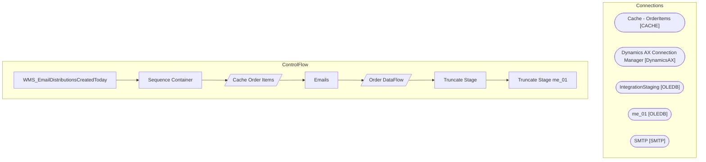

# SSIS Package: WMS_EmailDistributionsCreatedToday

**Project:** WMS_EmailDistributionsCreatedToday  
**Folder:** WMS  

## Architecture Diagram

## Connection Managers

| Connection Name | Type |
|---|---|
| Cache - OrderItems | CACHE |
| Dynamics AX Connection Manager | DynamicsAX |
| IntegrationStaging | OLEDB |
| me_01 | OLEDB |
| SMTP | SMTP |

## Control Flow Tasks

| Task Name | Type |
|---|---|
| WMS_EmailDistributionsCreatedToday | Microsoft.Package |
| Sequence Container | STOCK:SEQUENCE |
| Cache Order Items | Microsoft.Pipeline |
| Emails | Microsoft.ExecuteSQLTask |
| Order DataFlow | Microsoft.Pipeline |
| Truncate Stage | Microsoft.ExecuteSQLTask |
| Truncate Stage me_01 | Microsoft.ExecuteSQLTask |

## Data Flow: Sources

| Component | Tables Referenced | SQL Preview |
|---|---|---|
|  |  | select  	im.ItemNumber,  	coalesce( 				case when p.ProductName='' then Null else p.ProductName end, 				case when p.ProductSearchName='' then Null else p.ProductSearchName end, 				case when p.ProductDescription='' then Null else p.ProductDescription end 			) as ProductDescription from WMS.ItemMaster im with (nolock) join wms.ItemMasterProducts p with (nolock) on im.ItemNumber=p.ProductNumber whe |
|  |  | select  --	WarehouseID, 	LocationCode, 	PrimaryAddressDescription from erp.vwWarehouseIDToLocationCode where Entity=1100 |
|  |  | select  cast(WarehouseID as nvarchar) as WarehouseID,  	LocationCode from erp.vwWarehouseIDToLocationCode  where Entity=1100 |

## Data Flow: Destinations

| Component | Destination Table |
|---|---|
|  | [tmpDynamicsOrderItems] |
|  | [dbo].[tmpDynamicsOrderItems] |
|  | [tmpSupplyOrdersStaged] |

