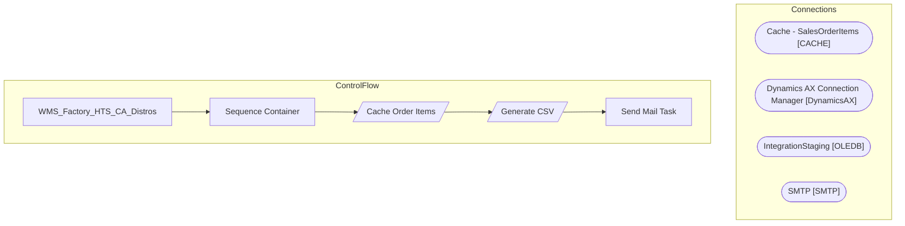

# SSIS Package: WMS_Factory_HTS_CA_Distros

**Project:** WMS_Factory_HTS_CA_Distros  
**Folder:** WMS  

## Architecture Diagram

## Connection Managers

| Connection Name | Type |
|---|---|
| Cache - SalesOrderItems | CACHE |
| Dynamics AX Connection Manager | DynamicsAX |
| IntegrationStaging | OLEDB |
| SMTP | SMTP |

## Control Flow Tasks

| Task Name | Type |
|---|---|
| WMS_Factory_HTS_CA_Distros | Microsoft.Package |
| Sequence Container | STOCK:SEQUENCE |
| Cache Order Items | Microsoft.Pipeline |
| Generate CSV | Microsoft.Pipeline |
| Send Mail Task | Microsoft.SendMailTask |

## Data Flow: Sources

| Component | Tables Referenced | SQL Preview |
|---|---|---|
|  |  | select ProductNumber, ProductName, HarmonizedSystemCode, CountryOfOrigin from [WMS].[vwItemsWithoutHTS_COO_Factory] where isnull(HarmonizedSystemCode,'')='' or isnull(CountryOfOrigin,'') ='' |

## Data Flow: Destinations

_No OLE DB data flow destinations detected._

