# SSIS Package: WMS_InventoryAdjustments

**Project:** WMS_InventoryAdjustments  
**Folder:** WMS  

## Architecture Diagram

```mermaid
flowchart TD
    subgraph Connections
        Azure_Service_Bus_conn(["Azure Service Bus [Azure Service Bus (KingswaySoft)]"])
        IntegrationStaging_conn(["IntegrationStaging [OLEDB]"])
        SMTP_conn(["SMTP [SMTP]"])
    end
    subgraph ControlFlow
        WMS_InventoryAdjustments_task["WMS_InventoryAdjustments"]
        Seq___Create_Pipeline_File_task["Seq - Create Pipeline File"]
        WMS_InventoryAdjustments_task --> Seq___Create_Pipeline_File_task
        spPrintInventoryAdjustments_task["spPrintInventoryAdjustments"]
        Seq___Create_Pipeline_File_task --> spPrintInventoryAdjustments_task
        Seq___Stage_and_Merge_from_Azure_Service_Bus_task["Seq - Stage and Merge from Azure Service Bus"]
        spPrintInventoryAdjustments_task --> Seq___Stage_and_Merge_from_Azure_Service_Bus_task
        Data_Flow___outboundinvadj_aptos_task[/"Data Flow - outboundinvadj-aptos"/]
        Seq___Stage_and_Merge_from_Azure_Service_Bus_task --> Data_Flow___outboundinvadj_aptos_task
        Merge_InventoryAdjustments_task["Merge InventoryAdjustments"]
        Data_Flow___outboundinvadj_aptos_task --> Merge_InventoryAdjustments_task
        Truncate_Stage_task["Truncate Stage"]
        Merge_InventoryAdjustments_task --> Truncate_Stage_task
        Send_Mail_Task_task["Send Mail Task"]
        Truncate_Stage_task --> Send_Mail_Task_task
    end
```

## Connection Managers

| Connection Name | Type |
|---|---|
| Azure Service Bus | Azure Service Bus (KingswaySoft) |
| IntegrationStaging | OLEDB |
| SMTP | SMTP |

## Control Flow Tasks

| Task Name | Type |
|---|---|
| WMS_InventoryAdjustments | Microsoft.Package |
| Seq - Create Pipeline File | STOCK:SEQUENCE |
| spPrintInventoryAdjustments | Microsoft.ExecuteSQLTask |
| Seq - Stage and Merge from Azure Service Bus | STOCK:SEQUENCE |
| Data Flow - outboundinvadj-aptos | Microsoft.Pipeline |
| Merge InventoryAdjustments | Microsoft.ExecuteSQLTask |
| Truncate Stage | Microsoft.ExecuteSQLTask |
| Send Mail Task | Microsoft.SendMailTask |

## Data Flow: Sources

_No OLE DB data flow sources detected._

## Data Flow: Destinations

| Component | Destination Table |
|---|---|
|  | [WMS].[InventoryAdjustmentsStage] |

