# SSIS Package: WMS_ItemCreate

**Project:** WMS_ItemCreate  
**Folder:** WMS  

## Architecture Diagram

```mermaid
flowchart TD
    subgraph Connections
        ArchiveFolder_conn(["ArchiveFolder [FILE]"])
        Flat_File_Connection_Manager_conn(["Flat File Connection Manager [FLATFILE]"])
        GetBlobUrl_conn(["GetBlobUrl [HTTP (KingswaySoft)]"])
        GetStatus_conn(["GetStatus [HTTP (KingswaySoft)]"])
        IntegrationStaging_conn(["IntegrationStaging [OLEDB]"])
        ItemCreateXML_conn(["ItemCreateXML [FLATFILE]"])
        ItemUpcXML_conn(["ItemUpcXML [FLATFILE]"])
        ME_01_conn(["ME_01 [OLEDB]"])
        PostTriggerImport_conn(["PostTriggerImport [HTTP (KingswaySoft)]"])
        silverdeltalake_conn(["silverdeltalake [OLEDB]"])
        SMTP_EMAIL_conn(["SMTP_EMAIL [SMTP]"])
        XML_FILES_conn(["XML FILES [FILE]"])
    end
    subgraph ControlFlow
        WMS_ItemCreate_task["WMS_ItemCreate"]
        File_Generation_and_Move_task["File Generation and Move"]
        WMS_ItemCreate_task --> File_Generation_and_Move_task
        Foreach_Loop___Per_Entity_task["Foreach Loop - Per Entity"]
        File_Generation_and_Move_task --> Foreach_Loop___Per_Entity_task
        Item_Sequence_task["Item Sequence"]
        Foreach_Loop___Per_Entity_task --> Item_Sequence_task
        Foreach_Item_Create_task["Foreach Item Create"]
        Item_Sequence_task --> Foreach_Item_Create_task
        Foreach_Loop_Container_task["Foreach Loop Container"]
        Foreach_Item_Create_task --> Foreach_Loop_Container_task
        Archive_Files_task["Archive Files"]
        Foreach_Loop_Container_task --> Archive_Files_task
        azCopy_to_Blob_task["azCopy to Blob"]
        Archive_Files_task --> azCopy_to_Blob_task
        ProcessStatus_For_Loop_task["ProcessStatus For Loop"]
        azCopy_to_Blob_task --> ProcessStatus_For_Loop_task
        Get_Summary_Status_task[/"Get Summary Status"/]
        ProcessStatus_For_Loop_task --> Get_Summary_Status_task
        Set_ProcessStatus_task["Set ProcessStatus"]
        Get_Summary_Status_task --> Set_ProcessStatus_task
        Wait_task["Wait"]
        Set_ProcessStatus_task --> Wait_task
        Set_BatchID___LoopCount_task["Set BatchID - LoopCount"]
        Wait_task --> Set_BatchID___LoopCount_task
        Set_RowsCount_task["Set RowsCount"]
        Set_BatchID___LoopCount_task --> Set_RowsCount_task
        Stage_Blob_URL_task[/"Stage Blob URL"/]
        Set_RowsCount_task --> Stage_Blob_URL_task
        Trigger_Import_task[/"Trigger Import"/]
        Stage_Blob_URL_task --> Trigger_Import_task
        Foreach_Loop___Cleanup_Folder_Before_Staging_New_Files_task["Foreach Loop - Cleanup Folder Before Staging New Files"]
        Trigger_Import_task --> Foreach_Loop___Cleanup_Folder_Before_Staging_New_Files_task
        Archive_Files_task["Archive Files"]
        Foreach_Loop___Cleanup_Folder_Before_Staging_New_Files_task --> Archive_Files_task
        Get_RowCount_task["Get RowCount"]
        Archive_Files_task --> Get_RowCount_task
        Item_XML_File_task["Item XML File"]
        Get_RowCount_task --> Item_XML_File_task
        Sequence_Container_task["Sequence Container"]
        Item_XML_File_task --> Sequence_Container_task
        Foreach_Loop___Copy_Manifest_and_Header_File___serv_task["Foreach Loop - Copy Manifest and Header File - serv"]
        Sequence_Container_task --> Foreach_Loop___Copy_Manifest_and_Header_File___serv_task
        Copy_Manifest___Header_task["Copy Manifest & Header"]
        Foreach_Loop___Copy_Manifest_and_Header_File___serv_task --> Copy_Manifest___Header_task
        Foreach_Loop___Copy_Manifest_and_Header_Files_task["Foreach Loop - Copy Manifest and Header Files"]
        Copy_Manifest___Header_task --> Foreach_Loop___Copy_Manifest_and_Header_Files_task
        Copy_Manifest___Header_task["Copy Manifest & Header"]
        Foreach_Loop___Copy_Manifest_and_Header_Files_task --> Copy_Manifest___Header_task
        Merch_vs_Serv_task["Merch vs Serv"]
        Copy_Manifest___Header_task --> Merch_vs_Serv_task
        XML_Files_task["XML Files"]
        Merch_vs_Serv_task --> XML_Files_task
        EcoResProductCategoryAssignment_task["EcoResProductCategoryAssignment"]
        XML_Files_task --> EcoResProductCategoryAssignment_task
        EcoResProductSpecificUOMConversion_task["EcoResProductSpecificUOMConversion"]
        EcoResProductCategoryAssignment_task --> EcoResProductSpecificUOMConversion_task
        EcoResProductV2_task["EcoResProductV2"]
        EcoResProductSpecificUOMConversion_task --> EcoResProductV2_task
        EcoResReleasedProductV2_task["EcoResReleasedProductV2"]
        EcoResProductV2_task --> EcoResReleasedProductV2_task
        Item_XML_File_task["Item XML File"]
        EcoResReleasedProductV2_task --> Item_XML_File_task
        Prestage_task["Prestage"]
        Item_XML_File_task --> Prestage_task
        PurchProductApprovedVendor_task["PurchProductApprovedVendor"]
        Prestage_task --> PurchProductApprovedVendor_task
        PurchVendorProductDescription_task["PurchVendorProductDescription"]
        PurchProductApprovedVendor_task --> PurchVendorProductDescription_task
        Zip_File_task["Zip File"]
        PurchVendorProductDescription_task --> Zip_File_task
        UPC_Sequence_task["UPC Sequence"]
        Zip_File_task --> UPC_Sequence_task
        Foreach_Item_UPC_task["Foreach Item UPC"]
        UPC_Sequence_task --> Foreach_Item_UPC_task
        Foreach_Loop_Container_task["Foreach Loop Container"]
        Foreach_Item_UPC_task --> Foreach_Loop_Container_task
        Archive_Files_task["Archive Files"]
        Foreach_Loop_Container_task --> Archive_Files_task
        azCopy_to_Blob_task["azCopy to Blob"]
        Archive_Files_task --> azCopy_to_Blob_task
        ProcessStatus_For_Loop_task["ProcessStatus For Loop"]
        azCopy_to_Blob_task --> ProcessStatus_For_Loop_task
        Get_Summary_Status_task[/"Get Summary Status"/]
        ProcessStatus_For_Loop_task --> Get_Summary_Status_task
        Set_ProcessStatus_task["Set ProcessStatus"]
        Get_Summary_Status_task --> Set_ProcessStatus_task
        Wait_task["Wait"]
        Set_ProcessStatus_task --> Wait_task
        Set_BatchID___LoopCount_task["Set BatchID - LoopCount"]
        Wait_task --> Set_BatchID___LoopCount_task
        Set_RowsCount_task["Set RowsCount"]
        Set_BatchID___LoopCount_task --> Set_RowsCount_task
        Stage_Blob_URL_task[/"Stage Blob URL"/]
        Set_RowsCount_task --> Stage_Blob_URL_task
        Trigger_Import_task[/"Trigger Import"/]
        Stage_Blob_URL_task --> Trigger_Import_task
        Foreach_Loop___Cleanup_Folder_Before_Staging_New_Files_task["Foreach Loop - Cleanup Folder Before Staging New Files"]
        Trigger_Import_task --> Foreach_Loop___Cleanup_Folder_Before_Staging_New_Files_task
        Archive_Files_task["Archive Files"]
        Foreach_Loop___Cleanup_Folder_Before_Staging_New_Files_task --> Archive_Files_task
        Foreach_Loop___Copy_Manifest_and_Header_Files_1_task["Foreach Loop - Copy Manifest and Header Files 1"]
        Archive_Files_task --> Foreach_Loop___Copy_Manifest_and_Header_Files_1_task
        Copy_Manifest___Header_task["Copy Manifest & Header"]
        Foreach_Loop___Copy_Manifest_and_Header_Files_1_task --> Copy_Manifest___Header_task
        Get_RowCount_task["Get RowCount"]
        Copy_Manifest___Header_task --> Get_RowCount_task
        UPC_XML_File_task["UPC XML File"]
        Get_RowCount_task --> UPC_XML_File_task
        Zip_File_1_task["Zip File 1"]
        UPC_XML_File_task --> Zip_File_1_task
        Stage_Company_Entities_task["Stage Company Entities"]
        Zip_File_1_task --> Stage_Company_Entities_task
        Pick_a_Path_task["Pick a Path"]
        Stage_Company_Entities_task --> Pick_a_Path_task
        Stage_Data_task["Stage Data"]
        Pick_a_Path_task --> Stage_Data_task
        Merge_Item_Data_task["Merge Item Data"]
        Stage_Data_task --> Merge_Item_Data_task
        Merge_Item_Vendor_Data_task["Merge Item Vendor Data"]
        Merge_Item_Data_task --> Merge_Item_Vendor_Data_task
        Stage_dynamics_EcoResProduct_task[/"Stage dynamics_EcoResProduct"/]
        Merge_Item_Vendor_Data_task --> Stage_dynamics_EcoResProduct_task
        Stage_Dynamics_ProductOUM_task[/"Stage Dynamics_ProductOUM"/]
        Stage_dynamics_EcoResProduct_task --> Stage_Dynamics_ProductOUM_task
        Stage_Item_Data_task[/"Stage Item Data"/]
        Stage_Dynamics_ProductOUM_task --> Stage_Item_Data_task
        Stage_Item_Vendor_Data_task[/"Stage Item Vendor Data"/]
        Stage_Item_Data_task --> Stage_Item_Vendor_Data_task
        Stage_ItemUOM_task[/"Stage ItemUOM"/]
        Stage_Item_Vendor_Data_task --> Stage_ItemUOM_task
        Truncate_Stage_task["Truncate Stage"]
        Stage_ItemUOM_task --> Truncate_Stage_task
        Update_Send_Data_for_Items_Not_Found_task["Update Send Data for Items Not Found"]
        Truncate_Stage_task --> Update_Send_Data_for_Items_Not_Found_task
        Send_Email_onError_task["Send Email onError"]
        Update_Send_Data_for_Items_Not_Found_task --> Send_Email_onError_task
    end
```

## Connection Managers

| Connection Name | Type |
|---|---|
| ArchiveFolder | FILE |
| Flat File Connection Manager | FLATFILE |
| GetBlobUrl | HTTP (KingswaySoft) |
| GetStatus | HTTP (KingswaySoft) |
| IntegrationStaging | OLEDB |
| ItemCreateXML | FLATFILE |
| ItemUpcXML | FLATFILE |
| ME_01 | OLEDB |
| PostTriggerImport | HTTP (KingswaySoft) |
| silverdeltalake | OLEDB |
| SMTP_EMAIL | SMTP |
| XML FILES | FILE |

## Control Flow Tasks

| Task Name | Type |
|---|---|
| WMS_ItemCreate | Microsoft.Package |
| File Generation and Move | STOCK:SEQUENCE |
| Foreach Loop - Per Entity | STOCK:FOREACHLOOP |
| Item Sequence | STOCK:SEQUENCE |
| Foreach Item Create | STOCK:FOREACHLOOP |
| Foreach Loop Container | STOCK:FOREACHLOOP |
| Archive Files | Microsoft.FileSystemTask |
| azCopy to Blob | Microsoft.ExecuteProcess |
| ProcessStatus For Loop | STOCK:FORLOOP |
| Get Summary Status | Microsoft.Pipeline |
| Set ProcessStatus | Microsoft.ExecuteSQLTask |
| Wait | Microsoft.ExecuteSQLTask |
| Set BatchID - LoopCount | Microsoft.ExecuteSQLTask |
| Set RowsCount | Microsoft.ExecuteSQLTask |
| Stage Blob URL | Microsoft.Pipeline |
| Trigger Import | Microsoft.Pipeline |
| Foreach Loop - Cleanup Folder Before Staging New Files | STOCK:FOREACHLOOP |
| Archive Files | Microsoft.FileSystemTask |
| Get RowCount | Microsoft.ExecuteSQLTask |
| Item XML File | Microsoft.ExecuteSQLTask |
| Sequence Container | STOCK:SEQUENCE |
| Foreach Loop - Copy Manifest and Header File - serv | STOCK:FOREACHLOOP |
| Copy Manifest & Header | Microsoft.FileSystemTask |
| Foreach Loop - Copy Manifest and Header Files | STOCK:FOREACHLOOP |
| Copy Manifest & Header | Microsoft.FileSystemTask |
| Merch vs Serv | Microsoft.ExecuteSQLTask |
| XML Files | STOCK:SEQUENCE |
| EcoResProductCategoryAssignment | Microsoft.ExecuteSQLTask |
| EcoResProductSpecificUOMConversion | Microsoft.ExecuteSQLTask |
| EcoResProductV2 | Microsoft.ExecuteSQLTask |
| EcoResReleasedProductV2 | Microsoft.ExecuteSQLTask |
| Item XML File | Microsoft.ExecuteSQLTask |
| Prestage | Microsoft.ExecuteSQLTask |
| PurchProductApprovedVendor | Microsoft.ExecuteSQLTask |
| PurchVendorProductDescription | Microsoft.ExecuteSQLTask |
| Zip File | Microsoft.ExecuteProcess |
| UPC Sequence | STOCK:SEQUENCE |
| Foreach Item UPC | STOCK:FOREACHLOOP |
| Foreach Loop Container | STOCK:FOREACHLOOP |
| Archive Files | Microsoft.FileSystemTask |
| azCopy to Blob | Microsoft.ExecuteProcess |
| ProcessStatus For Loop | STOCK:FORLOOP |
| Get Summary Status | Microsoft.Pipeline |
| Set ProcessStatus | Microsoft.ExecuteSQLTask |
| Wait | Microsoft.ExecuteSQLTask |
| Set BatchID - LoopCount | Microsoft.ExecuteSQLTask |
| Set RowsCount | Microsoft.ExecuteSQLTask |
| Stage Blob URL | Microsoft.Pipeline |
| Trigger Import | Microsoft.Pipeline |
| Foreach Loop - Cleanup Folder Before Staging New Files | STOCK:FOREACHLOOP |
| Archive Files | Microsoft.FileSystemTask |
| Foreach Loop - Copy Manifest and Header Files 1 | STOCK:FOREACHLOOP |
| Copy Manifest & Header | Microsoft.FileSystemTask |
| Get RowCount | Microsoft.ExecuteSQLTask |
| UPC XML File | Microsoft.ExecuteSQLTask |
| Zip File 1 | Microsoft.ExecuteProcess |
| Stage Company Entities | Microsoft.ExecuteSQLTask |
| Pick a Path | Microsoft.ExecuteSQLTask |
| Stage Data | STOCK:SEQUENCE |
| Merge Item Data | Microsoft.ExecuteSQLTask |
| Merge Item Vendor Data | Microsoft.ExecuteSQLTask |
| Stage dynamics_EcoResProduct | Microsoft.Pipeline |
| Stage Dynamics_ProductOUM | Microsoft.Pipeline |
| Stage Item Data | Microsoft.Pipeline |
| Stage Item Vendor Data | Microsoft.Pipeline |
| Stage ItemUOM | Microsoft.Pipeline |
| Truncate Stage | Microsoft.ExecuteSQLTask |
| Update Send Data for Items Not Found | Microsoft.ExecuteSQLTask |
| Send Email onError | Microsoft.SendMailTask |

## Data Flow: Sources

| Component | Tables Referenced | SQL Preview |
|---|---|---|
|  |  | update l set  	l.StatusDate=getdate(),  	l.StatusResponse=?, 	l.Duration=convert(varchar, (getdate()-l.TriggerDate), 108) from wms.DynamicsPackageAPILog l where l.BatchID=? |
|  |  | select 'do nothing' as DoNothing |
|  |  | update wms.DynamicsPackageAPILog  set TriggerDate=getdate(), TriggerResponse=? where BatchID=? |
|  |  | update l set  	l.StatusDate=getdate(),  	l.StatusResponse=?, 	l.Duration=convert(varchar, (getdate()-l.TriggerDate), 108) from wms.DynamicsPackageAPILog l where l.BatchID=? |
|  |  | select 'do nothing' as DoNothing |
|  |  | update wms.DynamicsPackageAPILog  set TriggerDate=getdate(), TriggerResponse=? where BatchID=? |
|  |  | SELECT DISTINCT       CAST(DisplayProductNumber AS nvarchar(25)) as 'DisplayProductNumber'   FROM silverdeltalake.dbo.dynamics_EcoResProduct   WHERE 1=1      AND ISNUMERIC(DisplayProductNumber) = 1 |
|  |  | SELECT CAST([displayProductNumber] AS nvarchar(25)) [displayProductNumber]       ,[Denominator]       ,CAST([Factor] AS int) [Factor]       ,CAST([fromSymbol] AS nvarchar(10)) [fromSymbol]       ,CAST([InnerOffset] AS int) [InnerOffset]       ,CAST([toSymbol] AS nvarchar(10)) [toSymbol]       ,[Numerator]       ,CAST([OuterOffset] AS int) [OuterOffset]   FROM [dbo].[dynamics_productuom] |
|  |  | select * from [WMS].[CountryCodes] |
|  |  | SELECT *   FROM [me_01].[dbo].[vwERPItemLoadtoD365]    wHERE itemnumber = '021709' |
|  |  | select 	s.style_code as ITEMNUMBER, 	v.Entity AS DataAreaId, 	att.attribute_set_code as FactoryCode, 	v.VendorAccountNumber, 	sv.Vendor_Style as VendorProductNumber, 	v.InsertDate as EFFECTIVEDATE from attribute a with (nolock) join entity_attribute_set eas with (nolock) on a.attribute_id=eas.attribute_id join attribute_set att with (nolock) on eas.attribute_set_id = att.attribute_set_id join pare |
|  |  | select  			style_code, 			order_multiple, 			distribution_multiple, 			'CS' as FromUnitSymbol, 			'EA' as ToUnitSymbol, 			1 as Denominator, 			order_multiple as Factor 		from style 		--where style_code = '029351' 		UNION 		select  			style_code, 			order_multiple, 			distribution_multiple, 			'CS' as FromUnitSymbol, 			'IP' as ToUnitSymbol, 			1 as Denominator, 			order_multiple / distribution_mu |

## Data Flow: Destinations

| Component | Destination Table |
|---|---|
|  | [WMS].[DynamicsPackageAPILog] |
|  | [WMS].[DynamicsPackageAPILog] |
|  | [dynamics_EcoResProduct] |
|  | [dynamics_productuom] |
|  | [ERP].[ItemLoadtoD365Stage] |
|  | [dbo].[vwERPItemLoadtoD365] |
|  | [ERP].[ItemVendorLoadtoD365Stage] |
|  | [WMS].[ItemUOMStageForDynamics] |
|  | [dbo].[vwWMSItemUOMs] |

