# SSIS Package: WMS_ItemMasterTo3PL

**Project:** WMS_ItemMasterTo3PL  
**Folder:** WMS  

## Architecture Diagram

```mermaid
flowchart TD
    subgraph Connections
        ChinaFTP_conn(["ChinaFTP [FTP]"])
        CNItemMasterCSVBonded_conn(["CNItemMasterCSVBonded [FLATFILE]"])
        CNItemMasterCSVNonBonded_conn(["CNItemMasterCSVNonBonded [FLATFILE]"])
        IntegrationStaging_conn(["IntegrationStaging [OLEDB]"])
        me_01_conn(["me_01 [OLEDB]"])
        SMTP_EMAIL_conn(["SMTP_EMAIL [SMTP]"])
        SQL_LOG_conn(["SQL_LOG [OLEDB]"])
        WCItemMasterCSV_conn(["WCItemMasterCSV [FLATFILE]"])
    end
    subgraph ControlFlow
        WMS_ItemMasterTo3PL_task["WMS_ItemMasterTo3PL"]
        Generate_File_Sequence_task["Generate File Sequence"]
        WMS_ItemMasterTo3PL_task --> Generate_File_Sequence_task
        CN_File_Sequence_task["CN File Sequence"]
        Generate_File_Sequence_task --> CN_File_Sequence_task
        CN_Bonded_Whse_task["CN Bonded Whse"]
        CN_File_Sequence_task --> CN_Bonded_Whse_task
        CN_ItemMasterCSV_task[/"CN ItemMasterCSV"/]
        CN_Bonded_Whse_task --> CN_ItemMasterCSV_task
        Count_CN_Items_task["Count CN Items"]
        CN_ItemMasterCSV_task --> Count_CN_Items_task
        Foreach_Loop___CN_Files_task["Foreach Loop - CN Files"]
        Count_CN_Items_task --> Foreach_Loop___CN_Files_task
        Archive_File_task["Archive File"]
        Foreach_Loop___CN_Files_task --> Archive_File_task
        FTP_Task_task["FTP Task"]
        Archive_File_task --> FTP_Task_task
        Send_Mail_Task_task["Send Mail Task"]
        FTP_Task_task --> Send_Mail_Task_task
        spFTPItemMasterCN_task["spFTPItemMasterCN"]
        Send_Mail_Task_task --> spFTPItemMasterCN_task
        CN_Non_Bonded_Whse_task["CN Non Bonded Whse"]
        spFTPItemMasterCN_task --> CN_Non_Bonded_Whse_task
        CN_ItemMasterCSV_task[/"CN ItemMasterCSV"/]
        CN_Non_Bonded_Whse_task --> CN_ItemMasterCSV_task
        Count_CN_Items_task["Count CN Items"]
        CN_ItemMasterCSV_task --> Count_CN_Items_task
        Foreach_Loop___CN_Files_task["Foreach Loop - CN Files"]
        Count_CN_Items_task --> Foreach_Loop___CN_Files_task
        Archive_File_task["Archive File"]
        Foreach_Loop___CN_Files_task --> Archive_File_task
        FTP_Task_task["FTP Task"]
        Archive_File_task --> FTP_Task_task
        Send_Mail_Task_task["Send Mail Task"]
        FTP_Task_task --> Send_Mail_Task_task
        spFTPItemMasterCN_task["spFTPItemMasterCN"]
        Send_Mail_Task_task --> spFTPItemMasterCN_task
        UK_File_Sequence_task["UK File Sequence"]
        spFTPItemMasterCN_task --> UK_File_Sequence_task
        Count_UK_Items_task["Count UK Items"]
        UK_File_Sequence_task --> Count_UK_Items_task
        Delete_Old_Files___UK_task["Delete Old Files - UK"]
        Count_UK_Items_task --> Delete_Old_Files___UK_task
        Foreach_Loop___UK_Files_task["Foreach Loop - UK Files"]
        Delete_Old_Files___UK_task --> Foreach_Loop___UK_Files_task
        Archive_File_task["Archive File"]
        Foreach_Loop___UK_Files_task --> Archive_File_task
        Move_File__to_UK_task["Move File  to UK"]
        Archive_File_task --> Move_File__to_UK_task
        spOutputItemMasterUKxml_task["spOutputItemMasterUKxml"]
        Move_File__to_UK_task --> spOutputItemMasterUKxml_task
        WC_File_Sequence_task["WC File Sequence"]
        spOutputItemMasterUKxml_task --> WC_File_Sequence_task
        Count_WC_Items_task["Count WC Items"]
        WC_File_Sequence_task --> Count_WC_Items_task
        Delete_Old_Files___WC_task["Delete Old Files - WC"]
        Count_WC_Items_task --> Delete_Old_Files___WC_task
        Foreach_Loop___WC_Files_task["Foreach Loop - WC Files"]
        Delete_Old_Files___WC_task --> Foreach_Loop___WC_Files_task
        Archive_File_task["Archive File"]
        Foreach_Loop___WC_Files_task --> Archive_File_task
        Move_File__to_WC_task["Move File  to WC"]
        Archive_File_task --> Move_File__to_WC_task
        WC_ItemMaster_CSV_task[/"WC ItemMaster CSV"/]
        Move_File__to_WC_task --> WC_ItemMaster_CSV_task
        Stage_Data_Sequence_task["Stage Data Sequence"]
        WC_ItemMaster_CSV_task --> Stage_Data_Sequence_task
        Merge_ItemMasterData_task["Merge ItemMasterData"]
        Stage_Data_Sequence_task --> Merge_ItemMasterData_task
        Stage_ItemMaster_Data_task[/"Stage ItemMaster Data"/]
        Merge_ItemMasterData_task --> Stage_ItemMaster_Data_task
        Truncate_Stage_task["Truncate Stage"]
        Stage_ItemMaster_Data_task --> Truncate_Stage_task
        Send_Email_onError_task["Send Email onError"]
        Truncate_Stage_task --> Send_Email_onError_task
    end
```

## Connection Managers

| Connection Name | Type |
|---|---|
| ChinaFTP | FTP |
| CNItemMasterCSVBonded | FLATFILE |
| CNItemMasterCSVNonBonded | FLATFILE |
| IntegrationStaging | OLEDB |
| me_01 | OLEDB |
| SMTP_EMAIL | SMTP |
| SQL_LOG | OLEDB |
| WCItemMasterCSV | FLATFILE |

## Control Flow Tasks

| Task Name | Type |
|---|---|
| WMS_ItemMasterTo3PL | Microsoft.Package |
| Generate File Sequence | STOCK:SEQUENCE |
| CN File Sequence | STOCK:SEQUENCE |
| CN Bonded Whse | STOCK:SEQUENCE |
| CN ItemMasterCSV | Microsoft.Pipeline |
| Count CN Items | Microsoft.ExecuteSQLTask |
| Foreach Loop - CN Files | STOCK:FOREACHLOOP |
| Archive File | Microsoft.FileSystemTask |
| FTP Task | Microsoft.FtpTask |
| Send Mail Task | Microsoft.SendMailTask |
| spFTPItemMasterCN | Microsoft.ExecuteSQLTask |
| CN Non Bonded Whse | STOCK:SEQUENCE |
| CN ItemMasterCSV | Microsoft.Pipeline |
| Count CN Items | Microsoft.ExecuteSQLTask |
| Foreach Loop - CN Files | STOCK:FOREACHLOOP |
| Archive File | Microsoft.FileSystemTask |
| FTP Task | Microsoft.FtpTask |
| Send Mail Task | Microsoft.SendMailTask |
| spFTPItemMasterCN | Microsoft.ExecuteSQLTask |
| UK File Sequence | STOCK:SEQUENCE |
| Count UK Items | Microsoft.ExecuteSQLTask |
| Delete Old Files - UK | Microsoft.ExecuteSQLTask |
| Foreach Loop - UK Files | STOCK:FOREACHLOOP |
| Archive File | Microsoft.FileSystemTask |
| Move File  to UK | Microsoft.FileSystemTask |
| spOutputItemMasterUKxml | Microsoft.ExecuteSQLTask |
| WC File Sequence | STOCK:SEQUENCE |
| Count WC Items | Microsoft.ExecuteSQLTask |
| Delete Old Files - WC | Microsoft.ExecuteSQLTask |
| Foreach Loop - WC Files | STOCK:FOREACHLOOP |
| Archive File | Microsoft.FileSystemTask |
| Move File  to WC | Microsoft.FileSystemTask |
| WC ItemMaster CSV | Microsoft.Pipeline |
| Stage Data Sequence | STOCK:SEQUENCE |
| Merge ItemMasterData | Microsoft.ExecuteSQLTask |
| Stage ItemMaster Data | Microsoft.Pipeline |
| Truncate Stage | Microsoft.ExecuteSQLTask |
| Send Email onError | Microsoft.SendMailTask |

## Data Flow: Sources

| Component | Tables Referenced | SQL Preview |
|---|---|---|
|  |  | select * from erp.vwItemMasterCNBonded --where datediff(dd, ItemDate, getdate())=0 |
|  |  | select * from erp.vwItemMasterCNNonBonded --where datediff(dd, ItemDate, getdate())=0 |

## Data Flow: Destinations

| Component | Destination Table |
|---|---|
|  | [ERP].[vwItemMasterCNBonded] |
|  | [ERP].[vwItemMasterCNNonBonded] |
|  | [ERP].[vwItemMasterWC] |
|  | [WMS].[AptosItemsTo3PLStage] |
|  | [ERP].[ItemMasterToWMStage] |
|  | [dbo].[VWCNItemMaster] |
|  | [WMS].[vwItemMasterTo3PL] |

