# SSIS Package: WMS_NonWarehouseInventoryShrinkToAptos

**Project:** WMS_NonWarehouseInventoryShrinkToAptos  
**Folder:** WMS  

## Architecture Diagram

```mermaid
flowchart TD
    subgraph Connections
        me_01_conn(["me_01 [OLEDB]"])
        SMTP_conn(["SMTP [SMTP]"])
    end
    subgraph ControlFlow
        WMS_NonWarehouseInventoryShrinkToAptos_task["WMS_NonWarehouseInventoryShrinkToAptos"]
        SeqCont___Output_Pipeline_Files_task["SeqCont - Output Pipeline Files"]
        WMS_NonWarehouseInventoryShrinkToAptos_task --> SeqCont___Output_Pipeline_Files_task
        Stores_0001_to_0100_task["Stores 0001 to 0100"]
        SeqCont___Output_Pipeline_Files_task --> Stores_0001_to_0100_task
        Stores_0101_to_0200_task["Stores 0101 to 0200"]
        Stores_0001_to_0100_task --> Stores_0101_to_0200_task
        Stores_0201_to_0300_task["Stores 0201 to 0300"]
        Stores_0101_to_0200_task --> Stores_0201_to_0300_task
        Stores_0301_to_0400_task["Stores 0301 to 0400"]
        Stores_0201_to_0300_task --> Stores_0301_to_0400_task
        Stores_0401_and_Beyond_task["Stores 0401 and Beyond"]
        Stores_0301_to_0400_task --> Stores_0401_and_Beyond_task
        SeqCont___Stage_Data_to_tmpNightlyNonWhseInventoryShrink_task["SeqCont - Stage Data to tmpNightlyNonWhseInventoryShrink"]
        Stores_0401_and_Beyond_task --> SeqCont___Stage_Data_to_tmpNightlyNonWhseInventoryShrink_task
        Execute_SQL_Task_task["Execute SQL Task"]
        SeqCont___Stage_Data_to_tmpNightlyNonWhseInventoryShrink_task --> Execute_SQL_Task_task
        Send_Mail_Task_task["Send Mail Task"]
        Execute_SQL_Task_task --> Send_Mail_Task_task
    end
```

## Connection Managers

| Connection Name | Type |
|---|---|
| me_01 | OLEDB |
| SMTP | SMTP |

## Control Flow Tasks

| Task Name | Type |
|---|---|
| WMS_NonWarehouseInventoryShrinkToAptos | Microsoft.Package |
| SeqCont - Output Pipeline Files | STOCK:SEQUENCE |
| Stores 0001 to 0100 | Microsoft.ExecuteSQLTask |
| Stores 0101 to 0200 | Microsoft.ExecuteSQLTask |
| Stores 0201 to 0300 | Microsoft.ExecuteSQLTask |
| Stores 0301 to 0400 | Microsoft.ExecuteSQLTask |
| Stores 0401 and Beyond | Microsoft.ExecuteSQLTask |
| SeqCont - Stage Data to tmpNightlyNonWhseInventoryShrink | STOCK:SEQUENCE |
| Execute SQL Task | Microsoft.ExecuteSQLTask |
| Send Mail Task | Microsoft.SendMailTask |

## Data Flow: Sources

_No OLE DB data flow sources detected._

## Data Flow: Destinations

_No OLE DB data flow destinations detected._

