# SSIS Package: WMS_POReceipt1200FromDBSchenker

**Project:** WMS_POReceipt1200FromDBSchenker  
**Folder:** WMS  

## Architecture Diagram

```mermaid
flowchart TD
    subgraph Connections
        DBSchenkerFTP_conn(["DBSchenkerFTP [FTP]"])
        DBSchenker_FullInGate_conn(["DBSchenker_FullInGate [FILE]"])
        DBS_CSV_conn(["DBS_CSV [FLATFILE]"])
        IntegrationStaging_conn(["IntegrationStaging [OLEDB]"])
        SMTP_conn(["SMTP [SMTP]"])
    end
    subgraph ControlFlow
        WMS_POReceipt1200FromDBSchenker_task["WMS_POReceipt1200FromDBSchenker"]
        Foreach_Loop_Container_task["Foreach Loop Container"]
        WMS_POReceipt1200FromDBSchenker_task --> Foreach_Loop_Container_task
        Archive_File_task["Archive File"]
        Foreach_Loop_Container_task --> Archive_File_task
        DataFlow_DBS_File_task[/"DataFlow DBS File"/]
        Archive_File_task --> DataFlow_DBS_File_task
        spMergeDBSchenkerFullInGateFile_task["spMergeDBSchenkerFullInGateFile"]
        DataFlow_DBS_File_task --> spMergeDBSchenkerFullInGateFile_task
        Truncate_Stage_task["Truncate Stage"]
        spMergeDBSchenkerFullInGateFile_task --> Truncate_Stage_task
        SEQ___Create_PO_Receipt_in_1200_task["SEQ - Create PO Receipt in 1200"]
        Truncate_Stage_task --> SEQ___Create_PO_Receipt_in_1200_task
        Foreach_Loop_task["Foreach Loop"]
        SEQ___Create_PO_Receipt_in_1200_task --> Foreach_Loop_task
        Archive_File_task["Archive File"]
        Foreach_Loop_task --> Archive_File_task
        Copy_to_Dynamics_task["Copy to Dynamics"]
        Archive_File_task --> Copy_to_Dynamics_task
        Output_PO_Receipt_XML_task["Output PO Receipt XML"]
        Copy_to_Dynamics_task --> Output_PO_Receipt_XML_task
        SEQ___FTP_Get_Full_In_Gate_File_task["SEQ - FTP Get Full In Gate File"]
        Output_PO_Receipt_XML_task --> SEQ___FTP_Get_Full_In_Gate_File_task
        FTP_Delete_task["FTP Delete"]
        SEQ___FTP_Get_Full_In_Gate_File_task --> FTP_Delete_task
        FTP_Get_task["FTP Get"]
        FTP_Delete_task --> FTP_Get_task
    end
```

## Connection Managers

| Connection Name | Type |
|---|---|
| DBSchenkerFTP | FTP |
| DBSchenker_FullInGate | FILE |
| DBS_CSV | FLATFILE |
| IntegrationStaging | OLEDB |
| SMTP | SMTP |

## Control Flow Tasks

| Task Name | Type |
|---|---|
| WMS_POReceipt1200FromDBSchenker | Microsoft.Package |
| Foreach Loop Container | STOCK:FOREACHLOOP |
| Archive File | Microsoft.FileSystemTask |
| DataFlow DBS File | Microsoft.Pipeline |
| spMergeDBSchenkerFullInGateFile | Microsoft.ExecuteSQLTask |
| Truncate Stage | Microsoft.ExecuteSQLTask |
| SEQ - Create PO Receipt in 1200 | STOCK:SEQUENCE |
| Foreach Loop | STOCK:FOREACHLOOP |
| Archive File | Microsoft.FileSystemTask |
| Copy to Dynamics | Microsoft.FileSystemTask |
| Output PO Receipt XML | Microsoft.ExecuteSQLTask |
| SEQ - FTP Get Full In Gate File | STOCK:SEQUENCE |
| FTP Delete | Microsoft.FtpTask |
| FTP Get | Microsoft.FtpTask |

## Data Flow: Sources

_No OLE DB data flow sources detected._

## Data Flow: Destinations

| Component | Destination Table |
|---|---|
|  | [WMS].[DBSchenkerFullInGateFileStage] |

