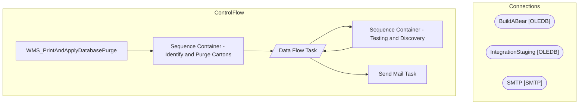

# SSIS Package: WMS_PrintAndApplyDatabasePurge

**Project:** WMS_PrintAndApplyDatabasePurge  
**Folder:** WMS  

## Architecture Diagram

## Connection Managers

| Connection Name | Type |
|---|---|
| BuildABear | OLEDB |
| IntegrationStaging | OLEDB |
| SMTP | SMTP |

## Control Flow Tasks

| Task Name | Type |
|---|---|
| WMS_PrintAndApplyDatabasePurge | Microsoft.Package |
| Sequence Container - Identify and Purge Cartons | STOCK:SEQUENCE |
| Data Flow Task | Microsoft.Pipeline |
| Sequence Container - Testing and Discovery | STOCK:SEQUENCE |
| Data Flow Task | Microsoft.Pipeline |
| Send Mail Task | Microsoft.SendMailTask |

## Data Flow: Sources

| Component | Tables Referenced | SQL Preview |
|---|---|---|
|  |  | with CartonData as ( select distinct containerId as Carton,  max(SentToHa) as MaxSentDate from [WMS].[CartonsSummaryToHA](nolock) group by containerId )   select distinct cast (Carton as varchar) as Carton --, MaxSentDate, DATEDIFF(dd,MaxSentDate,getdate()) as DateDiffz from CartonData where DATEDIFF(dd,MaxSentDate,getdate()) >= 30 order by 1 |
|  |  | delete from [dbo].[PAPPL_MSG] where CARTON = ? |
|  |  | select distinct carton  from pappl_msg (nolock)  order by 1 |

## Data Flow: Destinations

| Component | Destination Table |
|---|---|
|  | [dbo].[PAPPL_MSG] |
|  | [dbo].[TESTING_PAPPLMSG] |
|  | [dbo].[PAPPL_MSG] |

