# SSIS Package: WMS_PurchaseOrderReceipt

**Project:** WMS_PurchaseOrderReceipt  
**Folder:** WMS  

## Architecture Diagram

```mermaid
flowchart TD
    subgraph Connections
        AzureServiceBus_conn(["AzureServiceBus [Azure Service Bus (KingswaySoft)]"])
        Dynamics_AX_Connection_Manager_conn(["Dynamics AX Connection Manager [DynamicsAX]"])
        IntegrationStaging_conn(["IntegrationStaging [OLEDB]"])
        SMTP_conn(["SMTP [SMTP]"])
    end
    subgraph ControlFlow
        WMS_PurchaseOrderReceipt_task["WMS_PurchaseOrderReceipt"]
        SEQ___ProductReceiptLine_task["SEQ - ProductReceiptLine"]
        WMS_PurchaseOrderReceipt_task --> SEQ___ProductReceiptLine_task
        ProductReceipitHeader_task[/"ProductReceipitHeader"/]
        SEQ___ProductReceiptLine_task --> ProductReceipitHeader_task
        ProductReceiptLine_task[/"ProductReceiptLine"/]
        ProductReceipitHeader_task --> ProductReceiptLine_task
        spMergePurchaseOrderReceiptFromDynamicsReceiptHeaderAndLine_task["spMergePurchaseOrderReceiptFromDynamicsReceiptHeaderAndLine"]
        ProductReceiptLine_task --> spMergePurchaseOrderReceiptFromDynamicsReceiptHeaderAndLine_task
        Truncate_Stage_task["Truncate Stage"]
        spMergePurchaseOrderReceiptFromDynamicsReceiptHeaderAndLine_task --> Truncate_Stage_task
        Seq___Stage_and_Merge_from_Azure_Service_Bus_task["Seq - Stage and Merge from Azure Service Bus"]
        Truncate_Stage_task --> Seq___Stage_and_Merge_from_Azure_Service_Bus_task
        Data_Flow___outboundporeceipt_aptos_task[/"Data Flow - outboundporeceipt-aptos"/]
        Seq___Stage_and_Merge_from_Azure_Service_Bus_task --> Data_Flow___outboundporeceipt_aptos_task
        spMergePurchaseOrderReceipt_task["spMergePurchaseOrderReceipt"]
        Data_Flow___outboundporeceipt_aptos_task --> spMergePurchaseOrderReceipt_task
        Truncate_Stage_task["Truncate Stage"]
        spMergePurchaseOrderReceipt_task --> Truncate_Stage_task
        Seq___Stage_File_to_Pipeline_and_Dynamics_1200_Shipment_task["Seq - Stage File to Pipeline and Dynamics 1200 Shipment"]
        Truncate_Stage_task --> Seq___Stage_File_to_Pipeline_and_Dynamics_1200_Shipment_task
        Create_Dynamics_Shipment_task["Create Dynamics Shipment"]
        Seq___Stage_File_to_Pipeline_and_Dynamics_1200_Shipment_task --> Create_Dynamics_Shipment_task
        Create_Pipeline_File_task["Create Pipeline File"]
        Create_Dynamics_Shipment_task --> Create_Pipeline_File_task
        MergeShipmentInvoiceFromPOReceipt_task["MergeShipmentInvoiceFromPOReceipt"]
        Create_Pipeline_File_task --> MergeShipmentInvoiceFromPOReceipt_task
        Send_Mail_Task_task["Send Mail Task"]
        MergeShipmentInvoiceFromPOReceipt_task --> Send_Mail_Task_task
    end
```

## Connection Managers

| Connection Name | Type |
|---|---|
| AzureServiceBus | Azure Service Bus (KingswaySoft) |
| Dynamics AX Connection Manager | DynamicsAX |
| IntegrationStaging | OLEDB |
| SMTP | SMTP |

## Control Flow Tasks

| Task Name | Type |
|---|---|
| WMS_PurchaseOrderReceipt | Microsoft.Package |
| SEQ - ProductReceiptLine | STOCK:SEQUENCE |
| ProductReceipitHeader | Microsoft.Pipeline |
| ProductReceiptLine | Microsoft.Pipeline |
| spMergePurchaseOrderReceiptFromDynamicsReceiptHeaderAndLine | Microsoft.ExecuteSQLTask |
| Truncate Stage | Microsoft.ExecuteSQLTask |
| Seq - Stage and Merge from Azure Service Bus | STOCK:SEQUENCE |
| Data Flow - outboundporeceipt-aptos | Microsoft.Pipeline |
| spMergePurchaseOrderReceipt | Microsoft.ExecuteSQLTask |
| Truncate Stage | Microsoft.ExecuteSQLTask |
| Seq - Stage File to Pipeline and Dynamics 1200 Shipment | STOCK:SEQUENCE |
| Create Dynamics Shipment | Microsoft.ExecuteSQLTask |
| Create Pipeline File | Microsoft.ExecuteSQLTask |
| MergeShipmentInvoiceFromPOReceipt | Microsoft.ExecuteSQLTask |
| Send Mail Task | Microsoft.SendMailTask |

## Data Flow: Sources

_No OLE DB data flow sources detected._

## Data Flow: Destinations

| Component | Destination Table |
|---|---|
|  | [WMS].[DynamicsProductReceiptHeaderStage] |
|  | [WMS].[DynamicsProductReceiptLineStage] |
|  | [WMS].[PurchaseOrderReceiptStage] |

