# SSIS Package: WMS_PurchaseOrderToDynamics

**Project:** WMS_PurchaseOrderToDynamics  
**Folder:** WMS  

## Architecture Diagram

```mermaid
flowchart TD
    subgraph Connections
        HTTP_Connection_Manager_conn(["HTTP Connection Manager [HTTP (KingswaySoft)]"])
        IntegrationStaging_conn(["IntegrationStaging [OLEDB]"])
        ME_01_conn(["ME_01 [OLEDB]"])
        POCreate_API_conn(["POCreate API [HTTP (KingswaySoft)]"])
        POUpdate_API_conn(["POUpdate API [HTTP (KingswaySoft)]"])
        POUpdate_preECO_API_conn(["POUpdate_preECO API [HTTP (KingswaySoft)]"])
        PO_JSON_conn(["PO_JSON [FLATFILE]"])
        SMTP_conn(["SMTP [SMTP]"])
    end
    subgraph ControlFlow
        WMS_PurchaseOrderToDynamics_task["WMS_PurchaseOrderToDynamics"]
        ON_Demand_JSON_to_File_task[/"ON Demand JSON to File"/]
        WMS_PurchaseOrderToDynamics_task --> ON_Demand_JSON_to_File_task
        SEQ___Push_to_Dynamics___Post_ECO_task["SEQ - Push to Dynamics - Post-ECO"]
        ON_Demand_JSON_to_File_task --> SEQ___Push_to_Dynamics___Post_ECO_task
        Email_Summary_task["Email Summary"]
        SEQ___Push_to_Dynamics___Post_ECO_task --> Email_Summary_task
        Foreach_Loop_Container_task["Foreach Loop Container"]
        Email_Summary_task --> Foreach_Loop_Container_task
        DataFlow___PO_to_Dynamics_API_task[/"DataFlow - PO to Dynamics API"/]
        Foreach_Loop_Container_task --> DataFlow___PO_to_Dynamics_API_task
        Execute_SQL_Task_task["Execute SQL Task"]
        DataFlow___PO_to_Dynamics_API_task --> Execute_SQL_Task_task
        PreStage_PO_task["PreStage PO"]
        Execute_SQL_Task_task --> PreStage_PO_task
        SEQ___Push_to_Dynamics___Pre_ECO_Updates_Only_task["SEQ - Push to Dynamics - Pre-ECO Updates Only"]
        PreStage_PO_task --> SEQ___Push_to_Dynamics___Pre_ECO_Updates_Only_task
        Email_Summary_task["Email Summary"]
        SEQ___Push_to_Dynamics___Pre_ECO_Updates_Only_task --> Email_Summary_task
        Foreach_Loop_Container_task["Foreach Loop Container"]
        Email_Summary_task --> Foreach_Loop_Container_task
        DataFlow___PO_to_Dynamics_API_task[/"DataFlow - PO to Dynamics API"/]
        Foreach_Loop_Container_task --> DataFlow___PO_to_Dynamics_API_task
        Execute_SQL_Task_task["Execute SQL Task"]
        DataFlow___PO_to_Dynamics_API_task --> Execute_SQL_Task_task
        PreStage_PO_task["PreStage PO"]
        Execute_SQL_Task_task --> PreStage_PO_task
        SEQ___Stage_For_Dynamics_task["SEQ - Stage For Dynamics"]
        PreStage_PO_task --> SEQ___Stage_For_Dynamics_task
        Merge_PO_Data_task["Merge PO Data"]
        SEQ___Stage_For_Dynamics_task --> Merge_PO_Data_task
        Push_PO_to_TPM_task["Push PO to TPM"]
        Merge_PO_Data_task --> Push_PO_to_TPM_task
        Stage_PO_Data_task[/"Stage PO Data"/]
        Push_PO_to_TPM_task --> Stage_PO_Data_task
        Truncate_Stage_task["Truncate Stage"]
        Stage_PO_Data_task --> Truncate_Stage_task
        Validate_PO_to_Stage_task[/"Validate PO to Stage"/]
        Truncate_Stage_task --> Validate_PO_to_Stage_task
        SEQ___Stage_For_TPM_task["SEQ - Stage For TPM"]
        Validate_PO_to_Stage_task --> SEQ___Stage_For_TPM_task
        sp_keith_ib_audit_trail_task["sp_keith_ib_audit_trail"]
        SEQ___Stage_For_TPM_task --> sp_keith_ib_audit_trail_task
        sp_keith_ib_audit_trail_pointer_task["sp_keith_ib_audit_trail_pointer"]
        sp_keith_ib_audit_trail_task --> sp_keith_ib_audit_trail_pointer_task
        sp_po_cancel_task["sp_po_cancel"]
        sp_keith_ib_audit_trail_pointer_task --> sp_po_cancel_task
        sp_po_deleted_lines_task["sp_po_deleted_lines"]
        sp_po_cancel_task --> sp_po_deleted_lines_task
        sp_po_line_quantity_zero_task["sp_po_line_quantity_zero"]
        sp_po_deleted_lines_task --> sp_po_line_quantity_zero_task
        sp_po_new_task["sp_po_new"]
        sp_po_line_quantity_zero_task --> sp_po_new_task
        sp_po_updates_task["sp_po_updates"]
        sp_po_new_task --> sp_po_updates_task
        Truncate_Stage_task["Truncate Stage"]
        sp_po_updates_task --> Truncate_Stage_task
        Send_Mail_Task_task["Send Mail Task"]
        Truncate_Stage_task --> Send_Mail_Task_task
    end
```

## Connection Managers

| Connection Name | Type |
|---|---|
| HTTP Connection Manager | HTTP (KingswaySoft) |
| IntegrationStaging | OLEDB |
| ME_01 | OLEDB |
| POCreate API | HTTP (KingswaySoft) |
| POUpdate API | HTTP (KingswaySoft) |
| POUpdate_preECO API | HTTP (KingswaySoft) |
| PO_JSON | FLATFILE |
| SMTP | SMTP |

## Control Flow Tasks

| Task Name | Type |
|---|---|
| WMS_PurchaseOrderToDynamics | Microsoft.Package |
| ON Demand JSON to File | Microsoft.Pipeline |
| SEQ - Push to Dynamics - Post-ECO | STOCK:SEQUENCE |
| Email Summary | Microsoft.ExecuteSQLTask |
| Foreach Loop Container | STOCK:FOREACHLOOP |
| DataFlow - PO to Dynamics API | Microsoft.Pipeline |
| Execute SQL Task | Microsoft.ExecuteSQLTask |
| PreStage PO | Microsoft.ExecuteSQLTask |
| SEQ - Push to Dynamics - Pre-ECO Updates Only | STOCK:SEQUENCE |
| Email Summary | Microsoft.ExecuteSQLTask |
| Foreach Loop Container | STOCK:FOREACHLOOP |
| DataFlow - PO to Dynamics API | Microsoft.Pipeline |
| Execute SQL Task | Microsoft.ExecuteSQLTask |
| PreStage PO | Microsoft.ExecuteSQLTask |
| SEQ - Stage For Dynamics | STOCK:SEQUENCE |
| Merge PO Data | Microsoft.ExecuteSQLTask |
| Push PO to TPM | Microsoft.ExecuteSQLTask |
| Stage PO Data | Microsoft.Pipeline |
| Truncate Stage | Microsoft.ExecuteSQLTask |
| Validate PO to Stage | Microsoft.Pipeline |
| SEQ - Stage For TPM | STOCK:SEQUENCE |
| sp_keith_ib_audit_trail | Microsoft.ExecuteSQLTask |
| sp_keith_ib_audit_trail_pointer | Microsoft.ExecuteSQLTask |
| sp_po_cancel | Microsoft.ExecuteSQLTask |
| sp_po_deleted_lines | Microsoft.ExecuteSQLTask |
| sp_po_line_quantity_zero | Microsoft.ExecuteSQLTask |
| sp_po_new | Microsoft.ExecuteSQLTask |
| sp_po_updates | Microsoft.ExecuteSQLTask |
| Truncate Stage | Microsoft.ExecuteSQLTask |
| Send Mail Task | Microsoft.SendMailTask |

## Data Flow: Sources

| Component | Tables Referenced | SQL Preview |
|---|---|---|
|  |  | select * from [WMS].[vwPOAptosToDynamics] |
|  |  | select DISTINCT 	cast(po.po_no as varchar) as po_no, 	cast(pl.line_no as int) as POMainLine, pls.po_line_shipment_id as DynamicsPOLine, 	cast(case cf.cost_factor_code  		when 'ACTF' then 'GCACTFEE' 		when 'DUTY' then 'DUTY' 		when 'FOB' then 'FOBROY' 		when 'INB' then 'OCEANFRT' 		when 'SFEE' then 'INSPFEES' 		when 'WHS' then 'WHSFEES' 	end as nvarchar(15)) as ChargeCode, 	--cast('Freight' as nvar |
|  |  | update WMS.PurchaseOrderMerchToDynamics  set ExportedToDynamicsDate = getdate(), BatchID = ? where PONumber = ? |
|  |  | with  POHistory as 	( 		select concat(AptosDocumentNumber, '_', PO_OrderAccountNumber) as POVendorAccountForJoin 		from wms.DynamicsAPILog with (nolock) 		where IntegrationName = 'WMS_PurchaseOrderToDynamics' 		--and ResponseBody like '%hasErrors%false%' 		group by concat(AptosDocumentNumber, '_', PO_OrderAccountNumber) 	) select  --1200 PO 	po.PONumber, 	po.POLineNumber, 	po.ItemNumber, 	po.Quant |
|  |  | select * from WMS.vwPOAptosToDynamics where  	PONumber = '' and VendorAccountNumber = '' |
|  |  | select DISTINCT 	cast(po.po_no as varchar) as po_no, 	cast(pl.line_no as int) as POMainLine, pls.po_line_shipment_id as DynamicsPOLine, 	cast(case cf.cost_factor_code  		when 'ACTF' then 'GCACTFEE' 		when 'DUTY' then 'DUTY' 		when 'FOB' then 'FOBROY' 		when 'INB' then 'OCEANFRT' 		when 'SFEE' then 'INSPFEES' 		when 'WHS' then 'WHSFEES' 	end as nvarchar(15)) as ChargeCode, 	--cast('Freight' as nvar |
|  |  | select * from WMS.vwPOAptosToDynamics where  	PONumber = '' and VendorAccountNumber = '' |
|  |  | select DISTINCT 	cast(po.po_no as varchar) as po_no, 	cast(pl.line_no as int) as POMainLine, pls.po_line_shipment_id as DynamicsPOLine, 	cast(case cf.cost_factor_code  		when 'ACTF' then 'GCACTFEE' 		when 'DUTY' then 'DUTY' 		when 'FOB' then 'FOBROY' 		when 'INB' then 'OCEANFRT' 		when 'SFEE' then 'INSPFEES' 		when 'WHS' then 'WHSFEES' 	end as nvarchar(15)) as ChargeCode, 	--cast('Freight' as nvar |
|  |  | with  POLineNetFinalPrice as 	( 		select DISTINCT 			cast(po.po_no as varchar) as po_no, 			cast(pl.line_no as int) as POMainLine, 			cast (pl.net_final_cost as decimal (18,2)) as NetFinalPrice 		from po with (nolock) 		join po_line pl with (nolock) on po.po_id=pl.po_id 		join po_line_shipment pls with (nolock) on pls.po_id=po.po_id and pls.po_line_id=pl.po_line_id 		join po_line_cost_factor pcf w |
|  |  | select * from [WMS].[PurchaseOrderMerchToDynamics] |

## Data Flow: Destinations

| Component | Destination Table |
|---|---|
|  | [WMS].[vwPOAptosToDynamics] |
|  | [WMS].[DynamicsAPILog] |
|  | [WMS].[DynamicsAPILog] |
|  | [WMS].[vwPOAptosToDynamics] |
|  | [WMS].[DynamicsAPILog] |
|  | [WMS].[vwPOAptosToDynamics] |
|  | [WMS].[PurchaseOrderMerchToDynamicsStage] |
|  | [dbo].[vwWMSPOStagedForDynamics] |
|  | [WMS].[ValidateAptosPOtoStage] |
|  | [dbo].[vwWMSValidatePOStagedForDynamics] |

