# SSIS Package: WMS_StoreMasterTo3PL

**Project:** WMS_StoreMasterTo3PL  
**Folder:** WMS  

## Architecture Diagram

```mermaid
flowchart TD
    subgraph Connections
        CNStoreMasterCSV_conn(["CNStoreMasterCSV [FLATFILE]"])
        IntegrationStaging_conn(["IntegrationStaging [OLEDB]"])
        me_01_conn(["me_01 [OLEDB]"])
        SMTP_EMAIL_conn(["SMTP_EMAIL [SMTP]"])
        SQL_LOG_conn(["SQL_LOG [OLEDB]"])
    end
    subgraph ControlFlow
        WMS_StoreMasterTo3PL_task["WMS_StoreMasterTo3PL"]
        Output_File_and_Send_task["Output File and Send"]
        WMS_StoreMasterTo3PL_task --> Output_File_and_Send_task
        CN_StoreMasterCSV_task[/"CN StoreMasterCSV"/]
        Output_File_and_Send_task --> CN_StoreMasterCSV_task
        Count_CN_Stores_task["Count CN Stores"]
        CN_StoreMasterCSV_task --> Count_CN_Stores_task
        Foreach_Loop___CN_Files_task["Foreach Loop - CN Files"]
        Count_CN_Stores_task --> Foreach_Loop___CN_Files_task
        Archive_File_task["Archive File"]
        Foreach_Loop___CN_Files_task --> Archive_File_task
        Send_Mail_Task_task["Send Mail Task"]
        Archive_File_task --> Send_Mail_Task_task
        Stage_Store_Master_task["Stage Store Master"]
        Send_Mail_Task_task --> Stage_Store_Master_task
        MergeStoreMasterTo3PL_task["MergeStoreMasterTo3PL"]
        Stage_Store_Master_task --> MergeStoreMasterTo3PL_task
        Stage_Store_Master_task[/"Stage Store Master"/]
        MergeStoreMasterTo3PL_task --> Stage_Store_Master_task
        Truncate_Stage_task["Truncate Stage"]
        Stage_Store_Master_task --> Truncate_Stage_task
        Send_Email_onError_task["Send Email onError"]
        Truncate_Stage_task --> Send_Email_onError_task
    end
```

## Connection Managers

| Connection Name | Type |
|---|---|
| CNStoreMasterCSV | FLATFILE |
| IntegrationStaging | OLEDB |
| me_01 | OLEDB |
| SMTP_EMAIL | SMTP |
| SQL_LOG | OLEDB |

## Control Flow Tasks

| Task Name | Type |
|---|---|
| WMS_StoreMasterTo3PL | Microsoft.Package |
| Output File and Send | STOCK:SEQUENCE |
| CN StoreMasterCSV | Microsoft.Pipeline |
| Count CN Stores | Microsoft.ExecuteSQLTask |
| Foreach Loop - CN Files | STOCK:FOREACHLOOP |
| Archive File | Microsoft.FileSystemTask |
| Send Mail Task | Microsoft.SendMailTask |
| Stage Store Master | STOCK:SEQUENCE |
| MergeStoreMasterTo3PL | Microsoft.ExecuteSQLTask |
| Stage Store Master | Microsoft.Pipeline |
| Truncate Stage | Microsoft.ExecuteSQLTask |
| Send Email onError | Microsoft.SendMailTask |

## Data Flow: Sources

| Component | Tables Referenced | SQL Preview |
|---|---|---|
|  |  | select  	store_nbr,	 	name,	 	addr_line_1,	 	addr_line_2,	 	city,	 	state,	 	zip,	 	cntry,	 	addr_line_1CH,	 	addr_line_2CH,	 	cityCH,	 	stateCH,	 	zipCH,	 	cntryCH from WMS.StoreMasterTo3PL where datediff(dd, isnull(UpdateDate, InsertDate), getdate())=0 UNION select  	a.AddressID as store_nbr, 	replace(a.ShipToName,',','') as name, 	replace(replace(replace(a.ShipToStreet,',',''),CHAR(10),''),CHAR |

## Data Flow: Destinations

| Component | Destination Table |
|---|---|
|  | [dbo].[VW_CNStoreMaster] |
|  | [WMS].[StoreMasterTo3PLStage] |

