# SSIS Package: WMS_StoreShipmentReportEmail

**Project:** WMS_StoreShipmentReportEmail  
**Folder:** WMS  

## Architecture Diagram

```mermaid
flowchart TD
    subgraph Connections
        IntegrationStaging_conn(["IntegrationStaging [OLEDB]"])
        SMTP_conn(["SMTP [SMTP]"])
        SMTP_Connection_Manager_conn(["SMTP Connection Manager [SMTP (KingswaySoft)]"])
    end
    subgraph ControlFlow
        WMS_StoreShipmentReportEmail_task["WMS_StoreShipmentReportEmail"]
        SeqCont___Generate_and_Email_Reports_1_task["SeqCont - Generate and Email Reports 1"]
        WMS_StoreShipmentReportEmail_task --> SeqCont___Generate_and_Email_Reports_1_task
        Foreach_Loop_Container_1_task["Foreach Loop Container 1"]
        SeqCont___Generate_and_Email_Reports_1_task --> Foreach_Loop_Container_1_task
        Foreach_Loop_Container_task["Foreach Loop Container"]
        Foreach_Loop_Container_1_task --> Foreach_Loop_Container_task
        delete_file_task["delete file"]
        Foreach_Loop_Container_task --> delete_file_task
        Send_Mail_Task_task["Send Mail Task"]
        delete_file_task --> Send_Mail_Task_task
        Generate_PDF_task["Generate PDF"]
        Send_Mail_Task_task --> Generate_PDF_task
        wait_task["wait"]
        Generate_PDF_task --> wait_task
        wait_1_task["wait 1"]
        wait_task --> wait_1_task
        stores_with_shipments_task["stores with shipments"]
        wait_1_task --> stores_with_shipments_task
        Send_Mail_Task_task["Send Mail Task"]
        stores_with_shipments_task --> Send_Mail_Task_task
    end
```

## Connection Managers

| Connection Name | Type |
|---|---|
| IntegrationStaging | OLEDB |
| SMTP | SMTP |
| SMTP Connection Manager | SMTP (KingswaySoft) |

## Control Flow Tasks

| Task Name | Type |
|---|---|
| WMS_StoreShipmentReportEmail | Microsoft.Package |
| SeqCont - Generate and Email Reports 1 | STOCK:SEQUENCE |
| Foreach Loop Container 1 | STOCK:FOREACHLOOP |
| Foreach Loop Container | STOCK:FOREACHLOOP |
| delete file | Microsoft.FileSystemTask |
| Send Mail Task | Microsoft.SendMailTask |
| Generate PDF | Microsoft.ScriptTask |
| wait | Microsoft.ExecuteSQLTask |
| wait 1 | Microsoft.ExecuteSQLTask |
| stores with shipments | Microsoft.ExecuteSQLTask |
| Send Mail Task | Microsoft.SendMailTask |

## Data Flow: Sources

_No OLE DB data flow sources detected._

## Data Flow: Destinations

_No OLE DB data flow destinations detected._

