# SSIS Package: WMS_StoreToStoreTransferExtract

**Project:** WMS_StoreToStoreTransferExtract  
**Folder:** WMS  

## Architecture Diagram

```mermaid
flowchart TD
    subgraph Connections
        Azure_Service_Bus_conn(["Azure Service Bus [Azure Service Bus (KingswaySoft)]"])
        Dynamics_AX_Connection_Manager_conn(["Dynamics AX Connection Manager [DynamicsAX]"])
        IntegrationStaging_conn(["IntegrationStaging [OLEDB]"])
        SMTP_conn(["SMTP [SMTP]"])
    end
    subgraph ControlFlow
        WMS_StoreToStoreTransferExtract_task["WMS_StoreToStoreTransferExtract"]
        SeqCont___Discovery_and_Testing_task["SeqCont - Discovery and Testing"]
        WMS_StoreToStoreTransferExtract_task --> SeqCont___Discovery_and_Testing_task
        Data_Flow_Task_task[/"Data Flow Task"/]
        SeqCont___Discovery_and_Testing_task --> Data_Flow_Task_task
        Data_Flow_Task_1_task[/"Data Flow Task 1"/]
        Data_Flow_Task_task --> Data_Flow_Task_1_task
        Data_Flow_Task_2_task[/"Data Flow Task 2"/]
        Data_Flow_Task_1_task --> Data_Flow_Task_2_task
        Data_Flow_Task_3_task[/"Data Flow Task 3"/]
        Data_Flow_Task_2_task --> Data_Flow_Task_3_task
        DFT___WORK_LINE_task[/"DFT - WORK LINE"/]
        Data_Flow_Task_3_task --> DFT___WORK_LINE_task
        SeqCont___Generate_and_Email_Reports_task["SeqCont - Generate and Email Reports"]
        DFT___WORK_LINE_task --> SeqCont___Generate_and_Email_Reports_task
        Execute_SQL_Task___Target_Companies_task["Execute SQL Task - Target Companies"]
        SeqCont___Generate_and_Email_Reports_task --> Execute_SQL_Task___Target_Companies_task
        Foreach_Loop_Container_task["Foreach Loop Container"]
        Execute_SQL_Task___Target_Companies_task --> Foreach_Loop_Container_task
        Execute_SQL_Task___Target_Transfer_Order_Numbers_task["Execute SQL Task - Target Transfer Order Numbers"]
        Foreach_Loop_Container_task --> Execute_SQL_Task___Target_Transfer_Order_Numbers_task
        Foreach_Loop_Container_task["Foreach Loop Container"]
        Execute_SQL_Task___Target_Transfer_Order_Numbers_task --> Foreach_Loop_Container_task
        Execute_SQL_Task___Get_Email_Address_task["Execute SQL Task - Get Email Address"]
        Foreach_Loop_Container_task --> Execute_SQL_Task___Get_Email_Address_task
        Execute_SQL_Task___Update_As_Emailed_task["Execute SQL Task - Update As Emailed"]
        Execute_SQL_Task___Get_Email_Address_task --> Execute_SQL_Task___Update_As_Emailed_task
        FEL____Email_and_Delete_File_task["FEL -  Email and Delete File"]
        Execute_SQL_Task___Update_As_Emailed_task --> FEL____Email_and_Delete_File_task
        File_System_Task_task["File System Task"]
        FEL____Email_and_Delete_File_task --> File_System_Task_task
        Send_Mail_Task_task["Send Mail Task"]
        File_System_Task_task --> Send_Mail_Task_task
        Script_Task___Generate_PDF_File___1100_task["Script Task - Generate PDF File - 1100"]
        Send_Mail_Task_task --> Script_Task___Generate_PDF_File___1100_task
        SeqCont___Message_Substring_Extract_Approach_task["SeqCont - Message Substring Extract Approach"]
        Script_Task___Generate_PDF_File___1100_task --> SeqCont___Message_Substring_Extract_Approach_task
        SeqCont___Msg_Download_and_Parse_task["SeqCont - Msg Download and Parse"]
        SeqCont___Message_Substring_Extract_Approach_task --> SeqCont___Msg_Download_and_Parse_task
        DFT___Extract_from_Raw_Message_task[/"DFT - Extract from Raw Message"/]
        SeqCont___Msg_Download_and_Parse_task --> DFT___Extract_from_Raw_Message_task
        DFT___Raw_Message_Download_task[/"DFT - Raw Message Download"/]
        DFT___Extract_from_Raw_Message_task --> DFT___Raw_Message_Download_task
        Execute_SQL_Task___Truncate_Stage_task["Execute SQL Task - Truncate Stage"]
        DFT___Raw_Message_Download_task --> Execute_SQL_Task___Truncate_Stage_task
        spMergeStoreToStoreTransferMessage_task["spMergeStoreToStoreTransferMessage"]
        Execute_SQL_Task___Truncate_Stage_task --> spMergeStoreToStoreTransferMessage_task
        Sequence_Container_task["Sequence Container"]
        spMergeStoreToStoreTransferMessage_task --> Sequence_Container_task
        Execute_SQL_Task___Truncate_Stage_task["Execute SQL Task - Truncate Stage"]
        Sequence_Container_task --> Execute_SQL_Task___Truncate_Stage_task
        Sequence_Container_task["Sequence Container"]
        Execute_SQL_Task___Truncate_Stage_task --> Sequence_Container_task
        SeqCont___1100_task["SeqCont - 1100"]
        Sequence_Container_task --> SeqCont___1100_task
        FEL___1100_task["FEL - 1100"]
        SeqCont___1100_task --> FEL___1100_task
        Data_Flow_Task_task[/"Data Flow Task"/]
        FEL___1100_task --> Data_Flow_Task_task
        Update_Records_as_WorkLookupComplete_task["Update Records as WorkLookupComplete"]
        Data_Flow_Task_task --> Update_Records_as_WorkLookupComplete_task
        Stage_Transfer_Order_Numbers_for_Loop_task["Stage Transfer Order Numbers for Loop"]
        Update_Records_as_WorkLookupComplete_task --> Stage_Transfer_Order_Numbers_for_Loop_task
        SeqCont___1700_task["SeqCont - 1700"]
        Stage_Transfer_Order_Numbers_for_Loop_task --> SeqCont___1700_task
        FEL___1700_task["FEL - 1700"]
        SeqCont___1700_task --> FEL___1700_task
        Data_Flow_Task_task[/"Data Flow Task"/]
        FEL___1700_task --> Data_Flow_Task_task
        Update_Records_as_WorkLookupComplete_task["Update Records as WorkLookupComplete"]
        Data_Flow_Task_task --> Update_Records_as_WorkLookupComplete_task
        Stage_Transfer_Order_Numbers_for_Loop_1700_task["Stage Transfer Order Numbers for Loop 1700"]
        Update_Records_as_WorkLookupComplete_task --> Stage_Transfer_Order_Numbers_for_Loop_1700_task
        SeqCont___2110_task["SeqCont - 2110"]
        Stage_Transfer_Order_Numbers_for_Loop_1700_task --> SeqCont___2110_task
        FEL___2110_task["FEL - 2110"]
        SeqCont___2110_task --> FEL___2110_task
        Data_Flow_Task_task[/"Data Flow Task"/]
        FEL___2110_task --> Data_Flow_Task_task
        Update_Records_as_WorkLookupComplete_task["Update Records as WorkLookupComplete"]
        Data_Flow_Task_task --> Update_Records_as_WorkLookupComplete_task
        Stage_Transfer_Order_Numbers_for_Loop_2110_task["Stage Transfer Order Numbers for Loop 2110"]
        Update_Records_as_WorkLookupComplete_task --> Stage_Transfer_Order_Numbers_for_Loop_2110_task
        spMergeStoreToStoreTransferLicensePlate_task["spMergeStoreToStoreTransferLicensePlate"]
        Stage_Transfer_Order_Numbers_for_Loop_2110_task --> spMergeStoreToStoreTransferLicensePlate_task
        Send_Mail_Task_task["Send Mail Task"]
        spMergeStoreToStoreTransferLicensePlate_task --> Send_Mail_Task_task
    end
```

## Connection Managers

| Connection Name | Type |
|---|---|
| Azure Service Bus | Azure Service Bus (KingswaySoft) |
| Dynamics AX Connection Manager | DynamicsAX |
| IntegrationStaging | OLEDB |
| SMTP | SMTP |

## Control Flow Tasks

| Task Name | Type |
|---|---|
| WMS_StoreToStoreTransferExtract | Microsoft.Package |
| SeqCont - Discovery and Testing | STOCK:SEQUENCE |
| Data Flow Task | Microsoft.Pipeline |
| Data Flow Task 1 | Microsoft.Pipeline |
| Data Flow Task 2 | Microsoft.Pipeline |
| Data Flow Task 3 | Microsoft.Pipeline |
| DFT - WORK LINE | Microsoft.Pipeline |
| SeqCont - Generate and Email Reports | STOCK:SEQUENCE |
| Execute SQL Task - Target Companies | Microsoft.ExecuteSQLTask |
| Foreach Loop Container | STOCK:FOREACHLOOP |
| Execute SQL Task - Target Transfer Order Numbers | Microsoft.ExecuteSQLTask |
| Foreach Loop Container | STOCK:FOREACHLOOP |
| Execute SQL Task - Get Email Address | Microsoft.ExecuteSQLTask |
| Execute SQL Task - Update As Emailed | Microsoft.ExecuteSQLTask |
| FEL -  Email and Delete File | STOCK:FOREACHLOOP |
| File System Task | Microsoft.FileSystemTask |
| Send Mail Task | Microsoft.SendMailTask |
| Script Task - Generate PDF File - 1100 | Microsoft.ScriptTask |
| SeqCont - Message Substring Extract Approach | STOCK:SEQUENCE |
| SeqCont - Msg Download and Parse | STOCK:SEQUENCE |
| DFT - Extract from Raw Message | Microsoft.Pipeline |
| DFT - Raw Message Download | Microsoft.Pipeline |
| Execute SQL Task - Truncate Stage | Microsoft.ExecuteSQLTask |
| spMergeStoreToStoreTransferMessage | Microsoft.ExecuteSQLTask |
| Sequence Container | STOCK:SEQUENCE |
| Execute SQL Task - Truncate Stage | Microsoft.ExecuteSQLTask |
| Sequence Container | STOCK:SEQUENCE |
| SeqCont - 1100 | STOCK:SEQUENCE |
| FEL - 1100 | STOCK:FOREACHLOOP |
| Data Flow Task | Microsoft.Pipeline |
| Update Records as WorkLookupComplete | Microsoft.ExecuteSQLTask |
| Stage Transfer Order Numbers for Loop | Microsoft.ExecuteSQLTask |
| SeqCont - 1700 | STOCK:SEQUENCE |
| FEL - 1700 | STOCK:FOREACHLOOP |
| Data Flow Task | Microsoft.Pipeline |
| Update Records as WorkLookupComplete | Microsoft.ExecuteSQLTask |
| Stage Transfer Order Numbers for Loop 1700 | Microsoft.ExecuteSQLTask |
| SeqCont - 2110 | STOCK:SEQUENCE |
| FEL - 2110 | STOCK:FOREACHLOOP |
| Data Flow Task | Microsoft.Pipeline |
| Update Records as WorkLookupComplete | Microsoft.ExecuteSQLTask |
| Stage Transfer Order Numbers for Loop 2110 | Microsoft.ExecuteSQLTask |
| spMergeStoreToStoreTransferLicensePlate | Microsoft.ExecuteSQLTask |
| Send Mail Task | Microsoft.SendMailTask |

## Data Flow: Sources

| Component | Tables Referenced | SQL Preview |
|---|---|---|
|  |  | with MessageExtract as ( select  cast ( SUBSTRING(message, CHARINDEX('mserp_transferordernumber', Message)+36,  12) as varchar (20)) as TransferOrderNumber,   cast ( SUBSTRING(message,  CHARINDEX('mserp_dataareaid', Message)+27,  4 )  as varchar (10)) as Entity,  cast ( SUBSTRING(message,  CHARINDEX('mserp_shippingwarehouseid',Message)+36, 4) as varchar(5)) as  FromWarehouse,  cast ( SUBSTRING(mes |

## Data Flow: Destinations

| Component | Destination Table |
|---|---|
|  | [WMS].[StoreToStoreTransferLabelRawMessage] |
|  | [WMS].[tmpTestingWarehouseWorkHeader] |
|  | [WMS].[tmpWarehouseWorklines] |
|  | [WMS].[StoreToStoreTransferMessageStage] |
|  | [WMS].[StoreToStoreTransferRawMessage] |
|  | [WMS].[StoreToStoreTransferLicensePlateStage] |
|  | [WMS].[StoreToStoreTransferLicensePlateStage] |
|  | [WMS].[StoreToStoreTransferLicensePlateStage] |

