# SSIS Package: WMS_TransferOrderCreateFromAptos

**Project:** WMS_TransferOrderCreateFromAptos  
**Folder:** WMS  

## Architecture Diagram

```mermaid
flowchart TD
    subgraph Connections
        Flat_File_Connection_Manager_conn(["Flat File Connection Manager [FLATFILE]"])
        GetBlobUrl_conn(["GetBlobUrl [HTTP (KingswaySoft)]"])
        GetStatus_conn(["GetStatus [HTTP (KingswaySoft)]"])
        IntegrationStaging_conn(["IntegrationStaging [OLEDB]"])
        MerchProd_conn(["MerchProd [OLEDB]"])
        ME_01_conn(["ME_01 [OLEDB]"])
        PostTriggerImport_conn(["PostTriggerImport [HTTP (KingswaySoft)]"])
        POtoSOCreateAPI_conn(["POtoSOCreateAPI [HTTP (KingswaySoft)]"])
        SalesOrderCreateXML_conn(["SalesOrderCreateXML [FLATFILE]"])
        SMTP_conn(["SMTP [SMTP]"])
        TOCreateAPI_conn(["TOCreateAPI [HTTP (KingswaySoft)]"])
    end
    subgraph ControlFlow
        WMS_TransferOrderCreateFromAptos_task["WMS_TransferOrderCreateFromAptos"]
        File_Generation_and_Move_task["File Generation and Move"]
        WMS_TransferOrderCreateFromAptos_task --> File_Generation_and_Move_task
        Foreach_Loop___Per_Entity_task["Foreach Loop - Per Entity"]
        File_Generation_and_Move_task --> Foreach_Loop___Per_Entity_task
        DataFlow_XML_File_task[/"DataFlow XML File"/]
        Foreach_Loop___Per_Entity_task --> DataFlow_XML_File_task
        DataFlow_XML_File_OLD_task[/"DataFlow XML File OLD"/]
        DataFlow_XML_File_task --> DataFlow_XML_File_OLD_task
        Foreach_Loop___Copy_Manifest_and_Header_Files_task["Foreach Loop - Copy Manifest and Header Files"]
        DataFlow_XML_File_OLD_task --> Foreach_Loop___Copy_Manifest_and_Header_Files_task
        Copy_Manifest___Header_task["Copy Manifest & Header"]
        Foreach_Loop___Copy_Manifest_and_Header_Files_task --> Copy_Manifest___Header_task
        Foreach_SalesOrder_Create_task["Foreach SalesOrder Create"]
        Copy_Manifest___Header_task --> Foreach_SalesOrder_Create_task
        Foreach_Loop_Container_task["Foreach Loop Container"]
        Foreach_SalesOrder_Create_task --> Foreach_Loop_Container_task
        Archive_Files_task["Archive Files"]
        Foreach_Loop_Container_task --> Archive_Files_task
        azCopy_to_Blob_task["azCopy to Blob"]
        Archive_Files_task --> azCopy_to_Blob_task
        ProcessStatus_For_Loop_task["ProcessStatus For Loop"]
        azCopy_to_Blob_task --> ProcessStatus_For_Loop_task
        Get_Summary_Status_task[/"Get Summary Status"/]
        ProcessStatus_For_Loop_task --> Get_Summary_Status_task
        Set_ProcessStatus_task["Set ProcessStatus"]
        Get_Summary_Status_task --> Set_ProcessStatus_task
        Wait_30_Seconds_task["Wait 30 Seconds"]
        Set_ProcessStatus_task --> Wait_30_Seconds_task
        Set_BatchID___LoopCount_task["Set BatchID - LoopCount"]
        Wait_30_Seconds_task --> Set_BatchID___LoopCount_task
        Set_BAtchID_and_ExportFlag_SO_task["Set BAtchID and ExportFlag SO"]
        Set_BatchID___LoopCount_task --> Set_BAtchID_and_ExportFlag_SO_task
        Set_RowsCount_task["Set RowsCount"]
        Set_BAtchID_and_ExportFlag_SO_task --> Set_RowsCount_task
        Stage_Blob_URL_task[/"Stage Blob URL"/]
        Set_RowsCount_task --> Stage_Blob_URL_task
        Trigger_Import_task[/"Trigger Import"/]
        Stage_Blob_URL_task --> Trigger_Import_task
        Zip_File_task["Zip File"]
        Trigger_Import_task --> Zip_File_task
        Stage_Company_Entities_task["Stage Company Entities"]
        Zip_File_task --> Stage_Company_Entities_task
        ON_DEMAND_task["ON DEMAND"]
        Stage_Company_Entities_task --> ON_DEMAND_task
        AptosShipmentNumber_Stage_task["AptosShipmentNumber Stage"]
        ON_DEMAND_task --> AptosShipmentNumber_Stage_task
        Foreach_Loop___SalesOders_API_task["Foreach Loop - SalesOders API"]
        AptosShipmentNumber_Stage_task --> Foreach_Loop___SalesOders_API_task
        DataFlow___POtoSOCreate_API_task[/"DataFlow - POtoSOCreate API"/]
        Foreach_Loop___SalesOders_API_task --> DataFlow___POtoSOCreate_API_task
        SEQ___Export_Distros_From_Merch_to_Store_Shipments_task["SEQ - Export Distros From Merch to Store Shipments"]
        DataFlow___POtoSOCreate_API_task --> SEQ___Export_Distros_From_Merch_to_Store_Shipments_task
        PreStage_Store_Shipments_from_Merch_task["PreStage Store Shipments from Merch"]
        SEQ___Export_Distros_From_Merch_to_Store_Shipments_task --> PreStage_Store_Shipments_from_Merch_task
        SEQ___Stage_StoreShipments_to_IntegrationStaging_task["SEQ - Stage StoreShipments to IntegrationStaging"]
        PreStage_Store_Shipments_from_Merch_task --> SEQ___Stage_StoreShipments_to_IntegrationStaging_task
        Data_Flow_StoreShipmentExportStage_task[/"Data Flow StoreShipmentExportStage"/]
        SEQ___Stage_StoreShipments_to_IntegrationStaging_task --> Data_Flow_StoreShipmentExportStage_task
        Merge_StoreShipmentExport_task["Merge StoreShipmentExport"]
        Data_Flow_StoreShipmentExportStage_task --> Merge_StoreShipmentExport_task
        Set_Exported_Flag_task["Set Exported Flag"]
        Merge_StoreShipmentExport_task --> Set_Exported_Flag_task
        Truncate_Stage_task["Truncate Stage"]
        Set_Exported_Flag_task --> Truncate_Stage_task
        SEQ___TOCreate_and_POtoSOCreate_task["SEQ - TOCreate and POtoSOCreate"]
        Truncate_Stage_task --> SEQ___TOCreate_and_POtoSOCreate_task
        Sales_Order_Sequence_task["Sales Order Sequence"]
        SEQ___TOCreate_and_POtoSOCreate_task --> Sales_Order_Sequence_task
        AptosShipmentNumber_Stage_task["AptosShipmentNumber Stage"]
        Sales_Order_Sequence_task --> AptosShipmentNumber_Stage_task
        Foreach_Loop___SalesOders_API_task["Foreach Loop - SalesOders API"]
        AptosShipmentNumber_Stage_task --> Foreach_Loop___SalesOders_API_task
        DataFlow___POtoSOCreate_API_task[/"DataFlow - POtoSOCreate API"/]
        Foreach_Loop___SalesOders_API_task --> DataFlow___POtoSOCreate_API_task
        Set_BAtchID_and_ExportFlag_SO_task["Set BAtchID and ExportFlag SO"]
        DataFlow___POtoSOCreate_API_task --> Set_BAtchID_and_ExportFlag_SO_task
        Transfer_Order_Sequence_task["Transfer Order Sequence"]
        Set_BAtchID_and_ExportFlag_SO_task --> Transfer_Order_Sequence_task
        AptosShipmentNumber_Stage_task["AptosShipmentNumber Stage"]
        Transfer_Order_Sequence_task --> AptosShipmentNumber_Stage_task
        Foreach_Loop___TransferOrder_API_task["Foreach Loop - TransferOrder API"]
        AptosShipmentNumber_Stage_task --> Foreach_Loop___TransferOrder_API_task
        DataFlow___TOCreate_API_task[/"DataFlow - TOCreate API"/]
        Foreach_Loop___TransferOrder_API_task --> DataFlow___TOCreate_API_task
        Set_BAtchID_and_ExportFlag_TO_task["Set BAtchID and ExportFlag TO"]
        DataFlow___TOCreate_API_task --> Set_BAtchID_and_ExportFlag_TO_task
        SEQ_Validation_task["SEQ Validation"]
        Set_BAtchID_and_ExportFlag_TO_task --> SEQ_Validation_task
        Distro_Export_Validation_Stage_task[/"Distro Export Validation Stage"/]
        SEQ_Validation_task --> Distro_Export_Validation_Stage_task
        Email_Summary_task["Email Summary"]
        Distro_Export_Validation_Stage_task --> Email_Summary_task
        Email_Validation_task["Email Validation"]
        Email_Summary_task --> Email_Validation_task
        Store_Shipment_Export_Stage_task[/"Store Shipment Export Stage"/]
        Email_Validation_task --> Store_Shipment_Export_Stage_task
        Truncate_Stage_task["Truncate Stage"]
        Store_Shipment_Export_Stage_task --> Truncate_Stage_task
        Send_Mail_Task_task["Send Mail Task"]
        Truncate_Stage_task --> Send_Mail_Task_task
    end
```

## Connection Managers

| Connection Name | Type |
|---|---|
| Flat File Connection Manager | FLATFILE |
| GetBlobUrl | HTTP (KingswaySoft) |
| GetStatus | HTTP (KingswaySoft) |
| IntegrationStaging | OLEDB |
| MerchProd | OLEDB |
| ME_01 | OLEDB |
| PostTriggerImport | HTTP (KingswaySoft) |
| POtoSOCreateAPI | HTTP (KingswaySoft) |
| SalesOrderCreateXML | FLATFILE |
| SMTP | SMTP |
| TOCreateAPI | HTTP (KingswaySoft) |

## Control Flow Tasks

| Task Name | Type |
|---|---|
| WMS_TransferOrderCreateFromAptos | Microsoft.Package |
| File Generation and Move | STOCK:SEQUENCE |
| Foreach Loop - Per Entity | STOCK:FOREACHLOOP |
| DataFlow XML File | Microsoft.Pipeline |
| DataFlow XML File OLD | Microsoft.Pipeline |
| Foreach Loop - Copy Manifest and Header Files | STOCK:FOREACHLOOP |
| Copy Manifest & Header | Microsoft.FileSystemTask |
| Foreach SalesOrder Create | STOCK:FOREACHLOOP |
| Foreach Loop Container | STOCK:FOREACHLOOP |
| Archive Files | Microsoft.FileSystemTask |
| azCopy to Blob | Microsoft.ExecuteProcess |
| ProcessStatus For Loop | STOCK:FORLOOP |
| Get Summary Status | Microsoft.Pipeline |
| Set ProcessStatus | Microsoft.ExecuteSQLTask |
| Wait 30 Seconds | Microsoft.ExecuteSQLTask |
| Set BatchID - LoopCount | Microsoft.ExecuteSQLTask |
| Set BAtchID and ExportFlag SO | Microsoft.ExecuteSQLTask |
| Set RowsCount | Microsoft.ExecuteSQLTask |
| Stage Blob URL | Microsoft.Pipeline |
| Trigger Import | Microsoft.Pipeline |
| Zip File | Microsoft.ExecuteProcess |
| Stage Company Entities | Microsoft.ExecuteSQLTask |
| ON DEMAND | STOCK:SEQUENCE |
| AptosShipmentNumber Stage | Microsoft.ExecuteSQLTask |
| Foreach Loop - SalesOders API | STOCK:FOREACHLOOP |
| DataFlow - POtoSOCreate API | Microsoft.Pipeline |
| SEQ - Export Distros From Merch to Store Shipments | STOCK:SEQUENCE |
| PreStage Store Shipments from Merch | Microsoft.ExecuteSQLTask |
| SEQ - Stage StoreShipments to IntegrationStaging | STOCK:SEQUENCE |
| Data Flow StoreShipmentExportStage | Microsoft.Pipeline |
| Merge StoreShipmentExport | Microsoft.ExecuteSQLTask |
| Set Exported Flag | Microsoft.ExecuteSQLTask |
| Truncate Stage | Microsoft.ExecuteSQLTask |
| SEQ - TOCreate and POtoSOCreate | STOCK:SEQUENCE |
| Sales Order Sequence | STOCK:SEQUENCE |
| AptosShipmentNumber Stage | Microsoft.ExecuteSQLTask |
| Foreach Loop - SalesOders API | STOCK:FOREACHLOOP |
| DataFlow - POtoSOCreate API | Microsoft.Pipeline |
| Set BAtchID and ExportFlag SO | Microsoft.ExecuteSQLTask |
| Transfer Order Sequence | STOCK:SEQUENCE |
| AptosShipmentNumber Stage | Microsoft.ExecuteSQLTask |
| Foreach Loop - TransferOrder API | STOCK:FOREACHLOOP |
| DataFlow - TOCreate API | Microsoft.Pipeline |
| Set BAtchID and ExportFlag TO | Microsoft.ExecuteSQLTask |
| SEQ Validation | STOCK:SEQUENCE |
| Distro Export Validation Stage | Microsoft.Pipeline |
| Email Summary | Microsoft.ExecuteSQLTask |
| Email Validation | Microsoft.ExecuteSQLTask |
| Store Shipment Export Stage | Microsoft.Pipeline |
| Truncate Stage | Microsoft.ExecuteSQLTask |
| Send Mail Task | Microsoft.SendMailTask |

## Data Flow: Sources

| Component | Tables Referenced | SQL Preview |
|---|---|---|
|  |  | WITH ShipmentNumber as  	( 		select BABAptosShipmentNumber  		from wms.vwStoreShipmentsToDynamicsPOtoSO  		where BABAptosShipmentNumber = ? 		group by BABAptosShipmentNumber 	), X (xml) as 	( 			select  					( 						select distinct  							'' as [@PURCHASEORDERNUMBER], 							vw.BABAptosShipmentNumber as [@BABAPTOSPOSHIPMENTNUM],		 							vw.ToWarehouse as [@DEFAULTRECEIVINGSITEID],		 							vw.To |
|  |  | WITH ProdView as ---PRE-ECO PROD VIEW (THE UPDATED VIEW FOR TEST IS vwStoreShipmentsToDynamicsPOtoSO AND WILL BE USED WHEN WE HAVE ALL WHSES INTERFACING IN DYNAMICS) 	( 		select  			cast('1100' as varchar(4)) as Entity, 			--cast('CUST000058' as varchar(10)) as CustomerAccountNumber, 			cast(case  					when wm.Entity = 1700 then 'CUST000058' 					when wm.Entity = 2110 then 'CUST000022' 					when w |
|  |  | update l set  	l.StatusDate=getdate(),  	l.StatusResponse=?, 	l.Duration=convert(varchar, (getdate()-l.TriggerDate), 108) from wms.DynamicsPackageAPILog l where l.BatchID=? |
|  |  | update wms.DynamicsPackageAPILog  set TriggerDate=getdate(), TriggerResponse=?, AptosShipmentNumber=? where BatchID=? |
|  |  | select *  from WMS.vwStoreShipmentsToDynamicsPOtoSO_ONDEMAND where BABAptosShipmentNumber = ? |
|  |  | select  	WarehouseID,  	LocationCode, 	cast(Entity as varchar(4)) as Company from ERP.vwWarehouseIDToLocationCode with (nolock) where entity in (1100, 2110, 3001) |
|  |  | select  	cast(ItemNumber as varchar) as ItemNumber, 	cast(ItemNumber as varchar) as StyleCode,  	cast(InventoryUnitSymbol as varchar) as InventoryUnitSymbol, 	cast(Entity as varchar(4)) as Company from WMS.ItemMaster with (nolock) where Entity in (1100, 2110, 3001) and isnumeric(ItemNumber) = 1 |
|  |  | select * from [WMS].[vwDistributionRecTypeByCountryForLookup] |
|  |  | select  	WarehouseID,  	LocationCode, 	cast(Entity as varchar(4)) as Company from ERP.vwWarehouseIDToLocationCode with (nolock) where entity in (1100, 2110, 3001) |
|  |  | with  --CountryFlag as --	( --		select 	 --			l.location_code as LocationCode, --			c.country_code as CountryCode --		from location l with (nolock) --		inner join address a  with (nolock) on l.location_id = a.parent_id --			and l.location_status_id <> 5 --			and	a.parent_type = 2 --			and	address_type_id = 1 --		join keith_country c with (nolock) on a.country_id = c.country_id --	), PreStage as 	( |
|  |  | select *  from WMS.vwStoreShipmentsToDynamicsPOtoSO where BABAptosShipmentNumber = ? |
|  |  | select  	ShipDate,	 	ReceiptDate, 	BABAptosShipmentNumber,	 	DeliveryTerms,	 	ModeOfDelivery,	 	ToWarehouse,	 	FromWarehouse,	 	ItemNumber,	 	BABAptosDistroNumber,	 	BABAptosDistroLineNumber,	 	quantity,	 	UOM,	 	InventoryStatus,	 	Company from wms.vwStoreShipmentsToDynamicsTO where BABAptosShipmentNumber = ? |
|  |  | --DISTROS FROM PAST 7 DAYS select  	ddas.distribution_number, 	ddas.ref_field_1 as distribution_line_number, 	ddas.SourceID, 	ddas.DestID, 	ddas.style_code,	 	ddas.rec_type, 	ddas.release_date, 	sse.document_number as StoreShipmentNumber from distribution_data_after_split ddas with (nolock) left join store_shipment_export sse with (nolock)  	on ddas.distribution_number=sse.distribution_number 	and |
|  |  | --STORE SHIPMENTS STAGED PAST 7 DA7S select  	distribution_number, 	distribution_line_number, 	warehouse, 	location_code, 	style_code, 	rec_type, 	release_date, 	document_number as StoreShipmentNumber from store_shipment_export where 1=1 --and warehouse='0980' and warehouse in ('0980','0960','2970') -- Added additional Warehouses 8/2/2022 and datediff(dd, release_date, getdate()) <= 7 and distribu |

## Data Flow: Destinations

| Component | Destination Table |
|---|---|
|  | [WMS].[DynamicsPackageAPILog] |
|  | [WMS].[StoreShipmentExportStage] |
|  | [dbo].[vwDistroExportTransferOrderCreate] |
|  | [WMS].[DynamicsAPIErrorLog] |
|  | [WMS].[DynamicsAPILog] |
|  | [WMS].[vwStoreShipmentsToDynamicsPOtoSO] |
|  | [WMS].[DynamicsAPILog] |
|  | [WMS].[vwStoreShipmentsToDynamicsTO] |
|  | [WMS].[ValidationAptosDistroAfterSplit] |
|  | [WMS].[ValidationAptosStoreShipmentExport] |

