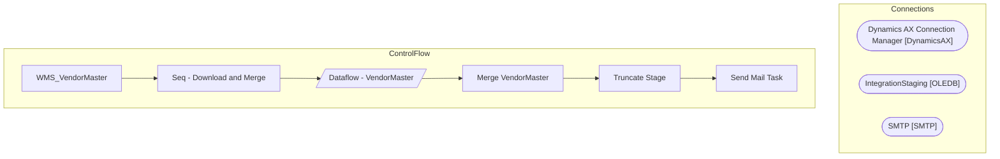

# SSIS Package: WMS_VendorMaster

**Project:** WMS_VendorMaster  
**Folder:** WMS  

## Architecture Diagram

## Connection Managers

| Connection Name | Type |
|---|---|
| Dynamics AX Connection Manager | DynamicsAX |
| IntegrationStaging | OLEDB |
| SMTP | SMTP |

## Control Flow Tasks

| Task Name | Type |
|---|---|
| WMS_VendorMaster | Microsoft.Package |
| Seq - Download and Merge | STOCK:SEQUENCE |
| Dataflow - VendorMaster | Microsoft.Pipeline |
| Merge VendorMaster | Microsoft.ExecuteSQLTask |
| Truncate Stage | Microsoft.ExecuteSQLTask |
| Send Mail Task | Microsoft.SendMailTask |

## Data Flow: Sources

_No OLE DB data flow sources detected._

## Data Flow: Destinations

| Component | Destination Table |
|---|---|
|  | [ERP].[VendorMasterStage] |

