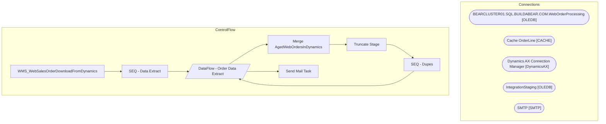

# SSIS Package: WMS_WebSalesOrderDownloadFromDynamics

**Project:** WMS_WebSalesOrderDownloadFromDynamics  
**Folder:** WMS  

## Architecture Diagram

## Connection Managers

| Connection Name | Type |
|---|---|
| BEARCLUSTER01.SQL.BUILDABEAR.COM.WebOrderProcessing | OLEDB |
| Cache OrderLine | CACHE |
| Dynamics AX Connection Manager | DynamicsAX |
| IntegrationStaging | OLEDB |
| SMTP | SMTP |

## Control Flow Tasks

| Task Name | Type |
|---|---|
| WMS_WebSalesOrderDownloadFromDynamics | Microsoft.Package |
| SEQ - Data Extract | STOCK:SEQUENCE |
| DataFlow - Order Data Extract | Microsoft.Pipeline |
| Merge AgedWebOrdersInDynamics | Microsoft.ExecuteSQLTask |
| Truncate Stage | Microsoft.ExecuteSQLTask |
| SEQ - Dupes | STOCK:SEQUENCE |
| DataFlow - Order Data Extract | Microsoft.Pipeline |
| Send Mail Task | Microsoft.SendMailTask |

## Data Flow: Sources

| Component | Tables Referenced | SQL Preview |
|---|---|---|
|  |  | select OrderDate, cast(OrderNum as nvarchar(10)) as OrderNum from wm.Orders |
|  |  | with  DeckStatuses as 	( 		select  			OrderNumber as DeckOrderNumber, 			case  				when CurrentItemStatus='Cancelled' or Cancelled is not null  					then 'Cancelled' 				when CurrentItemStatus='Shipped' or isnull(isnull(shipped,StoreShipped),GiftCardProcessed) is not null 					then 'Shipped' 			end as OrderStatus 		from wm.vwDeckOrderItemStatusPivot 		where  			( 				CurrentItemStatus in ('Cancell |
|  |  | select cast(OrderNum as nvarchar) as OrderNum from wms.SalesOrderStatusUpdateShipped with (nolock) group by cast(OrderNum as nvarchar) |
|  |  | select  	cast(wo.SalesOrderNumber as nvarchar) SalesOrderNumber, 	wo.WebOrderNumber  from wms.vwWebOrderSalesOrderLookup wo group by  cast(wo.SalesOrderNumber as nvarchar), wo.WebOrderNumber |
|  |  | with MaxWave as 	( 		select 			OrderNum, max(WaveID) as WaveID 		from WMS.SalesOrderStatusUpdateWaved with (nolock) 		group by OrderNum 	) select  	wa.WaveID, 	wa.ReleasedDateAndTime, 	wa.ContainerID, 	wa.WorkID, 	cast(wa.OrderNum as nvarchar) as OrderNum, 	wa.ItemID from WMS.SalesOrderStatusUpdateWaved wa with (nolock) --join MaxWave mw on wa.WaveID=mw.WaveID where exists (select mw.WaveID from M |
|  |  | select  	cast(wo.SalesOrderNumber as nvarchar) SalesOrderNumber, 	wo.WebOrderNumber  from wms.vwWebOrderSalesOrderLookup wo group by  cast(wo.SalesOrderNumber as nvarchar), wo.WebOrderNumber |

## Data Flow: Destinations

| Component | Destination Table |
|---|---|
|  | [WMS].[AgedWebOrdersInDynamicsStage] |

