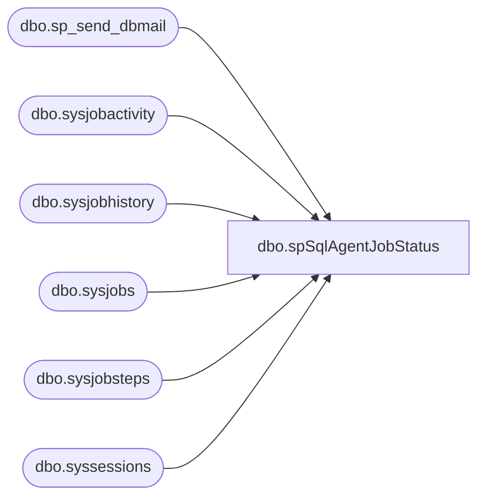

# dbo.spSqlAgentJobStatus

**Database:** DBAUtility  

## Architecture Diagram



## Table Dependencies

| Referenced Table |
|---|
| dbo.sp_send_dbmail |
| dbo.sysjobactivity |
| dbo.sysjobhistory |
| dbo.sysjobs |
| dbo.sysjobsteps |
| dbo.syssessions |

## Stored Procedure Code

```sql
CREATE PROC [dbo].[spSqlAgentJobStatus]  @JobName varchar(100)  as  declare  	@JobStatus varchar (50), 	--@JobName varchar(100), 	@SubjectDer varchar(100),  	@BodyDer varchar(100)  --set @JobName ='StoreSalesCheck' set @SubjectDer = @JobName+' SQL Agent Job Status'   set @JobStatus = ( select  case when  	count (*) = 0 then 'SQL Agent Job Is NOT Running' 	when count (*) > 0 then 'SQL Agent Job Is Running' 	end as Status FROM msdb.dbo.sysjobactivity ja  LEFT JOIN msdb.dbo.sysjobhistory jh      ON ja.job_history_id = jh.instance_id JOIN msdb.dbo.sysjobs j      ON ja.job_id = j.job_id JOIN msdb.dbo.sysjobsteps js     ON ja.job_id = js.job_id     AND ISNULL(ja.last_executed_step_id,0)+1 = js.step_id WHERE ja.session_id = (SELECT TOP 1 session_id FROM msdb.dbo.syssessions ORDER BY session_id DESC) AND start_execution_date is not null AND stop_execution_date is null --and j.name = 'ConcurEtl' and j.name = @JobName  )   set @BodyDer = @JobName+' '+@JobStatus  EXEC msdb.dbo.sp_send_dbmail 	@recipients = 'Poll@buildabear.com', 	@copy_recipients = 'BIAdmin@buildabear.com', 	@subject = @SubjectDer, 	@body = @BodyDer, 	@profile_name = 'BIAdmin'
```

