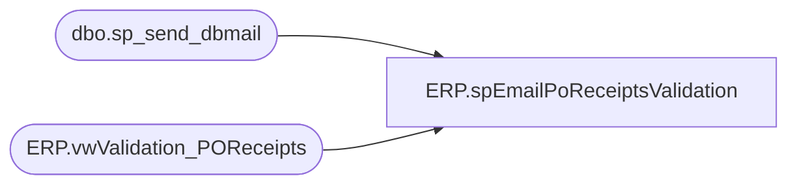

# ERP.spEmailPoReceiptsValidation

**Database:** IntegrationStaging  

## Architecture Diagram



## Table Dependencies

| Referenced Table |
|---|
| dbo.sp_send_dbmail |
| ERP.vwValidation_POReceipts |

## Stored Procedure Code

```sql
CREATE proc [ERP].[spEmailPoReceiptsValidation] 
@DaysToGoBack int

as 

-------------------------------------------------------------------------------------------
--	Dan Tweedie	2018-11-05	Created proc - Data has been staged via SSIS, proc sends email 
-------------------------------------------------------------------------------------------

set nocount on

if (select count(*) from ERP.vwValidation_POReceipts where AssumedImportStatus in ('Error', 'No Data') and datediff(dd, ReceiptDate, getdate()) <= @DaysToGoBack) > 0


begin
	declare @text nvarchar(max),
			@total int
	
	select @total = count(PurchaseOrderNumber) from ERP.vwValidation_POReceipts where AssumedImportStatus in ('Error', 'No Data') and datediff(dd, ReceiptDate, getdate()) <= @DaysToGoBack
	
	set @text = '<font face =arial size = 2> ' +
					 
					'The following PO Receipts were staged within the past <b>' + cast(@DaysToGoBack as varchar) + '</b> days, but did not successfully process into Dynamics. Please verify and correct as needed.' + 
					'<BR>' +
					'<BR>'+
					'<B>Total PO Lines: ' + cast(@total as varchar) + '</B>' +
					'<BR>' + 
					'<table border="1">' +
					'<tr><th>ENTITY</th><th>WHSE</th><th>DATE</th><th>PO</th><th>ITEM</th><th>QTY</th><th>UOM</th><th>STATUS</th>' +
						'</tr><font face =arial size = 2>' +
						CAST ( ( SELECT td = entity, '',
										td = ReceiptLocation, '',
										td = ReceiptDate, '',
										td = PurchaseOrderNumber, '',
										td = ItemNumber, '',
										td = Qty, '',
										td = UOM, '',
										td = AssumedImportStatus, ''
						from ERP.vwValidation_POReceipts 
						where AssumedImportStatus in ('Error', 'No Data')
						and datediff(dd, ReceiptDate, getdate()) <= @DaysToGoBack 
						order by ReceiptDate desc, Entity, PurchaseOrderNumber, ItemNumber, Qty, UOM
						FOR XML PATH('tr'), TYPE 
						) AS NVARCHAR(MAX) ) +
						'</font></table></font></p></p>
						<br>
						<br>
						<br>'

		select @text 

	exec msdb.dbo.sp_send_dbmail
	@profile_name = 'BIAdmin',
	@recipients = 'danl@buildabear.com;physicalinventory@buildabear.com;purchasing@buildabear.com',
	@copy_recipients = 'dant@buildabear.com',
	@body = @text,
	@subject= 'D365 PO Receipts Exceptions', 
	@body_format = 'HTML'

END
```

