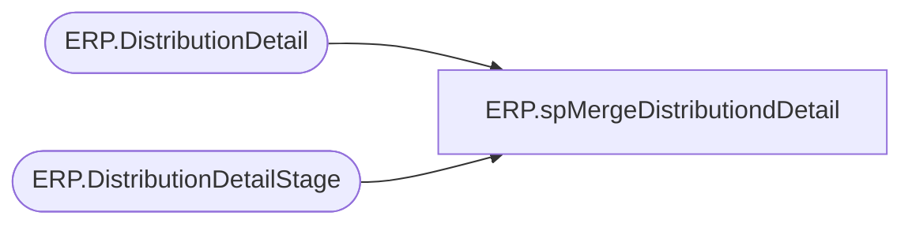

# ERP.spMergeDistributiondDetail

**Database:** IntegrationStaging  

## Architecture Diagram



## Table Dependencies

| Referenced Table |
|---|
| ERP.DistributionDetail |
| ERP.DistributionDetailStage |

## Stored Procedure Code

```sql
CREATE proc [ERP].[spMergeDistributiondDetail]

as

-------------------------------------------------------------------------
-- spMergeDistributionDetail- Merges from ERP.DistributionHeaderStage to ERP.DistributionHeader
--						
-- 2017-08-22 - Dan Tweedie - Created Proc
-- 2021-01-19 - Tim Callahan - Added logic for handling of null warehouse and locations as it was creating a non match when a match existed 
-- 2021-01-20 - Tim Callahan - Updated source logic to exclude Aptos Distributions that are now Dynamics TOs or SOs
-- 2021-01-21 - Tim Callahan - Updated proc for handling of OrderLineNumber which was added to JSON message on 1/21/2021
-- 2022-06-28 - Tim Callahan - Remarked out source logic that was added on 2021-01-20 as part of Dynamics 3PL Integration Project
-- 2023-11-14 - Tim Callahan - Added Handling of new fields BABAptosDistroLineNumber & BABAptosDistroNumber -- See JIRA BIB-698
--							   I intentionally only added to the insert not the update as these values shouldn't change and don't want to impact previously staged data 
-------------------------------------------------------------------------

set nocount on


Merge into ERP.DistributionDetail as target
--Using ERP.DistributionDetailStage as source
using (
		SELECT 
			PickListID,
			ItemDescription,
			ItemNumber,
			ModeOfDelivery, 
			OrderID,
			Sum(Quantity) as Quantity,
			QUANTITYUNITOFMEASURE,
			SALESPRICE,
			TransactionDateTime, 
			Warehouse,
			Location, 
			Entity,
			UOM, 
			OrderLineNumber, 
			BABAptosDistroLineNumber, 
			BABAptosDistroNumber
		from ERP.DistributionDetailStage d
		--where not exists (select v.DynamicsOrder from [ERP].[vwAptosDistributionDynamicsOrderLookup] v where d.ORDERID=v.DynamicsOrder and D.Entity=v.Entity) -- We want to exclude Aptos Distributions that are now Dynamics TOs or SOs
		group by 
			PickListID,
			ItemDescription,
			ItemNumber,
			ModeOfDelivery, 
			OrderID,
			QUANTITYUNITOFMEASURE,
			SALESPRICE,
			TransactionDateTime, 
			Warehouse,
			Location, 
			Entity,
			UOM, 
			OrderLineNumber,
			BABAptosDistroLineNumber, 
			BABAptosDistroNumber

	 )
as source

On (
		target.OrderID = source.OrderID
		AND
		target.PickListID = source.PickListID	
		AND
		target.ItemNumber = source.ItemNumber
		AND
		isnull(target.Warehouse,'x')=isnull(source.Warehouse,'x') -- Added 01/19/2021
		AND 
		isnull(target.Location,'x')=isnull(source.Location,'x') -- Added 01/19/2021
		AND 
		target.Entity = source.entity
		AND
		isnull(target.OrderLineNumber,1) = isnull(source.OrderLineNumber,1) -- Added 01/21/2021
	)
when matched 
	and 
		target.ReleaseDate is NULL --UPDATES ARE ONLY ALLOWED IF THE ORDER HAS NOT BEEN EXPORTED TO THE WAREHOUSE YET, AS INDICATED BY THE ReleaseDate COLUMN
		AND
		(	
			isnull(target.ItemDescription, 'xxx') <> isnull(source.ItemDescription,'xxx')
			OR
			isnull(target.ModeOfDelivery, 'xxx') <> isnull(source.ModeOfDelivery,'xxx')
			or
			--isnull(target.OrderID, 'xxx') <> isnull(source.OrderID,'xxx')
			--OR
			isnull(target.Quantity, 0.00) <> isnull(source.Quantity, 0.00)
			OR
			isnull(target.QuantityUnitOfMeasure, 'xxx') <> isnull(source.QuantityUnitOfMeasure,'xxx')
			OR
			isnull(target.SalesPrice, 0.00) <> isnull(source.SalesPrice, 0.00)
			OR
			isnull(target.TransactionDateTime, '1999-12-31') <> isnull(source.TransactionDateTime,'1999-12-31')		
			OR
			isnull(target.UOM, 'xxx') <> isnull(source.UOM, 'xxx')
		)
	then 
		UPDATE
			SET
				target.ItemDescription = source.ItemDescription,
				target.ModeOfDelivery = source.ModeOfDelivery,
				--target.OrderID = source.OrderID,
				target.Quantity = source.Quantity,
				target.QuantityUnitOfMeasure = source.QuantityUnitOfMeasure,
				target.SalesPrice = source.SalesPrice,
				target.TransactionDateTime = source.TransactionDateTime,
				target.UOM = source.UOM,
				target.UpdateDate = getdate()
When Not Matched By Target 
	Then 
		Insert (
					PickListID,
					ItemDescription,
					ItemNumber,
					ModeOfDelivery,
					OrderID,
					Quantity,
					QuantityUnitOfMeasure,
					SalesPrice,
					TransactionDateTime,
					Warehouse,
					Location,
					UOM,
					Entity,
					OrderLineNumber,
					InsertDate, 
					BABAptosDistroLineNumber, 
					BABAptosDistroNumber
				)
		Values (	
					source.PickListID,
					source.ItemDescription,
					source.ItemNumber,
					source.ModeOfDelivery,
					source.OrderID,
					source.Quantity,
					source.QuantityUnitOfMeasure,
					source.SalesPrice,
					source.TransactionDateTime,
					source.Warehouse,
					source.Location,
					source.UOM,
					source.Entity,
					source.OrderLineNumber,
					getdate(), 
					BABAptosDistroLineNumber, 
					BABAptosDistroNumber
				)
;
```

