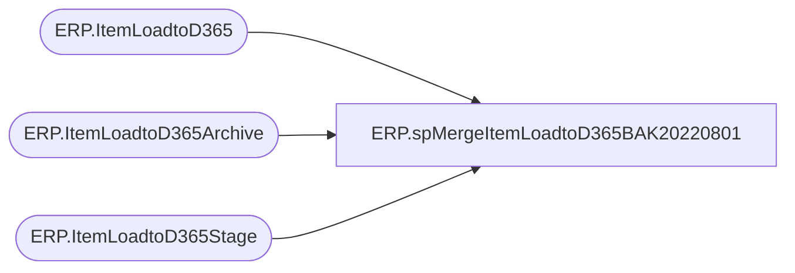

# ERP.spMergeItemLoadtoD365BAK20220801

**Database:** IntegrationStaging  

## Architecture Diagram



## Table Dependencies

| Referenced Table |
|---|
| ERP.ItemLoadtoD365 |
| ERP.ItemLoadtoD365Archive |
| ERP.ItemLoadtoD365Stage |

## Stored Procedure Code

```sql
CREATE proc [ERP].[spMergeItemLoadtoD365BAK20220801] 
 @LoadType varchar(5)

as


-------------------------------------------------------------------------
-- spMergeItemLoadtoD365 - Merges from ERP.ItemLoadtoD365Stage to ERP.ItemLoadtoD365
--						
-- 2017-08-14 - Dan Tweedie - Created Proc
/*
Fields that Cannot Be changed on Items After Transactions

This is what we know for sure:

1.	Item Model Group
2.	Storage Dimension
3.	Tracking Dimension
4.	Inventory Unit
5.	Item Number

Will add to the list when we know for sure.  Will continue to think through this and update as we discover more.  Some of these can be changed by counting out inventory and resetting.
*/
-------------------------------------------------------------------------

set nocount on

DELETE from ERP.ItemLoadtoD365Archive
where datediff(dd, ArchiveDate, getdate()) > 30

Update ERP.ItemLoadtoD365Archive
set CurrentBatch = 0

Update ERP.ItemLoadtoD365 
set SendData = 0 

Merge into ERP.ItemLoadtoD365 as target
Using ERP.ItemLoadtoD365Stage as source
On (
		target.ItemNumber=source.ItemNumber
		AND
		target.Entity = source.Entity
	)
when matched 
	and (
			
			ISNULL(target.InventoryUnitSymbol,'xxx')<>ISNULL(source.InventoryUnitSymbol,'xxx')
			OR
			ISNULL(target.ProductDescription, 'XXX') <> ISNULL(source.ProductDescription, 'XXX')
			OR
			ISNULL(target.PurchaseUnitSymbol, 'XXX') <> ISNULL(source.PurchaseUnitSymbol, 'XXX')
			OR
			ISNULL(target.SalesUnitSymbol, 'XXX') <> ISNULL(source.SalesUnitSymbol, 'XXX')
			OR
			ISNULL(target.SearchName, 'XXX') <> ISNULL(source.SearchName, 'XXX') 
			OR
			ISNULL(target.PurchasePrice, 999999.99) <> ISNULL(source.PurchasePrice, 999999.99)
			OR
			ISNULL(target.SalesPrice, 999999.99) <> ISNULL(source.SalesPrice, 999999.99)
			OR
			ISNULL(target.UnitCost, 999999.99) <> ISNULL(source.UnitCost, 999999.99)
			OR
			ISNULL(target.UnitCostQuantity, 999999.99) <> ISNULL(source.UnitCostQuantity, 999999.99)
			OR
			ISNULL(target.HarmonizedSystemCode, 'xxx')<>ISNULL(source.HarmonizedSystemCode,'xxx')
			or
			isnull(target.WarehouseMobileDeviceDescriptionLine2,'x')<>isnull(source.WarehouseMobileDeviceDescriptionLine2,'x')
			or
			isnull(target.AreTransportationManagementProcessesEnabled,'x')<>isnull(source.AreTransportationManagementProcessesEnabled,'x')
			or
			isnull(target.OriginCountryRegionId,'x')<>isnull(source.OriginCountryRegionId,'x')
			or
			isnull(target.PropertyID,'x')<>isnull(source.PropertyID,'x')
			or
			isnull(target.ReservationHierarchyName,'x')<>isnull(source.ReservationHierarchyName,'x')
			or
			isnull(target.NMFCCode,'x')<>isnull(source.NMFCCode,'x')
			or
			isnull(target.ProductSearchName,'x')<>isnull(source.ProductSearchName,'x')
			or 
			ISNULL(target.UnitConversionSequenceGroupId,'xxx')<>ISNULL(source.UnitConversionSequenceGroupId,'xxx')
		)
	then 
		UPDATE
			SET
				target.InventoryUnitSymbol=source.InventoryUnitSymbol,
				target.ProductDescription = source.ProductDescription,
				target.PurchaseUnitSymbol = source.PurchaseUnitSymbol,
				target.SalesUnitSymbol = source.SalesUnitSymbol,
				target.SearchName = source.SearchName,
				--target.PurchasePrice = source.PurchasePrice,
				--target.SalesPrice = source.SalesPrice,
				target.UnitCost = source.UnitCost,
				target.UnitCostQuantity = source.UnitCostQuantity,
				target.HarmonizedSystemCode=source.HarmonizedSystemCode,
				target.WarehouseMobileDeviceDescriptionLine2=source.WarehouseMobileDeviceDescriptionLine2,
				target.AreTransportationManagementProcessesEnabled=source.AreTransportationManagementProcessesEnabled,
				target.OriginCountryRegionId=source.OriginCountryRegionId,
				target.PropertyID=source.PropertyID,
				target.ReservationHierarchyName=source.ReservationHierarchyName,
				target.NMFCCode=source.NMFCCode,
				target.ProductSearchName=source.ProductSearchName,
				target.UnitConversionSequenceGroupId=source.UnitConversionSequenceGroupId,
				target.UpdateDate = getdate(),
				target.SendData = 1
When Not Matched By Target 
	Then 
		Insert (
					ItemNumber,
					InventoryUnitSymbol,
					ISCATCHWEIGHTPRODUCT,
					IsProductKit,
					ItemModelGroupID,
					ProductDescription,
					ProductGroupID,
					ProductName,
					ProductNumber,
					ProductSubType,
					ProductType,
					PurchaseUnitSymbol,
					SalesUnitSymbol,
					RetailProductCategoryName,
					SearchName,
					StorageDimensionGroupName,
					TrackingDimensionGroupName,
					PurchasePrice,
					SalesPrice,
					UnitConversionSequenceGroupID,
					UnitCost,
					UnitCostQuantity,
					ISPURCHASEPRICEAUTOMATICALLYUPDATED,
					HarmonizedSystemCode,
					WarehouseMobileDeviceDescriptionLine2,
					AreTransportationManagementProcessesEnabled,
					OriginCountryRegionId,
					PropertyID,
					ReservationHierarchyName,
					NMFCCode,
					ProductSearchName,
					Entity,
					SendData,
					InsertDate
				)
		Values (	
					source.ItemNumber,
					source.InventoryUnitSymbol,
					source.ISCATCHWEIGHTPRODUCT,
					source.IsProductKit,
					source.ItemModelGroupID,
					source.ProductDescription,
					source.ProductGroupID,
					source.ProductName,
					source.ProductNumber,
					source.ProductSubType,
					source.ProductType,
					source.PurchaseUnitSymbol,
					source.SalesUnitSymbol,
					source.RetailProductCategoryName,
					source.SearchName,
					source.StorageDimensionGroupName,
					source.TrackingDimensionGroupName,
					source.PurchasePrice,
					source.SalesPrice,
					source.UnitConversionSequenceGroupID,
					source.UnitCost,
					source.UnitCostQuantity,
					source.ISPURCHASEPRICEAUTOMATICALLYUPDATED,
					source.HarmonizedSystemCode,
					source.WarehouseMobileDeviceDescriptionLine2,
					source.AreTransportationManagementProcessesEnabled,
					source.OriginCountryRegionId,
					source.PropertyID,
					source.ReservationHierarchyName,
					source.NMFCCode,
					source.ProductSearchName,
					source.Entity,
					1,
					getdate()
				)
--When Not Matched By Source
--	Then
--		Delete
		
--OUTPUT 
--	deleted.*,
--	getdate(),
--	$action,
--	1
--into ERP.ItemLoadtoD365Archive

;

if @LoadType = 'FULL'
update ERP.ItemLoadtoD365
set SendData = 1

;
declare @Entity varchar(4)
select @Entity=max(Entity) from ERP.ItemLoadtoD365Stage
if @LoadType = 'FULL'
Merge into ERP.ItemLoadtoD365 as target
Using ERP.ItemLoadtoD365Stage as source
On (
		target.ItemNumber=source.ItemNumber
		AND
		target.Entity = source.Entity
	)
When Not Matched By Source
	and target.Entity = @Entity
	Then
		Delete
;
```

