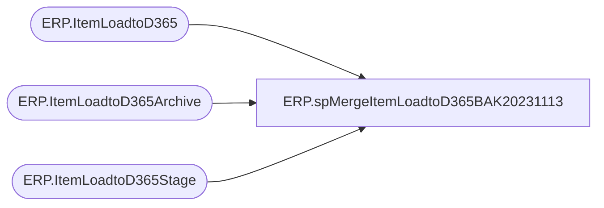

# ERP.spMergeItemLoadtoD365BAK20231113

**Database:** IntegrationStaging  

## Architecture Diagram



## Table Dependencies

| Referenced Table |
|---|
| ERP.ItemLoadtoD365 |
| ERP.ItemLoadtoD365Archive |
| ERP.ItemLoadtoD365Stage |

## Stored Procedure Code

```sql
CREATE proc [ERP].[spMergeItemLoadtoD365BAK20231113] 
 @LoadType varchar(5)

as


-------------------------------------------------------------------------
-- spMergeItemLoadtoD365 - Merges from ERP.ItemLoadtoD365Stage to ERP.ItemLoadtoD365
--						
-- 2017-08-14 - Dan Tweedie - Created Proc
/*
Fields that Cannot Be changed on Items After Transactions

This is what we know for sure:

1.	Item Model Group
2.	Storage Dimension
3.	Tracking Dimension
4.	Inventory Unit
5.	Item Number

Will add to the list when we know for sure.  Will continue to think through this and update as we discover more.  Some of these can be changed by counting out inventory and resetting.
*/
-------------------------------------------------------------------------

set nocount on

DELETE from ERP.ItemLoadtoD365Archive
where datediff(dd, ArchiveDate, getdate()) > 30

Update ERP.ItemLoadtoD365Archive
set CurrentBatch = 0

Update ERP.ItemLoadtoD365 
set SendData = 0 

Merge into ERP.ItemLoadtoD365 as target
Using ERP.ItemLoadtoD365Stage as source
On (
		target.ItemNumber=source.ItemNumber
		AND
		target.Entity = source.Entity
	)
when matched 
	and (
			
			ISNULL(target.InventoryUnitSymbol,'xxx')<>ISNULL(source.InventoryUnitSymbol,'xxx')
			OR
			ISNULL(target.ProductDescription, 'XXX') <> ISNULL(source.ProductDescription, 'XXX')
			OR
			ISNULL(target.PurchaseUnitSymbol, 'XXX') <> ISNULL(source.PurchaseUnitSymbol, 'XXX')
			OR
			ISNULL(target.SalesUnitSymbol, 'XXX') <> ISNULL(source.SalesUnitSymbol, 'XXX')
			OR
			ISNULL(target.SearchName, 'XXX') <> ISNULL(source.SearchName, 'XXX') 
			OR
			ISNULL(target.PurchasePrice, 999999.99) <> ISNULL(source.PurchasePrice, 999999.99)
			OR
			ISNULL(target.SalesPrice, 999999.99) <> ISNULL(source.SalesPrice, 999999.99)
			OR
			ISNULL(target.UnitCost, 999999.99) <> ISNULL(source.UnitCost, 999999.99)
			OR
			ISNULL(target.UnitCostQuantity, 999999.99) <> ISNULL(source.UnitCostQuantity, 999999.99)
			OR
			ISNULL(target.HarmonizedSystemCode, 'xxx')<>ISNULL(source.HarmonizedSystemCode,'xxx')
			or
			isnull(target.WarehouseMobileDeviceDescriptionLine2,'x')<>isnull(source.WarehouseMobileDeviceDescriptionLine2,'x')
			or
			isnull(target.AreTransportationManagementProcessesEnabled,'x')<>isnull(source.AreTransportationManagementProcessesEnabled,'x')
			or
			isnull(target.OriginCountryRegionId,'x')<>isnull(source.OriginCountryRegionId,'x')
			or
			isnull(target.PropertyID,'x')<>isnull(source.PropertyID,'x')
			or
			isnull(target.ReservationHierarchyName,'x')<>isnull(source.ReservationHierarchyName,'x')
			or
			isnull(target.NMFCCode,'x')<>isnull(source.NMFCCode,'x')
			or
			isnull(target.ProductSearchName,'x')<>isnull(source.ProductSearchName,'x')
			--or 
			--ISNULL(target.UnitConversionSequenceGroupId,'xxx')<>ISNULL(source.UnitConversionSequenceGroupId,'xxx')
			or
			isnull(target.ServiceItem,9)<>isnull(source.ServiceItem,9)
			or
			isnull(target.UPC,'x')<>isnull(source.UPC,'x')
			or
			isnull(target.ItemGroup,'x')<>isnull(source.ItemGroup,'x')
			or
			isnull(target.HierarchyGroup,'x')<>isnull(source.HierarchyGroup,'x')
		)
	then 
		UPDATE
			SET
				target.InventoryUnitSymbol=source.InventoryUnitSymbol,
				target.ProductDescription = source.ProductDescription,
				target.PurchaseUnitSymbol = source.PurchaseUnitSymbol,
				target.SalesUnitSymbol = source.SalesUnitSymbol,
				target.SearchName = source.SearchName,
				--target.PurchasePrice = source.PurchasePrice,
				--target.SalesPrice = source.SalesPrice,
				target.UnitCost = source.UnitCost,
				target.UnitCostQuantity = source.UnitCostQuantity,
				target.HarmonizedSystemCode=source.HarmonizedSystemCode,
				target.WarehouseMobileDeviceDescriptionLine2=source.WarehouseMobileDeviceDescriptionLine2,
				target.AreTransportationManagementProcessesEnabled=source.AreTransportationManagementProcessesEnabled,
				target.OriginCountryRegionId=source.OriginCountryRegionId,
				target.PropertyID=source.PropertyID,
				target.ReservationHierarchyName=source.ReservationHierarchyName,
				target.NMFCCode=source.NMFCCode,
				target.ProductSearchName=source.ProductSearchName,
				--target.UnitConversionSequenceGroupId=source.UnitConversionSequenceGroupId,
				target.ServiceItem=source.ServiceItem,
				target.UPC=source.UPC,
				target.ItemGroup=source.ItemGroup,
				target.HierarchyGroup=source.HierarchyGroup,
				target.UpdateDate = getdate(),
				target.SendData = 1
When Not Matched By Target 
	Then 
		Insert (
					ItemNumber,
					InventoryUnitSymbol,
					ISCATCHWEIGHTPRODUCT,
					IsProductKit,
					ItemModelGroupID,
					ProductDescription,
					ProductGroupID,
					ProductName,
					ProductNumber,
					ProductSubType,
					ProductType,
					PurchaseUnitSymbol,
					SalesUnitSymbol,
					RetailProductCategoryName,
					SearchName,
					StorageDimensionGroupName,
					TrackingDimensionGroupName,
					PurchasePrice,
					SalesPrice,
					UnitConversionSequenceGroupID,
					UnitCost,
					UnitCostQuantity,
					ISPURCHASEPRICEAUTOMATICALLYUPDATED,
					HarmonizedSystemCode,
					WarehouseMobileDeviceDescriptionLine2,
					AreTransportationManagementProcessesEnabled,
					OriginCountryRegionId,
					PropertyID,
					ReservationHierarchyName,
					NMFCCode,
					ProductSearchName,
					ServiceItem,
					UPC,
					ItemGroup,
					HierarchyGroup,
					Entity,
					SendData,
					InsertDate
				)
		Values (	
					source.ItemNumber,
					source.InventoryUnitSymbol,
					source.ISCATCHWEIGHTPRODUCT,
					source.IsProductKit,
					source.ItemModelGroupID,
					source.ProductDescription,
					source.ProductGroupID,
					source.ProductName,
					source.ProductNumber,
					source.ProductSubType,
					source.ProductType,
					source.PurchaseUnitSymbol,
					source.SalesUnitSymbol,
					source.RetailProductCategoryName,
					source.SearchName,
					source.StorageDimensionGroupName,
					source.TrackingDimensionGroupName,
					source.PurchasePrice,
					source.SalesPrice,
					source.UnitConversionSequenceGroupID,
					source.UnitCost,
					source.UnitCostQuantity,
					source.ISPURCHASEPRICEAUTOMATICALLYUPDATED,
					source.HarmonizedSystemCode,
					source.WarehouseMobileDeviceDescriptionLine2,
					source.AreTransportationManagementProcessesEnabled,
					source.OriginCountryRegionId,
					source.PropertyID,
					source.ReservationHierarchyName,
					source.NMFCCode,
					source.ProductSearchName,
					source.ServiceItem,
					source.UPC,
					source.ItemGroup,
					source.HierarchyGroup,
					source.Entity,
					1,
					getdate()
				)
--When Not Matched By Source
--	Then
--		Delete
		
--OUTPUT 
--	deleted.*,
--	getdate(),
--	$action,
--	1
--into ERP.ItemLoadtoD365Archive

;

if @LoadType = 'FULL'
update ERP.ItemLoadtoD365
set SendData = 1

;
declare @Entity varchar(4)
select @Entity=max(Entity) from ERP.ItemLoadtoD365Stage
if @LoadType = 'FULL'
Merge into ERP.ItemLoadtoD365 as target
Using ERP.ItemLoadtoD365Stage as source
On (
		target.ItemNumber=source.ItemNumber
		AND
		target.Entity = source.Entity
	)
When Not Matched By Source
	and target.Entity = @Entity
	Then
		Delete
;


ERP,spMergeItemMaster,CREATE proc [ERP].[spMergeItemMaster]

as

----------------------------------------------------------------------------------------------------------------------------
--	Dan Tweedie	-	2017-11-06	-	Created proc - Merges Dynamics 365 Item data from ERP.ItemMasterStage to ERP.ItemMaster
----------------------------------------------------------------------------------------------------------------------------


set nocount on

merge into ERP.ItemMaster as target 
Using ERP.ItemMasterStage as source
on (
		target.PRODUCTNUMBER=source.PRODUCTNUMBER
		and 
		target.Entity = source.Entity
	)
when matched 
	and
		(
			isnull(target.ALTERNATIVEPRODUCTUSAGECONDITION,'xxx')<>isnull(source.ALTERNATIVEPRODUCTUSAGECONDITION,'xxx') OR
			isnull(target.APPROVEDVENDORCHECKMETHOD,'xxx')<>isnull(source.APPROVEDVENDORCHECKMETHOD,'xxx') OR
			isnull(target.ARETRANSPORTATIONMANAGEMENTPROCESSESENABLED,'xxx')<>isnull(source.ARETRANSPORTATIONMANAGEMENTPROCESSESENABLED,'xxx') OR
			isnull(target.ARRIVALHANDLINGTIME,0)<>isnull(source.ARRIVALHANDLINGTIME,0) OR
			isnull(target.BASESALESPRICESOURCE,'xxx')<>isnull(source.BASESALESPRICESOURCE,'xxx') OR
			isnull(target.BATCHMERGEDATECALCULATIONMETHOD,'xxx')<>isnull(source.BATCHMERGEDATECALCULATIONMETHOD,'xxx') OR
			isnull(target.BESTBEFOREPERIODDAYS,0)<>isnull(source.BESTBEFOREPERIODDAYS,0) OR
			isnull(target.BOMLEVEL,0)<>isnull(source.BOMLEVEL,0) OR
			isnull(target.BOMUNITSYMBOL,'xxx')<>isnull(source.BOMUNITSYMBOL,'xxx') OR
			isnull(target.BUYERGROUPID,'xxx')<>isnull(source.BUYERGROUPID,'xxx') OR
			isnull(target.CARRYINGCOSTABCCODE,'xxx')<>isnull(source.CARRYINGCOSTABCCODE,'xxx') OR
			isnull(target.CONSTANTSCRAPQUANTITY,0)<>isnull(source.CONSTANTSCRAPQUANTITY,0) OR
			isnull(target.CONTINUITYEVENTDURATION,0)<>isnull(source.CONTINUITYEVENTDURATION,0) OR
			isnull(target.COSTCHARGESQUANTITY,0)<>isnull(source.COSTCHARGESQUANTITY,0) OR
			isnull(target.DEFAULTDIRECTDELIVERYWAREHOUSE,0)<>isnull(source.DEFAULTDIRECTDELIVERYWAREHOUSE,0) OR
			isnull(target.DEFAULTLEDGERDIMENSIONDISPLAYVALUE,'xxx')<>isnull(source.DEFAULTLEDGERDIMENSIONDISPLAYVALUE,'xxx') OR
			isnull(target.DEFAULTORDERTYPE,'xxx')<>isnull(source.DEFAULTORDERTYPE,'xxx') OR
			isnull(target.DEFAULTRECEIVINGQUANTITY,0)<>isnull(source.DEFAULTRECEIVINGQUANTITY,0) OR
			isnull(target.FIXEDCOSTCHARGES,0)<>isnull(source.FIXEDCOSTCHARGES,0) OR
			isnull(target.FIXEDPURCHASEPRICECHARGES,0)<>isnull(source.FIXEDPURCHASEPRICECHARGES,0) OR
			isnull(target.FIXEDSALESPRICECHARGES,0)<>isnull(source.FIXEDSALESPRICECHARGES,0) OR
			isnull(target.FLUSHINGPRINCIPLE,'xxx')<>isnull(source.FLUSHINGPRINCIPLE,'xxx') OR
			isnull(target.GROSSDEPTH,0)<>isnull(source.GROSSDEPTH,0) OR
			isnull(target.GROSSPRODUCTHEIGHT,0)<>isnull(source.GROSSPRODUCTHEIGHT,0) OR
			isnull(target.GROSSPRODUCTWIDTH,0)<>isnull(source.GROSSPRODUCTWIDTH,0) OR
			isnull(target.INVENTORYUNITSYMBOL,'xxx')<>isnull(source.INVENTORYUNITSYMBOL,'xxx') OR
			isnull(target.ISDELIVEREDDIRECTLY,'xxx')<>isnull(source.ISDELIVEREDDIRECTLY,'xxx') OR
			isnull(target.ISDISCOUNTPOSREGISTRATIONPROHIBITED,'xxx')<>isnull(source.ISDISCOUNTPOSREGISTRATIONPROHIBITED,'xxx') OR
			isnull(target.ISEXEMPTFROMAUTOMATICNOTIFICATIONANDCANCELLATION,'xxx')<>isnull(source.ISEXEMPTFROMAUTOMATICNOTIFICATIONANDCANCELLATION,'xxx') OR
			isnull(target.ISINSTALLMENTELIGIBLE,'xxx')<>isnull(source.ISINSTALLMENTELIGIBLE,'xxx') OR
			isnull(target.ISINTERCOMPANYPURCHASEUSAGEBLOCKED,'xxx')<>isnull(source.ISINTERCOMPANYPURCHASEUSAGEBLOCKED,'xxx') OR
			isnull(target.ISINTERCOMPANYSALESUSAGEBLOCKED,'xxx')<>isnull(source.ISINTERCOMPANYSALESUSAGEBLOCKED,'xxx') OR
			isnull(target.ISPHANTOM,'xxx')<>isnull(source.ISPHANTOM,'xxx') OR
			isnull(target.ISPOSREGISTRATIONBLOCKED,'xxx')<>isnull(source.ISPOSREGISTRATIONBLOCKED,'xxx') OR
			isnull(target.ISPOSREGISTRATIONQUANTITYNEGATIVE,'xxx')<>isnull(source.ISPOSREGISTRATIONQUANTITYNEGATIVE,'xxx') OR
			isnull(target.ISPURCHASEPRICEAUTOMATICALLYUPDATED,'xxx')<>isnull(source.ISPURCHASEPRICEAUTOMATICALLYUPDATED,'xxx') OR
			isnull(target.ISPURCHASEPRICEINCLUDINGCHARGES,'xxx')<>isnull(source.ISPURCHASEPRICEINCLUDINGCHARGES,'xxx') OR
			isnull(target.ISRESTRICTEDFORCOUPONS,'xxx')<>isnull(source.ISRESTRICTEDFORCOUPONS,'xxx') OR
			isnull(target.ISSALESPRICEADJUSTMENTALLOWED,'xxx')<>isnull(source.ISSALESPRICEADJUSTMENTALLOWED,'xxx') OR
			isnull(target.ISSALESPRICEINCLUDINGCHARGES,'xxx')<>isnull(source.ISSALESPRICEINCLUDINGCHARGES,'xxx') OR
			isnull(target.ISUNITCOSTPRODUCTVARIANTSPECIFIC,'xxx')<>isnull(source.ISUNITCOSTPRODUCTVARIANTSPECIFIC,'xxx') OR
			isnull(target.ISVARIANTSHELFLABELSPRINTINGENABLED,'xxx')<>isnull(source.ISVARIANTSHELFLABELSPRINTINGENABLED,'xxx') OR
			isnull(target.ISZEROPRICEPOSREGISTRATIONALLOWED,'xxx')<>isnull(source.ISZEROPRICEPOSREGISTRATIONALLOWED,'xxx') OR
			isnull(target.ITEMMODELGROUPID,'xxx')<>isnull(source.ITEMMODELGROUPID,'xxx') OR
			isnull(target.ITEMNUMBER,'xxx')<>isnull(source.ITEMNUMBER,'xxx') OR
			isnull(target.KEYINPRICEREQUIREMENTSATPOSREGISTER,'xxx')<>isnull(source.KEYINPRICEREQUIREMENTSATPOSREGISTER,'xxx') OR
			isnull(target.KEYINQUANTITYREQUIREMENTSATPOSREGISTER,'xxx')<>isnull(source.KEYINQUANTITYREQUIREMENTSATPOSREGISTER,'xxx') OR
			isnull(target.MARGINABCCODE,'xxx')<>isnull(source.MARGINABCCODE,'xxx') OR
			isnull(target.MAXIMUMCATCHWEIGHTQUANTITY,0)<>isnull(source.MAXIMUMCATCHWEIGHTQUANTITY,0) OR
			isnull(target.MAXIMUMPICKQUANTITY,0)<>isnull(source.MAXIMUMPICKQUANTITY,0) OR
			isnull(target.MINIMUMCATCHWEIGHTQUANTITY,0)<>isnull(source.MINIMUMCATCHWEIGHTQUANTITY,0) OR
			isnull(target.MUSTKEYINCOMMENTATPOSREGISTER,'xxx')<>isnull(source.MUSTKEYINCOMMENTATPOSREGISTER,'xxx') OR
			isnull(target.NETPRODUCTWEIGHT,0)<>isnull(source.NETPRODUCTWEIGHT,0) OR
			isnull(target.PACKINGDUTYQUANTITY,0)<>isnull(source.PACKINGDUTYQUANTITY,0) OR
			isnull(target.POSREGISTRATIONACTIVATIONDATE, '1999-12-31')<>isnull(source.POSREGISTRATIONACTIVATIONDATE, '1999-12-31') OR
			isnull(target.POSREGISTRATIONBLOCKEDDATE, '1999-12-31')<>isnull(source.POSREGISTRATIONBLOCKEDDATE, '1999-12-31') OR
			isnull(target.POSREGISTRATIONPLANNEDBLOCKEDDATE, '1999-12-31')<>isnull(source.POSREGISTRATIONPLANNEDBLOCKEDDATE, '1999-12-31') OR
			isnull(target.POTENCYBASEATTIBUTETARGETVALUE,0)<>isnull(source.POTENCYBASEATTIBUTETARGETVALUE,0) OR
			isnull(target.POTENCYBASEATTRIBUTEVALUEENTRYEVENT,'xxx')<>isnull(source.POTENCYBASEATTRIBUTEVALUEENTRYEVENT,'xxx') OR
			isnull(target.PRIMARYVENDORACCOUNTNUMBER,0)<>isnull(source.PRIMARYVENDORACCOUNTNUMBER,0) OR
			isnull(target.PRODUCTIONCONSUMPTIONDENSITYCONVERSIONFACTOR,0)<>isnull(source.PRODUCTIONCONSUMPTIONDENSITYCONVERSIONFACTOR,0) OR
			isnull(target.PRODUCTIONCONSUMPTIONDEPTHCONVERSIONFACTOR,0)<>isnull(source.PRODUCTIONCONSUMPTIONDEPTHCONVERSIONFACTOR,0) OR
			isnull(target.PRODUCTIONCONSUMPTIONHEIGHTCONVERSIONFACTOR,0)<>isnull(source.PRODUCTIONCONSUMPTIONHEIGHTCONVERSIONFACTOR,0) OR
			isnull(target.PRODUCTIONCONSUMPTIONWIDTHCONVERSIONFACTOR,0)<>isnull(source.PRODUCTIONCONSUMPTIONWIDTHCONVERSIONFACTOR,0) OR
			isnull(target.PRODUCTIONTYPE,'xxx')<>isnull(source.PRODUCTIONTYPE,'xxx') OR
			isnull(target.PRODUCTLIFECYCLEVALIDFROMDATE, '1999-12-31')<>isnull(source.PRODUCTLIFECYCLEVALIDFROMDATE, '1999-12-31') OR
			isnull(target.PRODUCTLIFECYCLEVALIDTODATE, '1999-12-31')<>isnull(source.PRODUCTLIFECYCLEVALIDTODATE, '1999-12-31') OR
			isnull(target.PRODUCTSEARCHNAME,'xxx')<>isnull(source.PRODUCTSEARCHNAME,'xxx') OR
			isnull(target.PRODUCTSUBTYPE,'xxx')<>isnull(source.PRODUCTSUBTYPE,'xxx') OR
			isnull(target.PRODUCTTYPE,'xxx')<>isnull(source.PRODUCTTYPE,'xxx') OR
			isnull(target.PRODUCTVOLUME,0)<>isnull(source.PRODUCTVOLUME,0) OR
			isnull(target.PURCHASECHARGESQUANTITY,0)<>isnull(source.PURCHASECHARGESQUANTITY,0) OR
			isnull(target.PURCHASEOVERDELIVERYPERCENTAGE,0)<>isnull(source.PURCHASEOVERDELIVERYPERCENTAGE,0) OR
			isnull(target.PURCHASEPRICE,0.00)<>isnull(source.PURCHASEPRICE,0.00) OR
			isnull(target.PURCHASEPRICEDATE, '1999-12-31')<>isnull(source.PURCHASEPRICEDATE, '1999-12-31') OR
			isnull(target.PURCHASEPRICEQUANTITY,0)<>isnull(source.PURCHASEPRICEQUANTITY,0) OR
			isnull(target.PURCHASEPRICINGPRECISION,0)<>isnull(source.PURCHASEPRICINGPRECISION,0) OR
			isnull(target.PURCHASESALESTAXITEMGROUPCODE,'xxx')<>isnull(source.PURCHASESALESTAXITEMGROUPCODE,'xxx') OR
			isnull(target.PURCHASEUNDERDELIVERYPERCENTAGE,0)<>isnull(source.PURCHASEUNDERDELIVERYPERCENTAGE,0) OR
			isnull(target.PURCHASEUNITSYMBOL,'xxx')<>isnull(source.PURCHASEUNITSYMBOL,'xxx') OR
			isnull(target.RAWMATERIALPICKINGPRINCIPLE,'xxx')<>isnull(source.RAWMATERIALPICKINGPRINCIPLE,'xxx') OR
			isnull(target.REVENUEABCCODE,'xxx')<>isnull(source.REVENUEABCCODE,'xxx') OR
			isnull(target.SALESCHARGESQUANTITY,0)<>isnull(source.SALESCHARGESQUANTITY,0) OR
			isnull(target.SALESLINEDISCOUNTPRODUCTGROUPCODE,'xxx')<>isnull(source.SALESLINEDISCOUNTPRODUCTGROUPCODE,'xxx') OR
			isnull(target.SALESOVERDELIVERYPERCENTAGE,0)<>isnull(source.SALESOVERDELIVERYPERCENTAGE,0) OR
			isnull(target.SALESPRICE,0.00)<>isnull(source.SALESPRICE,0.00) OR
			isnull(target.SALESPRICECALCULATIONCHARGESPERCENTAGE,0)<>isnull(source.SALESPRICECALCULATIONCHARGESPERCENTAGE,0) OR
			isnull(target.SALESPRICECALCULATIONCONTRIBUTIONRATIO,0)<>isnull(source.SALESPRICECALCULATIONCONTRIBUTIONRATIO,0) OR
			isnull(target.SALESPRICECALCULATIONMODEL,'xxx')<>isnull(source.SALESPRICECALCULATIONMODEL,'xxx') OR
			isnull(target.SALESPRICEDATE, '1999-12-31')<>isnull(source.SALESPRICEDATE, '1999-12-31') OR
			isnull(target.SALESPRICEQUANTITY,0)<>isnull(source.SALESPRICEQUANTITY,0) OR
			isnull(target.SALESPRICINGPRECISION,0)<>isnull(source.SALESPRICINGPRECISION,0) OR
			isnull(target.SALESSALESTAXITEMGROUPCODE,'xxx')<>isnull(source.SALESSALESTAXITEMGROUPCODE,'xxx') OR
			isnull(target.SALESUNDERDELIVERYPERCENTAGE,0)<>isnull(source.SALESUNDERDELIVERYPERCENTAGE,0) OR
			isnull(target.SALESUNITSYMBOL,'xxx')<>isnull(source.SALESUNITSYMBOL,'xxx') OR
			isnull(target.SEARCHNAME,'xxx')<>isnull(source.SEARCHNAME,'xxx') OR
			isnull(target.SELLENDDATE, '1999-12-31')<>isnull(source.SELLENDDATE, '1999-12-31') OR
			isnull(target.SELLSTARTDATE, '1999-12-31')<>isnull(source.SELLSTARTDATE, '1999-12-31') OR
			isnull(target.SHELFADVICEPERIODDAYS,0)<>isnull(source.SHELFADVICEPERIODDAYS,0) OR
			isnull(target.SHELFLIFEPERIODDAYS,0)<>isnull(source.SHELFLIFEPERIODDAYS,0) OR
			isnull(target.SHIPPINGANDRECEIVINGSORTORDERCODE,0)<>isnull(source.SHIPPINGANDRECEIVINGSORTORDERCODE,0) OR
			isnull(target.SHIPSTARTDATE, '1999-12-31')<>isnull(source.SHIPSTARTDATE, '1999-12-31') OR
			isnull(target.STORAGEDIMENSIONGROUPNAME,'xxx')<>isnull(source.STORAGEDIMENSIONGROUPNAME,'xxx') OR
			isnull(target.TAREPRODUCTWEIGHT,0)<>isnull(source.TAREPRODUCTWEIGHT,0) OR
			isnull(target.TRACKINGDIMENSIONGROUPNAME,'xxx')<>isnull(source.TRACKINGDIMENSIONGROUPNAME,'xxx') OR
			isnull(target.TRANSFERORDEROVERDELIVERYPERCENTAGE,0)<>isnull(source.TRANSFERORDEROVERDELIVERYPERCENTAGE,0) OR
			isnull(target.TRANSFERORDERUNDERDELIVERYPERCENTAGE,0)<>isnull(source.TRANSFERORDERUNDERDELIVERYPERCENTAGE,0) OR
			isnull(target.UNITCOST,0.00)<>isnull(source.UNITCOST,0.00) OR
			isnull(target.UNITCOSTDATE, '1999-12-31')<>isnull(source.UNITCOSTDATE, '1999-12-31') OR
			isnull(target.UNITCOSTQUANTITY,0)<>isnull(source.UNITCOSTQUANTITY,0) OR
			isnull(target.VALUEABCCODE,'xxx')<>isnull(source.VALUEABCCODE,'xxx') OR
			isnull(target.VARIABLESCRAPPERCENTAGE,0)<>isnull(source.VARIABLESCRAPPERCENTAGE,0) OR
			isnull(target.VENDORINVOICELINEMATCHINGPOLICY,'xxx')<>isnull(source.VENDORINVOICELINEMATCHINGPOLICY,'xxx') OR
			isnull(target.WILLINVENTORYISSUEAUTOMATICALLYREPORTASFINISHED,'xxx')<>isnull(source.WILLINVENTORYISSUEAUTOMATICALLYREPORTASFINISHED,'xxx') OR
			isnull(target.WILLINVENTORYRECEIPTIGNOREFLUSHINGPRINCIPLE,'xxx')<>isnull(source.WILLINVENTORYRECEIPTIGNOREFLUSHINGPRINCIPLE,'xxx') OR
			isnull(target.WILLPICKINGWORKBENCHAPPLYBOXINGLOGIC,'xxx')<>isnull(source.WILLPICKINGWORKBENCHAPPLYBOXINGLOGIC,'xxx') OR
			isnull(target.WILLTOTALPURCHASEDISCOUNTCALCULATIONINCLUDEPRODUCT,'xxx')<>isnull(source.WILLTOTALPURCHASEDISCOUNTCALCULATIONINCLUDEPRODUCT,'xxx') OR
			isnull(target.WILLTOTALSALESDISCOUNTCALCULATIONINCLUDEPRODUCT,'xxx')<>isnull(source.WILLTOTALSALESDISCOUNTCALCULATIONINCLUDEPRODUCT,'xxx') OR
			isnull(target.WILLWORKCENTERPICKINGALLOWNEGATIVEINVENTORY,'xxx')<>isnull(source.WILLWORKCENTERPICKINGALLOWNEGATIVEINVENTORY,'xxx') OR
			isnull(target.YIELDPERCENTAGE,0)<>isnull(source.YIELDPERCENTAGE,0)
		)
	then 
		UPDATE
			SET
				target.ALTERNATIVEPRODUCTUSAGECONDITION=source.ALTERNATIVEPRODUCTUSAGECONDITION,
				target.APPROVEDVENDORCHECKMETHOD=source.APPROVEDVENDORCHECKMETHOD,
				target.ARETRANSPORTATIONMANAGEMENTPROCESSESENABLED=source.ARETRANSPORTATIONMANAGEMENTPROCESSESENABLED,
				target.ARRIVALHANDLINGTIME=source.ARRIVALHANDLINGTIME,
				target.BASESALESPRICESOURCE=source.BASESALESPRICESOURCE,
				target.BATCHMERGEDATECALCULATIONMETHOD=source.BATCHMERGEDATECALCULATIONMETHOD,
				target.BESTBEFOREPERIODDAYS=source.BESTBEFOREPERIODDAYS,
				target.BOMLEVEL=source.BOMLEVEL,
				target.BOMUNITSYMBOL=source.BOMUNITSYMBOL,
				target.BUYERGROUPID=source.BUYERGROUPID,
				target.CARRYINGCOSTABCCODE=source.CARRYINGCOSTABCCODE,
				target.CONSTANTSCRAPQUANTITY=source.CONSTANTSCRAPQUANTITY,
				target.CONTINUITYEVENTDURATION=source.CONTINUITYEVENTDURATION,
				target.COSTCHARGESQUANTITY=source.COSTCHARGESQUANTITY,
				target.DEFAULTDIRECTDELIVERYWAREHOUSE=source.DEFAULTDIRECTDELIVERYWAREHOUSE,
				target.DEFAULTLEDGERDIMENSIONDISPLAYVALUE=source.DEFAULTLEDGERDIMENSIONDISPLAYVALUE,
				target.DEFAULTORDERTYPE=source.DEFAULTORDERTYPE,
				target.DEFAULTRECEIVINGQUANTITY=source.DEFAULTRECEIVINGQUANTITY,
				target.FIXEDCOSTCHARGES=source.FIXEDCOSTCHARGES,
				target.FIXEDPURCHASEPRICECHARGES=source.FIXEDPURCHASEPRICECHARGES,
				target.FIXEDSALESPRICECHARGES=source.FIXEDSALESPRICECHARGES,
				target.FLUSHINGPRINCIPLE=source.FLUSHINGPRINCIPLE,
				target.GROSSDEPTH=source.GROSSDEPTH,
				target.GROSSPRODUCTHEIGHT=source.GROSSPRODUCTHEIGHT,
				target.GROSSPRODUCTWIDTH=source.GROSSPRODUCTWIDTH,
				target.INVENTORYUNITSYMBOL=source.INVENTORYUNITSYMBOL,
				target.ISDELIVEREDDIRECTLY=source.ISDELIVEREDDIRECTLY,
				target.ISDISCOUNTPOSREGISTRATIONPROHIBITED=source.ISDISCOUNTPOSREGISTRATIONPROHIBITED,
				target.ISEXEMPTFROMAUTOMATICNOTIFICATIONANDCANCELLATION=source.ISEXEMPTFROMAUTOMATICNOTIFICATIONANDCANCELLATION,
				target.ISINSTALLMENTELIGIBLE=source.ISINSTALLMENTELIGIBLE,
				target.ISINTERCOMPANYPURCHASEUSAGEBLOCKED=source.ISINTERCOMPANYPURCHASEUSAGEBLOCKED,
				target.ISINTERCOMPANYSALESUSAGEBLOCKED=source.ISINTERCOMPANYSALESUSAGEBLOCKED,
				target.ISPHANTOM=source.ISPHANTOM,
				target.ISPOSREGISTRATIONBLOCKED=source.ISPOSREGISTRATIONBLOCKED,
				target.ISPOSREGISTRATIONQUANTITYNEGATIVE=source.ISPOSREGISTRATIONQUANTITYNEGATIVE,
				target.ISPURCHASEPRICEAUTOMATICALLYUPDATED=source.ISPURCHASEPRICEAUTOMATICALLYUPDATED,
				target.ISPURCHASEPRICEINCLUDINGCHARGES=source.ISPURCHASEPRICEINCLUDINGCHARGES,
				target.ISRESTRICTEDFORCOUPONS=source.ISRESTRICTEDFORCOUPONS,
				target.ISSALESPRICEADJUSTMENTALLOWED=source.ISSALESPRICEADJUSTMENTALLOWED,
				target.ISSALESPRICEINCLUDINGCHARGES=source.ISSALESPRICEINCLUDINGCHARGES,
				target.ISUNITCOSTPRODUCTVARIANTSPECIFIC=source.ISUNITCOSTPRODUCTVARIANTSPECIFIC,
				target.ISVARIANTSHELFLABELSPRINTINGENABLED=source.ISVARIANTSHELFLABELSPRINTINGENABLED,
				target.ISZEROPRICEPOSREGISTRATIONALLOWED=source.ISZEROPRICEPOSREGISTRATIONALLOWED,
				target.ITEMMODELGROUPID=source.ITEMMODELGROUPID,
				target.ITEMNUMBER=source.ITEMNUMBER,
				target.KEYINPRICEREQUIREMENTSATPOSREGISTER=source.KEYINPRICEREQUIREMENTSATPOSREGISTER,
				target.KEYINQUANTITYREQUIREMENTSATPOSREGISTER=source.KEYINQUANTITYREQUIREMENTSATPOSREGISTER,
				target.MARGINABCCODE=source.MARGINABCCODE,
				target.MAXIMUMCATCHWEIGHTQUANTITY=source.MAXIMUMCATCHWEIGHTQUANTITY,
				target.MAXIMUMPICKQUANTITY=source.MAXIMUMPICKQUANTITY,
				target.MINIMUMCATCHWEIGHTQUANTITY=source.MINIMUMCATCHWEIGHTQUANTITY,
				target.MUSTKEYINCOMMENTATPOSREGISTER=source.MUSTKEYINCOMMENTATPOSREGISTER,
				target.NETPRODUCTWEIGHT=source.NETPRODUCTWEIGHT,
				target.PACKINGDUTYQUANTITY=source.PACKINGDUTYQUANTITY,
				target.POSREGISTRATIONACTIVATIONDATE=source.POSREGISTRATIONACTIVATIONDATE,
				target.POSREGISTRATIONBLOCKEDDATE=source.POSREGISTRATIONBLOCKEDDATE,
				target.POSREGISTRATIONPLANNEDBLOCKEDDATE=source.POSREGISTRATIONPLANNEDBLOCKEDDATE,
				target.POTENCYBASEATTIBUTETARGETVALUE=source.POTENCYBASEATTIBUTETARGETVALUE,
				target.POTENCYBASEATTRIBUTEVALUEENTRYEVENT=source.POTENCYBASEATTRIBUTEVALUEENTRYEVENT,
				target.PRIMARYVENDORACCOUNTNUMBER=source.PRIMARYVENDORACCOUNTNUMBER,
				target.PRODUCTIONCONSUMPTIONDENSITYCONVERSIONFACTOR=source.PRODUCTIONCONSUMPTIONDENSITYCONVERSIONFACTOR,
				target.PRODUCTIONCONSUMPTIONDEPTHCONVERSIONFACTOR=source.PRODUCTIONCONSUMPTIONDEPTHCONVERSIONFACTOR,
				target.PRODUCTIONCONSUMPTIONHEIGHTCONVERSIONFACTOR=source.PRODUCTIONCONSUMPTIONHEIGHTCONVERSIONFACTOR,
				target.PRODUCTIONCONSUMPTIONWIDTHCONVERSIONFACTOR=source.PRODUCTIONCONSUMPTIONWIDTHCONVERSIONFACTOR,
				target.PRODUCTIONTYPE=source.PRODUCTIONTYPE,
				target.PRODUCTLIFECYCLEVALIDFROMDATE=source.PRODUCTLIFECYCLEVALIDFROMDATE,
				target.PRODUCTLIFECYCLEVALIDTODATE=source.PRODUCTLIFECYCLEVALIDTODATE,
				target.PRODUCTSEARCHNAME=source.PRODUCTSEARCHNAME,
				target.PRODUCTSUBTYPE=source.PRODUCTSUBTYPE,
				target.PRODUCTTYPE=source.PRODUCTTYPE,
				target.PRODUCTVOLUME=source.PRODUCTVOLUME,
				target.PURCHASECHARGESQUANTITY=source.PURCHASECHARGESQUANTITY,
				target.PURCHASEOVERDELIVERYPERCENTAGE=source.PURCHASEOVERDELIVERYPERCENTAGE,
				target.PURCHASEPRICE=source.PURCHASEPRICE,
				target.PURCHASEPRICEDATE=source.PURCHASEPRICEDATE,
				target.PURCHASEPRICEQUANTITY=source.PURCHASEPRICEQUANTITY,
				target.PURCHASEPRICINGPRECISION=source.PURCHASEPRICINGPRECISION,
				target.PURCHASESALESTAXITEMGROUPCODE=source.PURCHASESALESTAXITEMGROUPCODE,
				target.PURCHASEUNDERDELIVERYPERCENTAGE=source.PURCHASEUNDERDELIVERYPERCENTAGE,
				target.PURCHASEUNITSYMBOL=source.PURCHASEUNITSYMBOL,
				target.RAWMATERIALPICKINGPRINCIPLE=source.RAWMATERIALPICKINGPRINCIPLE,
				target.REVENUEABCCODE=source.REVENUEABCCODE,
				target.SALESCHARGESQUANTITY=source.SALESCHARGESQUANTITY,
				target.SALESLINEDISCOUNTPRODUCTGROUPCODE=source.SALESLINEDISCOUNTPRODUCTGROUPCODE,
				target.SALESOVERDELIVERYPERCENTAGE=source.SALESOVERDELIVERYPERCENTAGE,
				target.SALESPRICE=source.SALESPRICE,
				target.SALESPRICECALCULATIONCHARGESPERCENTAGE=source.SALESPRICECALCULATIONCHARGESPERCENTAGE,
				target.SALESPRICECALCULATIONCONTRIBUTIONRATIO=source.SALESPRICECALCULATIONCONTRIBUTIONRATIO,
				target.SALESPRICECALCULATIONMODEL=source.SALESPRICECALCULATIONMODEL,
				target.SALESPRICEDATE=source.SALESPRICEDATE,
				target.SALESPRICEQUANTITY=source.SALESPRICEQUANTITY,
				target.SALESPRICINGPRECISION=source.SALESPRICINGPRECISION,
				target.SALESSALESTAXITEMGROUPCODE=source.SALESSALESTAXITEMGROUPCODE,
				target.SALESUNDERDELIVERYPERCENTAGE=source.SALESUNDERDELIVERYPERCENTAGE,
				target.SALESUNITSYMBOL=source.SALESUNITSYMBOL,
				target.SEARCHNAME=source.SEARCHNAME,
				target.SELLENDDATE=source.SELLENDDATE,
				target.SELLSTARTDATE=source.SELLSTARTDATE,
				target.SHELFADVICEPERIODDAYS=source.SHELFADVICEPERIODDAYS,
				target.SHELFLIFEPERIODDAYS=source.SHELFLIFEPERIODDAYS,
				target.SHIPPINGANDRECEIVINGSORTORDERCODE=source.SHIPPINGANDRECEIVINGSORTORDERCODE,
				target.SHIPSTARTDATE=source.SHIPSTARTDATE,
				target.STORAGEDIMENSIONGROUPNAME=source.STORAGEDIMENSIONGROUPNAME,
				target.TAREPRODUCTWEIGHT=source.TAREPRODUCTWEIGHT,
				target.TRACKINGDIMENSIONGROUPNAME=source.TRACKINGDIMENSIONGROUPNAME,
				target.TRANSFERORDEROVERDELIVERYPERCENTAGE=source.TRANSFERORDEROVERDELIVERYPERCENTAGE,
				target.TRANSFERORDERUNDERDELIVERYPERCENTAGE=source.TRANSFERORDERUNDERDELIVERYPERCENTAGE,
				target.UNITCOST=source.UNITCOST,
				target.UNITCOSTDATE=source.UNITCOSTDATE,
				target.UNITCOSTQUANTITY=source.UNITCOSTQUANTITY,
				target.VALUEABCCODE=source.VALUEABCCODE,
				target.VARIABLESCRAPPERCENTAGE=source.VARIABLESCRAPPERCENTAGE,
				target.VENDORINVOICELINEMATCHINGPOLICY=source.VENDORINVOICELINEMATCHINGPOLICY,
				target.WILLINVENTORYISSUEAUTOMATICALLYREPORTASFINISHED=source.WILLINVENTORYISSUEAUTOMATICALLYREPORTASFINISHED,
				target.WILLINVENTORYRECEIPTIGNOREFLUSHINGPRINCIPLE=source.WILLINVENTORYRECEIPTIGNOREFLUSHINGPRINCIPLE,
				target.WILLPICKINGWORKBENCHAPPLYBOXINGLOGIC=source.WILLPICKINGWORKBENCHAPPLYBOXINGLOGIC,
				target.WILLTOTALPURCHASEDISCOUNTCALCULATIONINCLUDEPRODUCT=source.WILLTOTALPURCHASEDISCOUNTCALCULATIONINCLUDEPRODUCT,
				target.WILLTOTALSALESDISCOUNTCALCULATIONINCLUDEPRODUCT=source.WILLTOTALSALESDISCOUNTCALCULATIONINCLUDEPRODUCT,
				target.WILLWORKCENTERPICKINGALLOWNEGATIVEINVENTORY=source.WILLWORKCENTERPICKINGALLOWNEGATIVEINVENTORY,
				target.YIELDPERCENTAGE=source.YIELDPERCENTAGE,
				target.UpdateDate = getdate()
When NOT MATCHED by Target
	then 
		insert
			(
				ALTERNATIVEPRODUCTUSAGECONDITION,
				APPROVEDVENDORCHECKMETHOD,
				ARETRANSPORTATIONMANAGEMENTPROCESSESENABLED,
				ARRIVALHANDLINGTIME,
				BASESALESPRICESOURCE,
				BATCHMERGEDATECALCULATIONMETHOD,
				BESTBEFOREPERIODDAYS,
				BOMLEVEL,
				BOMUNITSYMBOL,
				BUYERGROUPID,
				CARRYINGCOSTABCCODE,
				CONSTANTSCRAPQUANTITY,
				CONTINUITYEVENTDURATION,
				COSTCHARGESQUANTITY,
				DEFAULTDIRECTDELIVERYWAREHOUSE,
				DEFAULTLEDGERDIMENSIONDISPLAYVALUE,
				DEFAULTORDERTYPE,
				DEFAULTRECEIVINGQUANTITY,
				FIXEDCOSTCHARGES,
				FIXEDPURCHASEPRICECHARGES,
				FIXEDSALESPRICECHARGES,
				FLUSHINGPRINCIPLE,
				GROSSDEPTH,
				GROSSPRODUCTHEIGHT,
				GROSSPRODUCTWIDTH,
				INVENTORYUNITSYMBOL,
				ISDELIVEREDDIRECTLY,
				ISDISCOUNTPOSREGISTRATIONPROHIBITED,
				ISEXEMPTFROMAUTOMATICNOTIFICATIONANDCANCELLATION,
				ISINSTALLMENTELIGIBLE,
				ISINTERCOMPANYPURCHASEUSAGEBLOCKED,
				ISINTERCOMPANYSALESUSAGEBLOCKED,
				ISPHANTOM,
				ISPOSREGISTRATIONBLOCKED,
				ISPOSREGISTRATIONQUANTITYNEGATIVE,
				ISPURCHASEPRICEAUTOMATICALLYUPDATED,
				ISPURCHASEPRICEINCLUDINGCHARGES,
				ISRESTRICTEDFORCOUPONS,
				ISSALESPRICEADJUSTMENTALLOWED,
				ISSALESPRICEINCLUDINGCHARGES,
				ISUNITCOSTPRODUCTVARIANTSPECIFIC,
				ISVARIANTSHELFLABELSPRINTINGENABLED,
				ISZEROPRICEPOSREGISTRATIONALLOWED,
				ITEMMODELGROUPID,
				ITEMNUMBER,
				KEYINPRICEREQUIREMENTSATPOSREGISTER,
				KEYINQUANTITYREQUIREMENTSATPOSREGISTER,
				MARGINABCCODE,
				MAXIMUMCATCHWEIGHTQUANTITY,
				MAXIMUMPICKQUANTITY,
				MINIMUMCATCHWEIGHTQUANTITY,
				MUSTKEYINCOMMENTATPOSREGISTER,
				NETPRODUCTWEIGHT,
				PACKINGDUTYQUANTITY,
				POSREGISTRATIONACTIVATIONDATE,
				POSREGISTRATIONBLOCKEDDATE,
				POSREGISTRATIONPLANNEDBLOCKEDDATE,
				POTENCYBASEATTIBUTETARGETVALUE,
				POTENCYBASEATTRIBUTEVALUEENTRYEVENT,
				PRIMARYVENDORACCOUNTNUMBER,
				PRODUCTIONCONSUMPTIONDENSITYCONVERSIONFACTOR,
				PRODUCTIONCONSUMPTIONDEPTHCONVERSIONFACTOR,
				PRODUCTIONCONSUMPTIONHEIGHTCONVERSIONFACTOR,
				PRODUCTIONCONSUMPTIONWIDTHCONVERSIONFACTOR,
				PRODUCTIONTYPE,
				PRODUCTLIFECYCLEVALIDFROMDATE,
				PRODUCTLIFECYCLEVALIDTODATE,
				PRODUCTNUMBER,
				PRODUCTSEARCHNAME,
				PRODUCTSUBTYPE,
				PRODUCTTYPE,
				PRODUCTVOLUME,
				PURCHASECHARGESQUANTITY,
				PURCHASEOVERDELIVERYPERCENTAGE,
				PURCHASEPRICE,
				PURCHASEPRICEDATE,
				PURCHASEPRICEQUANTITY,
				PURCHASEPRICINGPRECISION,
				PURCHASESALESTAXITEMGROUPCODE,
				PURCHASEUNDERDELIVERYPERCENTAGE,
				PURCHASEUNITSYMBOL,
				RAWMATERIALPICKINGPRINCIPLE,
				REVENUEABCCODE,
				SALESCHARGESQUANTITY,
				SALESLINEDISCOUNTPRODUCTGROUPCODE,
				SALESOVERDELIVERYPERCENTAGE,
				SALESPRICE,
				SALESPRICECALCULATIONCHARGESPERCENTAGE,
				SALESPRICECALCULATIONCONTRIBUTIONRATIO,
				SALESPRICECALCULATIONMODEL,
				SALESPRICEDATE,
				SALESPRICEQUANTITY,
				SALESPRICINGPRECISION,
				SALESSALESTAXITEMGROUPCODE,
				SALESUNDERDELIVERYPERCENTAGE,
				SALESUNITSYMBOL,
				SEARCHNAME,
				SELLENDDATE,
				SELLSTARTDATE,
				SHELFADVICEPERIODDAYS,
				SHELFLIFEPERIODDAYS,
				SHIPPINGANDRECEIVINGSORTORDERCODE,
				SHIPSTARTDATE,
				STORAGEDIMENSIONGROUPNAME,
				TAREPRODUCTWEIGHT,
				TRACKINGDIMENSIONGROUPNAME,
				TRANSFERORDEROVERDELIVERYPERCENTAGE,
				TRANSFERORDERUNDERDELIVERYPERCENTAGE,
				UNITCOST,
				UNITCOSTDATE,
				UNITCOSTQUANTITY,
				VALUEABCCODE,
				VARIABLESCRAPPERCENTAGE,
				VENDORINVOICELINEMATCHINGPOLICY,
				WILLINVENTORYISSUEAUTOMATICALLYREPORTASFINISHED,
				WILLINVENTORYRECEIPTIGNOREFLUSHINGPRINCIPLE,
				WILLPICKINGWORKBENCHAPPLYBOXINGLOGIC,
				WILLTOTALPURCHASEDISCOUNTCALCULATIONINCLUDEPRODUCT,
				WILLTOTALSALESDISCOUNTCALCULATIONINCLUDEPRODUCT,
				WILLWORKCENTERPICKINGALLOWNEGATIVEINVENTORY,
				YIELDPERCENTAGE,
				Entity,
				InsertDate
			)
		values
			(
				source.ALTERNATIVEPRODUCTUSAGECONDITION,
				source.APPROVEDVENDORCHECKMETHOD,
				source.ARETRANSPORTATIONMANAGEMENTPROCESSESENABLED,
				source.ARRIVALHANDLINGTIME,
				source.BASESALESPRICESOURCE,
				source.BATCHMERGEDATECALCULATIONMETHOD,
				source.BESTBEFOREPERIODDAYS,
				source.BOMLEVEL,
				source.BOMUNITSYMBOL,
				source.BUYERGROUPID,
				source.CARRYINGCOSTABCCODE,
				source.CONSTANTSCRAPQUANTITY,
				source.CONTINUITYEVENTDURATION,
				source.COSTCHARGESQUANTITY,
				source.DEFAULTDIRECTDELIVERYWAREHOUSE,
				source.DEFAULTLEDGERDIMENSIONDISPLAYVALUE,
				source.DEFAULTORDERTYPE,
				source.DEFAULTRECEIVINGQUANTITY,
				source.FIXEDCOSTCHARGES,
				source.FIXEDPURCHASEPRICECHARGES,
				source.FIXEDSALESPRICECHARGES,
				source.FLUSHINGPRINCIPLE,
				source.GROSSDEPTH,
				source.GROSSPRODUCTHEIGHT,
				source.GROSSPRODUCTWIDTH,
				source.INVENTORYUNITSYMBOL,
				source.ISDELIVEREDDIRECTLY,
				source.ISDISCOUNTPOSREGISTRATIONPROHIBITED,
				source.ISEXEMPTFROMAUTOMATICNOTIFICATIONANDCANCELLATION,
				source.ISINSTALLMENTELIGIBLE,
				source.ISINTERCOMPANYPURCHASEUSAGEBLOCKED,
				source.ISINTERCOMPANYSALESUSAGEBLOCKED,
				source.ISPHANTOM,
				source.ISPOSREGISTRATIONBLOCKED,
				source.ISPOSREGISTRATIONQUANTITYNEGATIVE,
				source.ISPURCHASEPRICEAUTOMATICALLYUPDATED,
				source.ISPURCHASEPRICEINCLUDINGCHARGES,
				source.ISRESTRICTEDFORCOUPONS,
				source.ISSALESPRICEADJUSTMENTALLOWED,
				source.ISSALESPRICEINCLUDINGCHARGES,
				source.ISUNITCOSTPRODUCTVARIANTSPECIFIC,
				source.ISVARIANTSHELFLABELSPRINTINGENABLED,
				source.ISZEROPRICEPOSREGISTRATIONALLOWED,
				source.ITEMMODELGROUPID,
				source.ITEMNUMBER,
				source.KEYINPRICEREQUIREMENTSATPOSREGISTER,
				source.KEYINQUANTITYREQUIREMENTSATPOSREGISTER,
				source.MARGINABCCODE,
				source.MAXIMUMCATCHWEIGHTQUANTITY,
				source.MAXIMUMPICKQUANTITY,
				source.MINIMUMCATCHWEIGHTQUANTITY,
				source.MUSTKEYINCOMMENTATPOSREGISTER,
				source.NETPRODUCTWEIGHT,
				source.PACKINGDUTYQUANTITY,
				source.POSREGISTRATIONACTIVATIONDATE,
				source.POSREGISTRATIONBLOCKEDDATE,
				source.POSREGISTRATIONPLANNEDBLOCKEDDATE,
				source.POTENCYBASEATTIBUTETARGETVALUE,
				source.POTENCYBASEATTRIBUTEVALUEENTRYEVENT,
				source.PRIMARYVENDORACCOUNTNUMBER,
				source.PRODUCTIONCONSUMPTIONDENSITYCONVERSIONFACTOR,
				source.PRODUCTIONCONSUMPTIONDEPTHCONVERSIONFACTOR,
				source.PRODUCTIONCONSUMPTIONHEIGHTCONVERSIONFACTOR,
				source.PRODUCTIONCONSUMPTIONWIDTHCONVERSIONFACTOR,
				source.PRODUCTIONTYPE,
				source.PRODUCTLIFECYCLEVALIDFROMDATE,
				source.PRODUCTLIFECYCLEVALIDTODATE,
				source.PRODUCTNUMBER,
				source.PRODUCTSEARCHNAME,
				source.PRODUCTSUBTYPE,
				source.PRODUCTTYPE,
				source.PRODUCTVOLUME,
				source.PURCHASECHARGESQUANTITY,
				source.PURCHASEOVERDELIVERYPERCENTAGE,
				source.PURCHASEPRICE,
				source.PURCHASEPRICEDATE,
				source.PURCHASEPRICEQUANTITY,
				source.PURCHASEPRICINGPRECISION,
				source.PURCHASESALESTAXITEMGROUPCODE,
				source.PURCHASEUNDERDELIVERYPERCENTAGE,
				source.PURCHASEUNITSYMBOL,
				source.RAWMATERIALPICKINGPRINCIPLE,
				source.REVENUEABCCODE,
				source.SALESCHARGESQUANTITY,
				source.SALESLINEDISCOUNTPRODUCTGROUPCODE,
				source.SALESOVERDELIVERYPERCENTAGE,
				source.SALESPRICE,
				source.SALESPRICECALCULATIONCHARGESPERCENTAGE,
				source.SALESPRICECALCULATIONCONTRIBUTIONRATIO,
				source.SALESPRICECALCULATIONMODEL,
				source.SALESPRICEDATE,
				source.SALESPRICEQUANTITY,
				source.SALESPRICINGPRECISION,
				source.SALESSALESTAXITEMGROUPCODE,
				source.SALESUNDERDELIVERYPERCENTAGE,
				source.SALESUNITSYMBOL,
				source.SEARCHNAME,
				source.SELLENDDATE,
				source.SELLSTARTDATE,
				source.SHELFADVICEPERIODDAYS,
				source.SHELFLIFEPERIODDAYS,
				source.SHIPPINGANDRECEIVINGSORTORDERCODE,
				source.SHIPSTARTDATE,
				source.STORAGEDIMENSIONGROUPNAME,
				source.TAREPRODUCTWEIGHT,
				source.TRACKINGDIMENSIONGROUPNAME,
				source.TRANSFERORDEROVERDELIVERYPERCENTAGE,
				source.TRANSFERORDERUNDERDELIVERYPERCENTAGE,
				source.UNITCOST,
				source.UNITCOSTDATE,
				source.UNITCOSTQUANTITY,
				source.VALUEABCCODE,
				source.VARIABLESCRAPPERCENTAGE,
				source.VENDORINVOICELINEMATCHINGPOLICY,
				source.WILLINVENTORYISSUEAUTOMATICALLYREPORTASFINISHED,
				source.WILLINVENTORYRECEIPTIGNOREFLUSHINGPRINCIPLE,
				source.WILLPICKINGWORKBENCHAPPLYBOXINGLOGIC,
				source.WILLTOTALPURCHASEDISCOUNTCALCULATIONINCLUDEPRODUCT,
				source.WILLTOTALSALESDISCOUNTCALCULATIONINCLUDEPRODUCT,
				source.WILLWORKCENTERPICKINGALLOWNEGATIVEINVENTORY,
				source.YIELDPERCENTAGE,
				source.Entity,
				getdate()
			)

;
ERP,spMergeItemMasterProducts,CREATE proc [ERP].[spMergeItemMasterProducts]
as
----------------------------------------------------------------------------------------------------------------------------
--	Dan Tweedie	-	2017-11-06	-	Created proc - Merges Dynamics 365 Item Product data from ERP.ItemMasterProductsStage to ERP.ItemMasterProducts
----------------------------------------------------------------------------------------------------------------------------

set nocount on
merge into ERP.ItemMasterProducts as target
Using ERP.ItemMasterProductsStage as source
on 
	(
		target.PRODUCTNUMBER=source.PRODUCTNUMBER
		and 
		target.Entity = source.Entity
	)
when matched 
	and
		(
			isnull(target.AREIDENTICALCONFIGURATIONSALLOWED,'xxx')<>isnull(source.AREIDENTICALCONFIGURATIONSALLOWED,'xxx') OR
			isnull(target.HARMONIZEDSYSTEMCODE,'xxx')<>source.HARMONIZEDSYSTEMCODE OR
			isnull(target.ISAUTOMATICVARIANTGENERATIONENABLED,'xxx')<>isnull(source.ISAUTOMATICVARIANTGENERATIONENABLED,'xxx') OR
			isnull(target.ISCATCHWEIGHTPRODUCT,'xxx')<>isnull(source.ISCATCHWEIGHTPRODUCT,'xxx') OR
			isnull(target.ISPRODUCTKIT,'xxx')<>isnull(source.ISPRODUCTKIT,'xxx') OR
			isnull(target.ISPRODUCTVARIANTUNITCONVERSIONENABLED,'xxx')<>isnull(source.ISPRODUCTVARIANTUNITCONVERSIONENABLED,'xxx') OR
			isnull(target.NMFCCODE,'xxx')<>isnull(source.NMFCCODE,'xxx') OR
			isnull(target.PRODUCTCOLORGROUPID,'xxx')<>isnull(source.PRODUCTCOLORGROUPID,'xxx') OR
			isnull(target.PRODUCTDESCRIPTION,'xxx')<>isnull(source.PRODUCTDESCRIPTION ,'xxx') OR
			isnull(target.PRODUCTDIMENSIONGROUPNAME,'xxx')<>isnull(source.PRODUCTDIMENSIONGROUPNAME,'xxx') OR
			isnull(target.PRODUCTNAME,'xxx')<>isnull(source.PRODUCTNAME,'xxx') OR
			isnull(target.PRODUCTSEARCHNAME,'xxx')<>isnull(source.PRODUCTSEARCHNAME,'xxx') OR
			isnull(target.PRODUCTSIZEGROUPID,'xxx')<>isnull(source.PRODUCTSIZEGROUPID,'xxx') OR
			isnull(target.PRODUCTSTYLEGROUPID,'xxx')<>isnull(source.PRODUCTSTYLEGROUPID,'xxx') OR
			isnull(target.PRODUCTSUBTYPE,'xxx')<>isnull(source.PRODUCTSUBTYPE,'xxx') OR
			isnull(target.PRODUCTTYPE,'xxx')<>isnull(source.PRODUCTTYPE,'xxx') OR
			isnull(target.RETAILPRODUCTCATEGORYNAME,'xxx')<>isnull(source.RETAILPRODUCTCATEGORYNAME,'xxx') OR
			isnull(target.STCCCODE,'xxx')<>isnull(source.STCCCODE,'xxx') OR
			isnull(target.STORAGEDIMENSIONGROUPNAME,'xxx')<>isnull(source.STORAGEDIMENSIONGROUPNAME,'xxx') OR
			isnull(target.TRACKINGDIMENSIONGROUPNAME,'xxx')<>isnull(source.TRACKINGDIMENSIONGROUPNAME,'xxx') OR
			isnull(target.VARIANTCONFIGURATIONTECHNOLOGY,'xxx')<>isnull(source.VARIANTCONFIGURATIONTECHNOLOGY,'xxx')
		)
	then 
		UPDATE
			SET
				target.AREIDENTICALCONFIGURATIONSALLOWED=source.AREIDENTICALCONFIGURATIONSALLOWED,
				target.HARMONIZEDSYSTEMCODE=source.HARMONIZEDSYSTEMCODE,
				target.ISAUTOMATICVARIANTGENERATIONENABLED=source.ISAUTOMATICVARIANTGENERATIONENABLED,
				target.ISCATCHWEIGHTPRODUCT=source.ISCATCHWEIGHTPRODUCT,
				target.ISPRODUCTKIT=source.ISPRODUCTKIT,
				target.ISPRODUCTVARIANTUNITCONVERSIONENABLED=source.ISPRODUCTVARIANTUNITCONVERSIONENABLED,
				target.NMFCCODE=source.NMFCCODE,
				target.PRODUCTCOLORGROUPID=source.PRODUCTCOLORGROUPID,
				target.PRODUCTDESCRIPTION=source.PRODUCTDESCRIPTION,
				target.PRODUCTDIMENSIONGROUPNAME=source.PRODUCTDIMENSIONGROUPNAME,
				target.PRODUCTNAME=source.PRODUCTNAME,
				target.PRODUCTSEARCHNAME=source.PRODUCTSEARCHNAME,
				target.PRODUCTSIZEGROUPID=source.PRODUCTSIZEGROUPID,
				target.PRODUCTSTYLEGROUPID=source.PRODUCTSTYLEGROUPID,
				target.PRODUCTSUBTYPE=source.PRODUCTSUBTYPE,
				target.PRODUCTTYPE=source.PRODUCTTYPE,
				target.RETAILPRODUCTCATEGORYNAME=source.RETAILPRODUCTCATEGORYNAME,
				target.STCCCODE=source.STCCCODE,
				target.STORAGEDIMENSIONGROUPNAME=source.STORAGEDIMENSIONGROUPNAME,
				target.TRACKINGDIMENSIONGROUPNAME=source.TRACKINGDIMENSIONGROUPNAME,
				target.VARIANTCONFIGURATIONTECHNOLOGY=source.VARIANTCONFIGURATIONTECHNOLOGY,
				target.UpdateDate=getdate()
when NOT MATCHED by Target
	then
		Insert
			(
				AREIDENTICALCONFIGURATIONSALLOWED,
				HARMONIZEDSYSTEMCODE,
				ISAUTOMATICVARIANTGENERATIONENABLED,
				ISCATCHWEIGHTPRODUCT,
				ISPRODUCTKIT,
				ISPRODUCTVARIANTUNITCONVERSIONENABLED,
				NMFCCODE,
				PRODUCTCOLORGROUPID,
				PRODUCTDESCRIPTION,
				PRODUCTDIMENSIONGROUPNAME,
				ProductNumber,
				PRODUCTNAME,
				PRODUCTSEARCHNAME,
				PRODUCTSIZEGROUPID,
				PRODUCTSTYLEGROUPID,
				PRODUCTSUBTYPE,
				PRODUCTTYPE,
				RETAILPRODUCTCATEGORYNAME,
				STCCCODE,
				STORAGEDIMENSIONGROUPNAME,
				TRACKINGDIMENSIONGROUPNAME,
				VARIANTCONFIGURATIONTECHNOLOGY,
				Entity,
				InsertDate
			)
		values
			(
				source.AREIDENTICALCONFIGURATIONSALLOWED,
				source.HARMONIZEDSYSTEMCODE,
				source.ISAUTOMATICVARIANTGENERATIONENABLED,
				source.ISCATCHWEIGHTPRODUCT,
				source.ISPRODUCTKIT,
				source.ISPRODUCTVARIANTUNITCONVERSIONENABLED,
				source.NMFCCODE,
				source.PRODUCTCOLORGROUPID,
				source.PRODUCTDESCRIPTION, 
				source.PRODUCTDIMENSIONGROUPNAME,
				source.ProductNumber,
				source.PRODUCTNAME,
				source.PRODUCTSEARCHNAME,
				source.PRODUCTSIZEGROUPID,
				source.PRODUCTSTYLEGROUPID,
				source.PRODUCTSUBTYPE,
				source.PRODUCTTYPE,
				source.RETAILPRODUCTCATEGORYNAME,
				source.STCCCODE,
				source.STORAGEDIMENSIONGROUPNAME,
				source.TRACKINGDIMENSIONGROUPNAME,
				source.VARIANTCONFIGURATIONTECHNOLOGY,
				source.Entity,
				getdate()
			)

;
```

