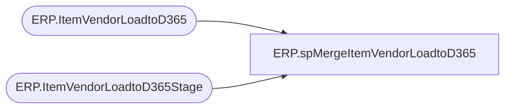

# ERP.spMergeItemVendorLoadtoD365

**Database:** IntegrationStaging  

## Architecture Diagram



## Table Dependencies

| Referenced Table |
|---|
| ERP.ItemVendorLoadtoD365 |
| ERP.ItemVendorLoadtoD365Stage |

## Stored Procedure Code

```sql
CREATE proc [ERP].[spMergeItemVendorLoadtoD365] 

as


-------------------------------------------------------------------------
-- spMergeItemVendorLoadtoD365 - Merges from ERP.ItemVendorLoadtoD365Stage to ERP.ItemVendorLoadtoD365
--						
-- 11/13/2023	Lizzy T.	 - Created Proc
-------------------------------------------------------------------------

set nocount on


Merge into ERP.ItemVendorLoadtoD365 as target
Using ERP.ItemVendorLoadtoD365Stage as source
On (
		target.ItemNumber=source.ItemNumber
		AND
		target.FactoryCode=source.FactoryCode
		AND
		target.VendorAccountNumber=source.VendorAccountNumber
		AND
		target.VendorProductNumber=source.VendorProductNumber
		AND
		target.DataAreaID=source.DataAreaID
		AND
		target.deletedFromSource IS NULL
	)
--when matched 
--	and (
			
--			ISNULL(target.ITEMNUMBER,'xxx')<>ISNULL(source.ITEMNUMBER,'xxx')
--			OR
--			ISNULL(target.FactoryCode, 'XXX') <> ISNULL(source.FactoryCode, 'XXX')
--			OR
--			ISNULL(target.VendorAccountNumber, 'XXX') <> ISNULL(source.VendorAccountNumber, 'XXX')
--			OR
--			ISNULL(target.EFFECTIVEDATE, 'XXX') <> ISNULL(source.EFFECTIVEDATE, 'XXX')
--		)
--	then 
--		UPDATE
--			SET
--				target.ITEMNUMBER=source.ITEMNUMBER,
--				target.FactoryCode = source.FactoryCode,
--				target.VendorAccountNumber = source.VendorAccountNumber,
--				target.EFFECTIVEDATE = source.EFFECTIVEDATE,
--				target.VendorExportedToDynamics = getdate()
When Not Matched By Target 
	Then 
		Insert (
					ITEMNUMBER,
					FactoryCode,
					VendorAccountNumber,
					VendorProductNumber,
					EFFECTIVEDATE,
					VendorExportedToDynamics,
					DataAreaID
				)
		Values (	
					source.ITEMNUMBER,
					source.FactoryCode,
					source.VendorAccountNumber,
					source.VendorProductNumber,
					source.EFFECTIVEDATE,
					getdate(),
					source.DataAreaID
				)
When Not Matched By Source and target.deletedFromSource IS NULL
	Then 
		Update
			Set target.deletedFromSource = getdate()

;
```

