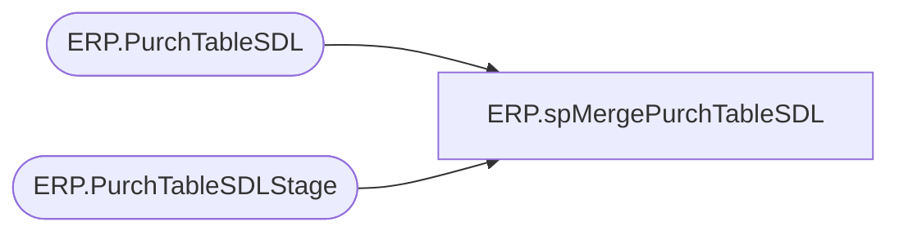

# ERP.spMergePurchTableSDL

**Database:** IntegrationStaging  

## Architecture Diagram



## Table Dependencies

| Referenced Table |
|---|
| ERP.PurchTableSDL |
| ERP.PurchTableSDLStage |

## Stored Procedure Code

```sql
CREATE PROCEDURE ERP.[spMergePurchTableSDL]
AS
-- =====================================================================================================
-- Name: ERP.spMergePurchTableSDL
--
-- Description:	Merges from ERP.PurchTableSDLStage to ERP.PurchTableSDL
--
--
-- Revision History
--		Name:			Date:			Comments:
--		Lizzy Timm		2025-06-04		Created proc.	
-- =====================================================================================================
SET NOCOUNT ON

UPDATE ERP.PurchTableSDL
SET SendCancellation = 0

MERGE INTO ERP.PurchTableSDL AS target
USING ERP.PurchTableSDLStage AS source
	ON (
			target.DataAreaId = source.DataAreaId
			AND target.PurchId = source.PurchId
			)
WHEN MATCHED
	AND (ISNULL(target.PurchStatusId, 99) <> ISNULL(source.PurchStatusId, 99))
	THEN
		UPDATE
		SET target.UpdateDate = getdate()
			,target.PurchStatusId = source.PurchStatusId
			,target.SendCancellation = CASE 
				WHEN ISNULL(target.PurchStatusId, 99) = 4 -- 4 = Canceled
					THEN 1
				ELSE 0
				END
WHEN NOT MATCHED BY Target
	THEN
		INSERT (
			DataAreaId
			,PurchID
			,PurchStatusId
			,SendCancellation
			,InsertDate
			)
		VALUES (
			source.DataAreaId
			,source.PurchId
			,source.PurchStatusId
			,1
			,getdate()
			);

ERP,spMergeShipmentInvoice,CREATE proc [ERP].[spMergeShipmentInvoice]

as

------------------------------------------------------------------------------------------------------------------------------------------------------------
--	Dan Tweedie	-	2017-12-10	- Created Proc - Merges Warehouse Shipment Invoice data from ERP.ShipmentInvoiceStage to ERP.ShipmentInvoice
------------------------------------------------------------------------------------------------------------------------------------------------------------

set nocount on

Merge into ERP.ShipmentInvoice as target
using ERP.ShipmentInvoiceStage as source
on 
	(
		target.InventLocationID = source.InventLocationID
		and
		target.OrderRef = source.OrderRef
		and
		target.CartonNumber = source.CartonNumber
		and
		target.ItemID = source.ItemID
		and 
		target.Entity = source.Entity
	)
when NOT MATCHED by Target
	then
		Insert
			(
				DlvMode,
				InventLocationID,
				ItemID,
				OrderRef,
				Qty,
				WhseUnitQty,
				ShipDate,
				ShipTo,
				CartonNumber,
				PalletID,
				RecType,
				Entity,
				BatchID,
				UDALocation,
				Warehouse,
				InsertDate,
				Transmitted
			)
		values
			(
				source.DlvMode,
				source.InventLocationID,
				source.ItemID,
				source.OrderRef,
				source.Qty,
				source.WhseUnitQty,
				source.ShipDate,
				source.ShipTo,
				source.CartonNumber,
				source.PalletID,
				source.RecType,
				source.Entity,
				source.BatchID,
				source.UDALocation,
				source.Warehouse,
				getdate(),
				0
			)


;
```

