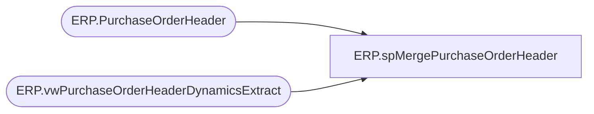

# ERP.spMergePurchaseOrderHeader

**Database:** IntegrationStaging  

## Architecture Diagram



## Table Dependencies

| Referenced Table |
|---|
| ERP.PurchaseOrderHeader |
| ERP.vwPurchaseOrderHeaderDynamicsExtract |

## Stored Procedure Code

```sql
CREATE proc [ERP].[spMergePurchaseOrderHeader]

as

----------------------------------------------------------------------------------------------------------------------------
--ERP.spMergePurchaseOrderHeader
--Dan Tweedie 2017-10-31 - Created proc - Merges D365 PO data from ERP.PurchaseOrderHeaderStage to ERP.PurchaseOrderHeader
--Tim Callahan 2021-01-25 - Modified Proc to a new source due to changes in PurchaseOrder source, now Dynamics AX Connector
----------------------------------------------------------------------------------------------------------------------------

set nocount on


Update ERP.PurchaseOrderHeader
set SendData = 0 

;

Merge into ERP.PurchaseOrderHeader as target
Using (select * from ERP.vwPurchaseOrderHeaderDynamicsExtract where isCurrent = 1) as source
On (
			target.PurchaseOrderNumber = source.PurchaseOrderNumber
			AND
			target.Entity = source.Entity
	) 

When Not Matched By Target 
	Then 
		Insert (
					PurchaseOrderNumber,
					ConfirmationNumber,
					TransportMethodDesc,
					FOBDesc,
					ShipFromId,
					Rep2Id,
					CurrencyDesc,
					OrderCreateDate,
					PaymentTerms,
					Entity,
					IsCurrent,
					InsertDate,
					UpdateDate,
					SendData
				)
		Values (	
					source.PurchaseOrderNumber,
					source.ConfirmationNumber,
					source.TransportMethodDesc,
					source.FOBDesc,
					source.ShipFromId,
					source.Rep2Id,
					source.CurrencyDesc,
					source.OrderCreateDate,
					source.PaymentTerms,
					source.Entity,
					source.IsCurrent,
					getdate(),
					NULL,
					--case 
					--	when source.IsCurrent = 1
					--		then 1
					--	else 0
					--end
					1
				)
When Matched
	and
		(
			isnull(target.ConfirmationNumber,'xxx')<>isnull(source.ConfirmationNumber,'xxx') OR
			isnull(target.TransportMethodDesc,'xxx')<>isnull(source.TransportMethodDesc,'xxx') OR
			isnull(target.FOBDesc,'xxx')<>isnull(source.FOBDesc,'xxx') OR
			isnull(target.ShipFromId,'xxx')<>isnull(source.ShipFromId,'xxx') OR
			isnull(target.Rep2Id,'xxx')<>isnull(source.Rep2Id,'xxx') OR
			isnull(target.CurrencyDesc,'xxx')<>isnull(source.CurrencyDesc,'xxx') OR
			isnull(target.OrderCreateDate,'xxx')<>isnull(source.OrderCreateDate,'xxx') OR
			isnull(target.PaymentTerms,'xxx')<>isnull(source.PaymentTerms,'xxx') OR
			isnull(target.IsCurrent,'xxx')<>isnull(source.IsCurrent,'xxx')
		)
	then
		Update
			set 
			target.ConfirmationNumber=source.ConfirmationNumber,
			target.TransportMethodDesc=source.TransportMethodDesc,
			target.FOBDesc=source.FOBDesc,
			target.ShipFromId=source.ShipFromId,
			target.Rep2Id=source.Rep2Id,
			target.CurrencyDesc=source.CurrencyDesc,
			target.OrderCreateDate=source.OrderCreateDate,
			target.PaymentTerms=source.PaymentTerms,
			target.IsCurrent=source.IsCurrent,
			target.UpdateDate = getdate(),
			target.SendData = case 
								when source.IsCurrent = 1
									then 1
								else 0
							end
;
```

