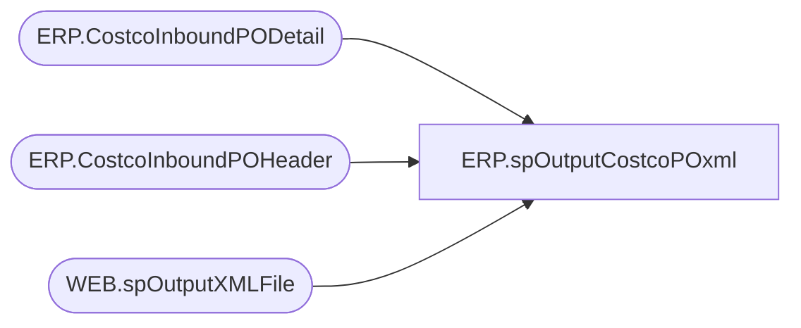

# ERP.spOutputCostcoPOxml

**Database:** IntegrationStaging  

## Architecture Diagram



## Table Dependencies

| Referenced Table |
|---|
| ERP.CostcoInboundPODetail |
| ERP.CostcoInboundPOHeader |
| WEB.spOutputXMLFile |

## Stored Procedure Code

```sql
CREATE proc [ERP].[spOutputCostcoPOxml]
@DropFolder varchar(100)

as

set nocount on

-- =====================================================================================================
-- Name:  ERP.spOutputCostcoPO
--
-- Description:	Outputs Costco PO XML to push to Dynamics365 ERP
--				 
-- Revision History
--		Name:			Date:			Comments:
--		Dan Tweedie		2017-08-08		Created proc
-- =====================================================================================================


declare 
	@dateString varchar(20),
	@file varchar(100),
	@sql varchar(100),
	@RowsToSend int

Select @RowsToSend = count(*) 
		from ERP.CostcoInboundPOHeader h
		join ERP.CostcoInboundPODetail d on h.CUSTOMERREQUISITIONNUMBER = d.CUSTOMERREQUISITIONNUMBER
		where h.Transmitted = 0

if @RowsToSend > 0
begin
	select 
		@dateString = replace(replace(replace(replace(convert(varchar, getdate(), 121), '-', ''), ':', ''), '.', ''),' ', ''),
		@file = 'CostcoPO' + @datestring + '.xml',
		@sql = 'select XMLData from IntegrationStaging.ERP.vwCostcoPOtoD365XML'

	exec WEB.spOutputXMLFile 
	@Query = @sql, 
	@FileLocation = @DropFolder, --'\\stl-ssis-p-01\IntegrationStaging\ERP\Costco\OutboundToD365\', 
	@FileName = @file

	update ERP.CostcoInboundPOHeader
	set Transmitted = 1 
	where Transmitted = 0

end


	
	
ERP,spOutputD365PurchaseOrderReceiptXML,CREATE proc [ERP].[spOutputD365PurchaseOrderReceiptXML]
@DropFile varchar(500)

as

---------------------------------------------------------------------------------------------------------------------------
--	Dan Tweedie	-	2017-11-15	-	Created proc to generate PurchaseOrderReceipt xml file for D365
--									Needs to be updated to only execute spOutputXMLFile if there is new receipt data
---------------------------------------------------------------------------------------------------------------------------

set nocount on


begin

	declare @concat varchar(100)

	select @concat = concat(
										'PurchOrderReceipt_',
										datepart(yyyy, getdate()),
										datepart(mm, getdate()),
										datepart(dd, getdate()),
										datepart(hh, getdate()),
										datepart(mi, getdate()),
										datepart(ss, getdate()),
										datepart(ms, getdate()),
										'.xml'
									)

		exec ERP.spOutputXMLFile
			@Query = 'select XMLData from IntegrationStaging.ERP.vwPurchaseOrderReceiptXML', 
			@FileLocation = @DropFile,  --'\\stl-ssis-p-01\IntegrationStaging\ERP\Outbound\D365\POReceipts',
			@FileName = @concat

		update pr
		set pr.Transmitted = 1
		from ERP.PurchaseOrderReceipt pr
		join ERP.tmpReceiptID r on pr.ReceiptID = r.ReceiptID
		where pr.Transmitted = 0 
end
```

