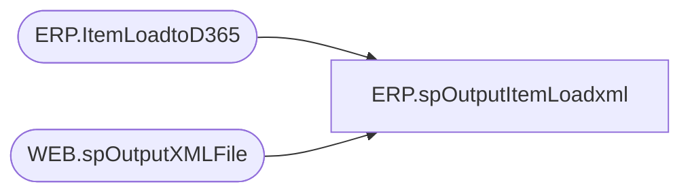

# ERP.spOutputItemLoadxml

**Database:** IntegrationStaging  

## Architecture Diagram



## Table Dependencies

| Referenced Table |
|---|
| ERP.ItemLoadtoD365 |
| WEB.spOutputXMLFile |

## Stored Procedure Code

```sql
CREATE proc [ERP].[spOutputItemLoadxml]
@Entity nvarchar(10)


as

set nocount on

-- =====================================================================================================
-- Name:  ERP.spOutputItemLoadxml
--
-- Description:	Outputs ItemLoad XML to push to Dynamics365 ERP
--				 
-- Revision History
--		Name:			Date:			Comments:
--		Dan Tweedie		2017-08-08		Created proc
-- =====================================================================================================


declare 
	@dateString varchar(20),
	@file varchar(100),
	@sql varchar(100),
	@RowsToSend int

Select @RowsToSend = count(*) 
		from ERP.ItemLoadtoD365
		where SendData = 1

if @RowsToSend > 0 
BEGIN
	begin
		select 
			@dateString = replace(replace(replace(replace(convert(varchar, getdate(), 121), '-', ''), ':', ''), '.', ''),' ', ''),
			@file = 'ReleasedProductCreation' + @datestring + '.xml',
			--@sql = 'select XMLData from IntegrationStaging.ERP.vwItemLoadReleasedProductCreationXML'
			@sql = 'exec IntegrationStaging.ERP.spItemLoadReleasedProductCreationXML ''' + @Entity + ''''

		exec WEB.spOutputXMLFile 
		@Query = @sql, 
		@FileLocation = '\\stl-ssis-p-01\IntegrationStaging\ERP\Items\', 
		@FileName = @file
	end
	--begin
	--	select 
	--		@file = 'ReleasedProducts' + @datestring + '.xml',
	--		--@sql = 'select XMLData from IntegrationStaging.ERP.vwItemLoadReleasedProductsXML'
	--		@sql = 'exec IntegrationStaging.ERP.spItemLoadReleasedProductsXML ''' + @Entity + ''''

	--	exec WEB.spOutputXMLFile 
	--	@Query = @sql, 
	--	@FileLocation = '\\stl-ssis-p-01\IntegrationStaging\ERP\Items\', 
	--	@FileName = @file
	--end

	WAITFOR DELAY '00:00:10'
END


	
	


ERP,spOutputItemMasterUKxml,CREATE proc [ERP].[spOutputItemMasterUKxml]
@FileDrop varchar(500)

as

-----------------------------------------------------------------------------------------------------------------------------
--Dan Tweedie	-	2018-01-24	- Created proc - Outputs Item Master XML file for WM - Only Contains Suppies from Dynamics365
-----------------------------------------------------------------------------------------------------------------------------

set nocount on

--if (select count(*) from erp.ItemMasterToWMStage where left(Style,1) = '4') > 0
if (
		select count(*) 
		from erp.ItemMasterToWM 
		where entity = 2110 
		and left(style, 1) IN ('4','5','6')
		and datediff(dd, isnull(UpdateDate, InsertDate), getdate()) = 0
	) > 0


begin

	declare @concat varchar(100)

	select @concat = concat(
							'IIMitemmasterbridge.',
							datepart(yyyy, getdate()),
							datepart(mm, getdate()),
							datepart(dd, getdate()),
							datepart(hh, getdate()),
							datepart(mi, getdate()),
							datepart(ss, getdate()),
							datepart(ms, getdate()),
							'.xml'
							)

	exec ERP.spOutputXMLFile
		@Query = 'select XMLData from IntegrationStaging.ERP.vwItemMasterUKxml', 
		@FileLocation = @FileDrop,
		@FileName = @concat

end 


ERP,spOutputItemMasterUKxmlBACKUP20201104,create proc [ERP].[spOutputItemMasterUKxmlBACKUP20201104]
@FileDrop varchar(500)

as

-----------------------------------------------------------------------------------------------------------------------------
--Dan Tweedie	-	2018-01-24	- Created proc - Outputs Item Master XML file for WM - Only Contains Suppies from Dynamics365
-----------------------------------------------------------------------------------------------------------------------------

set nocount on

--if (select count(*) from erp.ItemMasterToWMStage where left(Style,1) = '4') > 0
if (
		select count(*) 
		from erp.ItemMasterToWM 
		where entity = 2110 
		and left(style, 1) = '4'
		and datediff(dd, isnull(UpdateDate, InsertDate), getdate()) = 0
	) > 0


begin

	declare @concat varchar(100)

	select @concat = concat(
							'IIMitemmasterbridge.',
							datepart(yyyy, getdate()),
							datepart(mm, getdate()),
							datepart(dd, getdate()),
							datepart(hh, getdate()),
							datepart(mi, getdate()),
							datepart(ss, getdate()),
							datepart(ms, getdate()),
							'.xml'
							)

	exec ERP.spOutputXMLFile
		@Query = 'select XMLData from IntegrationStaging.ERP.vwItemMasterUKxml', 
		@FileLocation = @FileDrop,
		@FileName = @concat

end 


ERP,spOutputItemMasterWMxml,CREATE proc [ERP].[spOutputItemMasterWMxml]
@FileDrop varchar(500)

as

-----------------------------------------------------------------------------------------------------------------------------
--Dan Tweedie	-	2018-01-24	- Created proc - Outputs Item Master XML file for WM - Only Contains Suppies from Dynamics365
-----------------------------------------------------------------------------------------------------------------------------

set nocount on

if (select count(*) from erp.ItemMasterToWMStage) > 0

begin

	declare @concat varchar(100)

	select @concat = concat(
							'IIMitemmasterbridge.',
							datepart(yyyy, getdate()),
							datepart(mm, getdate()),
							datepart(dd, getdate()),
							datepart(hh, getdate()),
							datepart(mi, getdate()),
							datepart(ss, getdate()),
							datepart(ms, getdate()),
							'.xml'
							)

	exec ERP.spOutputXMLFile
		@Query = 'select XMLData from IntegrationStaging.ERP.vwItemMasterWMxml', 
		@FileLocation = @FileDrop,
		@FileName = @concat

end 
ERP,spOutputSalesOrderUDA,CREATE proc [ERP].[spOutputSalesOrderUDA]
@BatchID nvarchar(52),
@FileLocation varchar(500)

as
------------------------------------------------------------------------------------------------------------------------------
--Dan Tweedie - 2018-06-07 - Created Proc to output UDA files to Merchandising system for Sales Order UDA, called from SSIS
--	Dan TWeedie	2019-03-05 -	Disabling proc by commenting out the code
------------------------------------------------------------------------------------------------------------------------------
set nocount on

/*

IF (Object_ID('IntegrationStaging.ERP.tmpUDAStage') IS NOT NULL) DROP TABLE ERP.tmpUDAStage

;

With 
ShipmentData as
	(
		select 
			convert(varchar, InsertDate, 101) as ShipDate,
			case 
				when UDALocation in ('8500', '8501', '8502', '8503', '8504', '8505')
					then '8500'
				else '8175'
			end as LocationCode,
			right(concat('000000000000', replace(ItemID, 'M', '')),12) as UPC,
			Qty * -1 as Units,
			case 
				when UDALocation = '8175' then 'WHOLESALE'
				when UDALocation in ('8500', '8501', '8502', '8503', '8504', '8505') then 'FRANCHISEES'
				else NULL
			end as SaleType
		from ERP.ShipmentInvoice
		where 1=1
		and UDALocation in ('8175','8500', '8501', '8502', '8503', '8504', '8505')
		and left(ItemID, 1) = 'M' --merchandise only
		and BatchID = @BatchID 
		and Transmitted = 1
	)
select 
	ShipDate,
	LocationCode,
	UPC,
	sum(Units) as Units,
	SaleType
into ERP.tmpUDAStage
from ShipmentData 
group by 
	ShipDate,
	LocationCode,
	UPC,
	SaleType


if (select count(*) from ERP.tmpUDAStage) > 0

BEGIN


		---OUTPUT UDA FILE						
		declare	@UDAquery varchar(1000),
				@UDAdate varchar(200),
				@UDAfile_name varchar(100),
				@UDAfile_location varchar(100),
				@UDAserver varchar(20),
				@UDAdatabase varchar(20),
				@UDAsqlcmd varchar(1000),
				@UDAquery_text varchar(1000)

		select @UDAquery_text = 'set nocount on exec IntegrationStaging.ERP.spSelectSalesOrderUDA'

		set @UDAdate = convert(varchar, datepart(yyyy, getdate())) + convert(varchar, datepart(mm, getdate())) + convert(varchar, datepart(dd, getdate())) + convert(varchar, datepart(hh, getdate())) + convert(varchar, datepart(mm, getdate()))
		set @UDAquery = @UDAquery_text
		set @UDAfile_location = @FileLocation 
		set @UDAfile_name = 'STSIMUDA.DynamicsSalesOrders.' + @UDAdate + '.GO'
		set @UDAsqlcmd = 'sqlcmd' + ' -Q' + '"' + @UDAquery + '"' + ' -o' + '"' + @UDAfile_location + @UDAfile_name + '"' + ' -w1000 -W'
		exec master..xp_cmdshell @UDAsqlcmd

END 
	

*/

ERP,spOutputShipmentInvoice_SalesOrderXML,CREATE proc [ERP].[spOutputShipmentInvoice_SalesOrderXML]
@DropFolder varchar(100)

as

set nocount on

-- =====================================================================================================
-- Name:  ERP.spOutputShipmentInvoice_SalesOrderXML
--
-- Description:	Outputs Shipment Invoice XML to push to Dynamics365 ERP
--				 
-- Revision History
--		Name:			Date:			Comments:
--		Dan Tweedie		2017-12-14		Created proc
-- =====================================================================================================


declare 
	@dateString varchar(20),
	@file varchar(100),
	@sql varchar(100),
	@RowsToSend int

Select @RowsToSend = count(*) 
		from ERP.OrderShipmentInvoice with (nolock)
		where Transmitted = 0
		and left(OrderRef, 2) = 'SO'

if @RowsToSend > 0
begin
	select 
		@dateString = replace(replace(replace(replace(convert(varchar, getdate(), 121), '-', ''), ':', ''), '.', ''),' ', ''),
		@file = 'S' + @datestring + '.xml',
		@sql = 'select XMLData from IntegrationStaging.ERP.vwShipmentInvoice_SalesOrderXML'

	exec WEB.spOutputXMLFile 
	@Query = @sql, 
	@FileLocation = @DropFolder,
	@FileName = @file

	update ERP.OrderShipmentInvoice 
	set Transmitted =1
	where Transmitted = 0
	and left(OrderRef, 2) = 'SO'

end


ERP,spOutputShipmentInvoice_SalesOrderXMLByEntity,CREATE proc [ERP].[spOutputShipmentInvoice_SalesOrderXMLByEntity]
@DropFolder varchar(100),
@Entity varchar(10)


as

set nocount on

-- =====================================================================================================
-- Name:  ERP.spOutputShipmentInvoice_SalesOrderXMLByEntity
--
-- Description:	Outputs Shipment Invoice XML to push to Dynamics365 ERP
--				 
-- Revision History
--		Name:			Date:			Comments:
--		Dan Tweedie		2017-12-14		Created proc
-- =====================================================================================================


declare 
	@dateString varchar(20),
	@file varchar(100),
	@sql varchar(100),
	@RowsToSend int

Select @RowsToSend = count(*) 
		from ERP.ShipmentInvoice with (nolock)
		where Transmitted = 0
		and left(OrderRef, 2) = 'SO'
		and Entity = @Entity 

if @RowsToSend > 0
begin
	select 
		@dateString = replace(replace(replace(replace(convert(varchar, getdate(), 121), '-', ''), ':', ''), '.', ''),' ', ''),
		@file = 'S' + @datestring + '.xml',
		@sql = 'exec IntegrationStaging.ERP.spShipmentInvoice_SalesOrderXML ' + @Entity 

	exec WEB.spOutputXMLFile 
	@Query = @sql, 
	@FileLocation = @DropFolder, 
	@FileName = @file

	update ERP.ShipmentInvoice 
	set Transmitted = 1
	where Transmitted = 0
	and left(OrderRef, 2) = 'SO'
	and Entity = @Entity 
end
```

