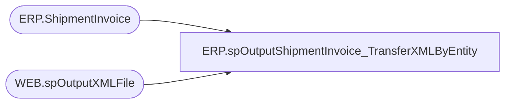

# ERP.spOutputShipmentInvoice_TransferXMLByEntity

**Database:** IntegrationStaging  

## Architecture Diagram



## Table Dependencies

| Referenced Table |
|---|
| ERP.ShipmentInvoice |
| WEB.spOutputXMLFile |

## Stored Procedure Code

```sql
CREATE proc [ERP].[spOutputShipmentInvoice_TransferXMLByEntity]
@DropFolder varchar(100),
@Entity varchar(10)


as

set nocount on

-- =====================================================================================================
-- Name:  ERP.spOutputShipmentInvoice_TransferXMLByEntity
--
-- Description:	Outputs Shipment Invoice XML to push to Dynamics365 ERP
--				 
-- Revision History
--		Name:			Date:			Comments:
--		Dan Tweedie		2017-12-14		Created proc
-- =====================================================================================================


declare 
	@dateString varchar(20),
	@file varchar(100),
	@sql varchar(100),
	@RowsToSend int

Select @RowsToSend = count(*) 
		from ERP.ShipmentInvoice with (nolock)
		where Transmitted = 0
		--and left(OrderRef, 2) = 'TR'
		--and OrderRef like '%TR%'
		and left(OrderRef,2) = 'TO'
		and Entity = @Entity 

if @RowsToSend > 0
begin
	select 
		@dateString = replace(replace(replace(replace(convert(varchar, getdate(), 121), '-', ''), ':', ''), '.', ''),' ', ''),
		@file = 'S' + @datestring + '.xml',
		@sql = 'exec IntegrationStaging.ERP.spShipmentInvoice_TransferXML ' + @Entity 

	exec WEB.spOutputXMLFile 
	@Query = @sql, 
	@FileLocation = @DropFolder, 
	@FileName = @file

	update ERP.ShipmentInvoice 
	set Transmitted = 1
	where Transmitted = 0
	--and left(OrderRef, 2) = 'TR'
	--and OrderRef like '%TR%'
	and left(OrderRef,2) = 'TO'
	and Entity = @Entity 
end


ERP,spOutputShipmentInvoiceXML,create proc [ERP].[spOutputShipmentInvoiceXML]

as

set nocount on

-- =====================================================================================================
-- Name:  ERP.spOutputShipmentInvoiceXML
--
-- Description:	Outputs Shipment Invoice XML to push to Dynamics365 ERP
--				 
-- Revision History
--		Name:			Date:			Comments:
--		Dan Tweedie		2017-02-14		Created proc
-- =====================================================================================================


declare 
	@dateString varchar(20),
	@file varchar(100),
	@sql varchar(100),
	@RowsToSend int

Select @RowsToSend = count(*) 
		from ERP.ShipmentInvoice with (nolock)
		where Transmitted = 0

if @RowsToSend > 0
begin
	select 
		@dateString = replace(replace(replace(replace(convert(varchar, getdate(), 121), '-', ''), ':', ''), '.', ''),' ', ''),
		@file = 'WMShipmentToD365' + @datestring + '.xml',
		@sql = 'select XMLData from IntegrationStaging.ERP.ShipmentInvoiceXML'

	exec WEB.spOutputXMLFile 
	@Query = @sql, 
	@FileLocation = '\\stl-ssis-p-01\IntegrationStaging\ERP\Outbound\D365\ShipmentInvoices\', 
	@FileName = @file
end
```

