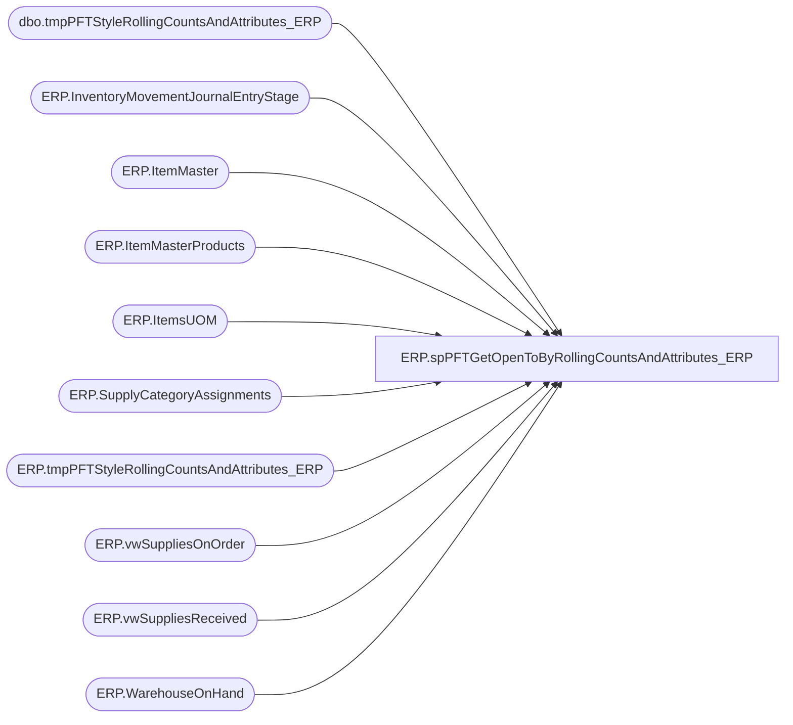

# ERP.spPFTGetOpenToByRollingCountsAndAttributes_ERP

**Database:** IntegrationStaging  

## Architecture Diagram



## Table Dependencies

| Referenced Table |
|---|
| dbo.tmpPFTStyleRollingCountsAndAttributes_ERP |
| ERP.InventoryMovementJournalEntryStage |
| ERP.ItemMaster |
| ERP.ItemMasterProducts |
| ERP.ItemsUOM |
| ERP.SupplyCategoryAssignments |
| ERP.tmpPFTStyleRollingCountsAndAttributes_ERP |
| ERP.vwSuppliesOnOrder |
| ERP.vwSuppliesReceived |
| ERP.WarehouseOnHand |

## Stored Procedure Code

```sql
CREATE PROCEDURE [ERP].[spPFTGetOpenToByRollingCountsAndAttributes_ERP] 
	@inputDate AS DATE
AS
BEGIN

	SET NOCOUNT ON;

	-- =============================================================================================================
-- Name: spPFTGetOpenToByRollingCountsAndAttributes
--
-- Description:	Gets Open To Buy Rolling counts and attributes for Purchasing Forecasting Tool from Merchandising
--
-- Output: 
-- 
-- Available actions: 
--
-- Revision History
--		Name:			Date:			Comments:
--		Ben Barud		04/24/2018		Creation
-- =============================================================================================================

IF OBJECT_ID('ERP.tmpPFTStyleRollingCountsAndAttributes_ERP') IS NULL
BEGIN
	CREATE TABLE [ERP].[tmpPFTStyleRollingCountsAndAttributes_ERP](
		[Style Code] [nvarchar](20) NULL,
		[Style Long Desc] [nvarchar](120) NULL,
		[Sub-Class Code] [nvarchar](20) NULL,
		[Sub-Class Label] [nvarchar](40) NULL,
		[NUMBER OF UNITS PER PACK] [nvarchar](30) NULL,
		[Style Last PO Cost] [numeric](14, 2) NULL,
		[BOP OH WH Units:InvStatus[Available]] ( 1 Periods(s) Ago )] [int] NULL,
		[BOP OH WH Units:InvStatus  ( 2 Periods(s) Ago )] [int] NULL,
		[BOP OH WH Units:InvStatus  ( 3 Periods(s) Ago )] [int] NULL,
		[BOP OH WH Units:InvStatus  ( 4 Periods(s) Ago )] [int] NULL,
		[BOP OH WH Units:InvStatus  ( 5 Periods(s) Ago )] [int] NULL,
		[BOP OH WH Units:InvStatus  ( 6 Periods(s) Ago )] [int] NULL,
		[BOP OH WH Units:InvStatus  ( 7 Periods(s) Ago )] [int] NULL,
		[BOP OH WH Units:InvStatus  ( 8 Periods(s) Ago )] [int] NULL,
		[BOP OH WH Units:InvStatus  ( 9 Periods(s) Ago )] [int] NULL,
		[BOP OH WH Units:InvStatus  ( 10 Periods(s) Ago )] [int] NULL,
		[BOP OH WH Units:InvStatus  ( 11 Periods(s) Ago )] [int] NULL,
		[BOP OH WH Units:InvStatus  ( 12 Periods(s) Ago )] [int] NULL,
		[BOP OH WH Units:InvStatus[Available]] ( This Period )] [int] NULL,
		[Net Receipts Units ( 1 Period(s) Ago )] [int] NULL,
		[Net Receipts Units ( 2 Period(s) Ago )] [int] NULL,
		[Net Receipts Units ( 3 Period(s) Ago )] [int] NULL,
		[Net Receipts Units ( 4 Period(s) Ago )] [int] NULL,
		[Net Receipts Units ( 5 Period(s) Ago )] [int] NULL,
		[Net Receipts Units ( 6 Period(s) Ago )] [int] NULL,
		[Net Receipts Units ( 7 Period(s) Ago )] [int] NULL,
		[Net Receipts Units ( 8 Period(s) Ago )] [int] NULL,
		[Net Receipts Units ( 9 Period(s) Ago )] [int] NULL,
		[Net Receipts Units ( 10 Period(s) Ago )] [int] NULL,
		[Net Receipts Units ( 11 Period(s) Ago )] [int] NULL,
		[Net Receipts Units ( 12 Period(s) Ago )] [int] NULL,
		[Net Receipts Units ( This Period )] [int] NULL,
		[On Order Units ( Last 3 Period(s) )] [int] NULL,
		[On Order Units ( This Period )] [int] NULL,
		[On Order Units ( Next 1 Periods )] [int] NULL,
		[On Order Units ( Next 2 Periods )] [int] NULL,
		[On Order Units ( Next 3 Periods )] [int] NULL,
		[On Order Units ( Next 4 Periods )] [int] NULL,
		[On Order Units ( Next 5 Periods )] [int] NULL,
		[On Order Units ( Next 6 Periods )] [int] NULL,
		[EOP OH WH Units:InvStatus[Available]] ( Current )] [int] NULL,
		[Style Custom Property Value O[SUPPLY STYLE CATEGORY]]] [nvarchar](30) NULL,
		[Style Attribute Set Code O[MEG'S INVENTOR STATUS BY STYLE]]] [nvarchar](6) NULL,
		[EOP OH Cost:Total ( Current )] [numeric](38, 2) NULL,
		[Style Custom Property Value O[OUT DATE]]] [nvarchar](30) NULL,
		[Style Attribute Set Label O[FACTORY]]] [nvarchar](30) NULL,
		[Merchandising Style_ID] VARCHAR(20) NULL,
		[JurisdictionCode] [nvarchar](2) NULL
	) ON [PRIMARY]
END
ELSE
BEGIN
	TRUNCATE TABLE ERP.tmpPFTStyleRollingCountsAndAttributes_ERP
END

	IF OBJECT_ID('tempdb..#SVWORK1') IS NOT NULL
	DROP TABLE #SVWORK1

	IF OBJECT_ID('tempdb..#SVWORK2') IS NOT NULL
		DROP TABLE #SVWORK2

	IF OBJECT_ID('tempdb..#SVWORK3') IS NOT NULL
		DROP TABLE #SVWORK3

	IF OBJECT_ID('tempdb..#SVWORK4') IS NOT NULL
		DROP TABLE #SVWORK4

	IF OBJECT_ID('tempdb..#SVWORK5') IS NOT NULL
		DROP TABLE #SVWORK5

	IF OBJECT_ID('tempdb..#SVWORK6') IS NOT NULL
		DROP TABLE #SVWORK6

	IF OBJECT_ID('tempdb..#SVWORKV11_1') IS NOT NULL
		DROP TABLE #SVWORKV11_1

	IF OBJECT_ID('tempdb..#SVWORKQ11') IS NOT NULL
		DROP TABLE #SVWORKQ11

	IF OBJECT_ID('tempdb..#SVWORKQ11_1') IS NOT NULL
		DROP TABLE #SVWORKQ11_1

	IF OBJECT_ID('tempdb..#SVWORKQ11_2') IS NOT NULL
		DROP TABLE #SVWORKQ11_2

	IF OBJECT_ID('tempdb..#SVWORK6_T') IS NOT NULL
		DROP TABLE #SVWORK6_T

	--DECLARE @inputDate AS DATE
	--SET @inputDate = '2018-04-02'
	DECLARE @currentPeriod INT, @1Period INT, @2Period INT, @3Period INT, @4Period INT, @5Period INT, @6Period INT, @7Period INT, @8Period INT, @9Period INT, @10Period INT, @11Period INT, @12Period INT, @13Period INT

	SET @currentPeriod = CAST(DATEPART(yyyy, @inputDate) AS VARCHAR(4)) + RIGHT('00' + CAST(DATEPART(mm, @inputDate) AS VARCHAR(2)), 2)
	SET @1Period = CAST(DATEPART(yyyy, DATEADD(mm, -1, @inputDate)) AS VARCHAR(4)) + RIGHT('00' + CAST(DATEPART(mm, DATEADD(mm, -1, @inputDate)) AS VARCHAR(2)), 2)
	SET @2Period = CAST(DATEPART(yyyy, DATEADD(mm, -2, @inputDate)) AS VARCHAR(4)) + RIGHT('00' + CAST(DATEPART(mm, DATEADD(mm, -2, @inputDate)) AS VARCHAR(2)), 2)
	SET @3Period = CAST(DATEPART(yyyy, DATEADD(mm, -3, @inputDate)) AS VARCHAR(4)) + RIGHT('00' + CAST(DATEPART(mm, DATEADD(mm, -3, @inputDate)) AS VARCHAR(2)), 2)
	SET @4Period = CAST(DATEPART(yyyy, DATEADD(mm, -4, @inputDate)) AS VARCHAR(4)) + RIGHT('00' + CAST(DATEPART(mm, DATEADD(mm, -4, @inputDate)) AS VARCHAR(2)), 2)
	SET @5Period = CAST(DATEPART(yyyy, DATEADD(mm, -5, @inputDate)) AS VARCHAR(4)) + RIGHT('00' + CAST(DATEPART(mm, DATEADD(mm, -5, @inputDate)) AS VARCHAR(2)), 2)
	SET @6Period = CAST(DATEPART(yyyy, DATEADD(mm, -6, @inputDate)) AS VARCHAR(4)) + RIGHT('00' + CAST(DATEPART(mm, DATEADD(mm, -6, @inputDate)) AS VARCHAR(2)), 2)
	SET @7Period = CAST(DATEPART(yyyy, DATEADD(mm, -7, @inputDate)) AS VARCHAR(4)) + RIGHT('00' + CAST(DATEPART(mm, DATEADD(mm, -7, @inputDate)) AS VARCHAR(2)), 2)
	SET @8Period = CAST(DATEPART(yyyy, DATEADD(mm, -8, @inputDate)) AS VARCHAR(4)) + RIGHT('00' + CAST(DATEPART(mm, DATEADD(mm, -8, @inputDate)) AS VARCHAR(2)), 2)
	SET @9Period = CAST(DATEPART(yyyy, DATEADD(mm, -9, @inputDate)) AS VARCHAR(4)) + RIGHT('00' + CAST(DATEPART(mm, DATEADD(mm, -9, @inputDate)) AS VARCHAR(2)), 2)
	SET @10Period = CAST(DATEPART(yyyy, DATEADD(mm, -10, @inputDate)) AS VARCHAR(4)) + RIGHT('00' + CAST(DATEPART(mm, DATEADD(mm, -10, @inputDate)) AS VARCHAR(2)), 2)
	SET @11Period = CAST(DATEPART(yyyy, DATEADD(mm, -11, @inputDate)) AS VARCHAR(4)) + RIGHT('00' + CAST(DATEPART(mm, DATEADD(mm, -11, @inputDate)) AS VARCHAR(2)), 2)
	SET @12Period = CAST(DATEPART(yyyy, DATEADD(mm, -12, @inputDate)) AS VARCHAR(4)) + RIGHT('00' + CAST(DATEPART(mm, DATEADD(mm, -12, @inputDate)) AS VARCHAR(2)), 2)

	--SELECT @12Period

	--SELECT CAST(YEAR(transactionDate) AS VARCHAR(4)) + RIGHT('00' + CAST(MONTH(transactionDate) AS VARCHAR(2)), 2) AS 'merch_year_pd'
	--FROM ERP.InventoryMovementJournalEntryStage

	SELECT SUM((inventoryQuantity) * (1 - abs (sign (CAST(YEAR(transactionDate) AS VARCHAR(4)) + RIGHT('00' + CAST(MONTH(transactionDate) AS VARCHAR(2)), 2) -@1Period)))) as Field_t
		  ,SUM((inventoryQuantity) * (1 - abs (sign (CAST(YEAR(transactionDate) AS VARCHAR(4)) + RIGHT('00' + CAST(MONTH(transactionDate) AS VARCHAR(2)), 2) -@2Period)))) as Field_u
		  ,SUM((inventoryQuantity) * (1 - abs (sign (CAST(YEAR(transactionDate) AS VARCHAR(4)) + RIGHT('00' + CAST(MONTH(transactionDate) AS VARCHAR(2)), 2) -@3Period)))) as Field_v
		  ,SUM((inventoryQuantity) * (1 - abs (sign (CAST(YEAR(transactionDate) AS VARCHAR(4)) + RIGHT('00' + CAST(MONTH(transactionDate) AS VARCHAR(2)), 2) -@4Period)))) as Field_w
		  ,SUM((inventoryQuantity) * (1 - abs (sign (CAST(YEAR(transactionDate) AS VARCHAR(4)) + RIGHT('00' + CAST(MONTH(transactionDate) AS VARCHAR(2)), 2) -@5Period)))) as Field_x
		  ,SUM((inventoryQuantity) * (1 - abs (sign (CAST(YEAR(transactionDate) AS VARCHAR(4)) + RIGHT('00' + CAST(MONTH(transactionDate) AS VARCHAR(2)), 2) -@6Period)))) as Field_y
		  ,SUM((inventoryQuantity) * (1 - abs (sign (CAST(YEAR(transactionDate) AS VARCHAR(4)) + RIGHT('00' + CAST(MONTH(transactionDate) AS VARCHAR(2)), 2) -@7Period)))) as Field_z
		  ,SUM((inventoryQuantity) * (1 - abs (sign (CAST(YEAR(transactionDate) AS VARCHAR(4)) + RIGHT('00' + CAST(MONTH(transactionDate) AS VARCHAR(2)), 2) -@8Period)))) as Field_0
		  ,SUM((inventoryQuantity) * (1 - abs (sign (CAST(YEAR(transactionDate) AS VARCHAR(4)) + RIGHT('00' + CAST(MONTH(transactionDate) AS VARCHAR(2)), 2) -@9Period)))) as Field_1
		  ,SUM((inventoryQuantity) * (1 - abs (sign (CAST(YEAR(transactionDate) AS VARCHAR(4)) + RIGHT('00' + CAST(MONTH(transactionDate) AS VARCHAR(2)), 2) -@10Period)))) as Field_2
		  ,SUM((inventoryQuantity) * (1 - abs (sign (CAST(YEAR(transactionDate) AS VARCHAR(4)) + RIGHT('00' + CAST(MONTH(transactionDate) AS VARCHAR(2)), 2) -@11Period)))) as Field_3
		  ,SUM((inventoryQuantity) * (1 - abs (sign (CAST(YEAR(transactionDate) AS VARCHAR(4)) + RIGHT('00' + CAST(MONTH(transactionDate) AS VARCHAR(2)), 2) -@12Period)))) as Field_4
		  ,SUM((inventoryQuantity) * (1 - abs (sign (CAST(YEAR(transactionDate) AS VARCHAR(4)) + RIGHT('00' + CAST(MONTH(transactionDate) AS VARCHAR(2)), 2) -@currentPeriod)))) as Field_5
		  ,itemNumber as QField_a 
	INTO #SVWORK1  
	FROM [IntegrationStaging].[ERP].[vwSuppliesReceived]
	--FROM OPENQUERY([STL-SSIS-P-01], 'SELECT * FROM [IntegrationStaging].[ERP].[vwSuppliesReceived]')
	--WHERE itemNumber = '000050'
	WHERE inventoryWarehouseId IN (9940, 9941, 9960, 9970, 9980)
	GROUP BY itemNumber 

	SELECT SUM(costAmount) as Field_h1
		  ,itemNumber as QField_a 
    INTO #SVWORK2  
	FROM [IntegrationStaging].[ERP].[InventoryMovementJournalEntryStage]
	WHERE inventorySiteID IN ('9940', '9941', '9960', '9970', '9980')
	GROUP BY itemNumber

	SET @1Period = CAST(DATEPART(yyyy, DATEADD(mm, -3, @inputDate)) AS VARCHAR(4)) + RIGHT('00' + CAST(DATEPART(mm, DATEADD(mm, -3, @inputDate)) AS VARCHAR(2)), 2)
	SET @2Period = CAST(DATEPART(yyyy, DATEADD(mm, 1, @inputDate)) AS VARCHAR(4)) + RIGHT('00' + CAST(DATEPART(mm, DATEADD(mm, 1, @inputDate)) AS VARCHAR(2)), 2)
	SET @3Period = CAST(DATEPART(yyyy, DATEADD(mm, 2, @inputDate)) AS VARCHAR(4)) + RIGHT('00' + CAST(DATEPART(mm, DATEADD(mm, 2, @inputDate)) AS VARCHAR(2)), 2)
	SET @4Period = CAST(DATEPART(yyyy, DATEADD(mm, 3, @inputDate)) AS VARCHAR(4)) + RIGHT('00' + CAST(DATEPART(mm, DATEADD(mm, 3, @inputDate)) AS VARCHAR(2)), 2)
	SET @5Period = CAST(DATEPART(yyyy, DATEADD(mm, 4, @inputDate)) AS VARCHAR(4)) + RIGHT('00' + CAST(DATEPART(mm, DATEADD(mm, 4, @inputDate)) AS VARCHAR(2)), 2)
	SET @6Period = CAST(DATEPART(yyyy, DATEADD(mm, 5, @inputDate)) AS VARCHAR(4)) + RIGHT('00' + CAST(DATEPART(mm, DATEADD(mm, 5, @inputDate)) AS VARCHAR(2)), 2)
	SET @7Period = CAST(DATEPART(yyyy, DATEADD(mm, 6, @inputDate)) AS VARCHAR(4)) + RIGHT('00' + CAST(DATEPART(mm, DATEADD(mm, 6, @inputDate)) AS VARCHAR(2)), 2)


	--SELECT SUM(Qty* (sign (1 + sign (CAST(YEAR(StartShipDate) AS VARCHAR(4)) + RIGHT('00' + CAST(MONTH(StartShipDate) AS VARCHAR(2)), 2) -@1Period))) *  (1 - sign (1 + sign (CAST(YEAR(StartShipDate) AS VARCHAR(4)) + RIGHT('00' + CAST(MONTH(StartShipDate) AS VARCHAR(2)), 2) -@currentPeriod)))) as Field_6
	--	  ,SUM(Qty* (1 - abs (sign (CAST(YEAR(StartShipDate) AS VARCHAR(4)) + RIGHT('00' + CAST(MONTH(StartShipDate) AS VARCHAR(2)), 2) -@currentPeriod)))) as Field_7
	--	  ,SUM(Qty* (1 - abs (sign (CAST(YEAR(StartShipDate) AS VARCHAR(4)) + RIGHT('00' + CAST(MONTH(StartShipDate) AS VARCHAR(2)), 2) -@2Period)))) as Field_8
	--	  ,SUM(Qty* (1 - abs (sign (CAST(YEAR(StartShipDate) AS VARCHAR(4)) + RIGHT('00' + CAST(MONTH(StartShipDate) AS VARCHAR(2)), 2) -@3Period)))) as Field_9
	--	  ,SUM(Qty* (1 - abs (sign (CAST(YEAR(StartShipDate) AS VARCHAR(4)) + RIGHT('00' + CAST(MONTH(StartShipDate) AS VARCHAR(2)), 2) -@4Period)))) as Field_a1
	--	  ,SUM(Qty* (1 - abs (sign (CAST(YEAR(StartShipDate) AS VARCHAR(4)) + RIGHT('00' + CAST(MONTH(StartShipDate) AS VARCHAR(2)), 2) -@5Period)))) as Field_b1
	--	  ,SUM(Qty* (1 - abs (sign (CAST(YEAR(StartShipDate) AS VARCHAR(4)) + RIGHT('00' + CAST(MONTH(StartShipDate) AS VARCHAR(2)), 2) -@6Period)))) as Field_c1
	--	  ,SUM(Qty* (1 - abs (sign (CAST(YEAR(StartShipDate) AS VARCHAR(4)) + RIGHT('00' + CAST(MONTH(StartShipDate) AS VARCHAR(2)), 2) -@7Period)))) as Field_d1
	--	  ,ItemID as QField_a 
 --   INTO #SVWORK3
	--FROM OPENQUERY([STL-SSIS-P-01], 'SELECT * FROM [IntegrationStaging].[ERP].[vwSuppliesOnOrder]')
	--GROUP BY [ItemID] 

	SELECT SUM(Qty* (sign (1 + sign (CAST(YEAR(EndDeliverDateTime) AS VARCHAR(4)) + RIGHT('00' + CAST(MONTH(EndDeliverDateTime) AS VARCHAR(2)), 2) -@1Period))) *  (1 - sign (1 + sign (CAST(YEAR(EndDeliverDateTime) AS VARCHAR(4)) + RIGHT('00' + CAST(MONTH(EndDeliverDateTime) AS VARCHAR(2)), 2) -@currentPeriod)))) as Field_6
		  ,SUM(Qty* (1 - abs (sign (CAST(YEAR(EndDeliverDateTime) AS VARCHAR(4)) + RIGHT('00' + CAST(MONTH(EndDeliverDateTime) AS VARCHAR(2)), 2) -@currentPeriod)))) as Field_7
		  ,SUM(Qty* (1 - abs (sign (CAST(YEAR(EndDeliverDateTime) AS VARCHAR(4)) + RIGHT('00' + CAST(MONTH(EndDeliverDateTime) AS VARCHAR(2)), 2) -@2Period)))) as Field_8
		  ,SUM(Qty* (1 - abs (sign (CAST(YEAR(EndDeliverDateTime) AS VARCHAR(4)) + RIGHT('00' + CAST(MONTH(EndDeliverDateTime) AS VARCHAR(2)), 2) -@3Period)))) as Field_9
		  ,SUM(Qty* (1 - abs (sign (CAST(YEAR(EndDeliverDateTime) AS VARCHAR(4)) + RIGHT('00' + CAST(MONTH(EndDeliverDateTime) AS VARCHAR(2)), 2) -@4Period)))) as Field_a1
		  ,SUM(Qty* (1 - abs (sign (CAST(YEAR(EndDeliverDateTime) AS VARCHAR(4)) + RIGHT('00' + CAST(MONTH(EndDeliverDateTime) AS VARCHAR(2)), 2) -@5Period)))) as Field_b1
		  ,SUM(Qty* (1 - abs (sign (CAST(YEAR(EndDeliverDateTime) AS VARCHAR(4)) + RIGHT('00' + CAST(MONTH(EndDeliverDateTime) AS VARCHAR(2)), 2) -@6Period)))) as Field_c1
		  ,SUM(Qty* (1 - abs (sign (CAST(YEAR(EndDeliverDateTime) AS VARCHAR(4)) + RIGHT('00' + CAST(MONTH(EndDeliverDateTime) AS VARCHAR(2)), 2) -@7Period)))) as Field_d1
		  ,ItemID as QField_a 
    INTO #SVWORK3
	FROM [IntegrationStaging].[ERP].[vwSuppliesOnOrder]
	--FROM OPENQUERY([STL-SSIS-P-01], 'SELECT * FROM [IntegrationStaging].[ERP].[vwSuppliesOnOrder]')
	GROUP BY [ItemID] 

	--SELECT *
	--FROM 	[STL-SSIS-P-01].[IntegrationStaging].[ERP].[vwSuppliesOnOrder]

	SET @currentPeriod = CAST(DATEPART(yyyy, @inputDate) AS VARCHAR(4)) + RIGHT('00' + CAST(DATEPART(mm, @inputDate) AS VARCHAR(2)), 2)
	SET @1Period = CAST(DATEPART(yyyy, DATEADD(mm, -1, @inputDate)) AS VARCHAR(4)) + RIGHT('00' + CAST(DATEPART(mm, DATEADD(mm, -1, @inputDate)) AS VARCHAR(2)), 2)
	SET @2Period = CAST(DATEPART(yyyy, DATEADD(mm, -2, @inputDate)) AS VARCHAR(4)) + RIGHT('00' + CAST(DATEPART(mm, DATEADD(mm, -2, @inputDate)) AS VARCHAR(2)), 2)
	SET @3Period = CAST(DATEPART(yyyy, DATEADD(mm, -3, @inputDate)) AS VARCHAR(4)) + RIGHT('00' + CAST(DATEPART(mm, DATEADD(mm, -3, @inputDate)) AS VARCHAR(2)), 2)
	SET @4Period = CAST(DATEPART(yyyy, DATEADD(mm, -4, @inputDate)) AS VARCHAR(4)) + RIGHT('00' + CAST(DATEPART(mm, DATEADD(mm, -4, @inputDate)) AS VARCHAR(2)), 2)
	SET @5Period = CAST(DATEPART(yyyy, DATEADD(mm, -5, @inputDate)) AS VARCHAR(4)) + RIGHT('00' + CAST(DATEPART(mm, DATEADD(mm, -5, @inputDate)) AS VARCHAR(2)), 2)
	SET @6Period = CAST(DATEPART(yyyy, DATEADD(mm, -6, @inputDate)) AS VARCHAR(4)) + RIGHT('00' + CAST(DATEPART(mm, DATEADD(mm, -6, @inputDate)) AS VARCHAR(2)), 2)
	SET @7Period = CAST(DATEPART(yyyy, DATEADD(mm, -7, @inputDate)) AS VARCHAR(4)) + RIGHT('00' + CAST(DATEPART(mm, DATEADD(mm, -7, @inputDate)) AS VARCHAR(2)), 2)
	SET @8Period = CAST(DATEPART(yyyy, DATEADD(mm, -8, @inputDate)) AS VARCHAR(4)) + RIGHT('00' + CAST(DATEPART(mm, DATEADD(mm, -8, @inputDate)) AS VARCHAR(2)), 2)
	SET @9Period = CAST(DATEPART(yyyy, DATEADD(mm, -9, @inputDate)) AS VARCHAR(4)) + RIGHT('00' + CAST(DATEPART(mm, DATEADD(mm, -9, @inputDate)) AS VARCHAR(2)), 2)
	SET @10Period = CAST(DATEPART(yyyy, DATEADD(mm, -10, @inputDate)) AS VARCHAR(4)) + RIGHT('00' + CAST(DATEPART(mm, DATEADD(mm, -10, @inputDate)) AS VARCHAR(2)), 2)
	SET @11Period = CAST(DATEPART(yyyy, DATEADD(mm, -11, @inputDate)) AS VARCHAR(4)) + RIGHT('00' + CAST(DATEPART(mm, DATEADD(mm, -11, @inputDate)) AS VARCHAR(2)), 2)
	SET @12Period = CAST(DATEPART(yyyy, DATEADD(mm, -12, @inputDate)) AS VARCHAR(4)) + RIGHT('00' + CAST(DATEPART(mm, DATEADD(mm, -12, @inputDate)) AS VARCHAR(2)), 2)
	SET @13Period = CAST(DATEPART(yyyy, DATEADD(mm, -13, @inputDate)) AS VARCHAR(4)) + RIGHT('00' + CAST(DATEPART(mm, DATEADD(mm, -13, @inputDate)) AS VARCHAR(2)), 2)


	--SELECT @1Period
	--SELECT @2Period
	--SELECT @3Period
	--SELECT @4Period
	--SELECT @5Period
	--SELECT @6Period
	--SELECT @7Period
	--SELECT @8Period
	--SELECT @9Period
	--SELECT @10Period
	--SELECT @11Period
	--SELECT @12Period
	--SELECT @13Period

	SELECT SUM(([AvailableOnHandQuantity]) * (1 - abs (sign ([MerchYearPeriod] - @2Period)))) as Field_g
		  ,SUM(([AvailableOnHandQuantity]) * (1 - abs (sign ([MerchYearPeriod] - @3Period)))) as Field_h
		  ,SUM(([AvailableOnHandQuantity]) * (1 - abs (sign ([MerchYearPeriod] - @4Period)))) as Field_i
		  ,SUM(([AvailableOnHandQuantity]) * (1 - abs (sign ([MerchYearPeriod] - @5Period)))) as Field_j
		  ,SUM(([AvailableOnHandQuantity]) * (1 - abs (sign ([MerchYearPeriod] - @6Period)))) as Field_k
		  ,SUM(([AvailableOnHandQuantity]) * (1 - abs (sign ([MerchYearPeriod] - @7Period)))) as Field_l
		  ,SUM(([AvailableOnHandQuantity]) * (1 - abs (sign ([MerchYearPeriod] - @8Period)))) as Field_m
		  ,SUM(([AvailableOnHandQuantity]) * (1 - abs (sign ([MerchYearPeriod] - @9Period)))) as Field_n
		  ,SUM(([AvailableOnHandQuantity]) * (1 - abs (sign ([MerchYearPeriod] - @10Period)))) as Field_o
		  ,SUM(([AvailableOnHandQuantity]) * (1 - abs (sign ([MerchYearPeriod] - @11Period)))) as Field_p
		  ,SUM(([AvailableOnHandQuantity]) * (1 - abs (sign ([MerchYearPeriod] - @12Period)))) as Field_q
		  ,SUM(([AvailableOnHandQuantity]) * (1 - abs (sign ([MerchYearPeriod] - @13Period)))) as Field_r
		  ,SUM(([AvailableOnHandQuantity]) * (1 - abs (sign ([MerchYearPeriod] - @1Period)))) as Field_s
		  ,SUM(([AvailableOnHandQuantity]) * (1 - abs (sign ([MerchYearPeriod] - @currentPeriod)))) as Field_e1
		  ,ItemNumber as QField_a 
	INTO #SVWORK4  
	FROM [IntegrationStaging].[ERP].[WarehouseOnHand]
	WHERE InventoryWarehouseId IN ('9940', '9941', '9960', '9970', '9980') AND dataAreaID IN (1100, 1700, 2110, 3001)
	GROUP BY ItemNumber

	SELECT QField_a 
	INTO #SVWORK6  
	FROM #SVWORK1 
	UNION 
	SELECT QField_a 
	FROM #SVWORK2 
	UNION 
	SELECT QField_a 
	FROM #SVWORK3 
	UNION 
	SELECT QField_a 
	FROM #SVWORK4 

	SELECT DISTINCT QField_a as QField_a 
	INTO #SVWORK6_T  
	FROM #SVWORK6 

    UPDATE STATISTICS #SVWORK6_T 

	SELECT DISTINCT a.PRODUCTNUMBER as Field_a
				   ,d.PRODUCTNAME as Field_b
				   ,NULL as Field_c
				   ,b.ProductCategoryName as Field_d
				   ,c.FACTOR as Field_e
				   ,a.UNITCOST as Field_f
				   ,NULL as Field_g
				   ,'ACTIVE' as Field_h
				   ,NULL as Field_i
				   ,NULL as Field_j
				   ,a.PRODUCTNUMBER as Field_k 
	INTO #SVWORKV11_1  
	FROM IntegrationStaging.ERP.ItemMaster a
	LEFT JOIN IntegrationStaging.ERP.SupplyCategoryAssignments b ON a.PRODUCTNUMBER = b.ProductNumber
	LEFT JOIN IntegrationStaging.ERP.ItemsUOM c ON a.PRODUCTNUMBER = c.PRODUCTNUMBER AND c.Entity = 1100 AND a.PURCHASEUNITSYMBOL = c.FROMUNITSYMBOL AND TOUNITSYMBOL = 'WMEA'
	LEFT JOIN IntegrationStaging.ERP.ItemMasterProducts d ON a.PRODUCTNUMBER = d.PRODUCTNUMBER
	WHERE a.Entity = 1100 AND a.PRODUCTNUMBER LIKE 'S%'
	--LEFT JOIN IntegrationStaging.ERP.ItemsUOM bdl ON a.PRODUCTNUMBER = bdl.PRODUCTNUMBER AND bdl.Entity = 1100 AND bdl.FROMUNITSYMBOL = 'BDL' AND bdl.TOUNITSYMBOL = 'WMEA'
	--LEFT JOIN IntegrationStaging.ERP.ItemsUOM cs ON a.PRODUCTNUMBER = cs.PRODUCTNUMBER AND cs.Entity = 1100 AND cs.FROMUNITSYMBOL = 'cs' AND cs.TOUNITSYMBOL = 'WMEA'
	--	,BEDROCKDB02.ma_01.dbo.view_style_attribute_outer b03
	--	,BEDROCKDB02.ma_01.dbo.view_style_attribute_outer b05
	--	,BEDROCKDB02.ma_01.dbo.view_style_cust_prop_outer c01
	--	,BEDROCKDB02.ma_01.dbo.view_style_cust_prop_outer c02
	--	,BEDROCKDB02.ma_01.dbo.view_style_cust_prop_outer c04
	--	,BEDROCKDB02.ma_01.dbo.hierarchy_group d
	--	,BEDROCKDB02.ma_01.dbo.style_parent e
	--	,#SVWORK6_T U1 
	--WHERE a.style_id =b03.style_id and  b03.attribute_id = 72 
	--  AND a.style_id =b05.style_id and  b05.attribute_id = 122  
	--  AND a.style_id =c01.style_id and c01.custom_property_id = 2 
	--  AND a.style_id =c02.style_id and c02.custom_property_id = 51 
	--  AND a.style_id =c04.style_id and c04.custom_property_id = 6  
	--  AND a.style_id = e.style_id and e.hierarchy_level_id = 10000007 
	--  AND e.parent_hierarchy_group_id = d.hierarchy_group_id  
	--  AND (a.style_id = U1.QField_a) AND d.hierarchy_level_id = 10000007 

	Drop Table #SVWORK6_T

	INSERT INTO tmpPFTStyleRollingCountsAndAttributes_ERP ([Style Code]
      ,[Style Long Desc]
      ,[Sub-Class Code]
      ,[Sub-Class Label]
      ,[NUMBER OF UNITS PER PACK]
      ,[Style Last PO Cost]
      ,[BOP OH WH Units:InvStatus[Available]] ( 1 Periods(s) Ago )]
      ,[BOP OH WH Units:InvStatus  ( 2 Periods(s) Ago )]
      ,[BOP OH WH Units:InvStatus  ( 3 Periods(s) Ago )]
      ,[BOP OH WH Units:InvStatus  ( 4 Periods(s) Ago )]
      ,[BOP OH WH Units:InvStatus  ( 5 Periods(s) Ago )]
      ,[BOP OH WH Units:InvStatus  ( 6 Periods(s) Ago )]
      ,[BOP OH WH Units:InvStatus  ( 7 Periods(s) Ago )]
      ,[BOP OH WH Units:InvStatus  ( 8 Periods(s) Ago )]
      ,[BOP OH WH Units:InvStatus  ( 9 Periods(s) Ago )]
      ,[BOP OH WH Units:InvStatus  ( 10 Periods(s) Ago )]
      ,[BOP OH WH Units:InvStatus  ( 11 Periods(s) Ago )]
      ,[BOP OH WH Units:InvStatus  ( 12 Periods(s) Ago )]
      ,[BOP OH WH Units:InvStatus[Available]] ( This Period )]
      ,[Net Receipts Units ( 1 Period(s) Ago )]
      ,[Net Receipts Units ( 2 Period(s) Ago )]
      ,[Net Receipts Units ( 3 Period(s) Ago )]
      ,[Net Receipts Units ( 4 Period(s) Ago )]
      ,[Net Receipts Units ( 5 Period(s) Ago )]
      ,[Net Receipts Units ( 6 Period(s) Ago )]
      ,[Net Receipts Units ( 7 Period(s) Ago )]
      ,[Net Receipts Units ( 8 Period(s) Ago )]
      ,[Net Receipts Units ( 9 Period(s) Ago )]
      ,[Net Receipts Units ( 10 Period(s) Ago )]
      ,[Net Receipts Units ( 11 Period(s) Ago )]
      ,[Net Receipts Units ( 12 Period(s) Ago )]
      ,[Net Receipts Units ( This Period )]
      ,[On Order Units ( Last 3 Period(s) )]
      ,[On Order Units ( This Period )]
      ,[On Order Units ( Next 1 Periods )]
      ,[On Order Units ( Next 2 Periods )]
      ,[On Order Units ( Next 3 Periods )]
      ,[On Order Units ( Next 4 Periods )]
      ,[On Order Units ( Next 5 Periods )]
      ,[On Order Units ( Next 6 Periods )]
      ,[EOP OH WH Units:InvStatus[Available]] ( Current )]
      ,[Style Custom Property Value O[SUPPLY STYLE CATEGORY]]]
      ,[Style Attribute Set Code O[MEG'S INVENTOR STATUS BY STYLE]]]
      ,[EOP OH Cost:Total ( Current )]
      ,[Style Custom Property Value O[OUT DATE]]]
      ,[Style Attribute Set Label O[FACTORY]]]
      ,[Merchandising Style_ID]
      ,[JurisdictionCode]
	)
	SELECT RIGHT(V1_1.Field_a, 6) 'Style Code'
		  ,V1_1.Field_b 'Style Long Desc'
		  ,V1_1.Field_c 'Sub-Class Code'
		  ,V1_1.Field_d 'Sub-Class Label'
		  ,V1_1.Field_e 'NUMBER OF UNITS PER PACK'
		  ,V1_1.Field_f 'Style Last PO Cost'
		  ,d.Field_g 'BOP OH WH Units:InvStatus[Available] ( 1 Periods(s) Ago )'
		  ,d.Field_h 'BOP OH WH Units:InvStatus  ( 2 Periods(s) Ago )'
		  ,d.Field_i 'BOP OH WH Units:InvStatus  ( 3 Periods(s) Ago )'
		  ,d.Field_j 'BOP OH WH Units:InvStatus  ( 4 Periods(s) Ago )'
		  ,d.Field_k 'BOP OH WH Units:InvStatus  ( 5 Periods(s) Ago )'
		  ,d.Field_l 'BOP OH WH Units:InvStatus  ( 6 Periods(s) Ago )'
		  ,d.Field_m 'BOP OH WH Units:InvStatus  ( 7 Periods(s) Ago )'
		  ,d.Field_n 'BOP OH WH Units:InvStatus  ( 8 Periods(s) Ago )'
		  ,d.Field_o 'BOP OH WH Units:InvStatus  ( 9 Periods(s) Ago )'
		  ,d.Field_p 'BOP OH WH Units:InvStatus  ( 10 Periods(s) Ago )'
		  ,d.Field_q 'BOP OH WH Units:InvStatus  ( 11 Periods(s) Ago )'
		  ,d.Field_r 'BOP OH WH Units:InvStatus  ( 12 Periods(s) Ago )'
		  ,d.Field_s 'BOP OH WH Units:InvStatus[Available] ( This Period )'
		  ,ISNULL(a.Field_t, 0) 'Net Receipts Units ( 1 Period(s) Ago )'
		  ,ISNULL(a.Field_u, 0) 'Net Receipts Units ( 2 Period(s) Ago )'
		  ,ISNULL(a.Field_v, 0) 'Net Receipts Units ( 3 Period(s) Ago )'
		  ,ISNULL(a.Field_w, 0) 'Net Receipts Units ( 4 Period(s) Ago )'
		  ,ISNULL(a.Field_x, 0) 'Net Receipts Units ( 5 Period(s) Ago )'
		  ,ISNULL(a.Field_y, 0) 'Net Receipts Units ( 6 Period(s) Ago )'
		  ,ISNULL(a.Field_z, 0) 'Net Receipts Units ( 7 Period(s) Ago )'
		  ,ISNULL(a.Field_0, 0) 'Net Receipts Units ( 8 Period(s) Ago )'
		  ,ISNULL(a.Field_1, 0) 'Net Receipts Units ( 9 Period(s) Ago )'
		  ,ISNULL(a.Field_2, 0) 'Net Receipts Units ( 10 Period(s) Ago )'
		  ,ISNULL(a.Field_3, 0) 'Net Receipts Units ( 11 Period(s) Ago )'
		  ,ISNULL(a.Field_4, 0) 'Net Receipts Units ( 12 Period(s) Ago )'
		  ,ISNULL(a.Field_5, 0) 'Net Receipts Units ( This Period )'
		  ,ISNULL(c.Field_6, 0) 'On Order Units ( Last 3 Period(s) )'
		  ,ISNULL(c.Field_7, 0) 'On Order Units ( This Period )'
		  ,ISNULL(c.Field_8, 0) 'On Order Units ( Next 1 Periods )'
		  ,ISNULL(c.Field_9, 0) 'On Order Units ( Next 2 Periods )'
		  ,ISNULL(c.Field_a1, 0) 'On Order Units ( Next 3 Periods )'
		  ,ISNULL(c.Field_b1, 0) 'On Order Units ( Next 4 Periods )'
		  ,ISNULL(c.Field_c1, 0) 'On Order Units ( Next 5 Periods )'
		  ,ISNULL(c.Field_d1, 0) 'On Order Units ( Next 6 Periods )'
		  ,d.Field_e1 'EOP OH WH Units:InvStatus[Available] ( Current )'
		  ,V1_1.Field_g 'Style Custom Property Value O[SUPPLY STYLE CATEGORY]'
		  ,V1_1.Field_h 'Style Attribute Set Code O[MEG''S INVENTOR STATUS BY STYLE]'
		  ,ISNULL(b.Field_h1, 0) 'EOP OH Cost:Total ( Current )'
		  ,V1_1.Field_i 'Style Custom Property Value O[OUT DATE]'
		  ,V1_1.Field_j 'Style Attribute Set Label O[FACTORY]'
		  ,V1_1.Field_k 'Merchandising Style_ID'
		  ,CASE 
			WHEN SUBSTRING(V1_1.Field_a,2,1) = '0' THEN 'US'
			WHEN SUBSTRING(V1_1.Field_a,2,1) = '1' THEN 'CA'
			WHEN SUBSTRING(V1_1.Field_a,2,1) = '4' THEN 'UK'
			WHEN SUBSTRING(V1_1.Field_a,2,1) = '8' THEN 'CN'
			ELSE 'US'
		  END AS 'JurisdictionCode'
	FROM #SVWORK6 U1 
	INNER JOIN #SVWORKV11_1 V1_1 ON  U1.QField_a = V1_1.Field_k 
	LEFT JOIN #SVWORK1 a ON  U1.QField_a = a.QField_a 
	LEFT JOIN #SVWORK2 b ON  U1.QField_a = b.QField_a 
	LEFT JOIN #SVWORK3 c ON  U1.QField_a = c.QField_a 
	INNER JOIN #SVWORK4 d ON  U1.QField_a = d.QField_a 
	--LEFT JOIN #SVWORK5 e ON  U1.QField_a = e.QField_a
	ORDER BY 1

	--SELECT * FROM #SVWORK6
	--SELECT * FROM #SVWORKV11_1
	--SELECT * FROM #SVWORK1
	--SELECT * FROM #SVWORK2
	--SELECT * FROM #SVWORK3
	--SELECT * FROM #SVWORK4
 
END
```

