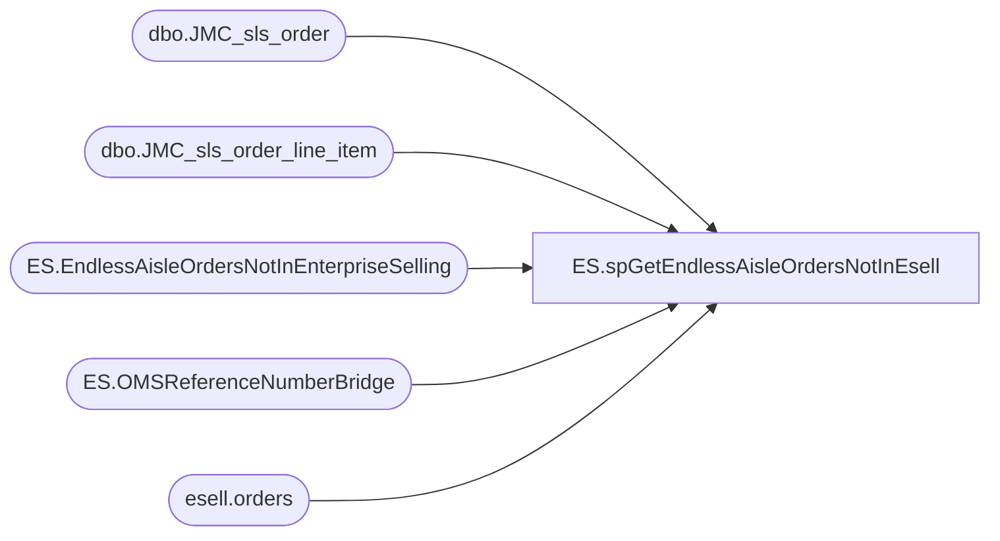

# ES.spGetEndlessAisleOrdersNotInEsell

**Database:** IntegrationStaging  

## Architecture Diagram



## Table Dependencies

| Referenced Table |
|---|
| dbo.JMC_sls_order |
| dbo.JMC_sls_order_line_item |
| ES.EndlessAisleOrdersNotInEnterpriseSelling |
| ES.OMSReferenceNumberBridge |
| esell.orders |

## Stored Procedure Code

```sql
CREATE PROC [ES].[spGetEndlessAisleOrdersNotInEsell]

as

------------------------------------------------------------------------------------------------------------------------------------------------------------
---- [ES].[spEmailEndlessAisleOrdersNotInEsell]
----	Name		Date		Action		Details
----	Brandon Hickey	2026-1-21	Create Proc	Created procedure to identify endless aisle orders missing from Esell.  
----										The missing orders will send to the Develobears in an email and populate the ES.EndlessAisleOrdersNotInEnterpriseSelling table
------------------------------------------------------------------------------------------------------------------------------------------------------------

-- Truncate ES.EndlessAisleOrdersNotInEnterpriseSelling
TRUNCATE TABLE ES.EndlessAisleOrdersNotInEnterpriseSelling

-- Populate EndlessAisle table
IF (Object_ID('tempdb..#EndlessAisle') IS NOT null) DROP TABLE #EndlessAisle
SELECT distinct
			so.[order_id],
			soli.orig_sequence_number,
			so.[create_time],
			cast(so.[business_date] as date) BusinessDate,
			so.[business_unit_id] StoreNumber,
			RIGHT(	'00000' 
					+ SUBSTRING(device_id, 2, 3), 5) 
					+ SUBSTRING(business_date, 3, 2) 
					+ SUBSTRING(business_date, 5, 2) 
					+ RIGHT(device_id, 2) 
					+ RIGHT('00000' 
					+ CAST(soli.orig_sequence_number AS VARCHAR(5)), 5) 
					+ '0101' 
					as 'EnterpriseSellingID',
			so.[total],
			so.[subtotal],
			so.[tax_total],
			so.[discount_total],
			so.[line_item_count],
			so.[order_status_code],
			so.[order_type_code],
			so.[amount_due],
			so.device_id,
			esb.ReferenceNumber,
			esb.OrderNumber
		INTO #EndlessAisle
		FROM papamart.[dw].[dbo].[JMC_sls_order] so
		join papamart.[dw].[dbo].[JMC_sls_order_line_item] soli ON so.order_id = soli.order_id
		left join ES.OMSReferenceNumberBridge (nolock) esb on 
			RIGHT('00000' + SUBSTRING(device_id, 2, 3), 5) + SUBSTRING(business_date, 3, 2) + SUBSTRING(business_date, 5, 2) + RIGHT(device_id, 2) + RIGHT('00000' + CAST(soli.orig_sequence_number AS VARCHAR(5)), 5) + '0101'
			= esb.EnterpriseSellingID
		where datediff(dd, so.create_time, getdate())<=14
		
-- Insert into EndlessAisleOrdersNotInEnterpriseSelling
INSERT INTO ES.EndlessAisleOrdersNotInEnterpriseSelling
SELECT DISTINCT
		ea.order_id,
		ea.orig_sequence_number,
		ea.create_time,
		ea.BusinessDate,
		ea.StoreNumber,
		ea.EnterpriseSellingID,
		ea.total,
		ea.subtotal,
		ea.tax_total,
		ea.discount_total,
		ea.line_item_count,
		ea.order_status_code,
		ea.order_type_code,
		ea.amount_due,
		ea.ReferenceNumber,
		ea.OrderNumber,
		ea.device_id,
		GETDATE() [AlertDate]
	FROM #EndlessAisle ea
	left join bedrockdb02.esell.esell.orders e (nolock) on ea.EnterpriseSellingID = right(e.order_id,20)
	--left join papamart.dw.azure.vwEntepriseSellingFact ef on right(ea.ReferenceNumber,20)=right(ef.ReferenceNumber,20)
	WHERE 1=1
		AND (ea.ReferenceNumber is null	or e.order_id is null)

SELECT order_id from ES.EndlessAisleOrdersNotInEnterpriseSelling
```

