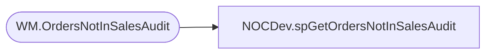

# NOCDev.spGetOrdersNotInSalesAudit

**Database:** IntegrationStaging  

## Architecture Diagram



## Table Dependencies

| Referenced Table |
|---|
| WM.OrdersNotInSalesAudit |

## Stored Procedure Code

```sql
CREATE proc [NOCDev].[spGetOrdersNotInSalesAudit]

as

-------------------------------------------------------------------------					
-- 2021-11-10 - Brandon Hickey - Created Proc
-------------------------------------------------------------------------

set nocount on

SELECT OrderNum,
	ShipDate,
	InSettlementData,
	CheckDateTime 
FROM [BEARCLUSTER01.SQL.BUILDABEAR.COM].[WebOrderProcessing].[WM].[OrdersNotInSalesAudit]
```

