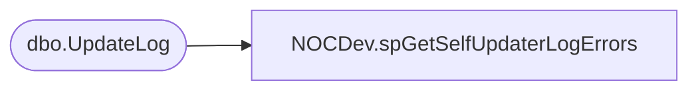

# NOCDev.spGetSelfUpdaterLogErrors

**Database:** IntegrationStaging  

## Architecture Diagram



## Table Dependencies

| Referenced Table |
|---|
| dbo.UpdateLog |

## Stored Procedure Code

```sql
CREATE proc [NOCDev].[spGetSelfUpdaterLogErrors]

as

-------------------------------------------------------------------------					
-- 2021-11-16 - Brandon Hickey - Created Proc
-------------------------------------------------------------------------

set nocount on

SELECT TOP (5) [RowIndex]
      ,[Server]
      ,[LogDate]
      ,[IsError]
      ,[UpdateSet]
      ,[Marker]
      ,[Message]
  FROM [KODIAK].[BABW_Interactive_Self_Updater].[dbo].[UpdateLog]
  WHERE IsError = 'Y'
  AND Message NOT LIKE '%Execution Timeout Expired%'
  ORDER BY 1 DESC
```

