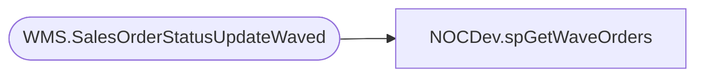

# NOCDev.spGetWaveOrders

**Database:** IntegrationStaging  

## Architecture Diagram



## Table Dependencies

| Referenced Table |
|---|
| WMS.SalesOrderStatusUpdateWaved |

## Stored Procedure Code

```sql
CREATE proc [NOCDev].[spGetWaveOrders]

as

-------------------------------------------------------------------------					
-- 2021-11-10 - Brandon Hickey - Created Proc
-------------------------------------------------------------------------

set nocount on


SELECT [WaveId]
      ,COUNT([DeckSalesOrderReferenceNumber]) AS OrderCount
      ,[ReleasedDateAndTime]
FROM
(SELECT DISTINCT [WaveId]
      ,[ReleasedDateAndTime]
      ,[DeckSalesOrderReferenceNumber]
  FROM [IntegrationStaging].[WMS].[SalesOrderStatusUpdateWaved]
  WHERE ReleasedDateAndTime > DATEADD(DAY, -1, GETDATE())
  ) AS innerQry
  GROUP BY WaveId, ReleasedDateAndTime
  ORDER BY ReleasedDateAndTime DESC
```

