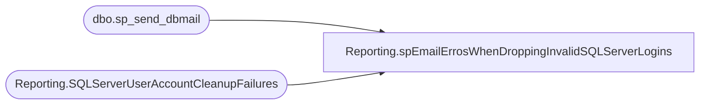

# Reporting.spEmailErrosWhenDroppingInvalidSQLServerLogins

**Database:** IntegrationStaging  

## Architecture Diagram



## Table Dependencies

| Referenced Table |
|---|
| dbo.sp_send_dbmail |
| Reporting.SQLServerUserAccountCleanupFailures |

## Stored Procedure Code

```sql
CREATE proc [Reporting].[spEmailErrosWhenDroppingInvalidSQLServerLogins] 
@Recipient nvarchar(max)

as 

----------------------------------------------------------------------------------------------------------------------------------------------------------
-- [Reporting].[spEmailErrosWhenDroppingInvalidSQLServerLogins] 
-- Tim Callahan	2021-07-01	Created Proc to notify when there were errors when attempting to drop invalid sql server logins 
------------------------------------------------------------------------------------------------------------------------------------------------------------
set nocount on

	declare @text nvarchar(max)
	
	set @text = '<font face =arial size = 2>' + 
		'</b><H1>Errors Encountered When Dropping Invalid SQL Logins</H1>' +
			'<table border="1">' +
			'<tr><th>ServerName</th><th>CommandExecuted</th><th>ErrorMessage</th><th>InsertDate</th></tr>' +
			CAST ( ( SELECT td = ServerName,'',
							td = CommandExecuted, '',
							td = ErrorMessage, '',
							td = InsertDate, ''
					  from [Reporting].[SQLServerUserAccountCleanupFailures]
					  where cast(InsertDate as date) = cast (getdate() as date) 
					  order by InsertDate
					  FOR XML PATH('tr'), TYPE 
			) AS NVARCHAR(MAX) ) +
			'</font></table></font></p></p>
			<br>
			<font face =arial size = 1>This report was run from {stl-ssis-p-01].[IntegrationStaging].[Reporting].[spEmailErrosWhenDroppingInvalidSQLServerLogins]</font>
			<br>
			<br>
		<font face =arial size = 1><i>The information in this message may be privileged, “confidential” and protected from disclosure and/or intended only for the addressee(s) named above.  If the reader of this message is not the intended recipient, or an employee or agent responsible for delivering this message to the intended recipient, you are hereby notified that any dissemination, distribution or copying of the communication is strictly prohibited.  If you have received this communication in error, please notify us immediately by replying to the message and deleting it from your computer.  Thank you beary much.</i></font>'

		exec msdb.dbo.sp_send_dbmail
		@profile_name = 'BIadmin',
		@recipients = @Recipient,
		@body = @text,
		@subject = 'Errors Encountered When Droping Invalid SQL Logins',
		@body_format = 'HTML'
```

