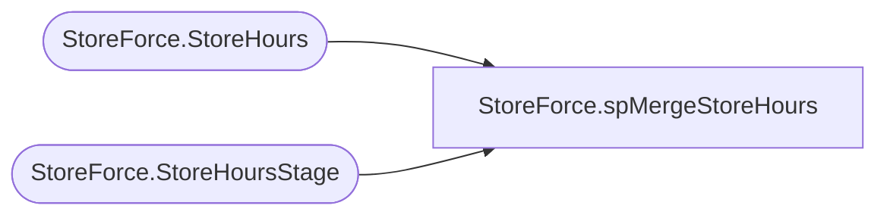

# StoreForce.spMergeStoreHours

**Database:** IntegrationStaging  

## Architecture Diagram



## Table Dependencies

| Referenced Table |
|---|
| StoreForce.StoreHours |
| StoreForce.StoreHoursStage |

## Stored Procedure Code

```sql
CREATE proc [StoreForce].[spMergeStoreHours]
as 

set nocount on 

merge into StoreForce.StoreHours as target
using 
(select * from StoreForce.StoreHoursStage where isnumeric(code)=1) as source
on 
	target.Code=source.Code
	and
	target.Date=source.Date
when matched  
and 
	(
		isnull(target.OpenTime,'x')<>isnull(source.OpenTime,'x')
		or
		isnull(target.CloseTime,'x')<>isnull(source.CloseTime,'x')
		or
		isnull(target.IsHoliday,'x')<>isnull(source.IsHoliday,'x')
	)
then update
	set
		target.OpenTime=source.OpenTime,
		target.CloseTime=source.CloseTime,
		target.IsHoliday=source.IsHoliday,
		target.UpdateDate=getdate()
when not matched by target
then insert
	(
		Code,
		Date,
		OpenTime,
		CloseTime,
		IsHoliday,
		InsertDate
	)
values
	(
		source.Code,
		source.Date,
		source.OpenTime,
		source.CloseTime,
		source.IsHoliday,
		getdate()
	)
;
```

