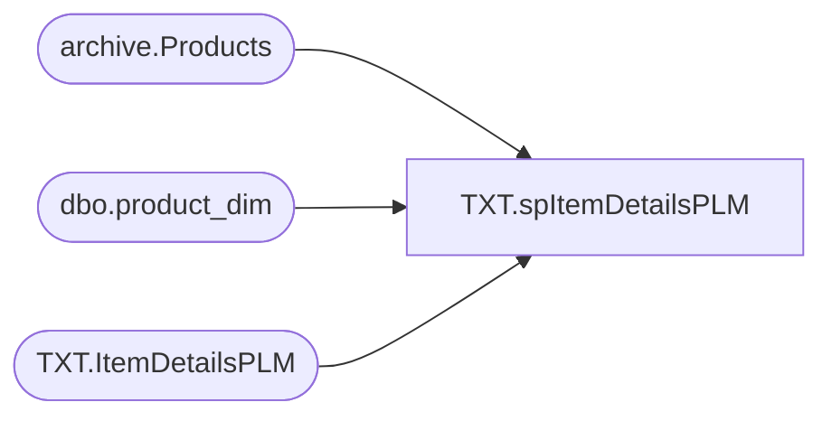

# TXT.spItemDetailsPLM

**Database:** IntegrationStaging  

## Architecture Diagram



## Table Dependencies

| Referenced Table |
|---|
| archive.Products |
| dbo.product_dim |
| TXT.ItemDetailsPLM |

## Stored Procedure Code

```sql
CREATE proc [TXT].[spItemDetailsPLM]
as 
-- =====================================================================================================
-- Name: TXT.spItemDetailsPLM
--
-- Description:	Populates TXT.ItemDetailsPLM with data from PLM; JIRA BIB-897
-- Note: This is used in place of a data flow because of the limitations of PLMDB01: "length parameter passed to the LEFT or SUBSTRING function"
--
-- Revision History
--		Name:			Date:			Comments:
--		Lizzy Timm		05/15/2024		Created proc
-- =====================================================================================================
set nocount on 


IF (Object_ID('TXT.ItemDetailsPLM') IS NOT null) TRUNCATE TABLE TXT.ItemDetailsPLM
;

WITH MaxDate AS
(
	SELECT DISTINCT babussku, MAX(_exporteddate_) _exporteddate_
	  FROM PLMDB01.ProductLifecycleManagement.archive.Products with(nolock)
	  WHERE ISNUMERIC(babussku) = 1
		AND LEN(babussku) = 6
	  GROUP BY babussku
)
,Hierarchy AS 
(
	SELECT DISTINCT subclass
		,class
		,department	
		,department_code	
		,division	
		,chain	
		,concept	
		,subclass_code	
		,class_code
		FROM PAPAMART.DW.dbo.product_dim with(nolock)
		WHERE subclass_code IS NOT NULL
		AND LEFT(subclass_code, CHARINDEX('-', subclass_code) - 1) = 'W'
)
INSERT INTO TXT.ItemDetailsPLM
SELECT DISTINCT p.babussku style_code
	, LEFT(p.babDesc2, 20) [StyleShortDesc]
	, p.babcompletecode	
	, ISNULL(h.Concept, '') AS ConceptCode
	, ISNULL(h.Chain, '') AS ChainLabel
	, ISNULL(h.Department, '') AS DepartmentLabel
	, ISNULL(h.Class, '') AS ClassLabel	
	, ISNULL(h.Subclass, '') AS SubClassLabel
	, p.babSTORY [StyleCustomPropertyValue]
	, p.babMSTAT [StyleAttributeSetCodeO]
--INTO TXT.ItemDetailsPLM
FROM PLMDB01.ProductLifecycleManagement.archive.Products p with(nolock)
JOIN MaxDate m ON p.babussku = m.babussku AND p._exporteddate_ = m._exporteddate_ 
LEFT JOIN Hierarchy h ON p.babcompletecode = h.subclass_code
WHERE ISNUMERIC(p.babUSSKU) = 1
	AND LEFT(p.babcompletecode, CHARINDEX('-', p.babcompletecode) - 1) = 'W'
UNION
SELECT DISTINCT p.babUSSNCSKU style_code
	, CONCAT('SNC ',LEFT(p.babDesc2, 16)) [StyleShortDesc]
	, p.babcompletecode
	, ISNULL(h.Concept, '') AS ConceptCode
	, ISNULL(h.Chain, '') AS ChainLabel
	, ISNULL(h.Department, '') AS DepartmentLabel
	, ISNULL(h.Class, '') AS ClassLabel	
	, ISNULL(h.Subclass, '') AS SubClassLabel
	, p.babSTORY [StyleCustomPropertyValue]
	, p.babMSTAT [StyleAttributeSetCodeO]
FROM PLMDB01.ProductLifecycleManagement.archive.Products p with(nolock)
JOIN MaxDate m ON p.babussku = m.babussku AND p._exporteddate_ = m._exporteddate_ 
LEFT JOIN Hierarchy h ON p.babcompletecode = h.subclass_code
WHERE ISNUMERIC(p.babUSSNCSKU) = 1
	AND LEFT(p.babcompletecode, CHARINDEX('-', p.babcompletecode) - 1) = 'W'
UNION
SELECT DISTINCT p.babUSSACSKU style_code
	, CONCAT('SC ',LEFT(p.babDesc2, 16)) [StyleShortDesc]
	, p.babcompletecode
	, ISNULL(h.Concept, '') AS ConceptCode
	, ISNULL(h.Chain, '') AS ChainLabel
	, ISNULL(h.Department, '') AS DepartmentLabel
	, ISNULL(h.Class, '') AS ClassLabel	
	, ISNULL(h.Subclass, '') AS SubClassLabel
	, p.babSTORY [StyleCustomPropertyValue]
	, p.babMSTAT [StyleAttributeSetCodeO]
FROM PLMDB01.ProductLifecycleManagement.archive.Products p with(nolock)
JOIN MaxDate m ON p.babussku = m.babussku AND p._exporteddate_ = m._exporteddate_ 
LEFT JOIN Hierarchy h ON p.babcompletecode = h.subclass_code
WHERE ISNUMERIC(p.babUSSACSKU) = 1
	AND LEFT(p.babcompletecode, CHARINDEX('-', p.babcompletecode) - 1) = 'W'
UNION
SELECT DISTINCT p.babCANSKU style_code
	, LEFT(babDesc2, 20) [StyleShortDesc]
	, p.babcompletecode
	, ISNULL(h.Concept, '') AS ConceptCode
	, ISNULL(h.Chain, '') AS ChainLabel
	, ISNULL(h.Department, '') AS DepartmentLabel
	, ISNULL(h.Class, '') AS ClassLabel	
	, ISNULL(h.Subclass, '') AS SubClassLabel
	, p.babSTORY [StyleCustomPropertyValue]
	, p.babCAMSTAT [StyleAttributeSetCodeO]
FROM PLMDB01.ProductLifecycleManagement.archive.Products p with(nolock)
JOIN MaxDate m ON p.babussku = m.babussku AND p._exporteddate_ = m._exporteddate_ 
LEFT JOIN Hierarchy h ON p.babcompletecode = h.subclass_code
WHERE ISNUMERIC(p.babCANSKU) = 1
	AND LEFT(p.babcompletecode, CHARINDEX('-', p.babcompletecode) - 1) = 'W'
UNION
SELECT DISTINCT p.babUKSKU style_code
	, LEFT(babDesc2, 20) [StyleShortDesc]
	, p.babcompletecode
	, ISNULL(h.Concept, '') AS ConceptCode
	, ISNULL(h.Chain, '') AS ChainLabel
	, ISNULL(h.Department, '') AS DepartmentLabel
	, ISNULL(h.Class, '') AS ClassLabel	
	, ISNULL(h.Subclass, '') AS SubClassLabel
	, p.babSTORY [StyleCustomPropertyValue]
	, p.babEUMSTAT [StyleAttributeSetCodeO]
FROM PLMDB01.ProductLifecycleManagement.archive.Products p with(nolock)
JOIN MaxDate m ON p.babussku = m.babussku AND p._exporteddate_ = m._exporteddate_ 
LEFT JOIN Hierarchy h ON p.babcompletecode = h.subclass_code
WHERE ISNUMERIC(p.babUKSKU) = 1
	AND LEFT(p.babcompletecode, CHARINDEX('-', p.babcompletecode) - 1) = 'W'
UNION
SELECT DISTINCT p.babUKSNCSKU style_code
	, CONCAT('SNC ',LEFT(p.babDesc2, 16)) [StyleShortDesc]
	, p.babcompletecode
	, ISNULL(h.Concept, '') AS ConceptCode
	, ISNULL(h.Chain, '') AS ChainLabel
	, ISNULL(h.Department, '') AS DepartmentLabel
	, ISNULL(h.Class, '') AS ClassLabel	
	, ISNULL(h.Subclass, '') AS SubClassLabel
	, p.babSTORY [StyleCustomPropertyValue]
	, p.babEUMSTAT [StyleAttributeSetCodeO]
FROM PLMDB01.ProductLifecycleManagement.archive.Products p with(nolock)
JOIN MaxDate m ON p.babussku = m.babussku AND p._exporteddate_ = m._exporteddate_ 
LEFT JOIN Hierarchy h ON p.babcompletecode = h.subclass_code
WHERE ISNUMERIC(p.babUKSNCSKU) = 1
	AND LEFT(p.babcompletecode, CHARINDEX('-', p.babcompletecode) - 1) = 'W'
UNION
SELECT DISTINCT p.babUKSACSKU style_code
	, CONCAT('SC ',LEFT(p.babDesc2, 16)) [StyleShortDesc]
	, p.babcompletecode
	, ISNULL(h.Concept, '') AS ConceptCode
	, ISNULL(h.Chain, '') AS ChainLabel
	, ISNULL(h.Department, '') AS DepartmentLabel
	, ISNULL(h.Class, '') AS ClassLabel	
	, ISNULL(h.Subclass, '') AS SubClassLabel
	, p.babSTORY [StyleCustomPropertyValue]
	, p.babEUMSTAT [StyleAttributeSetCodeO]
FROM PLMDB01.ProductLifecycleManagement.archive.Products p with(nolock)
JOIN MaxDate m ON p.babussku = m.babussku AND p._exporteddate_ = m._exporteddate_ 
LEFT JOIN Hierarchy h ON p.babcompletecode = h.subclass_code
WHERE ISNUMERIC(p.babUKSACSKU) = 1
	AND LEFT(p.babcompletecode, CHARINDEX('-', p.babcompletecode) - 1) = 'W'
UNION
SELECT DISTINCT p.babChinaSKU style_code
	, LEFT(babDesc2, 20) [StyleShortDesc]
	, p.babcompletecode
	, ISNULL(h.Concept, '') AS ConceptCode
	, ISNULL(h.Chain, '') AS ChainLabel
	, ISNULL(h.Department, '') AS DepartmentLabel
	, ISNULL(h.Class, '') AS ClassLabel	
	, ISNULL(h.Subclass, '') AS SubClassLabel
	, p.babSTORY [StyleCustomPropertyValue]
	, p.babCNMSTAT [StyleAttributeSetCodeO]
FROM PLMDB01.ProductLifecycleManagement.archive.Products p with(nolock)
JOIN MaxDate m ON p.babussku = m.babussku AND p._exporteddate_ = m._exporteddate_ 
LEFT JOIN Hierarchy h ON p.babcompletecode = h.subclass_code
WHERE ISNUMERIC(p.babChinaSKU) = 1
	AND LEFT(p.babcompletecode, CHARINDEX('-', p.babcompletecode) - 1) = 'W'
UNION
SELECT DISTINCT p.babMEXSKU style_code
	, LEFT(babDesc2, 20) [StyleShortDesc]
	, p.babcompletecode
	/*
	, LEFT(p.babcompletecode, CHARINDEX('-', p.babcompletecode) - 1) AS [ConceptCode]
	, SUBSTRING(p.babcompletecode, CHARINDEX('-', p.babcompletecode) + 1, CHARINDEX('-', p.babcompletecode, CHARINDEX('-', p.babcompletecode) + 1) - CHARINDEX('-', p.babcompletecode) - 1) AS [ChainLabel]
	, SUBSTRING(p.babcompletecode, PATINDEX('%[0-9]%', p.babcompletecode), PATINDEX('%[^0-9]%', SUBSTRING(p.babcompletecode, PATINDEX('%[0-9]%', p.babcompletecode), LEN(p.babcompletecode))) - 1) AS [DepartmentLabel]

	, CASE 
		WHEN ISNUMERIC(REVERSE(SUBSTRING(REVERSE(p.babcompletecode), CHARINDEX('-', REVERSE(p.babcompletecode)) + 1, CHARINDEX('-', REVERSE(p.babcompletecode), CHARINDEX('-', REVERSE(p.babcompletecode)) + 1) - CHARINDEX('-', REVERSE(p.babcompletecode)) - 1))) = 1 
			THEN REVERSE(SUBSTRING(REVERSE(p.babcompletecode), CHARINDEX('-', REVERSE(p.babcompletecode)) + 1, CHARINDEX('-', REVERSE(p.babcompletecode), CHARINDEX('-', REVERSE(p.babcompletecode)) + 1) - CHARINDEX('-', REVERSE(p.babcompletecode)) - 1))
		ELSE ''
	  END AS [ClassLabel]
	, CASE
		WHEN ISNUMERIC(RIGHT(p.babcompletecode, CHARINDEX('-', REVERSE(p.babcompletecode)) - 1) ) = 1
			THEN RIGHT(p.babcompletecode, CHARINDEX('-', REVERSE(p.babcompletecode)) - 1)
		ELSE ''
	  END AS [SubClassLabel]
	  */
	, ISNULL(h.Concept, '') AS ConceptCode
	, ISNULL(h.Chain, '') AS ChainLabel
	, ISNULL(h.Department, '') AS DepartmentLabel
	, ISNULL(h.Class, '') AS ClassLabel	
	, ISNULL(h.Subclass, '') AS SubClassLabel
	, p.babSTORY [StyleCustomPropertyValue]
	, p.babMEXMSTAT [StyleAttributeSetCodeO]
FROM PLMDB01.ProductLifecycleManagement.archive.Products p with(nolock)
JOIN MaxDate m ON p.babussku = m.babussku AND p._exporteddate_ = m._exporteddate_ 
LEFT JOIN Hierarchy h ON p.babcompletecode = h.subclass_code
WHERE ISNUMERIC(p.babMEXSKU) = 1
	AND LEFT(p.babcompletecode, CHARINDEX('-', p.babcompletecode) - 1) = 'W'
ORDER BY 1
```

