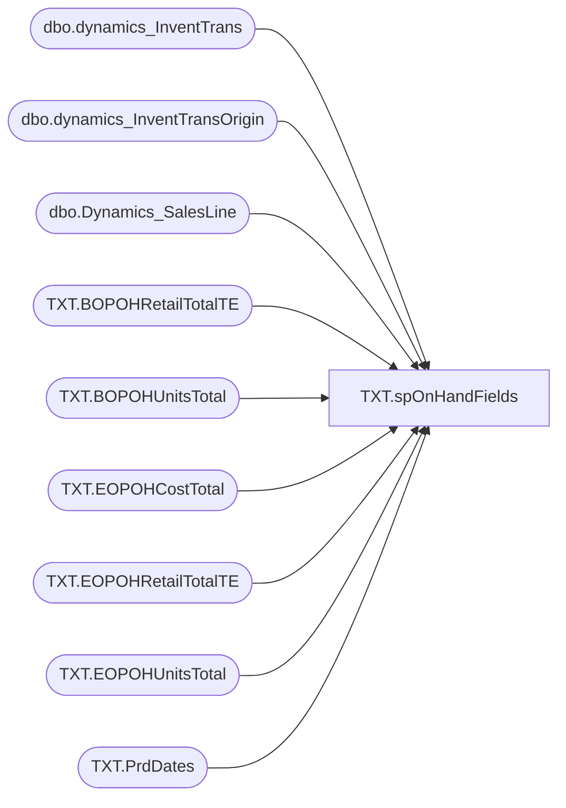

# TXT.spOnHandFields

**Database:** IntegrationStaging  

## Architecture Diagram



## Table Dependencies

| Referenced Table |
|---|
| dbo.dynamics_InventTrans |
| dbo.dynamics_InventTransOrigin |
| dbo.Dynamics_SalesLine |
| TXT.BOPOHRetailTotalTE |
| TXT.BOPOHUnitsTotal |
| TXT.EOPOHCostTotal |
| TXT.EOPOHRetailTotalTE |
| TXT.EOPOHUnitsTotal |
| TXT.PrdDates |

## Stored Procedure Code

```sql
CREATE proc [TXT].[spOnHandFields]
as 
-- =====================================================================================================
-- Name: TXT.spOnHandFields
--
-- Description:	Populates the following tables with data from D365; JIRA BIB-897
--		TXT.BOPOHUnitsTotal
--		TXT.EOPOHUnitsTotal
--		TXT.BOPOHRetailTotalTE
--		TXT.EOPOHRetailTotalTE
--		TXT.BOPOHCostTotal
--		TXT.EOPOHCostTotal
--
-- Revision History
--		Name:			Date:			Comments:
--		Lizzy Timm		05/21/2024		Created proc
-- =====================================================================================================
set nocount on 

--IF (Object_ID('TXT.BOPOHUnitsTotal') IS NOT null) 
TRUNCATE TABLE TXT.BOPOHUnitsTotal;
INSERT INTO TXT.BOPOHUnitsTotal
---- BOP OH Units Total Period 1
SELECT it1.ItemID
	, CONVERT(DECIMAL(10,2),ROUND(SUM(ISNULL(it1.Qty,0)),2)) BOPOHUnitsTotal
	, d1.Fiscal_year_pd
	--, it1.DatePhysical
  FROM silverdeltalake.silverdeltalake.dbo.dynamics_InventTrans it1 
	JOIN silverdeltalake.silverdeltalake.dbo.dynamics_InventTransOrigin ito1 ON it1.InventTransOrigin = ito1.RecID
		AND it1.ItemID = ito1.ItemId
		AND it1.DataAreaId = ito1.DataAreaId
		AND ito1.ReferenceCategory IN (1,4,5,6,13,34) -- labels starting with INV
	RIGHT JOIN TXT.PrdDates d1 ON d1.fiscal_period = 1	
  WHERE 1=1
	AND it1.StatusReceipt is NOT NULL
	AND it1.DatePhysical BETWEEN '2020-01-01 00:00:00.0000000' AND d1.BOPDate
  GROUP BY it1.ItemID
	, d1.Fiscal_year_pd
	--, it1.DatePhysical
UNION
---- BOP OH Units Total Period 2
SELECT it1.ItemID
	, CONVERT(DECIMAL(10,2),ROUND(SUM(ISNULL(it1.Qty,0)),2)) BOPOHUnitsTotal
	, d1.Fiscal_year_pd
	--, it1.DatePhysical
  FROM silverdeltalake.silverdeltalake.dbo.dynamics_InventTrans it1 
	JOIN silverdeltalake.silverdeltalake.dbo.dynamics_InventTransOrigin ito1 ON it1.InventTransOrigin = ito1.RecID
		AND it1.ItemID = ito1.ItemId
		AND it1.DataAreaId = ito1.DataAreaId
		AND ito1.ReferenceCategory IN (1,4,5,6,13,34) -- labels starting with INV
	RIGHT JOIN TXT.PrdDates d1 ON d1.fiscal_period = 2
  WHERE 1=1
	AND it1.StatusReceipt is NOT NULL
	AND it1.DatePhysical BETWEEN '2020-01-01 00:00:00.0000000' AND d1.BOPDate
  GROUP BY it1.ItemID
	, d1.Fiscal_year_pd
	--, it1.DatePhysical
UNION 
---- BOP OH Units Total Period 3
SELECT it1.ItemID
	, CONVERT(DECIMAL(10,2),ROUND(SUM(ISNULL(it1.Qty,0)),2)) BOPOHUnitsTotal
	, d1.Fiscal_year_pd
	--, it1.DatePhysical
  FROM silverdeltalake.silverdeltalake.dbo.dynamics_InventTrans it1 
	JOIN silverdeltalake.silverdeltalake.dbo.dynamics_InventTransOrigin ito1 ON it1.InventTransOrigin = ito1.RecID
		AND it1.ItemID = ito1.ItemId
		AND it1.DataAreaId = ito1.DataAreaId
		AND ito1.ReferenceCategory IN (1,4,5,6,13,34) -- labels starting with INV
	RIGHT JOIN TXT.PrdDates d1 ON d1.fiscal_period = 3	
  WHERE 1=1
	AND it1.StatusReceipt is NOT NULL
	AND it1.DatePhysical BETWEEN '2020-01-01 00:00:00.0000000' AND d1.BOPDate
  GROUP BY it1.ItemID
	, d1.Fiscal_year_pd
	--, it1.DatePhysical
UNION 
---- BOP OH Units Total Period 4
SELECT it1.ItemID
	, CONVERT(DECIMAL(10,2),ROUND(SUM(ISNULL(it1.Qty,0)),2)) BOPOHUnitsTotal
	, d1.Fiscal_year_pd
	--, it1.DatePhysical
  FROM silverdeltalake.silverdeltalake.dbo.dynamics_InventTrans it1 
	JOIN silverdeltalake.silverdeltalake.dbo.dynamics_InventTransOrigin ito1 ON it1.InventTransOrigin = ito1.RecID
		AND it1.ItemID = ito1.ItemId
		AND it1.DataAreaId = ito1.DataAreaId
		AND ito1.ReferenceCategory IN (1,4,5,6,13,34) -- labels starting with INV
	RIGHT JOIN TXT.PrdDates d1 ON d1.fiscal_period = 4	
  WHERE 1=1
	AND it1.StatusReceipt is NOT NULL
	AND it1.DatePhysical BETWEEN '2020-01-01 00:00:00.0000000' AND d1.BOPDate
  GROUP BY it1.ItemID
	, d1.Fiscal_year_pd
	--, it1.DatePhysical
UNION 
---- BOP OH Units Total Period 5
SELECT it1.ItemID
	, CONVERT(DECIMAL(10,2),ROUND(SUM(ISNULL(it1.Qty,0)),2)) BOPOHUnitsTotal
	, d1.Fiscal_year_pd
	--, it1.DatePhysical
  FROM silverdeltalake.silverdeltalake.dbo.dynamics_InventTrans it1 
	JOIN silverdeltalake.silverdeltalake.dbo.dynamics_InventTransOrigin ito1 ON it1.InventTransOrigin = ito1.RecID
		AND it1.ItemID = ito1.ItemId
		AND it1.DataAreaId = ito1.DataAreaId
		AND ito1.ReferenceCategory IN (1,4,5,6,13,34) -- labels starting with INV
	RIGHT JOIN TXT.PrdDates d1 ON d1.fiscal_period = 5	
  WHERE 1=1
	AND it1.StatusReceipt is NOT NULL
	AND it1.DatePhysical BETWEEN '2020-01-01 00:00:00.0000000' AND d1.BOPDate
  GROUP BY it1.ItemID
	, d1.Fiscal_year_pd
	--, it1.DatePhysical
UNION 
---- BOP OH Units Total Period 6
SELECT it1.ItemID
	, CONVERT(DECIMAL(10,2),ROUND(SUM(ISNULL(it1.Qty,0)),2)) BOPOHUnitsTotal
	, d1.Fiscal_year_pd
	--, it1.DatePhysical
  FROM silverdeltalake.silverdeltalake.dbo.dynamics_InventTrans it1 
	JOIN silverdeltalake.silverdeltalake.dbo.dynamics_InventTransOrigin ito1 ON it1.InventTransOrigin = ito1.RecID
		AND it1.ItemID = ito1.ItemId
		AND it1.DataAreaId = ito1.DataAreaId
		AND ito1.ReferenceCategory IN (1,4,5,6,13,34) -- labels starting with INV
	RIGHT JOIN TXT.PrdDates d1 ON d1.fiscal_period = 6	
  WHERE 1=1
	AND it1.StatusReceipt is NOT NULL
	AND it1.DatePhysical BETWEEN '2020-01-01 00:00:00.0000000' AND d1.BOPDate
  GROUP BY it1.ItemID
	, d1.Fiscal_year_pd
	--, it1.DatePhysical
UNION 
---- BOP OH Units Total Period 7
SELECT it1.ItemID
	, CONVERT(DECIMAL(10,2),ROUND(SUM(ISNULL(it1.Qty,0)),2)) BOPOHUnitsTotal
	, d1.Fiscal_year_pd
	--, it1.DatePhysical
  FROM silverdeltalake.silverdeltalake.dbo.dynamics_InventTrans it1 
	JOIN silverdeltalake.silverdeltalake.dbo.dynamics_InventTransOrigin ito1 ON it1.InventTransOrigin = ito1.RecID
		AND it1.ItemID = ito1.ItemId
		AND it1.DataAreaId = ito1.DataAreaId
		AND ito1.ReferenceCategory IN (1,4,5,6,13,34) -- labels starting with INV
	RIGHT JOIN TXT.PrdDates d1 ON d1.fiscal_period = 7	
  WHERE 1=1
	AND it1.StatusReceipt is NOT NULL
	AND it1.DatePhysical BETWEEN '2020-01-01 00:00:00.0000000' AND d1.BOPDate
  GROUP BY it1.ItemID
	, d1.Fiscal_year_pd
	--, it1.DatePhysical
UNION 
---- BOP OH Units Total Period 8
SELECT it1.ItemID
	, CONVERT(DECIMAL(10,2),ROUND(SUM(ISNULL(it1.Qty,0)),2)) BOPOHUnitsTotal
	, d1.Fiscal_year_pd
	--, it1.DatePhysical
  FROM silverdeltalake.silverdeltalake.dbo.dynamics_InventTrans it1 
	JOIN silverdeltalake.silverdeltalake.dbo.dynamics_InventTransOrigin ito1 ON it1.InventTransOrigin = ito1.RecID
		AND it1.ItemID = ito1.ItemId
		AND it1.DataAreaId = ito1.DataAreaId
		AND ito1.ReferenceCategory IN (1,4,5,6,13,34) -- labels starting with INV
	RIGHT JOIN TXT.PrdDates d1 ON d1.fiscal_period = 8	
  WHERE 1=1
	AND it1.StatusReceipt is NOT NULL
	AND it1.DatePhysical BETWEEN '2020-01-01 00:00:00.0000000' AND d1.BOPDate
  GROUP BY it1.ItemID
	, d1.Fiscal_year_pd
	--, it1.DatePhysical
UNION 
---- BOP OH Units Total Period 9
SELECT it1.ItemID
	, CONVERT(DECIMAL(10,2),ROUND(SUM(ISNULL(it1.Qty,0)),2)) BOPOHUnitsTotal
	, d1.Fiscal_year_pd
	--, it1.DatePhysical
  FROM silverdeltalake.silverdeltalake.dbo.dynamics_InventTrans it1 
	JOIN silverdeltalake.silverdeltalake.dbo.dynamics_InventTransOrigin ito1 ON it1.InventTransOrigin = ito1.RecID
		AND it1.ItemID = ito1.ItemId
		AND it1.DataAreaId = ito1.DataAreaId
		AND ito1.ReferenceCategory IN (1,4,5,6,13,34) -- labels starting with INV
	RIGHT JOIN TXT.PrdDates d1 ON d1.fiscal_period = 9	
  WHERE 1=1
	AND it1.StatusReceipt is NOT NULL
	AND it1.DatePhysical BETWEEN '2020-01-01 00:00:00.0000000' AND d1.BOPDate
  GROUP BY it1.ItemID
	, d1.Fiscal_year_pd
	--, it1.DatePhysical
UNION 
---- BOP OH Units Total Period 10
SELECT it1.ItemID
	, CONVERT(DECIMAL(10,2),ROUND(SUM(ISNULL(it1.Qty,0)),2)) BOPOHUnitsTotal
	, d1.Fiscal_year_pd
	--, it1.DatePhysical
  FROM silverdeltalake.silverdeltalake.dbo.dynamics_InventTrans it1 
	JOIN silverdeltalake.silverdeltalake.dbo.dynamics_InventTransOrigin ito1 ON it1.InventTransOrigin = ito1.RecID
		AND it1.ItemID = ito1.ItemId
		AND it1.DataAreaId = ito1.DataAreaId
		AND ito1.ReferenceCategory IN (1,4,5,6,13,34) -- labels starting with INV
	RIGHT JOIN TXT.PrdDates d1 ON d1.fiscal_period = 10	
  WHERE 1=1
	AND it1.StatusReceipt is NOT NULL
	AND it1.DatePhysical BETWEEN '2020-01-01 00:00:00.0000000' AND d1.BOPDate
  GROUP BY it1.ItemID
	, d1.Fiscal_year_pd
	--, it1.DatePhysical
UNION 
---- BOP OH Units Total Period 11
SELECT it1.ItemID
	, CONVERT(DECIMAL(10,2),ROUND(SUM(ISNULL(it1.Qty,0)),2)) BOPOHUnitsTotal
	, d1.Fiscal_year_pd
	--, it1.DatePhysical
  FROM silverdeltalake.silverdeltalake.dbo.dynamics_InventTrans it1 
	JOIN silverdeltalake.silverdeltalake.dbo.dynamics_InventTransOrigin ito1 ON it1.InventTransOrigin = ito1.RecID
		AND it1.ItemID = ito1.ItemId
		AND it1.DataAreaId = ito1.DataAreaId
		AND ito1.ReferenceCategory IN (1,4,5,6,13,34) -- labels starting with INV
	RIGHT JOIN TXT.PrdDates d1 ON d1.fiscal_period = 11	
  WHERE 1=1
	AND it1.StatusReceipt is NOT NULL
	AND it1.DatePhysical BETWEEN '2020-01-01 00:00:00.0000000' AND d1.BOPDate
  GROUP BY it1.ItemID
	, d1.Fiscal_year_pd
	--, it1.DatePhysical
UNION 
---- BOP OH Units Total Period 12
SELECT it1.ItemID
	, CONVERT(DECIMAL(10,2),ROUND(SUM(ISNULL(it1.Qty,0)),2)) BOPOHUnitsTotal
	, d1.Fiscal_year_pd
	--, it1.DatePhysical
  FROM silverdeltalake.silverdeltalake.dbo.dynamics_InventTrans it1 
	JOIN silverdeltalake.silverdeltalake.dbo.dynamics_InventTransOrigin ito1 ON it1.InventTransOrigin = ito1.RecID
		AND it1.ItemID = ito1.ItemId
		AND it1.DataAreaId = ito1.DataAreaId
		AND ito1.ReferenceCategory IN (1,4,5,6,13,34) -- labels starting with INV
	RIGHT JOIN TXT.PrdDates d1 ON d1.fiscal_period = 12	
  WHERE 1=1
	AND it1.StatusReceipt is NOT NULL
	AND it1.DatePhysical BETWEEN '2020-01-01 00:00:00.0000000' AND d1.BOPDate
  GROUP BY it1.ItemID
	, d1.Fiscal_year_pd
	--, it1.DatePhysical
ORDER BY it1.ItemID
	, d1.Fiscal_year_pd
;
----------------------------------------------------------
---- EOP OH Units Total Period 1
--IF (Object_ID('TXT.EOPOHUnitsTotal') IS NOT null) 
TRUNCATE TABLE TXT.EOPOHUnitsTotal;
INSERT INTO TXT.EOPOHUnitsTotal
SELECT it1.ItemID
	, CONVERT(DECIMAL(10,2),ROUND(SUM(ISNULL(it1.Qty,0)),2)) EOPOHUnitsTotal
	, d1.Fiscal_year_pd
  -- INTO TXT.EOPOHUnitsTotal
  FROM silverdeltalake.silverdeltalake.dbo.dynamics_InventTrans it1 
	JOIN silverdeltalake.silverdeltalake.dbo.dynamics_InventTransOrigin ito1 ON it1.InventTransOrigin = ito1.RecID
		AND it1.ItemID = ito1.ItemId
		AND it1.DataAreaId = ito1.DataAreaId
		AND ito1.ReferenceCategory IN (1,4,5,6,13,34) -- labels starting with INV
	RIGHT JOIN TXT.PrdDates d1 ON d1.fiscal_period = 1	
  WHERE 1=1
	AND it1.StatusReceipt is NOT NULL
	AND it1.DatePhysical BETWEEN '2020-01-01 00:00:00.0000000' AND d1.EOPDate
  GROUP BY it1.ItemID
	, d1.Fiscal_year_pd
	--, it1.DatePhysical
UNION
---- EOP OH Units Total Period 2
SELECT it1.ItemID
	, CONVERT(DECIMAL(10,2),ROUND(SUM(ISNULL(it1.Qty,0)),2)) EOPOHUnitsTotal
	, d1.Fiscal_year_pd
	--, it1.DatePhysical
  FROM silverdeltalake.silverdeltalake.dbo.dynamics_InventTrans it1 
	JOIN silverdeltalake.silverdeltalake.dbo.dynamics_InventTransOrigin ito1 ON it1.InventTransOrigin = ito1.RecID
		AND it1.ItemID = ito1.ItemId
		AND it1.DataAreaId = ito1.DataAreaId
		AND ito1.ReferenceCategory IN (1,4,5,6,13,34) -- labels starting with INV
	RIGHT JOIN TXT.PrdDates d1 ON d1.fiscal_period = 2
  WHERE 1=1
	AND it1.StatusReceipt is NOT NULL
	AND it1.DatePhysical BETWEEN '2020-01-01 00:00:00.0000000' AND d1.EOPDate
  GROUP BY it1.ItemID
	, d1.Fiscal_year_pd
	--, it1.DatePhysical
UNION 
---- EOP OH Units Total Period 3
SELECT it1.ItemID
	, CONVERT(DECIMAL(10,2),ROUND(SUM(ISNULL(it1.Qty,0)),2)) EOPOHUnitsTotal
	, d1.Fiscal_year_pd
	--, it1.DatePhysical
  FROM silverdeltalake.silverdeltalake.dbo.dynamics_InventTrans it1 
	JOIN silverdeltalake.silverdeltalake.dbo.dynamics_InventTransOrigin ito1 ON it1.InventTransOrigin = ito1.RecID
		AND it1.ItemID = ito1.ItemId
		AND it1.DataAreaId = ito1.DataAreaId
		AND ito1.ReferenceCategory IN (1,4,5,6,13,34) -- labels starting with INV
	RIGHT JOIN TXT.PrdDates d1 ON d1.fiscal_period = 3	
  WHERE 1=1
	AND it1.StatusReceipt is NOT NULL
	AND it1.DatePhysical BETWEEN '2020-01-01 00:00:00.0000000' AND d1.EOPDate
  GROUP BY it1.ItemID
	, d1.Fiscal_year_pd
	--, it1.DatePhysical
UNION 
---- EOP OH Units Total Period 4
SELECT it1.ItemID
	, CONVERT(DECIMAL(10,2),ROUND(SUM(ISNULL(it1.Qty,0)),2)) EOPOHUnitsTotal
	, d1.Fiscal_year_pd
	--, it1.DatePhysical
  FROM silverdeltalake.silverdeltalake.dbo.dynamics_InventTrans it1 
	JOIN silverdeltalake.silverdeltalake.dbo.dynamics_InventTransOrigin ito1 ON it1.InventTransOrigin = ito1.RecID
		AND it1.ItemID = ito1.ItemId
		AND it1.DataAreaId = ito1.DataAreaId
		AND ito1.ReferenceCategory IN (1,4,5,6,13,34) -- labels starting with INV
	RIGHT JOIN TXT.PrdDates d1 ON d1.fiscal_period = 4	
  WHERE 1=1
	AND it1.StatusReceipt is NOT NULL
	AND it1.DatePhysical BETWEEN '2020-01-01 00:00:00.0000000' AND d1.EOPDate
  GROUP BY it1.ItemID
	, d1.Fiscal_year_pd
	--, it1.DatePhysical
UNION 
---- EOP OH Units Total Period 5
SELECT it1.ItemID
	, CONVERT(DECIMAL(10,2),ROUND(SUM(ISNULL(it1.Qty,0)),2)) EOPOHUnitsTotal
	, d1.Fiscal_year_pd
	--, it1.DatePhysical
  FROM silverdeltalake.silverdeltalake.dbo.dynamics_InventTrans it1 
	JOIN silverdeltalake.silverdeltalake.dbo.dynamics_InventTransOrigin ito1 ON it1.InventTransOrigin = ito1.RecID
		AND it1.ItemID = ito1.ItemId
		AND it1.DataAreaId = ito1.DataAreaId
		AND ito1.ReferenceCategory IN (1,4,5,6,13,34) -- labels starting with INV
	RIGHT JOIN TXT.PrdDates d1 ON d1.fiscal_period = 5	
  WHERE 1=1
	AND it1.StatusReceipt is NOT NULL
	AND it1.DatePhysical BETWEEN '2020-01-01 00:00:00.0000000' AND d1.EOPDate
  GROUP BY it1.ItemID
	, d1.Fiscal_year_pd
	--, it1.DatePhysical
UNION 
---- EOP OH Units Total Period 6
SELECT it1.ItemID
	, CONVERT(DECIMAL(10,2),ROUND(SUM(ISNULL(it1.Qty,0)),2)) EOPOHUnitsTotal
	, d1.Fiscal_year_pd
	--, it1.DatePhysical
  FROM silverdeltalake.silverdeltalake.dbo.dynamics_InventTrans it1 
	JOIN silverdeltalake.silverdeltalake.dbo.dynamics_InventTransOrigin ito1 ON it1.InventTransOrigin = ito1.RecID
		AND it1.ItemID = ito1.ItemId
		AND it1.DataAreaId = ito1.DataAreaId
		AND ito1.ReferenceCategory IN (1,4,5,6,13,34) -- labels starting with INV
	RIGHT JOIN TXT.PrdDates d1 ON d1.fiscal_period = 6	
  WHERE 1=1
	AND it1.StatusReceipt is NOT NULL
	AND it1.DatePhysical BETWEEN '2020-01-01 00:00:00.0000000' AND d1.EOPDate
  GROUP BY it1.ItemID
	, d1.Fiscal_year_pd
	--, it1.DatePhysical
UNION 
---- EOP OH Units Total Period 7
SELECT it1.ItemID
	, CONVERT(DECIMAL(10,2),ROUND(SUM(ISNULL(it1.Qty,0)),2)) EOPOHUnitsTotal
	, d1.Fiscal_year_pd
	--, it1.DatePhysical
  FROM silverdeltalake.silverdeltalake.dbo.dynamics_InventTrans it1 
	JOIN silverdeltalake.silverdeltalake.dbo.dynamics_InventTransOrigin ito1 ON it1.InventTransOrigin = ito1.RecID
		AND it1.ItemID = ito1.ItemId
		AND it1.DataAreaId = ito1.DataAreaId
		AND ito1.ReferenceCategory IN (1,4,5,6,13,34) -- labels starting with INV
	RIGHT JOIN TXT.PrdDates d1 ON d1.fiscal_period = 7	
  WHERE 1=1
	AND it1.StatusReceipt is NOT NULL
	AND it1.DatePhysical BETWEEN '2020-01-01 00:00:00.0000000' AND d1.EOPDate
  GROUP BY it1.ItemID
	, d1.Fiscal_year_pd
	--, it1.DatePhysical
UNION 
---- EOP OH Units Total Period 8
SELECT it1.ItemID
	, CONVERT(DECIMAL(10,2),ROUND(SUM(ISNULL(it1.Qty,0)),2)) EOPOHUnitsTotal
	, d1.Fiscal_year_pd
	--, it1.DatePhysical
  FROM silverdeltalake.silverdeltalake.dbo.dynamics_InventTrans it1 
	JOIN silverdeltalake.silverdeltalake.dbo.dynamics_InventTransOrigin ito1 ON it1.InventTransOrigin = ito1.RecID
		AND it1.ItemID = ito1.ItemId
		AND it1.DataAreaId = ito1.DataAreaId
		AND ito1.ReferenceCategory IN (1,4,5,6,13,34) -- labels starting with INV
	RIGHT JOIN TXT.PrdDates d1 ON d1.fiscal_period = 8	
  WHERE 1=1
	AND it1.StatusReceipt is NOT NULL
	AND it1.DatePhysical BETWEEN '2020-01-01 00:00:00.0000000' AND d1.EOPDate
  GROUP BY it1.ItemID
	, d1.Fiscal_year_pd
	--, it1.DatePhysical
UNION 
---- EOP OH Units Total Period 9
SELECT it1.ItemID
	, CONVERT(DECIMAL(10,2),ROUND(SUM(ISNULL(it1.Qty,0)),2)) EOPOHUnitsTotal
	, d1.Fiscal_year_pd
	--, it1.DatePhysical
  FROM silverdeltalake.silverdeltalake.dbo.dynamics_InventTrans it1 
	JOIN silverdeltalake.silverdeltalake.dbo.dynamics_InventTransOrigin ito1 ON it1.InventTransOrigin = ito1.RecID
		AND it1.ItemID = ito1.ItemId
		AND it1.DataAreaId = ito1.DataAreaId
		AND ito1.ReferenceCategory IN (1,4,5,6,13,34) -- labels starting with INV
	RIGHT JOIN TXT.PrdDates d1 ON d1.fiscal_period = 9	
  WHERE 1=1
	AND it1.StatusReceipt is NOT NULL
	AND it1.DatePhysical BETWEEN '2020-01-01 00:00:00.0000000' AND d1.EOPDate
  GROUP BY it1.ItemID
	, d1.Fiscal_year_pd
	--, it1.DatePhysical
UNION 
---- EOP OH Units Total Period 10
SELECT it1.ItemID
	, CONVERT(DECIMAL(10,2),ROUND(SUM(ISNULL(it1.Qty,0)),2)) EOPOHUnitsTotal
	, d1.Fiscal_year_pd
	--, it1.DatePhysical
  FROM silverdeltalake.silverdeltalake.dbo.dynamics_InventTrans it1 
	JOIN silverdeltalake.silverdeltalake.dbo.dynamics_InventTransOrigin ito1 ON it1.InventTransOrigin = ito1.RecID
		AND it1.ItemID = ito1.ItemId
		AND it1.DataAreaId = ito1.DataAreaId
		AND ito1.ReferenceCategory IN (1,4,5,6,13,34) -- labels starting with INV
	RIGHT JOIN TXT.PrdDates d1 ON d1.fiscal_period = 10	
  WHERE 1=1
	AND it1.StatusReceipt is NOT NULL
	AND it1.DatePhysical BETWEEN '2020-01-01 00:00:00.0000000' AND d1.EOPDate
  GROUP BY it1.ItemID
	, d1.Fiscal_year_pd
	--, it1.DatePhysical
UNION 
---- EOP OH Units Total Period 11
SELECT it1.ItemID
	, CONVERT(DECIMAL(10,2),ROUND(SUM(ISNULL(it1.Qty,0)),2)) EOPOHUnitsTotal
	, d1.Fiscal_year_pd
	--, it1.DatePhysical
  FROM silverdeltalake.silverdeltalake.dbo.dynamics_InventTrans it1 
	JOIN silverdeltalake.silverdeltalake.dbo.dynamics_InventTransOrigin ito1 ON it1.InventTransOrigin = ito1.RecID
		AND it1.ItemID = ito1.ItemId
		AND it1.DataAreaId = ito1.DataAreaId
		AND ito1.ReferenceCategory IN (1,4,5,6,13,34) -- labels starting with INV
	RIGHT JOIN TXT.PrdDates d1 ON d1.fiscal_period = 11	
  WHERE 1=1
	AND it1.StatusReceipt is NOT NULL
	AND it1.DatePhysical BETWEEN '2020-01-01 00:00:00.0000000' AND d1.EOPDate
  GROUP BY it1.ItemID
	, d1.Fiscal_year_pd
	--, it1.DatePhysical
UNION 
---- EOP OH Units Total Period 12
SELECT it1.ItemID
	, CONVERT(DECIMAL(10,2),ROUND(SUM(ISNULL(it1.Qty,0)),2)) EOPOHUnitsTotal
	, d1.Fiscal_year_pd
	--, it1.DatePhysical
  FROM silverdeltalake.silverdeltalake.dbo.dynamics_InventTrans it1 
	JOIN silverdeltalake.silverdeltalake.dbo.dynamics_InventTransOrigin ito1 ON it1.InventTransOrigin = ito1.RecID
		AND it1.ItemID = ito1.ItemId
		AND it1.DataAreaId = ito1.DataAreaId
		AND ito1.ReferenceCategory IN (1,4,5,6,13,34) -- labels starting with INV
	RIGHT JOIN TXT.PrdDates d1 ON d1.fiscal_period = 12	
  WHERE 1=1
	AND it1.StatusReceipt is NOT NULL
	AND it1.DatePhysical BETWEEN '2020-01-01 00:00:00.0000000' AND d1.EOPDate
  GROUP BY it1.ItemID
	, d1.Fiscal_year_pd
	--, it1.DatePhysical
ORDER BY it1.ItemID
	, d1.Fiscal_year_pd
;
----------------------------------------------------------
--IF (Object_ID('TXT.BOPOHRetailTotalTE') IS NOT null) 
TRUNCATE TABLE TXT.BOPOHRetailTotalTE;
INSERT INTO TXT.BOPOHRetailTotalTE
-- BOP OH Retail Total TE Period 1 
SELECT it1.ItemID
	, CONVERT(DECIMAL(10,2),ROUND(SUM(ISNULL(sl.LineAmount,0)),2)) BOPOHRetailTotalTE
	, pd.Fiscal_year_pd
  FROM silverdeltalake.silverdeltalake.dbo.Dynamics_InventTrans it1 
  JOIN silverdeltalake.silverdeltalake.dbo.dynamics_InventTransOrigin ito1 ON it1.InventTransOrigin = ito1.RecID
	AND it1.ItemID = ito1.ItemId COLLATE Latin1_General_100_BIN2
	AND it1.DataAreaId = ito1.DataAreaId COLLATE Latin1_General_100_BIN2
	AND LEFT(ito1.ReferenceID, 2) = 'SO'
  JOIN silverdeltalake.silverdeltalake.dbo.Dynamics_SalesLine sl ON ito1.ReferenceId  COLLATE Latin1_General_100_BIN2 = sl.SalesID
	AND ito1.ItemId COLLATE Latin1_General_100_BIN2 = sl.ItemId
	AND ito1.InventTransId COLLATE Latin1_General_100_BIN2 = sl.InventTransId
  RIGHT JOIN TXT.PrdDates pd ON pd.fiscal_period = 1
  WHERE 1=1
	AND it1.StatusReceipt is NOT NULL
	AND it1.DatePhysical BETWEEN '2020-01-01 00:00:00.0000000' AND pd.BOPDate
  GROUP BY it1.ItemID
	, pd.Fiscal_year_pd
UNION
-- BOP OH Retail Total TE Period 2 
 SELECT it1.ItemID
	, CONVERT(DECIMAL(10,2),ROUND(SUM(ISNULL(sl.LineAmount,0)),2)) BOPOHRetailTotalTE
	, pd.Fiscal_year_pd
   FROM silverdeltalake.silverdeltalake.dbo.dynamics_InventTrans it1 
	JOIN silverdeltalake.silverdeltalake.dbo.dynamics_InventTransOrigin ito1 ON it1.InventTransOrigin = ito1.RecID
		AND it1.ItemID = ito1.ItemId
		AND it1.DataAreaId = ito1.DataAreaId
		AND LEFT(ito1.ReferenceID, 2) = 'SO'
	JOIN silverdeltalake.silverdeltalake.dbo.dynamics_SalesLine sl ON ito1.ReferenceId = sl.SalesID
		AND ito1.ItemId = sl.ItemId
		AND ito1.InventTransId = sl.InventTransId
	RIGHT JOIN TXT.PrdDates pd ON pd.fiscal_period = 2
  WHERE 1=1
	AND it1.StatusReceipt is NOT NULL
	AND it1.DatePhysical BETWEEN '2020-01-01 00:00:00.0000000' AND pd.BOPDate
  GROUP BY it1.ItemID
	, pd.Fiscal_year_pd
UNION
-- BOP OH Retail Total TE Period 3
 SELECT it1.ItemID
	, CONVERT(DECIMAL(10,2),ROUND(SUM(ISNULL(sl.LineAmount,0)),2)) BOPOHRetailTotalTE
	, pd.Fiscal_year_pd
   FROM silverdeltalake.silverdeltalake.dbo.dynamics_InventTrans it1 
	JOIN silverdeltalake.silverdeltalake.dbo.dynamics_InventTransOrigin ito1 ON it1.InventTransOrigin = ito1.RecID
		AND it1.ItemID = ito1.ItemId
		AND it1.DataAreaId = ito1.DataAreaId
		AND LEFT(ito1.ReferenceID, 2) = 'SO'
	JOIN silverdeltalake.silverdeltalake.dbo.dynamics_SalesLine sl ON ito1.ReferenceId = sl.SalesID
		AND ito1.ItemId = sl.ItemId
		AND ito1.InventTransId = sl.InventTransId
	RIGHT JOIN TXT.PrdDates pd ON pd.fiscal_period = 3
  WHERE 1=1
	AND it1.StatusReceipt is NOT NULL
	AND it1.DatePhysical BETWEEN '2020-01-01 00:00:00.0000000' AND pd.BOPDate
  GROUP BY it1.ItemID
	, pd.Fiscal_year_pd
UNION
-- BOP OH Retail Total TE Period 4
 SELECT it1.ItemID
	, CONVERT(DECIMAL(10,2),ROUND(SUM(ISNULL(sl.LineAmount,0)),2)) BOPOHRetailTotalTE
	, pd.Fiscal_year_pd
   FROM silverdeltalake.silverdeltalake.dbo.dynamics_InventTrans it1 
	JOIN silverdeltalake.silverdeltalake.dbo.dynamics_InventTransOrigin ito1 ON it1.InventTransOrigin = ito1.RecID
		AND it1.ItemID = ito1.ItemId
		AND it1.DataAreaId = ito1.DataAreaId
		AND LEFT(ito1.ReferenceID, 2) = 'SO'
	JOIN silverdeltalake.silverdeltalake.dbo.dynamics_SalesLine sl ON ito1.ReferenceId = sl.SalesID
		AND ito1.ItemId = sl.ItemId
		AND ito1.InventTransId = sl.InventTransId
	RIGHT JOIN TXT.PrdDates pd ON pd.fiscal_period = 4
  WHERE 1=1
	AND it1.StatusReceipt is NOT NULL
	AND it1.DatePhysical BETWEEN '2020-01-01 00:00:00.0000000' AND pd.BOPDate
  GROUP BY it1.ItemID
	, pd.Fiscal_year_pd
UNION
-- BOP OH Retail Total TE Period 5 
 SELECT it1.ItemID
	, CONVERT(DECIMAL(10,2),ROUND(SUM(ISNULL(sl.LineAmount,0)),2)) BOPOHRetailTotalTE
	, pd.Fiscal_year_pd
   FROM silverdeltalake.silverdeltalake.dbo.dynamics_InventTrans it1 
	JOIN silverdeltalake.silverdeltalake.dbo.dynamics_InventTransOrigin ito1 ON it1.InventTransOrigin = ito1.RecID
		AND it1.ItemID = ito1.ItemId
		AND it1.DataAreaId = ito1.DataAreaId
		AND LEFT(ito1.ReferenceID, 2) = 'SO'
	JOIN silverdeltalake.silverdeltalake.dbo.dynamics_SalesLine sl ON ito1.ReferenceId = sl.SalesID
		AND ito1.ItemId = sl.ItemId
		AND ito1.InventTransId = sl.InventTransId
	RIGHT JOIN TXT.PrdDates pd ON pd.fiscal_period = 5
  WHERE 1=1
	AND it1.StatusReceipt is NOT NULL
	AND it1.DatePhysical BETWEEN '2020-01-01 00:00:00.0000000' AND pd.BOPDate
  GROUP BY it1.ItemID
	, pd.Fiscal_year_pd
UNION
-- BOP OH Retail Total TE Period 6 
 SELECT it1.ItemID
	, CONVERT(DECIMAL(10,2),ROUND(SUM(ISNULL(sl.LineAmount,0)),2)) BOPOHRetailTotalTE
	, pd.Fiscal_year_pd
   FROM silverdeltalake.silverdeltalake.dbo.dynamics_InventTrans it1 
	JOIN silverdeltalake.silverdeltalake.dbo.dynamics_InventTransOrigin ito1 ON it1.InventTransOrigin = ito1.RecID
		AND it1.ItemID = ito1.ItemId
		AND it1.DataAreaId = ito1.DataAreaId
		AND LEFT(ito1.ReferenceID, 2) = 'SO'
	JOIN silverdeltalake.silverdeltalake.dbo.dynamics_SalesLine sl ON ito1.ReferenceId = sl.SalesID
		AND ito1.ItemId = sl.ItemId
		AND ito1.InventTransId = sl.InventTransId
	RIGHT JOIN TXT.PrdDates pd ON pd.fiscal_period = 6
  WHERE 1=1
	AND it1.StatusReceipt is NOT NULL
	AND it1.DatePhysical BETWEEN '2020-01-01 00:00:00.0000000' AND pd.BOPDate
  GROUP BY it1.ItemID
	, pd.Fiscal_year_pd
UNION
-- BOP OH Retail Total TE Period 7
 SELECT it1.ItemID
	, CONVERT(DECIMAL(10,2),ROUND(SUM(ISNULL(sl.LineAmount,0)),2)) BOPOHRetailTotalTE
	, pd.Fiscal_year_pd
   FROM silverdeltalake.silverdeltalake.dbo.dynamics_InventTrans it1 
	JOIN silverdeltalake.silverdeltalake.dbo.dynamics_InventTransOrigin ito1 ON it1.InventTransOrigin = ito1.RecID
		AND it1.ItemID = ito1.ItemId
		AND it1.DataAreaId = ito1.DataAreaId
		AND LEFT(ito1.ReferenceID, 2) = 'SO'
	JOIN silverdeltalake.silverdeltalake.dbo.dynamics_SalesLine sl ON ito1.ReferenceId = sl.SalesID
		AND ito1.ItemId = sl.ItemId
		AND ito1.InventTransId = sl.InventTransId
	RIGHT JOIN TXT.PrdDates pd ON pd.fiscal_period = 7
  WHERE 1=1
	AND it1.StatusReceipt is NOT NULL
	AND it1.DatePhysical BETWEEN '2020-01-01 00:00:00.0000000' AND pd.BOPDate
  GROUP BY it1.ItemID
	, pd.Fiscal_year_pd
UNION
-- BOP OH Retail Total TE Period 8 
 SELECT it1.ItemID
	, CONVERT(DECIMAL(10,2),ROUND(SUM(ISNULL(sl.LineAmount,0)),2)) BOPOHRetailTotalTE
	, pd.Fiscal_year_pd
   FROM silverdeltalake.silverdeltalake.dbo.dynamics_InventTrans it1 
	JOIN silverdeltalake.silverdeltalake.dbo.dynamics_InventTransOrigin ito1 ON it1.InventTransOrigin = ito1.RecID
		AND it1.ItemID = ito1.ItemId
		AND it1.DataAreaId = ito1.DataAreaId
		AND LEFT(ito1.ReferenceID, 2) = 'SO'
	JOIN silverdeltalake.silverdeltalake.dbo.dynamics_SalesLine sl ON ito1.ReferenceId = sl.SalesID
		AND ito1.ItemId = sl.ItemId
		AND ito1.InventTransId = sl.InventTransId
	RIGHT JOIN TXT.PrdDates pd ON pd.fiscal_period = 8
  WHERE 1=1
	AND it1.StatusReceipt is NOT NULL
	AND it1.DatePhysical BETWEEN '2020-01-01 00:00:00.0000000' AND pd.BOPDate
  GROUP BY it1.ItemID
	, pd.Fiscal_year_pd	
UNION
-- BOP OH Retail Total TE Period 9 
 SELECT it1.ItemID
	, CONVERT(DECIMAL(10,2),ROUND(SUM(ISNULL(sl.LineAmount,0)),2)) BOPOHRetailTotalTE
	, pd.Fiscal_year_pd
   FROM silverdeltalake.silverdeltalake.dbo.dynamics_InventTrans it1 
	JOIN silverdeltalake.silverdeltalake.dbo.dynamics_InventTransOrigin ito1 ON it1.InventTransOrigin = ito1.RecID
		AND it1.ItemID = ito1.ItemId
		AND it1.DataAreaId = ito1.DataAreaId
		AND LEFT(ito1.ReferenceID, 2) = 'SO'
	JOIN silverdeltalake.silverdeltalake.dbo.dynamics_SalesLine sl ON ito1.ReferenceId = sl.SalesID
		AND ito1.ItemId = sl.ItemId
		AND ito1.InventTransId = sl.InventTransId
	RIGHT JOIN TXT.PrdDates pd ON pd.fiscal_period = 9
  WHERE 1=1
	AND it1.StatusReceipt is NOT NULL
	AND it1.DatePhysical BETWEEN '2020-01-01 00:00:00.0000000' AND pd.BOPDate
  GROUP BY it1.ItemID
	, pd.Fiscal_year_pd
UNION
-- BOP OH Retail Total TE Period 10 
 SELECT it1.ItemID
	, CONVERT(DECIMAL(10,2),ROUND(SUM(ISNULL(sl.LineAmount,0)),2)) BOPOHRetailTotalTE
	, pd.Fiscal_year_pd
   FROM silverdeltalake.silverdeltalake.dbo.dynamics_InventTrans it1 
	JOIN silverdeltalake.silverdeltalake.dbo.dynamics_InventTransOrigin ito1 ON it1.InventTransOrigin = ito1.RecID
		AND it1.ItemID = ito1.ItemId
		AND it1.DataAreaId = ito1.DataAreaId
		AND LEFT(ito1.ReferenceID, 2) = 'SO'
	JOIN silverdeltalake.silverdeltalake.dbo.dynamics_SalesLine sl ON ito1.ReferenceId = sl.SalesID
		AND ito1.ItemId = sl.ItemId
		AND ito1.InventTransId = sl.InventTransId
	RIGHT JOIN TXT.PrdDates pd ON pd.fiscal_period = 10
  WHERE 1=1
	AND it1.StatusReceipt is NOT NULL
	AND it1.DatePhysical BETWEEN '2020-01-01 00:00:00.0000000' AND pd.BOPDate
  GROUP BY it1.ItemID
	, pd.Fiscal_year_pd
UNION
-- BOP OH Retail Total TE Period 11 
 SELECT it1.ItemID
	, CONVERT(DECIMAL(10,2),ROUND(SUM(ISNULL(sl.LineAmount,0)),2)) BOPOHRetailTotalTE
	, pd.Fiscal_year_pd
   FROM silverdeltalake.silverdeltalake.dbo.dynamics_InventTrans it1 
	JOIN silverdeltalake.silverdeltalake.dbo.dynamics_InventTransOrigin ito1 ON it1.InventTransOrigin = ito1.RecID
		AND it1.ItemID = ito1.ItemId
		AND it1.DataAreaId = ito1.DataAreaId
		AND LEFT(ito1.ReferenceID, 2) = 'SO'
	JOIN silverdeltalake.silverdeltalake.dbo.dynamics_SalesLine sl ON ito1.ReferenceId = sl.SalesID
		AND ito1.ItemId = sl.ItemId
		AND ito1.InventTransId = sl.InventTransId
	RIGHT JOIN TXT.PrdDates pd ON pd.fiscal_period = 11
  WHERE 1=1
	AND it1.StatusReceipt is NOT NULL
	AND it1.DatePhysical BETWEEN '2020-01-01 00:00:00.0000000' AND pd.BOPDate
  GROUP BY it1.ItemID
	, pd.Fiscal_year_pd
UNION
-- BOP OH Retail Total TE Period 12 
 SELECT it1.ItemID
	, CONVERT(DECIMAL(10,2),ROUND(SUM(ISNULL(sl.LineAmount,0)),2)) BOPOHRetailTotalTE
	, pd.Fiscal_year_pd
   FROM silverdeltalake.silverdeltalake.dbo.dynamics_InventTrans it1 
	JOIN silverdeltalake.silverdeltalake.dbo.dynamics_InventTransOrigin ito1 ON it1.InventTransOrigin = ito1.RecID
		AND it1.ItemID = ito1.ItemId
		AND it1.DataAreaId = ito1.DataAreaId
		AND LEFT(ito1.ReferenceID, 2) = 'SO'
	JOIN silverdeltalake.silverdeltalake.dbo.dynamics_SalesLine sl ON ito1.ReferenceId = sl.SalesID
		AND ito1.ItemId = sl.ItemId
		AND ito1.InventTransId = sl.InventTransId
	RIGHT JOIN TXT.PrdDates pd ON pd.fiscal_period = 12
  WHERE 1=1
	AND it1.StatusReceipt is NOT NULL
	AND it1.DatePhysical BETWEEN '2020-01-01 00:00:00.0000000' AND pd.BOPDate
  GROUP BY it1.ItemID
	, pd.Fiscal_year_pd
  ORDER BY it1.ItemID
	, pd.Fiscal_year_pd
;
----------------------------------------------------------
---- EOP OH Units Total Period 1
--IF (Object_ID('TXT.BOPOHUnitsTotal') IS NOT null) 
TRUNCATE TABLE TXT.BOPOHUnitsTotal;
INSERT INTO TXT.BOPOHUnitsTotal
-- BOP OH Cost Total Period 1
SELECT it1.ItemID
	, CONVERT(DECIMAL(10,2),ROUND(SUM(ISNULL(it1.CostAmountPhysical,0)),2)) BOPOHCostTotal
	, d1.Fiscal_year_pd
	--, it1.DatePhysical
  FROM silverdeltalake.silverdeltalake.dbo.dynamics_InventTrans it1 
	JOIN silverdeltalake.silverdeltalake.dbo.dynamics_InventTransOrigin ito1 ON it1.InventTransOrigin = ito1.RecID
		AND it1.ItemID = ito1.ItemId
		AND it1.DataAreaId = ito1.DataAreaId
		AND ito1.ReferenceCategory IN (1,4,5,6,13,34) -- labels starting with INV
	RIGHT JOIN TXT.PrdDates d1 ON d1.fiscal_period = 1	
  WHERE 1=1
	AND it1.StatusReceipt is NOT NULL
	AND it1.DatePhysical BETWEEN '2020-01-01 00:00:00.0000000' AND d1.BOPDate
  GROUP BY it1.ItemID
	, d1.Fiscal_year_pd
	--, it1.DatePhysical
UNION
-- BOP OH Cost Total Period 2
SELECT it1.ItemID
	, CONVERT(DECIMAL(10,2),ROUND(SUM(ISNULL(it1.CostAmountPhysical,0)),2)) BOPOHCostTotal
	, d1.Fiscal_year_pd
	--, it1.DatePhysical
  FROM silverdeltalake.silverdeltalake.dbo.dynamics_InventTrans it1 
	JOIN silverdeltalake.silverdeltalake.dbo.dynamics_InventTransOrigin ito1 ON it1.InventTransOrigin = ito1.RecID
		AND it1.ItemID = ito1.ItemId
		AND it1.DataAreaId = ito1.DataAreaId
		AND ito1.ReferenceCategory IN (1,4,5,6,13,34) -- labels starting with INV
	RIGHT JOIN TXT.PrdDates d1 ON d1.fiscal_period = 2
  WHERE 1=1
	AND it1.StatusReceipt is NOT NULL
	AND it1.DatePhysical BETWEEN '2020-01-01 00:00:00.0000000' AND d1.BOPDate
  GROUP BY it1.ItemID
	, d1.Fiscal_year_pd
	--, it1.DatePhysical
UNION 
-- BOP OH Cost Total Period 3
SELECT it1.ItemID
	, CONVERT(DECIMAL(10,2),ROUND(SUM(ISNULL(it1.CostAmountPhysical,0)),2)) BOPOHCostTotal
	, d1.Fiscal_year_pd
	--, it1.DatePhysical
  FROM silverdeltalake.silverdeltalake.dbo.dynamics_InventTrans it1 
	JOIN silverdeltalake.silverdeltalake.dbo.dynamics_InventTransOrigin ito1 ON it1.InventTransOrigin = ito1.RecID
		AND it1.ItemID = ito1.ItemId
		AND it1.DataAreaId = ito1.DataAreaId
		AND ito1.ReferenceCategory IN (1,4,5,6,13,34) -- labels starting with INV
	RIGHT JOIN TXT.PrdDates d1 ON d1.fiscal_period = 3	
  WHERE 1=1
	AND it1.StatusReceipt is NOT NULL
	AND it1.DatePhysical BETWEEN '2020-01-01 00:00:00.0000000' AND d1.BOPDate
  GROUP BY it1.ItemID
	, d1.Fiscal_year_pd
	--, it1.DatePhysical
UNION 
-- BOP OH Cost Total Period 4
SELECT it1.ItemID
	, CONVERT(DECIMAL(10,2),ROUND(SUM(ISNULL(it1.CostAmountPhysical,0)),2)) BOPOHCostTotal
	, d1.Fiscal_year_pd
	--, it1.DatePhysical
  FROM silverdeltalake.silverdeltalake.dbo.dynamics_InventTrans it1 
	JOIN silverdeltalake.silverdeltalake.dbo.dynamics_InventTransOrigin ito1 ON it1.InventTransOrigin = ito1.RecID
		AND it1.ItemID = ito1.ItemId
		AND it1.DataAreaId = ito1.DataAreaId
		AND ito1.ReferenceCategory IN (1,4,5,6,13,34) -- labels starting with INV
	RIGHT JOIN TXT.PrdDates d1 ON d1.fiscal_period = 4	
  WHERE 1=1
	AND it1.StatusReceipt is NOT NULL
	AND it1.DatePhysical BETWEEN '2020-01-01 00:00:00.0000000' AND d1.BOPDate
  GROUP BY it1.ItemID
	, d1.Fiscal_year_pd
	--, it1.DatePhysical
UNION 
-- BOP OH Cost Total Period 5
SELECT it1.ItemID
	, CONVERT(DECIMAL(10,2),ROUND(SUM(ISNULL(it1.CostAmountPhysical,0)),2)) BOPOHCostTotal
	, d1.Fiscal_year_pd
	--, it1.DatePhysical
  FROM silverdeltalake.silverdeltalake.dbo.dynamics_InventTrans it1 
	JOIN silverdeltalake.silverdeltalake.dbo.dynamics_InventTransOrigin ito1 ON it1.InventTransOrigin = ito1.RecID
		AND it1.ItemID = ito1.ItemId
		AND it1.DataAreaId = ito1.DataAreaId
		AND ito1.ReferenceCategory IN (1,4,5,6,13,34) -- labels starting with INV
	RIGHT JOIN TXT.PrdDates d1 ON d1.fiscal_period = 5	
  WHERE 1=1
	AND it1.StatusReceipt is NOT NULL
	AND it1.DatePhysical BETWEEN '2020-01-01 00:00:00.0000000' AND d1.BOPDate
  GROUP BY it1.ItemID
	, d1.Fiscal_year_pd
	--, it1.DatePhysical
UNION 
-- BOP OH Cost Total Period 6
SELECT it1.ItemID
	, CONVERT(DECIMAL(10,2),ROUND(SUM(ISNULL(it1.CostAmountPhysical,0)),2)) BOPOHCostTotal
	, d1.Fiscal_year_pd
	--, it1.DatePhysical
  FROM silverdeltalake.silverdeltalake.dbo.dynamics_InventTrans it1 
	JOIN silverdeltalake.silverdeltalake.dbo.dynamics_InventTransOrigin ito1 ON it1.InventTransOrigin = ito1.RecID
		AND it1.ItemID = ito1.ItemId
		AND it1.DataAreaId = ito1.DataAreaId
		AND ito1.ReferenceCategory IN (1,4,5,6,13,34) -- labels starting with INV
	RIGHT JOIN TXT.PrdDates d1 ON d1.fiscal_period = 6	
  WHERE 1=1
	AND it1.StatusReceipt is NOT NULL
	AND it1.DatePhysical BETWEEN '2020-01-01 00:00:00.0000000' AND d1.BOPDate
  GROUP BY it1.ItemID
	, d1.Fiscal_year_pd
	--, it1.DatePhysical
UNION 
-- BOP OH Cost Total Period 7
SELECT it1.ItemID
	, CONVERT(DECIMAL(10,2),ROUND(SUM(ISNULL(it1.CostAmountPhysical,0)),2)) BOPOHCostTotal
	, d1.Fiscal_year_pd
	--, it1.DatePhysical
  FROM silverdeltalake.silverdeltalake.dbo.dynamics_InventTrans it1 
	JOIN silverdeltalake.silverdeltalake.dbo.dynamics_InventTransOrigin ito1 ON it1.InventTransOrigin = ito1.RecID
		AND it1.ItemID = ito1.ItemId
		AND it1.DataAreaId = ito1.DataAreaId
		AND ito1.ReferenceCategory IN (1,4,5,6,13,34) -- labels starting with INV
	RIGHT JOIN TXT.PrdDates d1 ON d1.fiscal_period = 7	
  WHERE 1=1
	AND it1.StatusReceipt is NOT NULL
	AND it1.DatePhysical BETWEEN '2020-01-01 00:00:00.0000000' AND d1.BOPDate
  GROUP BY it1.ItemID
	, d1.Fiscal_year_pd
	--, it1.DatePhysical
UNION 
-- BOP OH Cost Total Period 8
SELECT it1.ItemID
	, CONVERT(DECIMAL(10,2),ROUND(SUM(ISNULL(it1.CostAmountPhysical,0)),2)) BOPOHCostTotal
	, d1.Fiscal_year_pd
	--, it1.DatePhysical
  FROM silverdeltalake.silverdeltalake.dbo.dynamics_InventTrans it1 
	JOIN silverdeltalake.silverdeltalake.dbo.dynamics_InventTransOrigin ito1 ON it1.InventTransOrigin = ito1.RecID
		AND it1.ItemID = ito1.ItemId
		AND it1.DataAreaId = ito1.DataAreaId
		AND ito1.ReferenceCategory IN (1,4,5,6,13,34) -- labels starting with INV
	RIGHT JOIN TXT.PrdDates d1 ON d1.fiscal_period = 8	
  WHERE 1=1
	AND it1.StatusReceipt is NOT NULL
	AND it1.DatePhysical BETWEEN '2020-01-01 00:00:00.0000000' AND d1.BOPDate
  GROUP BY it1.ItemID
	, d1.Fiscal_year_pd
	--, it1.DatePhysical
UNION 
-- BOP OH Cost Total Period 9
SELECT it1.ItemID
	, CONVERT(DECIMAL(10,2),ROUND(SUM(ISNULL(it1.CostAmountPhysical,0)),2)) BOPOHCostTotal
	, d1.Fiscal_year_pd
	--, it1.DatePhysical
  FROM silverdeltalake.silverdeltalake.dbo.dynamics_InventTrans it1 
	JOIN silverdeltalake.silverdeltalake.dbo.dynamics_InventTransOrigin ito1 ON it1.InventTransOrigin = ito1.RecID
		AND it1.ItemID = ito1.ItemId
		AND it1.DataAreaId = ito1.DataAreaId
		AND ito1.ReferenceCategory IN (1,4,5,6,13,34) -- labels starting with INV
	RIGHT JOIN TXT.PrdDates d1 ON d1.fiscal_period = 9	
  WHERE 1=1
	AND it1.StatusReceipt is NOT NULL
	AND it1.DatePhysical BETWEEN '2020-01-01 00:00:00.0000000' AND d1.BOPDate
  GROUP BY it1.ItemID
	, d1.Fiscal_year_pd
	--, it1.DatePhysical
UNION 
-- BOP OH Cost Total Period 10
SELECT it1.ItemID
	, CONVERT(DECIMAL(10,2),ROUND(SUM(ISNULL(it1.CostAmountPhysical,0)),2)) BOPOHCostTotal
	, d1.Fiscal_year_pd
	--, it1.DatePhysical
  FROM silverdeltalake.silverdeltalake.dbo.dynamics_InventTrans it1 
	JOIN silverdeltalake.silverdeltalake.dbo.dynamics_InventTransOrigin ito1 ON it1.InventTransOrigin = ito1.RecID
		AND it1.ItemID = ito1.ItemId
		AND it1.DataAreaId = ito1.DataAreaId
		AND ito1.ReferenceCategory IN (1,4,5,6,13,34) -- labels starting with INV
	RIGHT JOIN TXT.PrdDates d1 ON d1.fiscal_period = 10	
  WHERE 1=1
	AND it1.StatusReceipt is NOT NULL
	AND it1.DatePhysical BETWEEN '2020-01-01 00:00:00.0000000' AND d1.BOPDate
  GROUP BY it1.ItemID
	, d1.Fiscal_year_pd
	--, it1.DatePhysical
UNION 
-- BOP OH Cost Total Period 11
SELECT it1.ItemID
	, CONVERT(DECIMAL(10,2),ROUND(SUM(ISNULL(it1.CostAmountPhysical,0)),2)) BOPOHCostTotal
	, d1.Fiscal_year_pd
	--, it1.DatePhysical
  FROM silverdeltalake.silverdeltalake.dbo.dynamics_InventTrans it1 
	JOIN silverdeltalake.silverdeltalake.dbo.dynamics_InventTransOrigin ito1 ON it1.InventTransOrigin = ito1.RecID
		AND it1.ItemID = ito1.ItemId
		AND it1.DataAreaId = ito1.DataAreaId
		AND ito1.ReferenceCategory IN (1,4,5,6,13,34) -- labels starting with INV
	RIGHT JOIN TXT.PrdDates d1 ON d1.fiscal_period = 11	
  WHERE 1=1
	AND it1.StatusReceipt is NOT NULL
	AND it1.DatePhysical BETWEEN '2020-01-01 00:00:00.0000000' AND d1.BOPDate
  GROUP BY it1.ItemID
	, d1.Fiscal_year_pd
	--, it1.DatePhysical
UNION 
-- BOP OH Cost Total Period 12
SELECT it1.ItemID
	, CONVERT(DECIMAL(10,2),ROUND(SUM(ISNULL(it1.CostAmountPhysical,0)),2)) BOPOHCostTotal
	, d1.Fiscal_year_pd
	--, it1.DatePhysical
  FROM silverdeltalake.silverdeltalake.dbo.dynamics_InventTrans it1 
	JOIN silverdeltalake.silverdeltalake.dbo.dynamics_InventTransOrigin ito1 ON it1.InventTransOrigin = ito1.RecID
		AND it1.ItemID = ito1.ItemId
		AND it1.DataAreaId = ito1.DataAreaId
		AND ito1.ReferenceCategory IN (1,4,5,6,13,34) -- labels starting with INV
	RIGHT JOIN TXT.PrdDates d1 ON d1.fiscal_period = 12	
  WHERE 1=1
	AND it1.StatusReceipt is NOT NULL
	AND it1.DatePhysical BETWEEN '2020-01-01 00:00:00.0000000' AND d1.BOPDate
  GROUP BY it1.ItemID
	, d1.Fiscal_year_pd
	--, it1.DatePhysical
ORDER BY it1.ItemID
	, d1.Fiscal_year_pd
;
----------------------------------------------------------
--IF (Object_ID('TXT.EOPOHRetailTotalTE') IS NOT null) 
TRUNCATE TABLE TXT.EOPOHRetailTotalTE;
INSERT INTO TXT.EOPOHRetailTotalTE
---- EOP OH Retail Total TE Period 1 
SELECT it1.ItemID
	, CONVERT(DECIMAL(10,2),ROUND(SUM(ISNULL(sl.LineAmount,0)),2)) EOPOHRetailTotalTE
	, pd.Fiscal_year_pd
   -- INTO TXT.EOPOHRetailTotalTE
   FROM silverdeltalake.silverdeltalake.dbo.dynamics_InventTrans it1 
	JOIN silverdeltalake.silverdeltalake.dbo.dynamics_InventTransOrigin ito1 ON it1.InventTransOrigin = ito1.RecID
		AND it1.ItemID = ito1.ItemId
		AND it1.DataAreaId = ito1.DataAreaId
		AND LEFT(ito1.ReferenceID, 2) = 'SO'
	JOIN silverdeltalake.silverdeltalake.dbo.dynamics_SalesLine sl ON ito1.ReferenceId = sl.SalesID
		AND ito1.ItemId = sl.ItemId
		AND ito1.InventTransId = sl.InventTransId
	RIGHT JOIN TXT.PrdDates pd ON pd.fiscal_period = 1
  WHERE 1=1
	AND it1.StatusReceipt is NOT NULL
	AND it1.DatePhysical BETWEEN '2020-01-01 00:00:00.0000000' AND pd.EOPDate
  GROUP BY it1.ItemID
	, pd.Fiscal_year_pd
UNION
---- EOP OH Retail Total TE Period 2 
 SELECT it1.ItemID
	, CONVERT(DECIMAL(10,2),ROUND(SUM(ISNULL(sl.LineAmount,0)),2)) EOPOHRetailTotalTE
	, pd.Fiscal_year_pd
   FROM silverdeltalake.silverdeltalake.dbo.dynamics_InventTrans it1 
	JOIN silverdeltalake.silverdeltalake.dbo.dynamics_InventTransOrigin ito1 ON it1.InventTransOrigin = ito1.RecID
		AND it1.ItemID = ito1.ItemId
		AND it1.DataAreaId = ito1.DataAreaId
		AND LEFT(ito1.ReferenceID, 2) = 'SO'
	JOIN silverdeltalake.silverdeltalake.dbo.dynamics_SalesLine sl ON ito1.ReferenceId = sl.SalesID
		AND ito1.ItemId = sl.ItemId
		AND ito1.InventTransId = sl.InventTransId
	RIGHT JOIN TXT.PrdDates pd ON pd.fiscal_period = 2
  WHERE 1=1
	AND it1.StatusReceipt is NOT NULL
	AND it1.DatePhysical BETWEEN '2020-01-01 00:00:00.0000000' AND pd.EOPDate
  GROUP BY it1.ItemID
	, pd.Fiscal_year_pd
UNION
---- EOP OH Retail Total TE Period 3
 SELECT it1.ItemID
	, CONVERT(DECIMAL(10,2),ROUND(SUM(ISNULL(sl.LineAmount,0)),2)) EOPOHRetailTotalTE
	, pd.Fiscal_year_pd
   FROM silverdeltalake.silverdeltalake.dbo.dynamics_InventTrans it1 
	JOIN silverdeltalake.silverdeltalake.dbo.dynamics_InventTransOrigin ito1 ON it1.InventTransOrigin = ito1.RecID
		AND it1.ItemID = ito1.ItemId
		AND it1.DataAreaId = ito1.DataAreaId
		AND LEFT(ito1.ReferenceID, 2) = 'SO'
	JOIN silverdeltalake.silverdeltalake.dbo.dynamics_SalesLine sl ON ito1.ReferenceId = sl.SalesID
		AND ito1.ItemId = sl.ItemId
		AND ito1.InventTransId = sl.InventTransId
	RIGHT JOIN TXT.PrdDates pd ON pd.fiscal_period = 3
  WHERE 1=1
	AND it1.StatusReceipt is NOT NULL
	AND it1.DatePhysical BETWEEN '2020-01-01 00:00:00.0000000' AND pd.EOPDate
  GROUP BY it1.ItemID
	, pd.Fiscal_year_pd
UNION
---- EOP OH Retail Total TE Period 4
 SELECT it1.ItemID
	, CONVERT(DECIMAL(10,2),ROUND(SUM(ISNULL(sl.LineAmount,0)),2)) EOPOHRetailTotalTE
	, pd.Fiscal_year_pd
   FROM silverdeltalake.silverdeltalake.dbo.dynamics_InventTrans it1 
	JOIN silverdeltalake.silverdeltalake.dbo.dynamics_InventTransOrigin ito1 ON it1.InventTransOrigin = ito1.RecID
		AND it1.ItemID = ito1.ItemId
		AND it1.DataAreaId = ito1.DataAreaId
		AND LEFT(ito1.ReferenceID, 2) = 'SO'
	JOIN silverdeltalake.silverdeltalake.dbo.dynamics_SalesLine sl ON ito1.ReferenceId = sl.SalesID
		AND ito1.ItemId = sl.ItemId
		AND ito1.InventTransId = sl.InventTransId
	RIGHT JOIN TXT.PrdDates pd ON pd.fiscal_period = 4
  WHERE 1=1
	AND it1.StatusReceipt is NOT NULL
	AND it1.DatePhysical BETWEEN '2020-01-01 00:00:00.0000000' AND pd.EOPDate
  GROUP BY it1.ItemID
	, pd.Fiscal_year_pd
UNION
---- EOP OH Retail Total TE Period 5 
 SELECT it1.ItemID
	, CONVERT(DECIMAL(10,2),ROUND(SUM(ISNULL(sl.LineAmount,0)),2)) EOPOHRetailTotalTE
	, pd.Fiscal_year_pd
   FROM silverdeltalake.silverdeltalake.dbo.dynamics_InventTrans it1 
	JOIN silverdeltalake.silverdeltalake.dbo.dynamics_InventTransOrigin ito1 ON it1.InventTransOrigin = ito1.RecID
		AND it1.ItemID = ito1.ItemId
		AND it1.DataAreaId = ito1.DataAreaId
		AND LEFT(ito1.ReferenceID, 2) = 'SO'
	JOIN silverdeltalake.silverdeltalake.dbo.dynamics_SalesLine sl ON ito1.ReferenceId = sl.SalesID
		AND ito1.ItemId = sl.ItemId
		AND ito1.InventTransId = sl.InventTransId
	RIGHT JOIN TXT.PrdDates pd ON pd.fiscal_period = 5
  WHERE 1=1
	AND it1.StatusReceipt is NOT NULL
	AND it1.DatePhysical BETWEEN '2020-01-01 00:00:00.0000000' AND pd.EOPDate
  GROUP BY it1.ItemID
	, pd.Fiscal_year_pd
UNION
---- EOP OH Retail Total TE Period 6 
 SELECT it1.ItemID
	, CONVERT(DECIMAL(10,2),ROUND(SUM(ISNULL(sl.LineAmount,0)),2)) EOPOHRetailTotalTE
	, pd.Fiscal_year_pd
   FROM silverdeltalake.silverdeltalake.dbo.dynamics_InventTrans it1 
	JOIN silverdeltalake.silverdeltalake.dbo.dynamics_InventTransOrigin ito1 ON it1.InventTransOrigin = ito1.RecID
		AND it1.ItemID = ito1.ItemId
		AND it1.DataAreaId = ito1.DataAreaId
		AND LEFT(ito1.ReferenceID, 2) = 'SO'
	JOIN silverdeltalake.silverdeltalake.dbo.dynamics_SalesLine sl ON ito1.ReferenceId = sl.SalesID
		AND ito1.ItemId = sl.ItemId
		AND ito1.InventTransId = sl.InventTransId
	RIGHT JOIN TXT.PrdDates pd ON pd.fiscal_period = 6
  WHERE 1=1
	AND it1.StatusReceipt is NOT NULL
	AND it1.DatePhysical BETWEEN '2020-01-01 00:00:00.0000000' AND pd.EOPDate
  GROUP BY it1.ItemID
	, pd.Fiscal_year_pd
UNION
---- EOP OH Retail Total TE Period 7
 SELECT it1.ItemID
	, CONVERT(DECIMAL(10,2),ROUND(SUM(ISNULL(sl.LineAmount,0)),2)) EOPOHRetailTotalTE
	, pd.Fiscal_year_pd
   FROM silverdeltalake.silverdeltalake.dbo.dynamics_InventTrans it1 
	JOIN silverdeltalake.silverdeltalake.dbo.dynamics_InventTransOrigin ito1 ON it1.InventTransOrigin = ito1.RecID
		AND it1.ItemID = ito1.ItemId
		AND it1.DataAreaId = ito1.DataAreaId
		AND LEFT(ito1.ReferenceID, 2) = 'SO'
	JOIN silverdeltalake.silverdeltalake.dbo.dynamics_SalesLine sl ON ito1.ReferenceId = sl.SalesID
		AND ito1.ItemId = sl.ItemId
		AND ito1.InventTransId = sl.InventTransId
	RIGHT JOIN TXT.PrdDates pd ON pd.fiscal_period = 7
  WHERE 1=1
	AND it1.StatusReceipt is NOT NULL
	AND it1.DatePhysical BETWEEN '2020-01-01 00:00:00.0000000' AND pd.EOPDate
  GROUP BY it1.ItemID
	, pd.Fiscal_year_pd
UNION
---- EOP OH Retail Total TE Period 8 
 SELECT it1.ItemID
	, CONVERT(DECIMAL(10,2),ROUND(SUM(ISNULL(sl.LineAmount,0)),2)) EOPOHRetailTotalTE
	, pd.Fiscal_year_pd
   FROM silverdeltalake.silverdeltalake.dbo.dynamics_InventTrans it1 
	JOIN silverdeltalake.silverdeltalake.dbo.dynamics_InventTransOrigin ito1 ON it1.InventTransOrigin = ito1.RecID
		AND it1.ItemID = ito1.ItemId
		AND it1.DataAreaId = ito1.DataAreaId
		AND LEFT(ito1.ReferenceID, 2) = 'SO'
	JOIN silverdeltalake.silverdeltalake.dbo.dynamics_SalesLine sl ON ito1.ReferenceId = sl.SalesID
		AND ito1.ItemId = sl.ItemId
		AND ito1.InventTransId = sl.InventTransId
	RIGHT JOIN TXT.PrdDates pd ON pd.fiscal_period = 8
  WHERE 1=1
	AND it1.StatusReceipt is NOT NULL
	AND it1.DatePhysical BETWEEN '2020-01-01 00:00:00.0000000' AND pd.EOPDate
  GROUP BY it1.ItemID
	, pd.Fiscal_year_pd	
UNION
---- EOP OH Retail Total TE Period 9 
 SELECT it1.ItemID
	, CONVERT(DECIMAL(10,2),ROUND(SUM(ISNULL(sl.LineAmount,0)),2)) EOPOHRetailTotalTE
	, pd.Fiscal_year_pd
   FROM silverdeltalake.silverdeltalake.dbo.dynamics_InventTrans it1 
	JOIN silverdeltalake.silverdeltalake.dbo.dynamics_InventTransOrigin ito1 ON it1.InventTransOrigin = ito1.RecID
		AND it1.ItemID = ito1.ItemId
		AND it1.DataAreaId = ito1.DataAreaId
		AND LEFT(ito1.ReferenceID, 2) = 'SO'
	JOIN silverdeltalake.silverdeltalake.dbo.dynamics_SalesLine sl ON ito1.ReferenceId = sl.SalesID
		AND ito1.ItemId = sl.ItemId
		AND ito1.InventTransId = sl.InventTransId
	RIGHT JOIN TXT.PrdDates pd ON pd.fiscal_period = 9
  WHERE 1=1
	AND it1.StatusReceipt is NOT NULL
	AND it1.DatePhysical BETWEEN '2020-01-01 00:00:00.0000000' AND pd.EOPDate
  GROUP BY it1.ItemID
	, pd.Fiscal_year_pd
UNION
---- EOP OH Retail Total TE Period 10 
 SELECT it1.ItemID
	, CONVERT(DECIMAL(10,2),ROUND(SUM(ISNULL(sl.LineAmount,0)),2)) EOPOHRetailTotalTE
	, pd.Fiscal_year_pd
   FROM silverdeltalake.silverdeltalake.dbo.dynamics_InventTrans it1 
	JOIN silverdeltalake.silverdeltalake.dbo.dynamics_InventTransOrigin ito1 ON it1.InventTransOrigin = ito1.RecID
		AND it1.ItemID = ito1.ItemId
		AND it1.DataAreaId = ito1.DataAreaId
		AND LEFT(ito1.ReferenceID, 2) = 'SO'
	JOIN silverdeltalake.silverdeltalake.dbo.dynamics_SalesLine sl ON ito1.ReferenceId = sl.SalesID
		AND ito1.ItemId = sl.ItemId
		AND ito1.InventTransId = sl.InventTransId
	RIGHT JOIN TXT.PrdDates pd ON pd.fiscal_period = 10
  WHERE 1=1
	AND it1.StatusReceipt is NOT NULL
	AND it1.DatePhysical BETWEEN '2020-01-01 00:00:00.0000000' AND pd.EOPDate
  GROUP BY it1.ItemID
	, pd.Fiscal_year_pd
UNION
---- EOP OH Retail Total TE Period 11 
 SELECT it1.ItemID
	, CONVERT(DECIMAL(10,2),ROUND(SUM(ISNULL(sl.LineAmount,0)),2)) EOPOHRetailTotalTE
	, pd.Fiscal_year_pd
   FROM silverdeltalake.silverdeltalake.dbo.dynamics_InventTrans it1 
	JOIN silverdeltalake.silverdeltalake.dbo.dynamics_InventTransOrigin ito1 ON it1.InventTransOrigin = ito1.RecID
		AND it1.ItemID = ito1.ItemId
		AND it1.DataAreaId = ito1.DataAreaId
		AND LEFT(ito1.ReferenceID, 2) = 'SO'
	JOIN silverdeltalake.silverdeltalake.dbo.dynamics_SalesLine sl ON ito1.ReferenceId = sl.SalesID
		AND ito1.ItemId = sl.ItemId
		AND ito1.InventTransId = sl.InventTransId
	RIGHT JOIN TXT.PrdDates pd ON pd.fiscal_period = 11
  WHERE 1=1
	AND it1.StatusReceipt is NOT NULL
	AND it1.DatePhysical BETWEEN '2020-01-01 00:00:00.0000000' AND pd.EOPDate
  GROUP BY it1.ItemID
	, pd.Fiscal_year_pd
UNION
---- EOP OH Retail Total TE Period 12 
 SELECT it1.ItemID
	, CONVERT(DECIMAL(10,2),ROUND(SUM(ISNULL(sl.LineAmount,0)),2)) EOPOHRetailTotalTE
	, pd.Fiscal_year_pd
   FROM silverdeltalake.silverdeltalake.dbo.dynamics_InventTrans it1 
	JOIN silverdeltalake.silverdeltalake.dbo.dynamics_InventTransOrigin ito1 ON it1.InventTransOrigin = ito1.RecID
		AND it1.ItemID = ito1.ItemId
		AND it1.DataAreaId = ito1.DataAreaId
		AND LEFT(ito1.ReferenceID, 2) = 'SO'
	JOIN silverdeltalake.silverdeltalake.dbo.dynamics_SalesLine sl ON ito1.ReferenceId = sl.SalesID
		AND ito1.ItemId = sl.ItemId
		AND ito1.InventTransId = sl.InventTransId
	RIGHT JOIN TXT.PrdDates pd ON pd.fiscal_period = 12
  WHERE 1=1
	AND it1.StatusReceipt is NOT NULL
	AND it1.DatePhysical BETWEEN '2020-01-01 00:00:00.0000000' AND pd.EOPDate
  GROUP BY it1.ItemID
	, pd.Fiscal_year_pd
  ORDER BY it1.ItemID
	, pd.Fiscal_year_pd
;
----------------------------------------------------------
--IF (Object_ID('TXT.EOPOHCostTotal') IS NOT null) 
TRUNCATE TABLE TXT.EOPOHCostTotal;
INSERT INTO TXT.EOPOHCostTotal
---- EOP OH Cost Total Period 1
SELECT it1.ItemID
	, CONVERT(DECIMAL(10,2),ROUND(SUM(ISNULL(it1.CostAmountPhysical,0)),2)) EOPOHCostTotal
	, d1.Fiscal_year_pd
	--, it1.DatePhysical
  -- INTO TXT.EOPOHCostTotal
  FROM silverdeltalake.silverdeltalake.dbo.dynamics_InventTrans it1 
	JOIN silverdeltalake.silverdeltalake.dbo.dynamics_InventTransOrigin ito1 ON it1.InventTransOrigin = ito1.RecID
		AND it1.ItemID = ito1.ItemId
		AND it1.DataAreaId = ito1.DataAreaId
		AND ito1.ReferenceCategory IN (1,4,5,6,13,34) -- labels starting with INV
	RIGHT JOIN TXT.PrdDates d1 ON d1.fiscal_period = 1	
  WHERE 1=1
	AND it1.StatusReceipt is NOT NULL
	AND it1.DatePhysical BETWEEN '2020-01-01 00:00:00.0000000' AND d1.EOPDate
  GROUP BY it1.ItemID
	, d1.Fiscal_year_pd
	--, it1.DatePhysical
UNION
---- EOP OH Cost Total Period 2
SELECT it1.ItemID
	, CONVERT(DECIMAL(10,2),ROUND(SUM(ISNULL(it1.CostAmountPhysical,0)),2)) EOPOHCostTotal
	, d1.Fiscal_year_pd
	--, it1.DatePhysical
  FROM silverdeltalake.silverdeltalake.dbo.dynamics_InventTrans it1 
	JOIN silverdeltalake.silverdeltalake.dbo.dynamics_InventTransOrigin ito1 ON it1.InventTransOrigin = ito1.RecID
		AND it1.ItemID = ito1.ItemId
		AND it1.DataAreaId = ito1.DataAreaId
		AND ito1.ReferenceCategory IN (1,4,5,6,13,34) -- labels starting with INV
	RIGHT JOIN TXT.PrdDates d1 ON d1.fiscal_period = 2
  WHERE 1=1
	AND it1.StatusReceipt is NOT NULL
	AND it1.DatePhysical BETWEEN '2020-01-01 00:00:00.0000000' AND d1.EOPDate
  GROUP BY it1.ItemID
	, d1.Fiscal_year_pd
	--, it1.DatePhysical
UNION 
---- EOP OH Cost Total Period 3
SELECT it1.ItemID
	, CONVERT(DECIMAL(10,2),ROUND(SUM(ISNULL(it1.CostAmountPhysical,0)),2)) EOPOHCostTotal
	, d1.Fiscal_year_pd
	--, it1.DatePhysical
  FROM silverdeltalake.silverdeltalake.dbo.dynamics_InventTrans it1 
	JOIN silverdeltalake.silverdeltalake.dbo.dynamics_InventTransOrigin ito1 ON it1.InventTransOrigin = ito1.RecID
		AND it1.ItemID = ito1.ItemId
		AND it1.DataAreaId = ito1.DataAreaId
		AND ito1.ReferenceCategory IN (1,4,5,6,13,34) -- labels starting with INV
	RIGHT JOIN TXT.PrdDates d1 ON d1.fiscal_period = 3	
  WHERE 1=1
	AND it1.StatusReceipt is NOT NULL
	AND it1.DatePhysical BETWEEN '2020-01-01 00:00:00.0000000' AND d1.EOPDate
  GROUP BY it1.ItemID
	, d1.Fiscal_year_pd
	--, it1.DatePhysical
UNION 
---- EOP OH Cost Total Period 4
SELECT it1.ItemID
	, CONVERT(DECIMAL(10,2),ROUND(SUM(ISNULL(it1.CostAmountPhysical,0)),2)) EOPOHCostTotal
	, d1.Fiscal_year_pd
	--, it1.DatePhysical
  FROM silverdeltalake.silverdeltalake.dbo.dynamics_InventTrans it1 
	JOIN silverdeltalake.silverdeltalake.dbo.dynamics_InventTransOrigin ito1 ON it1.InventTransOrigin = ito1.RecID
		AND it1.ItemID = ito1.ItemId
		AND it1.DataAreaId = ito1.DataAreaId
		AND ito1.ReferenceCategory IN (1,4,5,6,13,34) -- labels starting with INV
	RIGHT JOIN TXT.PrdDates d1 ON d1.fiscal_period = 4	
  WHERE 1=1
	AND it1.StatusReceipt is NOT NULL
	AND it1.DatePhysical BETWEEN '2020-01-01 00:00:00.0000000' AND d1.EOPDate
  GROUP BY it1.ItemID
	, d1.Fiscal_year_pd
	--, it1.DatePhysical
UNION 
---- EOP OH Cost Total Period 5
SELECT it1.ItemID
	, CONVERT(DECIMAL(10,2),ROUND(SUM(ISNULL(it1.CostAmountPhysical,0)),2)) EOPOHCostTotal
	, d1.Fiscal_year_pd
	--, it1.DatePhysical
  FROM silverdeltalake.silverdeltalake.dbo.dynamics_InventTrans it1 
	JOIN silverdeltalake.silverdeltalake.dbo.dynamics_InventTransOrigin ito1 ON it1.InventTransOrigin = ito1.RecID
		AND it1.ItemID = ito1.ItemId
		AND it1.DataAreaId = ito1.DataAreaId
		AND ito1.ReferenceCategory IN (1,4,5,6,13,34) -- labels starting with INV
	RIGHT JOIN TXT.PrdDates d1 ON d1.fiscal_period = 5	
  WHERE 1=1
	AND it1.StatusReceipt is NOT NULL
	AND it1.DatePhysical BETWEEN '2020-01-01 00:00:00.0000000' AND d1.EOPDate
  GROUP BY it1.ItemID
	, d1.Fiscal_year_pd
	--, it1.DatePhysical
UNION 
---- EOP OH Cost Total Period 6
SELECT it1.ItemID
	, CONVERT(DECIMAL(10,2),ROUND(SUM(ISNULL(it1.CostAmountPhysical,0)),2)) EOPOHCostTotal
	, d1.Fiscal_year_pd
	--, it1.DatePhysical
  FROM silverdeltalake.silverdeltalake.dbo.dynamics_InventTrans it1 
	JOIN silverdeltalake.silverdeltalake.dbo.dynamics_InventTransOrigin ito1 ON it1.InventTransOrigin = ito1.RecID
		AND it1.ItemID = ito1.ItemId
		AND it1.DataAreaId = ito1.DataAreaId
		AND ito1.ReferenceCategory IN (1,4,5,6,13,34) -- labels starting with INV
	RIGHT JOIN TXT.PrdDates d1 ON d1.fiscal_period = 6	
  WHERE 1=1
	AND it1.StatusReceipt is NOT NULL
	AND it1.DatePhysical BETWEEN '2020-01-01 00:00:00.0000000' AND d1.EOPDate
  GROUP BY it1.ItemID
	, d1.Fiscal_year_pd
	--, it1.DatePhysical
UNION 
---- EOP OH Cost Total Period 7
SELECT it1.ItemID
	, CONVERT(DECIMAL(10,2),ROUND(SUM(ISNULL(it1.CostAmountPhysical,0)),2)) EOPOHCostTotal
	, d1.Fiscal_year_pd
	--, it1.DatePhysical
  FROM silverdeltalake.silverdeltalake.dbo.dynamics_InventTrans it1 
	JOIN silverdeltalake.silverdeltalake.dbo.dynamics_InventTransOrigin ito1 ON it1.InventTransOrigin = ito1.RecID
		AND it1.ItemID = ito1.ItemId
		AND it1.DataAreaId = ito1.DataAreaId
		AND ito1.ReferenceCategory IN (1,4,5,6,13,34) -- labels starting with INV
	RIGHT JOIN TXT.PrdDates d1 ON d1.fiscal_period = 7	
  WHERE 1=1
	AND it1.StatusReceipt is NOT NULL
	AND it1.DatePhysical BETWEEN '2020-01-01 00:00:00.0000000' AND d1.EOPDate
  GROUP BY it1.ItemID
	, d1.Fiscal_year_pd
	--, it1.DatePhysical
UNION 
---- EOP OH Cost Total Period 8
SELECT it1.ItemID
	, CONVERT(DECIMAL(10,2),ROUND(SUM(ISNULL(it1.CostAmountPhysical,0)),2)) EOPOHCostTotal
	, d1.Fiscal_year_pd
	--, it1.DatePhysical
  FROM silverdeltalake.silverdeltalake.dbo.dynamics_InventTrans it1 
	JOIN silverdeltalake.silverdeltalake.dbo.dynamics_InventTransOrigin ito1 ON it1.InventTransOrigin = ito1.RecID
		AND it1.ItemID = ito1.ItemId
		AND it1.DataAreaId = ito1.DataAreaId
		AND ito1.ReferenceCategory IN (1,4,5,6,13,34) -- labels starting with INV
	RIGHT JOIN TXT.PrdDates d1 ON d1.fiscal_period = 8	
  WHERE 1=1
	AND it1.StatusReceipt is NOT NULL
	AND it1.DatePhysical BETWEEN '2020-01-01 00:00:00.0000000' AND d1.EOPDate
  GROUP BY it1.ItemID
	, d1.Fiscal_year_pd
	--, it1.DatePhysical
UNION 
---- EOP OH Cost Total Period 9
SELECT it1.ItemID
	, CONVERT(DECIMAL(10,2),ROUND(SUM(ISNULL(it1.CostAmountPhysical,0)),2)) EOPOHCostTotal
	, d1.Fiscal_year_pd
	--, it1.DatePhysical
  FROM silverdeltalake.silverdeltalake.dbo.dynamics_InventTrans it1 
	JOIN silverdeltalake.silverdeltalake.dbo.dynamics_InventTransOrigin ito1 ON it1.InventTransOrigin = ito1.RecID
		AND it1.ItemID = ito1.ItemId
		AND it1.DataAreaId = ito1.DataAreaId
		AND ito1.ReferenceCategory IN (1,4,5,6,13,34) -- labels starting with INV
	RIGHT JOIN TXT.PrdDates d1 ON d1.fiscal_period = 9	
  WHERE 1=1
	AND it1.StatusReceipt is NOT NULL
	AND it1.DatePhysical BETWEEN '2020-01-01 00:00:00.0000000' AND d1.EOPDate
  GROUP BY it1.ItemID
	, d1.Fiscal_year_pd
	--, it1.DatePhysical
UNION 
---- EOP OH Cost Total Period 10
SELECT it1.ItemID
	, CONVERT(DECIMAL(10,2),ROUND(SUM(ISNULL(it1.CostAmountPhysical,0)),2)) EOPOHCostTotal
	, d1.Fiscal_year_pd
	--, it1.DatePhysical
  FROM silverdeltalake.silverdeltalake.dbo.dynamics_InventTrans it1 
	JOIN silverdeltalake.silverdeltalake.dbo.dynamics_InventTransOrigin ito1 ON it1.InventTransOrigin = ito1.RecID
		AND it1.ItemID = ito1.ItemId
		AND it1.DataAreaId = ito1.DataAreaId
		AND ito1.ReferenceCategory IN (1,4,5,6,13,34) -- labels starting with INV
	RIGHT JOIN TXT.PrdDates d1 ON d1.fiscal_period = 10	
  WHERE 1=1
	AND it1.StatusReceipt is NOT NULL
	AND it1.DatePhysical BETWEEN '2020-01-01 00:00:00.0000000' AND d1.EOPDate
  GROUP BY it1.ItemID
	, d1.Fiscal_year_pd
	--, it1.DatePhysical
UNION 
---- EOP OH Cost Total Period 11
SELECT it1.ItemID
	, CONVERT(DECIMAL(10,2),ROUND(SUM(ISNULL(it1.CostAmountPhysical,0)),2)) EOPOHCostTotal
	, d1.Fiscal_year_pd
	--, it1.DatePhysical
  FROM silverdeltalake.silverdeltalake.dbo.dynamics_InventTrans it1 
	JOIN silverdeltalake.silverdeltalake.dbo.dynamics_InventTransOrigin ito1 ON it1.InventTransOrigin = ito1.RecID
		AND it1.ItemID = ito1.ItemId
		AND it1.DataAreaId = ito1.DataAreaId
		AND ito1.ReferenceCategory IN (1,4,5,6,13,34) -- labels starting with INV
	RIGHT JOIN TXT.PrdDates d1 ON d1.fiscal_period = 11	
  WHERE 1=1
	AND it1.StatusReceipt is NOT NULL
	AND it1.DatePhysical BETWEEN '2020-01-01 00:00:00.0000000' AND d1.EOPDate
  GROUP BY it1.ItemID
	, d1.Fiscal_year_pd
	--, it1.DatePhysical
UNION 
---- EOP OH Cost Total Period 12
SELECT it1.ItemID
	, CONVERT(DECIMAL(10,2),ROUND(SUM(ISNULL(it1.CostAmountPhysical,0)),2)) EOPOHCostTotal
	, d1.Fiscal_year_pd
	--, it1.DatePhysical
  FROM silverdeltalake.silverdeltalake.dbo.dynamics_InventTrans it1 
	JOIN silverdeltalake.silverdeltalake.dbo.dynamics_InventTransOrigin ito1 ON it1.InventTransOrigin = ito1.RecID
		AND it1.ItemID = ito1.ItemId
		AND it1.DataAreaId = ito1.DataAreaId
		AND ito1.ReferenceCategory IN (1,4,5,6,13,34) -- labels starting with INV
	RIGHT JOIN TXT.PrdDates d1 ON d1.fiscal_period = 12	
  WHERE 1=1
	AND it1.StatusReceipt is NOT NULL
	AND it1.DatePhysical BETWEEN '2020-01-01 00:00:00.0000000' AND d1.EOPDate
  GROUP BY it1.ItemID
	, d1.Fiscal_year_pd
	--, it1.DatePhysical
ORDER BY it1.ItemID
	, d1.Fiscal_year_pd
;
```

