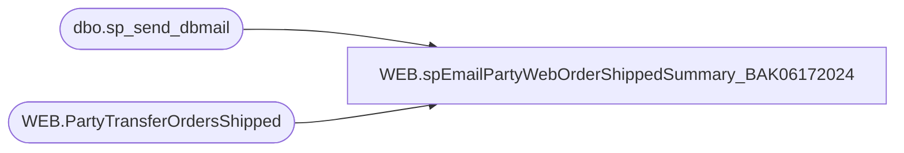

# WEB.spEmailPartyWebOrderShippedSummary_BAK06172024

**Database:** IntegrationStaging  

## Architecture Diagram



## Table Dependencies

| Referenced Table |
|---|
| dbo.sp_send_dbmail |
| WEB.PartyTransferOrdersShipped |

## Stored Procedure Code

```sql
CREATE proc [WEB].[spEmailPartyWebOrderShippedSummary_BAK06172024]

as 

------------------------------------------------------------------
--	Dan Tweedie	2018-01-08	Created proc, runs from SSIS 
------------------------------------------------------------------
set nocount on 

if (
		select count(*) 
		from WEB.PartyTransferOrdersShipped
		where datediff(dd, ShipDate, getdate()-1) = 0
	) > 0
begin

	declare @subj varchar(52),
			@text nvarchar(max),
			@recip varchar(1000),
			@cc varchar(100)


	select 
		@Subj = 'Party Web Orders Shipped',
		@recip = 'DistroBears@buildabear.com',
		@text = 
		'<font face =arial size = 2><B>Party Web Orders Shipped Summary</B><br>' +
	'The items below were shipped from the Web for scheduled Parties.<br>' +
	'</font>' +
		'<table cellpadding=10 border=1>' +
			'<tr bgcolor=#4b6c9e>
				<th><font face =arial size = 2 color=White>PartyID</font></th>' +
				'<th><font face =arial size = 2 color=White>PartyDate</font></th>' +
				'<th><font face =arial size = 2 color=White>Store</font></th>' +
				'<th><font face =arial size = 2 color=White>Style</font></th>' +
				'<th><font face =arial size = 2 color=White>Description</font></th>' +
				'<th><font face =arial size = 2 color=White>Qty</font></th>' +
				'<th><font face =arial size = 2 color=White>ShipDate</font></th>' +
				'<th><font face =arial size = 2 color=White>ShipMethod</font></th>' +
				'<th><font face =arial size = 2 color=White>Tracking</font></th>' +
				'<th><font face =arial size = 2 color=White>WebOrder</font></th>' +
				'<th><font face =arial size = 2 color=White>TransferNumber</font></th>' + 
				'<th><font face =arial size = 2 color=White>TransferUnitsSent</font></th>' +
				'<th><font face =arial size = 2 color=White>TransferUnitsReceived</font></th></tr>' +
	'<font face =arial size = 2>' +
		CAST ( ( SELECT td = PartyID,'',
						td = PartyDate, '',
						td = StoreNumber, '',
						td = Style, '',
						td = SKUDescription, '',
						td = QtyShipped, '',
						td = ShipDate, '',
						td = ShipMethod, '',
						td = isnull(TrackingNumber,'n/a'), '',
						td = WebOrderNumber, '',
						td = isnull(document_no, 'unknown'), '',
						td = isnull(TransferUnitsSent,0), '',
						td = isnull(TransferUnitsReceived,0), ''
				  from WEB.PartyTransferOrdersShipped
				  where datediff(dd, ShipDate, getdate()-1) = 0
				  order by PartyDate, StoreNumber, Style, ShipMethod, TrackingNumber
				  FOR XML PATH('tr'), TYPE 
		) AS NVARCHAR(MAX) ) +
		'</font></table></font></p></p>
		<br><br>' +
		'<br>
		<font face =arial size = 1><B>This report was run from stl-ssis-p-01.IntegrationStaging.WEB.spEmailPartyWebOrderShippedSummary.</B></font>
		<br>
		<br>
	<font face =arial size = 1><i>The information in this message may be privileged, “confidential” and protected from disclosure and/or intended only for the addressee(s) named above.  If the reader of this message is not the intended recipient, or an employee or agent responsible for delivering this message to the intended recipient, you are hereby notified that any dissemination, distribution or copying of the communication is strictly prohibited.  If you have received this communication in error, please notify us immediately by replying to the message and deleting it from your computer.  Thank you beary much.</i></font>'

	exec msdb.dbo.sp_send_dbmail
			@profile_name = 'BIAdmin',
			@recipients = @recip,
			@body = @text,
			@subject = @subj,
			@body_format = 'HTML'

end


WEB,spEnterpriseSellingStoreInventoryGutCheck,CREATE proc [WEB].[spEnterpriseSellingStoreInventoryGutCheck]

as 

set nocount on

if (object_id('tempdb..#hasInv')) is not null drop table #hasInv
select distinct WarehouseCode 
into #hasInv
from web.vwStoreInventoryCSV 
where TotalQuantity>0 
and TotalQuantity<99000

if (object_id('tempdb..#hasNoInv')) is not null drop table #hasNoInv
select distinct hni.WarehouseCode 
into #hasNoInv
from web.vwStoreInventoryCSV hni 
where not exists (select hi.WarehouseCode from #hasInv hi where hi.WarehouseCode=hni.WarehouseCode)
	
if (object_id('tempdb..#Grouped')) is not null drop table #Grouped
select cast(count(*) as numeric(10,2)) as hasInventory, cast(0 as numeric(10,2)) as hasNoInventory 
into #Grouped
from #hasInv 
UNION 
select cast(0 as numeric(10,2)) as hasInventory, cast(count(*) as numeric(10,2)) as hasNoInventory 
from #hasNoInv

if (object_id('tempdb..#Summary')) is not null drop table #Summary
select 
	cast(sum(hasInventory) as int) as hasInventory, 
	cast(sum(hasNoInventory) as int) as hasNoInventory,
	cast(((sum(hasInventory) / ( sum(hasInventory) + sum(hasNoInventory) )) * 100) as int)  as hasInventoryPct,
	cast(((sum(hasNoInventory) / ( sum(hasInventory) + sum(hasNoInventory) )) * 100) as int)  as hasNoInventoryPct
into #Summary
from #Grouped


if (select count(*) from #Summary where hasInventoryPct<90) >0 --if the hasInventory value is less than 90 that means less than 90% of stores have inventroy, the rest have not inventory for all items and that is likely a problem requiring a reload of the inventory from Aptos Merch to Enterprise Selling

begin
		declare
			@Statement varchar(4000),
			@ProcessName varchar(100),
			@hasNoInv varchar(10)

		select @ProcessName='WEB_EnterpriseSellingStoreInventoryToOMS'
		select @hasNoInv = concat(cast(hasNoInventoryPct as varchar), '%') from #Summary
	
		select 
			@Statement = '
		<font face=arial size=2> '  +
			'The <b>' + @ProcessName + '</b> process has completed and found that ' + @hasNoInv + ' of locations have 0 inventory for all items. 
			<br> The process will not send a Store Inventory file to Deck until this has been resolved.'
    
   
		exec msdb.dbo.sp_send_dbmail
			@profile_name = 'BIAdmin',
			@recipients = 'entsyssupport@buildabear.com',
			@body = @Statement,
			@subject = 'Store Inventory to Deck is halted due to stores with 0 inventory',
			@body_format = 'HTML'

end


declare @out varchar(1)

select @out=
	case when (select count(*) from #Summary where hasInventoryPct<90) > 0 --this means less than 90% of stores have inventory, the rest have all 0
		then '0' --fail
		else '1' --pass
	end

select @out output 

	
WEB,spExportFileGirlScoutWebToStorePipelineTransferData,CREATE proc [WEB].[spExportFileGirlScoutWebToStorePipelineTransferData]
@PipelineServerName varchar(52)

as 

------------------------------------------------------------------------------------------------------------------------------------------
-- Dan Tweedie	2018-11-01	Created proc to generate Aptos Transfer file for cartons shipped from Web To Stores for Girl Scout Parties
--									Data is pre-staged before this proc is run
------------------------------------------------------------------------------------------------------------------------------------------

set nocount on

IF (Object_ID('tempdb..#Shipped') IS NOT NULL) DROP TABLE #Shipped 
select distinct CartonNumber, right(('0000' + cast(isnull(ShipTo,'0000') as varchar)), 4) ShipTo 
into #Shipped 
from WEB.WMShippedCartons 
where Transmitted is NULL

if (select count(*) from #Shipped) > 0

Begin

	declare @query1 varchar(1000),
			@file_location1 varchar(1000),
			@file_name1 varchar(1000),
			@sqlcmd1 varchar(1000),
			@timestamp1 varchar(12)


	set @timestamp1 = replace(replace(replace(replace(convert(varchar, getdate(), 121), ':', ''), '-', ''), ' ', ''), '.', '')
	set @query1 = 'set nocount on exec IntegrationStaging.WEB.spOutputGirlScoutWebToStorePipelineTransferData'
	set @file_location1 = '\\' + @PipelineServerName + '\Company01\Text File to IM Import Tables - Import Outbound Xfers\'
	set @file_name1 = 'STSIMOUTBOUNDTRANSFER.GS.' + @timestamp1 + '.GO'
	set @sqlcmd1 = 'sqlcmd -Q' + '"' + @query1 + '"' + ' -o' + '"' + @file_location1 + @file_name1 + '"'
	exec master..xp_cmdshell @sqlcmd1

	update WEB.WMShippedCartons 
	set 
		Transmitted = 1,
		TransmitDate = getdate()
	where CartonNumber in (select CartonNumber from #Shipped)


	IF (Object_ID('IntegrationStaging..tmpCBR') IS NOT NULL) DROP TABLE tmpCBR
	select DISTINCT 
		'BC' as type,
		'A' as action,
		CartonNumber as carton_number,
		ShipTo as location_code,
		'099060166' as employee_code -- Admin
	into tmpCBR
	from #Shipped 

	if (select count(*) from tmpCBR) > 0 
		begin
		
			declare @query2 varchar(1000),
					@file_location2 varchar(1000),
					@file_name2 varchar(1000),
					@sqlcmd2 varchar(1000),
					@timestamp2 varchar(12)


			set @timestamp2 = replace(replace(replace(replace(convert(varchar, getdate(), 121), ':', ''), '-', ''), ' ', ''), '.', '')
			set @query2 = 'set nocount on select * from IntegrationStaging.dbo.tmpCBR'
			set @file_location2 = '\\' + @PipelineServerName + '\Company01\Text File to IM Import Tables  - Batch Carton\'
			set @file_name2 = 'STSIMCTN.GS.' + @timestamp2 + '.GO'
			set @sqlcmd2 = 'sqlcmd -Q' + '"' + @query2 + '"' + ' -o' + '"' + @file_location2 + @file_name2 + '"' + ' -s"	" -w100 -W -h-1'
			exec master..xp_cmdshell @sqlcmd2

		end

End
```

