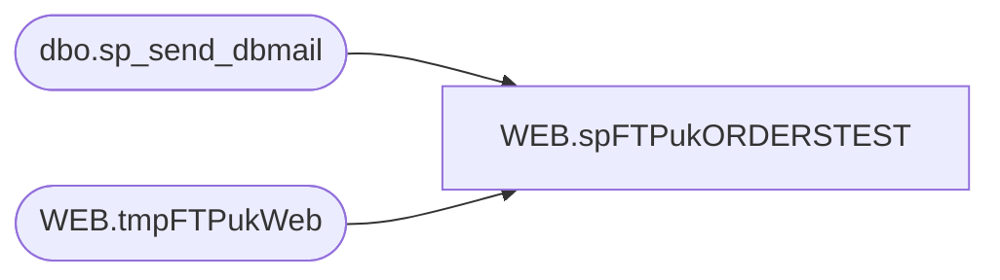

# WEB.spFTPukORDERSTEST

**Database:** IntegrationStaging  

## Architecture Diagram



## Table Dependencies

| Referenced Table |
|---|
| dbo.sp_send_dbmail |
| WEB.tmpFTPukWeb |

## Stored Procedure Code

```sql
CREATE proc [WEB].[spFTPukORDERSTEST]

as

-- =====================================================================================================
-- Name: spFTPukORDERSTEST
--
-- Description:	Uploads web orders to UK 
--
-- Revision History
--		Name:			Date:			Comments:
--		Dan Tweedie		2017-09-25		Created proc
-- =====================================================================================================
	
set nocount on

--DELETE PREVIOUS LOG FILES
IF (Object_ID('tempdb..#DEL') IS NOT NULL) DROP TABLE #DEL
create table #DEL(output varchar(1000))
insert #DEL exec master..xp_cmdshell 'dir \\kermode\Filerepository\omsTESTorders\babw-UK\log\Upload.log /B'
insert #DEL exec master..xp_cmdshell 'dir \\kermode\Filerepository\omsTESTorders\babw-UK\log\FTPLog_UKWeb.txt /B'

delete from #DEL where output is null or output = 'File Not Found'

IF (select count(*) from #DEL where output = 'Upload.log') > 0
	begin
		exec master..xp_cmdshell 'del \\kermode\Filerepository\omsTESTorders\babw-UK\log\Upload.log'
	end
IF (select count(*) from #DEL where output = 'FTPLog_UKWeb.txt') > 0
	begin
		exec master..xp_cmdshell 'del \\kermode\Filerepository\omsTESTorders\babw-UK\log\FTPLog_UKWeb.txt'
	end

--CHECK FOR FILES TO UPLOAD
-------------do a DIR command and store the results in a temp table
IF (Object_ID('tempdb..#DIR') IS NOT NULL) DROP TABLE #DIR
create table #DIR (output varchar(1000))
insert #DIR exec master..xp_cmdshell 'dir \\kermode\Filerepository\omsTESTorders\babw-UK\Temp\*.xml /B'
delete from #DIR where output is null or output = 'File Not Found'

------------query temp table to see if there are CSV files
if (select count(*) from #DIR) > 0

BEGIN
			-----ftp upload
					declare 
							@winSCP varchar(1000),
							@ini varchar(1000),
							@script varchar(1000),
							@log varchar(1000),
							@FTP varchar(4000),
							@Log_query varchar(1000),
							@Log_filename varchar(100),
							@Log_file_location varchar(100),
							@Log_bcp varchar(1000),
							@body varchar(4000)

					select 
							@winSCP = '"\\stl-ssis-p-01\C$\Program Files (x86)\WinSCP\winscp.com"',
							@ini = ' /ini=\\stl-ssis-p-01\Integrationstaging\WM\Test\WinSCP.ini',
							@script = ' /script=\\stl-ssis-p-01\Integrationstaging\wm\test\winscp.txt',
							@log = ' /log=\\kermode\Filerepository\omsTESTorders\babw-UK\log\Upload.log',
							@FTP = concat(@winSCP, @ini, @script, @log)
							
					--create temp tables for ftp logs
					IF (Object_ID('IntegrationStaging.WEB.tmpFTPukWeb') IS NOT NULL) DROP TABLE WEB.tmpFTPukWeb
					create table WEB.tmpFTPukWeb
					(ftpLog varchar(4000))

					--execute sql/ftp
					----connect to ftp server, if connection unsuccessful, send email
							insert WEB.tmpFTPukWeb exec master..xp_cmdshell @FTP
							if (select count(*) from WEB.tmpFTPukWeb where ftplog like '%.xml%100[%]') < 1
								begin
									set @Log_query = 'select * from IntegrationStaging.WEB.tmpFTPukWeb'
									set @Log_filename = 'FTPLog_UKWeb.txt'
									set @Log_file_location = '\\kermode\Filerepository\omsTESTorders\babw-UK\log\'
									set @Log_bcp = 'bcp "' + @Log_query + '" queryout "' + @Log_file_location + @Log_filename + '" -t, -T -c -Sstl-ssis-p-01'

									exec master..xp_cmdshell @Log_bcp
															
									set @body =	'An attempt to FTP a UK Web Order failed.' 
												+ char(10) + char(13) + 
												'See the attached logs for details.'
												+ char(10) + char(13) + 
												+ char(10) + char(13) + 
												'This process is managed by stl-ssip-p-01.IntegrationStaging.WEB.spFTPukORDERS'
							
									EXEC msdb.dbo.sp_send_dbmail
									@profile_name = 'BIAdmin',
									@recipients = 'webalerts@buildabear.com',
									@subject = 'FTP Failure: UK Web Order Upload',
									@body = @body,
									@file_attachments = '\\kermode\Filerepository\omsTESTorders\babw-UK\log\FTPLog_UKWeb.txt;\\kermode\Filerepository\omsTESTorders\babw-UK\log\Upload.log',
									@importance = 'HIGH'

									EXEC master..xp_cmdshell 'move \\kermode\Filerepository\omsTESTorders\babw-UK\Temp\* \\kermode\Filerepository\omsTESTorders\babw-UK\FAILED\'
									
								end
							else
								begin
									--EXEC master..xp_cmdshell 'move \\kermode\Filerepository\omsTESTorders\babw-UK\Temp\* \\kermode\Filerepository\omsTESTorders\babw-UK\Success\'
									EXEC master..xp_cmdshell 'del \\kermode\Filerepository\omsTESTorders\babw-UK\Temp\*.xml'
								end

END
```

