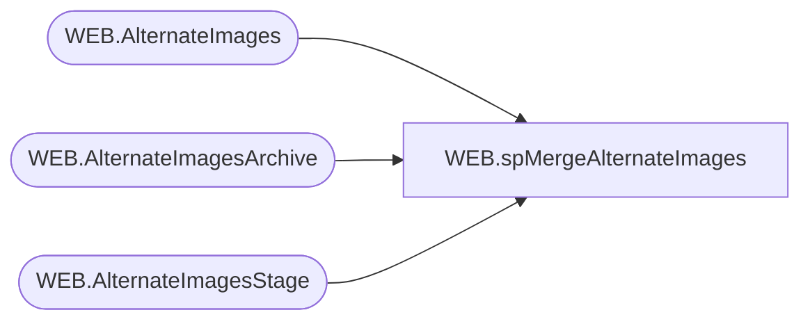

# WEB.spMergeAlternateImages

**Database:** IntegrationStaging  

## Architecture Diagram



## Table Dependencies

| Referenced Table |
|---|
| WEB.AlternateImages |
| WEB.AlternateImagesArchive |
| WEB.AlternateImagesStage |

## Stored Procedure Code

```sql
CREATE proc [WEB].[spMergeAlternateImages] 
@LoadType varchar(5)

as

-------------------------------------------------------------------------
-- spMergeCategoryXREF - Merges from WEB.AlternateImagesStage to WEB.AlternateImages
--						
-- 2017-08-14 - Dan Tweedie - Created Proc
-------------------------------------------------------------------------

set nocount on

DELETE from WEB.AlternateImagesArchive
where datediff(dd, ArchiveDate, getdate()) > 30

Update WEB.AlternateImagesArchive
set CurrentBatch = 0

Update WEB.AlternateImages 
set SendData = 0 

Merge into WEB.AlternateImages as target
Using WEB.AlternateImagesStage as source
On (
			isnull(target.ImageName,'xxx') = isnull(source.ImageName,'xxx')
			and
			isnull(target.BABWProductID, 'xxx') = isnull(source.BABWProductID, 'xxx')
	)
When Not Matched By Target 
	Then 
		Insert (
					ImageName,
					BABWProductID,
					InsertDate,
					SendData
				)
		Values (	
					source.ImageName, 
					source.BABWProductID,
					getdate(),
					1
				)
When Not Matched By Source
	Then
		Delete
		
OUTPUT 
	deleted.ImageName,
	deleted.BABWProductID,
	getdate(),
	$action,
	1
into WEB.AlternateImagesArchive

;

if @LoadType = 'FULL'
update WEB.AlternateImages
set SendData = 1
```

