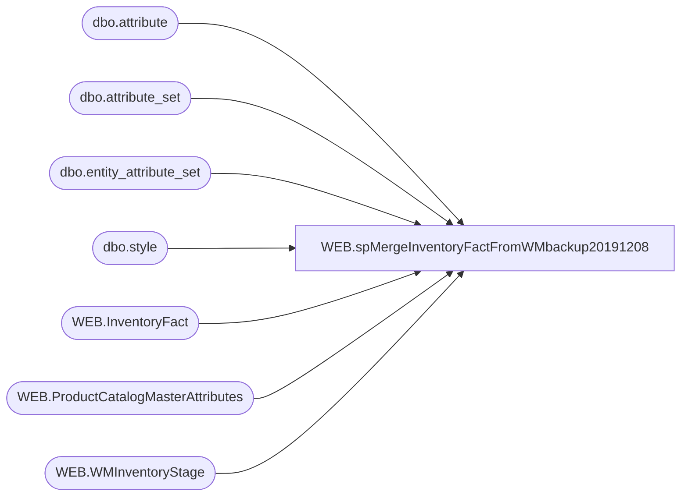

# WEB.spMergeInventoryFactFromWMbackup20191208

**Database:** IntegrationStaging  

## Architecture Diagram



## Table Dependencies

| Referenced Table |
|---|
| dbo.attribute |
| dbo.attribute_set |
| dbo.entity_attribute_set |
| dbo.style |
| WEB.InventoryFact |
| WEB.ProductCatalogMasterAttributes |
| WEB.WMInventoryStage |

## Stored Procedure Code

```sql
CREATE proc [WEB].[spMergeInventoryFactFromWMbackup20191208]

as 

set nocount on

Merge into WEB.InventoryFact as target
Using 
	(
		select 
			'0013' as LocationCode,
			wm.StyleCode,
			wm.QTY as UnbufferedQTY,
			case 
				when (wm.QTY - isnull(a.InventoryBuffer,0)) < 0 
					then 0 
				else (wm.QTY - isnull(a.InventoryBuffer,0)) 
			end Qty,
			a.UPC
		from WEB.WMInventoryStage wm 
		join WEB.ProductCatalogMasterAttributes a on wm.StyleCode = a.BABWProductID and a.StorefrontEligible = 1
		where wm.StyleCode not in 
			(
				select StyleCode 
				from web.InventoryFact 
				where LocationCode = '0013' 
				and UnbufferedQty = 99999
				--and StyleCode in 
			)
		and wm.StyleCode not in 
					(
						select s.style_code as StyleCode--, ats.attribute_set_code, ats.attribute_set_label
						from  bedrockdb02.me_01.dbo.attribute a
						join bedrockdb02.me_01.dbo.entity_attribute_set eas on a.attribute_id = eas.attribute_id 
						join bedrockdb02.me_01.dbo.attribute_set ats 
							on a.attribute_id = ats.attribute_id 
							and eas.attribute_set_id = ats.attribute_set_id 
							and ats.active_flag = 1
						join bedrockdb02.me_01.dbo.style s on eas.parent_id = s.style_id 
						where a.attribute_code = 'WEBINV' and ats.attribute_set_label = 'INFINITE INVENTORY'
					)
	) as source
On (
		target.LocationCode = source.LocationCode
		and target.StyleCode = source.StyleCode 
		--and target.UnbufferedQTY <> 99999
	)
When Matched 
	Then 
		Update 
			Set target.QTY = source.QTY,
				target.UnbufferedQTY = source.UnbufferedQTY,
				target.UpdateDate = getdate(),
				target.CheckDate = getdate(),
				target.SendData = 1
when not matched by target 
	then insert
		(
			LocationCode,
			StyleCode,
			Qty,
			GTIN,
			SellingGeography,
			UnbufferedQty,
			InsertDate,
			CheckDAte,
			SendData
		)
	values
		(
			source.LocationCode,
			source.StyleCode,
			source.Qty,
			source.UPC,
			'US',
			source.UnbufferedQty,
			getdate(),
			getdate(),
			1
		)
;

--update to 0 where item not contained in WM query, and is also not a hard-code infinite inventory item

update web.InventoryFact
set 
	Qty = 0, 
	UnbufferedQty = 0, 
	UpdateDate = getdate(), 
	CheckDate=getdate(),
	SendData = 1
where LocationCode = '0013'
and UnbufferedQty <> 99999 --hard coded infinite inventory items
and Qty <> 0
and UnbufferedQty <> 0
and StyleCode not in 
	(
		select  wm.StyleCode 
		from WEB.WMInventoryStage wm 
		join WEB.ProductCatalogMasterAttributes a on wm.StyleCode = a.BABWProductID and a.StorefrontEligible = 1
		where wm.StyleCode not in-- (select StyleCode from web.InventoryFact where LocationCode = '0013' and UnbufferedQty = 99999)
			(
				select StyleCode 
				from web.InventoryFact 
				where LocationCode = '0013' 
				and UnbufferedQty = 99999
				and StyleCode in 
					(
						select s.style_code as StyleCode--, ats.attribute_set_code, ats.attribute_set_label
						from  bedrockdb02.me_01.dbo.attribute a
						join bedrockdb02.me_01.dbo.entity_attribute_set eas on a.attribute_id = eas.attribute_id 
						join bedrockdb02.me_01.dbo.attribute_set ats 
							on a.attribute_id = ats.attribute_id 
							and eas.attribute_set_id = ats.attribute_set_id 
							and ats.active_flag = 1
						join bedrockdb02.me_01.dbo.style s on eas.parent_id = s.style_id 
						where a.attribute_code = 'WEBINV' and ats.attribute_set_label = 'INFINITE INVENTORY'
					)
			)
	)


WEB,spMergeInventoryFactStoreInventory,CREATE proc [WEB].[spMergeInventoryFactStoreInventory]


as

-------------------------------------------------------------------------
-- Dan Tweedie	2020-04-09	Created proc to merge store inventory from ES for Buy Online / Ship from Store
---							Data is staged from Enterprise Selling and should contain a row for all stores (actually store list contained in the proc), all styles --- 
--							So if there is no inventory in ES, it should result in a row with 0 qty being passed through
-------------------------------------------------------------------------

set nocount on

update WEB.InventoryFact
	set SendData = 0 

if (select count(*) from WEB.StoreInventoryStage) > 0 

begin

		Merge into WEB.InventoryFact as target
		Using 
			(
				select DISTINCT
					LocationCode,
					GTIN,
					StyleCode,
					SKUDescription,
					QTY,
					SellingGeography,
					UnbufferedQTY,
					getdate() as INS_DT,
					getdate() as CheckDate
				from WEB.StoreInventoryStage
			) as source
		On (
				target.LocationCode = source.LocationCode
				and target.StyleCode = source.StyleCode
			)
		When Matched 
			AND 
				(
					 isnull(target.QTY,0) <> isnull(source.QTY,0)
					 or
					 isnull(target.UnbufferedQTY,0) <> isnull(source.UnbufferedQTY,0)
				 )
			Then 
				Update 
					Set target.QTY = source.QTY,
						target.UnbufferedQTY = source.UnbufferedQTY,
						target.PreviousQty = target.Qty,
						target.UpdateDate = getdate(),
						target.CheckDate = source.CheckDate,
						target.SendData = 1
		When Not Matched By Target 
			Then 
				Insert (LocationCode, GTIN, StyleCode, SKUDescription, QTY, SellingGeography, UnbufferedQTY, InsertDate, CheckDate, SendData)
				Values (source.LocationCode, source.GTIN, source.StyleCode, source.SKUDescription, source.QTY, source.SellingGeography, source.UnbufferedQTY, source.INS_DT, source.CheckDate, 1)
		;

		update WEB.InventoryFact
		set 
			CheckDate = getdate(),
			SendData = 1
		where LocationCode in (select LocationCode from web.StoreInventoryStage group by LocationCode)


end
```

