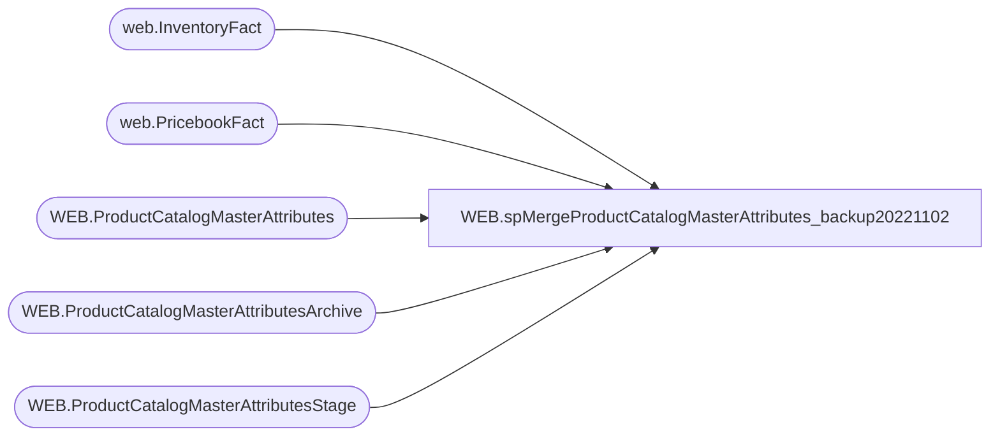

# WEB.spMergeProductCatalogMasterAttributes_backup20221102

**Database:** IntegrationStaging  

## Architecture Diagram



## Table Dependencies

| Referenced Table |
|---|
| web.InventoryFact |
| web.PricebookFact |
| WEB.ProductCatalogMasterAttributes |
| WEB.ProductCatalogMasterAttributesArchive |
| WEB.ProductCatalogMasterAttributesStage |

## Stored Procedure Code

```sql
CREATE proc [WEB].[spMergeProductCatalogMasterAttributes_backup20221102]
@LoadType varchar(5)

as 

-------------------------------------------------------------------------
-- spMergeProductCatalogMasterAttributes - Merges from WEB.ProductCatalogMasterAttributesStage to WEB.ProductCatalogMasterAttributes
--
-- 2017-06-30 - Dan Tweedie - Created Proc
-- 2022-09-06	Dan Tweedie	- Added Columns	
-------------------------------------------------------------------------

set nocount on

delete from WEB.ProductCatalogMasterAttributesArchive
where datediff(dd, ArchiveDate, getdate()) > 30

update WEB.ProductCatalogMasterAttributesArchive
set CurrentBatch = 0

update WEB.ProductCatalogMasterAttributes
	set SendData = 0 

Merge into WEB.ProductCatalogMasterAttributes as target
Using 
	(
		--select *
		--from WEB.ProductCatalogMasterAttributesStage
		
		select 
			a.Style_Code,	
			a.DisplayName,	
			a.ShortDescription,	
			a.UPC,	
			a.DefaultDisplayName,	
			a.AccessoryType,	
			a.AnimalSoldSeparately,	
			a.AsthmaFriendly,	
			a.ColorCode,	
			a.LicensedCollection,	
			a.BABWProductID,	
			a.BirthCertificateRequired,	
			a.BodyType,	
			a.Bottoms,	
			a.Boy,	
			a.ClassName,	
			a.CommodityCode,	
			a.Department,	
			a.DepartmentSortOrder,	
			a.DisplayOnAmazon,	
			a.EyeColor,	
			a.WebExclusive,	
			a.Girl,	
			a.Neutral,	
			a.Outfits,	
			a.GiftBoxType,	
			a.HierarchyGroupCode,	
			a.KeyStory,	
			a.ManufacturerCountry,	
			a.MerchInDate,	
			a.Mini,	
			a.Music,	
			a.NoInternationalShipping,	
			a.SAC,	
			a.SNC,	
			a.ProductSellingGeography,	
			a.QuantityRestriction,	
			a.RefundEligible,	
			a.Seasonal,	
			a.ThirdPartySiteEligible,	
			a.ShippingClass,	
			a.Stuffable,	
			a.Tops,	
			a.WarningLabel,	
			a.AccessoryEligible,	
			a.SkinType,	
			a.FriendHeight,	
			a.FriendWeight,	
			a.SoundEligible,	
			a.MSTAT,	
			a.EmbroideryProductList,	
			a.ProductCanBeEmbroidered,	
			a.ProductMustBeEmbroidered,	
			a.Purses,	
			a.EnableEmailAFriend,	
			a.CopyStatus,	
			a.GoogleTag1,	
			a.GoogleTag2,	
			a.GoogleTag3,	
			a.GoogleTag4,	
			a.GoogleTag5,	
			a.NewProduct,	
			a.PrimaryCategoryDerived,	
			a.ChildSKUs,	
			a.DisplayableSkuAttributes,	
			a.PreOrderable,	
			a.PreorderEndDate,	
			a.DefaultKeywords,	
			a.CategoryTree,	
			a.LICEN,	
			a.sportsTeam,	
			a.occasion,	
			a.OccasionCode,	
			a.StoreFrontEligible,	
			a.OnOrderFlag,	
			a.InventoryBuffer,	
			a.Inventory,	
			a.OnlineFlag,	
			a.SearchableFlag,	
			a.SearchableIfUnavailableFlag,	
			a.IsFirstTransmit,	
			a.giftCardType,	
			a.PackageOption,	
			a.dropShipCustLines,	
			a.Web,	
			a.InventoryBuffer as WebBuf,
			a.BRF,	
			a.Inline,	
			a.AvailB,
			case
				when exists (select i.StyleCode from web.InventoryFact i with (nolock) where i.StyleCode=a.style_code and i.LocationCode in ('0013','2013') and i.Qty>0)
					then 'True'
				else 'False'
			end as WebInStock,
			case
				when exists (select i.StyleCode from web.InventoryFact i with (nolock) where i.StyleCode=a.style_code and i.LocationCode not in ('0013','2013') and i.Qty>0)
					then 'True'
				else 'False'
			end as StoreInStock,
			pbf.OriginalPrice as OriginalRetail,
			isnull(pbf.SalePrice,pbf.OriginalPrice) as CurrentRetail,
			case when OnOrderFlag=0 then 'False' else 'True' end as OnOrder,
			a.SubClassLabel
		from WEB.ProductCatalogMasterAttributesStage a 
		left join web.PricebookFact pbf with (nolock) on a.style_code=pbf.style_code
		where (a.UPC is not NULL
				OR
					(a.UPC is NULL and a.StoreFrontEligible = 0)
				)
	) as source
On (target.Style_Code = source.Style_Code)
When Matched 
	AND 
		(
				isnull(target.DisplayName,'xxx') <> isnull(source.DisplayName,'xxx')
			OR  isnull(target.ShortDescription, 'xxx') <> isnull(source.ShortDescription, 'xxx')
			OR	isnull(target.UPC,'xxx') <> isnull(source.UPC,'xxx')
			OR	isnull(target.DefaultDisplayName,'xxx') <> isnull(source.DefaultDisplayName,'xxx')
			OR	isnull(target.AccessoryType,'xxx') <> isnull(source.AccessoryType,'xxx')
			OR	isnull(target.AnimalSoldSeparately,'xxx') <> isnull(source.AnimalSoldSeparately,'xxx')
			OR	isnull(target.AsthmaFriendly,'xxx') <> isnull(source.AsthmaFriendly,'xxx')
			OR	isnull(target.ColorCode,'xxx') <> isnull(source.ColorCode,'xxx')
			OR	isnull(target.LicensedCollection,'xxx') <> isnull(source.LicensedCollection,'xxx')
			OR	isnull(target.BABWProductID,'xxx') <> isnull(source.BABWProductID,'xxx')
			OR	isnull(target.BirthCertificateRequired,'xxx') <> isnull(source.BirthCertificateRequired,'xxx')
			OR	isnull(target.BodyType,'xxx') <> isnull(source.BodyType,'xxx')
			OR	isnull(target.Bottoms,'xxx') <> isnull(source.Bottoms,'xxx')
			OR	isnull(target.Boy,'xxx') <> isnull(source.Boy,'xxx')
			OR	isnull(target.ClassName,'xxx') <> isnull(source.ClassName,'xxx')
			OR	isnull(target.CommodityCode,'xxx') <> isnull(source.CommodityCode,'xxx')
			OR	isnull(target.Department,'xxx') <> isnull(source.Department,'xxx')
			OR  isnull(target.DepartmentSortOrder, 999) <> isnull(source.DepartmentSortOrder,999)
			OR	isnull(target.DisplayOnAmazon,'xxx') <> isnull(source.DisplayOnAmazon,'xxx')
			OR	isnull(target.EyeColor,'xxx') <> isnull(source.EyeColor,'xxx')
			OR	isnull(target.WebExclusive,'xxx') <> isnull(source.WebExclusive,'xxx')
			OR	isnull(target.Girl,'xxx') <> isnull(source.Girl,'xxx')
			OR	isnull(target.Neutral,'xxx') <> isnull(source.Neutral,'xxx')
			OR	isnull(target.Outfits,'xxx') <> isnull(source.Outfits,'xxx')
			OR	isnull(target.GiftBoxType,'xxx') <> isnull(source.GiftBoxType,'xxx')
			OR	isnull(target.HierarchyGroupCode,'xxx') <> isnull(source.HierarchyGroupCode,'xxx')
			OR	isnull(target.KeyStory,'xxx') <> isnull(source.KeyStory,'xxx')
			OR	isnull(target.ManufacturerCountry,'xxx') <> isnull(source.ManufacturerCountry,'xxx')
			OR	isnull(target.MerchInDate,'1900-01-01') <> isnull(source.MerchInDate,'1900-01-01')
			OR	isnull(target.Mini,'xxx') <> isnull(source.Mini,'xxx')
			OR	isnull(target.Music,'xxx') <> isnull(source.Music,'xxx')
			OR	isnull(target.NoInternationalShipping,'xxx') <> isnull(source.NoInternationalShipping,'xxx')
			OR	isnull(target.SAC,'xxx') <> isnull(source.SAC,'xxx')
			OR	isnull(target.SNC,'xxx') <> isnull(source.SNC,'xxx')
			OR	isnull(target.ProductSellingGeography,'xxx') <> isnull(source.ProductSellingGeography,'xxx')
			OR	isnull(target.QuantityRestriction,'999999') <> isnull(source.QuantityRestriction,'999999')
			OR	isnull(target.RefundEligible,'xxx') <> isnull(source.RefundEligible,'xxx')
			OR	isnull(target.Seasonal,'xxx') <> isnull(source.Seasonal,'xxx')
			OR	isnull(target.ThirdPartySiteEligible,'xxx') <> isnull(source.ThirdPartySiteEligible,'xxx')
			OR	isnull(target.ShippingClass,'xxx') <> isnull(source.ShippingClass,'xxx')
			OR	isnull(target.Stuffable,'xxx') <> isnull(source.Stuffable,'xxx')
			OR	isnull(target.Tops,'xxx') <> isnull(source.Tops,'xxx')
			OR	isnull(target.WarningLabel,'xxx') <> isnull(source.WarningLabel,'xxx')
			OR	isnull(target.AccessoryEligible,'xxx') <> isnull(source.AccessoryEligible,'xxx')
			OR	isnull(target.SkinType,'xxx') <> isnull(source.SkinType,'xxx')
			OR	isnull(target.FriendHeight,'xxx') <> isnull(source.FriendHeight,'xxx')
			OR	isnull(target.FriendWeight,'xxx') <> isnull(source.FriendWeight,'xxx')
			OR	isnull(target.SoundEligible,'xxx') <> isnull(source.SoundEligible,'xxx')
			OR	isnull(target.MSTAT,'xxx') <> isnull(source.MSTAT,'xxx')
			OR	isnull(target.EmbroideryProductList,'xxx') <> isnull(source.EmbroideryProductList,'xxx')
			OR	isnull(target.ProductCanBeEmbroidered,'xxx') <> isnull(source.ProductCanBeEmbroidered,'xxx')
			OR	isnull(target.ProductMustBeEmbroidered,'xxx') <> isnull(source.ProductMustBeEmbroidered,'xxx')
			OR	isnull(target.Purses,'xxx') <> isnull(source.Purses,'xxx')
			OR	isnull(target.EnableEmailAFriend,'xxx') <> isnull(source.EnableEmailAFriend,'xxx')
			OR	isnull(target.CopyStatus,'xxx') <> isnull(source.CopyStatus,'xxx')
			OR	isnull(target.GoogleTag1,'xxx') <> isnull(source.GoogleTag1,'xxx')
			OR	isnull(target.GoogleTag2,'xxx') <> isnull(source.GoogleTag2,'xxx')
			OR	isnull(target.GoogleTag3,'xxx') <> isnull(source.GoogleTag3,'xxx')
			OR	isnull(target.GoogleTag4,'xxx') <> isnull(source.GoogleTag4,'xxx')
			OR	isnull(target.GoogleTag5,'xxx') <> isnull(source.GoogleTag5,'xxx')
			OR	isnull(target.NewProduct,'xxx') <> isnull(source.NewProduct,'xxx')
			OR	isnull(target.PrimaryCategoryDerived,'xxx') <> isnull(source.PrimaryCategoryDerived,'xxx')
			OR	isnull(target.ChildSKUs,'xxx') <> isnull(source.ChildSKUs,'xxx')
			OR	isnull(target.DisplayableSkuAttributes,'xxx') <> isnull(source.DisplayableSkuAttributes,'xxx')
			OR	isnull(target.PreOrderable,'xxx') <> isnull(source.PreOrderable,'xxx')
			OR	isnull(target.PreorderEndDate,'1900-01-01') <> isnull(source.PreorderEndDate,'1900-01-01')
			OR	isnull(target.DefaultKeywords,'xxx') <> isnull(source.DefaultKeywords,'xxx')
			OR	isnull(target.CategoryTree,'xxx') <> isnull(source.CategoryTree,'xxx')
			OR	isnull(target.LICEN,'xxx') <> isnull(source.LICEN,'xxx')
			OR  isnull(target.sportsTeam,'xxx') <> isnull(source.sportsTeam,'xxx')
			--OR  isnull(target.occasion, 'xxx') <> isnull(source.occasion, 'xxx')
			OR  isnull(target.OccasionCode, 'xxx') <> isnull(source.OccasionCode,'xxx')
			OR  isnull(target.StoreFrontEligible, 99) <> isnull(source.StoreFrontEligible, 99)
			OR  isnull(target.OnOrderFlag,99) <> isnull(source.OnOrderFlag,99)
			OR  isnull(target.InventoryBuffer,99) <> isnull(source.InventoryBuffer,99)
			OR  isnull(target.Inventory,123456789) <> isnull(source.Inventory,123456789)
			OR  isnull(target.OnlineFlag,99) <> isnull(source.OnlineFlag,99)
			OR  isnull(target.SearchableFlag,99) <> isnull(source.SearchableFlag,99)
			OR  isnull(target.SearchableIfUnavailableFlag,99) <> isnull(source.SearchableIfUnavailableFlag,99)
			OR  isnull(target.IsFirstTransmit,99) <> isnull(source.IsFirstTransmit,99)
			OR  isnull(target.giftCardType, 'X') <> isnull(source.giftCardType,'X')
			OR  isnull(target.PackageOption,'x') <> isnull(source.PackageOption,'x')
			OR  isnull(target.dropShipCustLines,0) <> isnull(source.dropShipCustLines,0)
			OR	isnull(target.Web,'x')<>isnull(source.Web,'x')
			OR	isnull(target.WebBuf,0)<>isnull(source.WebBuf,0)
			or	isnull(target.BRF,'x')<>isnull(source.BRF,'x')
			or	isnull(target.InLine,'x')<>isnull(source.Inline,'x')
			or	isnull(target.AvailB,'x')<>isnull(source.AvailB,'x')
			or	isnull(target.WebInStock,'x')<>isnull(source.WebInStock,'x')
			or	isnull(target.StoreInStock,'x')<>isnull(source.StoreInStock,'x')
			or	isnull(target.OriginalRetail,0)<>isnull(source.OriginalRetail,0)
			or	isnull(target.CurrentRetail,0)<>isnull(source.CurrentRetail,0)
			or	isnull(target.OnOrder,'x')<>isnull(source.OnOrder,'x')
			or isnull(target.SubClassLabel,'x')<>isnull(source.SubClassLabel,'x')
		)
	Then 
		Update 
			Set 
				target.DisplayName	=	source.DisplayName,
				target.ShortDescription =	source.ShortDescription,
				target.UPC	=	source.UPC,
				target.DefaultDisplayName	=	source.DefaultDisplayName,
				target.AccessoryType	=	source.AccessoryType,
				target.AnimalSoldSeparately	=	source.AnimalSoldSeparately,
				target.AsthmaFriendly	=	source.AsthmaFriendly,
				target.ColorCode	=	source.ColorCode,
				target.LicensedCollection	=	source.LicensedCollection,
				target.BABWProductID	=	source.BABWProductID,
				target.BirthCertificateRequired	=	source.BirthCertificateRequired,
				target.BodyType	=	source.BodyType,
				target.Bottoms	=	source.Bottoms,
				target.Boy	=	source.Boy,
				target.ClassName	=	source.ClassName,
				target.CommodityCode	=	source.CommodityCode,
				target.Department	=	source.Department,
				target.DepartmentSortOrder = source.DepartmentSortOrder,
				target.DisplayOnAmazon	=	source.DisplayOnAmazon,
				target.EyeColor	=	source.EyeColor,
				target.WebExclusive	=	source.WebExclusive,
				target.Girl	=	source.Girl,
				target.Neutral	=	source.Neutral,
				target.Outfits	=	source.Outfits,
				target.GiftBoxType	=	source.GiftBoxType,
				target.HierarchyGroupCode	=	source.HierarchyGroupCode,
				target.KeyStory	=	source.KeyStory,
				target.ManufacturerCountry	=	source.ManufacturerCountry,
				target.MerchInDate	=	source.MerchInDate,
				target.Mini	=	source.Mini,
				target.Music	=	source.Music,
				target.NoInternationalShipping	=	source.NoInternationalShipping,
				target.SAC	=	source.SAC,
				target.SNC	=	source.SNC,
				target.ProductSellingGeography	=	source.ProductSellingGeography,
				target.QuantityRestriction	=	source.QuantityRestriction,
				target.RefundEligible	=	source.RefundEligible,
				target.Seasonal	=	source.Seasonal,
				target.ThirdPartySiteEligible	=	source.ThirdPartySiteEligible,
				target.ShippingClass	=	source.ShippingClass,
				target.Stuffable	=	source.Stuffable,
				target.Tops	=	source.Tops,
				target.WarningLabel	=	source.WarningLabel,
				target.AccessoryEligible	=	source.AccessoryEligible,
				target.SkinType	=	source.SkinType,
				target.FriendHeight	=	source.FriendHeight,
				target.FriendWeight	=	source.FriendWeight,
				target.SoundEligible	=	source.SoundEligible,
				target.MSTAT	=	source.MSTAT,
				target.EmbroideryProductList	=	source.EmbroideryProductList,
				target.ProductCanBeEmbroidered	=	source.ProductCanBeEmbroidered,
				target.ProductMustBeEmbroidered	=	source.ProductMustBeEmbroidered,
				target.Purses	=	source.Purses,
				target.EnableEmailAFriend	=	source.EnableEmailAFriend,
				target.CopyStatus	=	source.CopyStatus,
				target.GoogleTag1	=	source.GoogleTag1,
				target.GoogleTag2	=	source.GoogleTag2,
				target.GoogleTag3	=	source.GoogleTag3,
				target.GoogleTag4	=	source.GoogleTag4,
				target.GoogleTag5	=	source.GoogleTag5,
				target.NewProduct	=	source.NewProduct,
				target.PrimaryCategoryDerived	=	source.PrimaryCategoryDerived,
				target.ChildSKUs	=	source.ChildSKUs,
				target.DisplayableSkuAttributes	=	source.DisplayableSkuAttributes,
				target.PreOrderable	=	source.PreOrderable,
				target.PreorderEndDate	=	source.PreorderEndDate,
				target.DefaultKeywords	=	source.DefaultKeywords,
				target.CategoryTree	=	source.CategoryTree,
				target.LICEN	=	source.LICEN,
				target.sportsTeam =		source.sportsTeam,
				--target.occasion =	source.occasion,
				target.OccasionCode = source.OccasionCode,
				target.StoreFrontEligible =		source.StoreFrontEligible,
				target.OnOrderFlag =	source.OnOrderFlag,
				target.InventoryBuffer = source.InventoryBuffer,
				target.Inventory = source.Inventory,
				target.OnlineFlag =	source.OnlineFlag,
				target.SearchableFlag =		source.SearchableFlag,
				target.SearchableIfUnavailableFlag =	source.SearchableIfUnavailableFlag,
				target.IsFirstTransmit =	source.IsFirstTransmit,
				target.giftCardType =	source.giftCardType,
				target.PackageOption = source.PackageOption,
				target.dropShipCustLines = source.dropShipCustLines,
				target.Web=source.Web,
				target.WebBuf=source.WebBuf,
				target.BRF=source.BRF,
				target.Inline=source.Inline,	
				target.AvailB=source.AvailB,
				target.WebInStock=source.WebInStock,
				target.StoreInStock=source.StoreInStock,
				target.OriginalRetail=source.OriginalRetail,
				target.CurrentRetail=source.CurrentRetail,
				target.OnOrder=source.OnOrder,
				target.SubClassLabel=source.SubClassLabel,
				target.UpdateDate	=	getdate(),
				target.SendData = 1
When Not Matched By Target 
	Then 
		Insert (
				Style_Code,
				DisplayName,
				ShortDescription,
				UPC,
				DefaultDisplayName,
				AccessoryType,
				AnimalSoldSeparately,
				AsthmaFriendly,
				ColorCode,
				LicensedCollection,
				BABWProductID,
				BirthCertificateRequired,
				BodyType,
				Bottoms,
				Boy,
				ClassName,
				CommodityCode,
				Department,
				DepartmentSortOrder,
				DisplayOnAmazon,
				EyeColor,
				WebExclusive,
				Girl,
				Neutral,
				Outfits,
				GiftBoxType,
				HierarchyGroupCode,
				KeyStory,
				ManufacturerCountry,
				MerchInDate,
				Mini,
				Music,
				NoInternationalShipping,
				SAC,
				SNC,
				ProductSellingGeography,
				QuantityRestriction,
				RefundEligible,
				Seasonal,
				ThirdPartySiteEligible,
				ShippingClass,
				Stuffable,
				Tops,
				WarningLabel,
				AccessoryEligible,
				SkinType,
				FriendHeight,
				FriendWeight,
				SoundEligible,
				MSTAT,
				EmbroideryProductList,
				ProductCanBeEmbroidered,
				ProductMustBeEmbroidered,
				Purses,
				EnableEmailAFriend,
				CopyStatus,
				GoogleTag1,
				GoogleTag2,
				GoogleTag3,
				GoogleTag4,
				GoogleTag5,
				NewProduct,
				PrimaryCategoryDerived,
				ChildSKUs,
				DisplayableSkuAttributes,
				PreOrderable,
				PreorderEndDate,
				DefaultKeywords,
				CategoryTree,
				LICEN,
				sportsTeam,
				--occasion,
				OccasionCode,
				StoreFrontEligible,
				OnOrderFlag,
				InventoryBuffer,
				Inventory,
				OnlineFlag,
				SearchableFlag,
				SearchableIfUnavailableFlag,
				IsFirstTransmit,
				giftCardType,
				PackageOption,
				dropShipCustLines,
				Web,
				WebBuf,
				BRF,
				Inline,	
				AvailB,
				WebInStock,
				StoreInStock,
				OriginalRetail,
				CurrentRetail,
				OnOrder,
				SubClassLabel,
				InsertDate,
				SendData
				)
		Values (
					source.Style_Code,
					source.DisplayName,
					source.ShortDescription,
					source.UPC,
					source.DefaultDisplayName,
					source.AccessoryType,
					source.AnimalSoldSeparately,
					source.AsthmaFriendly,
					source.ColorCode,
					source.LicensedCollection,
					source.BABWProductID,
					source.BirthCertificateRequired,
					source.BodyType,
					source.Bottoms,
					source.Boy,
					source.ClassName,
					source.CommodityCode,
					source.Department,
					source.DepartmentSortOrder,
					source.DisplayOnAmazon,
					source.EyeColor,
					source.WebExclusive,
					source.Girl,
					source.Neutral,
					source.Outfits,
					source.GiftBoxType,
					source.HierarchyGroupCode,
					source.KeyStory,
					source.ManufacturerCountry,
					source.MerchInDate,
					source.Mini,
					source.Music,
					source.NoInternationalShipping,
					source.SAC,
					source.SNC,
					source.ProductSellingGeography,
					source.QuantityRestriction,
					source.RefundEligible,
					source.Seasonal,
					source.ThirdPartySiteEligible,
					source.ShippingClass,
					source.Stuffable,
					source.Tops,
					source.WarningLabel,
					source.AccessoryEligible,
					source.SkinType,
					source.FriendHeight,
					source.FriendWeight,
					source.SoundEligible,
					source.MSTAT,
					source.EmbroideryProductList,
					source.ProductCanBeEmbroidered,
					source.ProductMustBeEmbroidered,
					source.Purses,
					source.EnableEmailAFriend,
					source.CopyStatus,
					source.GoogleTag1,
					source.GoogleTag2,
					source.GoogleTag3,
					source.GoogleTag4,
					source.GoogleTag5,
					source.NewProduct,
					source.PrimaryCategoryDerived,
					source.ChildSKUs,
					source.DisplayableSkuAttributes,
					source.PreOrderable,
					source.PreorderEndDate,
					source.DefaultKeywords,
					source.CategoryTree,
					source.LICEN,
					source.sportsTeam,
					--source.occasion,
					source.OccasionCode,
					source.StoreFrontEligible,
					source.OnOrderFlag,
					source.InventoryBuffer,
					source.Inventory,
					source.OnlineFlag,
					source.SearchableFlag,
					source.SearchableIfUnavailableFlag,
					source.IsFirstTransmit,
					source.giftCardType,
					source.PackageOption,
					source.dropShipCustLines,
					source.Web,
					source.WebBuf,
					source.BRF,
					source.Inline,	
					source.AvailB,
					source.WebInStock,
					source.StoreInStock,
					source.OriginalRetail,
					source.CurrentRetail,
					source.OnOrder,
					source.SubClassLabel,
					getdate(),
					1
				)
When Not Matched By Source
	Then
		delete

OUTPUT 
	deleted.*,
	getdate(),
	$action,
	1
into WEB.ProductCatalogMasterAttributesArchive		
;

if @LoadType = 'FULL'
	update WEB.ProductCatalogMasterAttributes
	set SendData = 1


if (select count(*) from WEB.ProductCatalogMasterAttributes where isCPS is NULL) > 0
begin
	update WEB.ProductCatalogMasterAttributes
	set isCPS = 0
	where isCPS is NULL
end


WEB,spMergeProductCatalogMasterCategory,CREATE proc [WEB].[spMergeProductCatalogMasterCategory] 
@LoadType varchar(5)

as 

-------------------------------------------------------------------------
-- spMergeProductCatalogMasterAttributes - Merges from WEB.ProductCatalogMasterCategoryStage to WEB.ProductCatalogMasterCategory
--
-- 2017-07-05- Dan Tweedie - Created Proc
-------------------------------------------------------------------------

set nocount on

delete from WEB.ProductCatalogMasterCategoryArchive
where datediff(dd, ArchiveDate, getdate()) > 30

Update WEB.ProductCatalogMasterCategoryArchive
set CurrentBatch = 0

update WEB.ProductCatalogMasterCategory
	set SendData = 0

merge WEB.ProductCatalogMasterCategory as target
using WEB.ProductCatalogMasterCategoryStage as source
on target.CategoryID = source.CategoryID
when matched 
	and
		(
			   isnull(target.Parent,'xxx') <> isnull(source.Parent,'xxx')
			OR isnull(target.DisplayName,'xxx') <> isnull(source.DisplayName,'xxx')
			OR isnull(target.CategoryLevel, 99999) <> isnull(source.CategoryLevel,99999)
		)
	then 
		update 
			set 
				target.Parent = source.Parent,
				target.DisplayName = source.DisplayName,
				target.CategoryLevel = source.CategoryLevel,
				target.UpdateDate = getdate(),
				target.SendData = 1
when not matched by target
	then 
		insert (
					CategoryID,
					Parent,
					DisplayName,
					CategoryLevel,
					InsertDate,
					SendData
				)
		values (
					source.CategoryID,
					source.Parent,
					source.DisplayName,
					source.CategoryLevel,
					getdate(),
					1
				)
when not matched by source
	then
		delete

OUTPUT 
	deleted.*,
	getdate(),
	$action,
	1
into WEB.ProductCatalogMasterCategoryArchive		
;

if @LoadType = 'FULL'
	update WEB.ProductCatalogMasterCategory
	set SendData = 1
```

