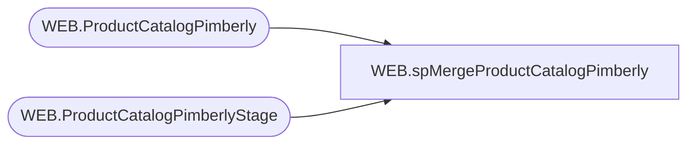

# WEB.spMergeProductCatalogPimberly

**Database:** IntegrationStaging  

## Architecture Diagram



## Table Dependencies

| Referenced Table |
|---|
| WEB.ProductCatalogPimberly |
| WEB.ProductCatalogPimberlyStage |

## Stored Procedure Code

```sql
CREATE proc [WEB].[spMergeProductCatalogPimberly]

as 

-------------------------------------------------------------------------
-- spMergeProductCatalogPimberly - Merges from WEB.ProductCatalogPimberlyStage to WEB.ProductCatalogPimberly
--
-- 2022-11-05 - Ian Wallace - Created Proc
-------------------------------------------------------------------------

set nocount on


Merge into WEB.ProductCatalogPimberly as target
Using 
	(
		select * from WEB.ProductCatalogPimberlyStage
	) as source
On (target.Style_Code = source.Style_Code)
When Matched 
	AND 
		(
			isnull(target.BaseID,'xxx') <> isnull(source.BaseID,'xxx')
			OR	isnull(target.DisplayName,'xxx') <> isnull(source.DisplayName,'xxx')
			OR	isnull(target.UPC,'xxx') <> isnull(source.UPC,'xxx')
			OR	isnull(target.AccessoryType,'xxx') <> isnull(source.AccessoryType,'xxx')
			OR	isnull(target.ColorCode,'xxx') <> isnull(source.ColorCode,'xxx')
			OR	isnull(target.LicensedCollection,'xxx') <> isnull(source.LicensedCollection,'xxx')
			OR	isnull(target.BirthCertificateRequired,'xxx') <> isnull(source.BirthCertificateRequired,'xxx')
			OR	isnull(target.BodyType,'xxx') <> isnull(source.BodyType,'xxx')
			OR	isnull(target.ClassName,'xxx') <> isnull(source.ClassName,'xxx')
			OR	isnull(target.CommodityCode,'xxx') <> isnull(source.CommodityCode,'xxx')
			OR	isnull(target.Department,'xxx') <> isnull(source.Department,'xxx')
			OR  isnull(target.DepartmentSortOrder, 999) <> isnull(source.DepartmentSortOrder,999)
			OR	isnull(target.EyeColor,'xxx') <> isnull(source.EyeColor,'xxx')
			OR	isnull(target.WebExclusive,'xxx') <> isnull(source.WebExclusive,'xxx')
			OR	isnull(target.Outfits,'xxx') <> isnull(source.Outfits,'xxx')
			OR	isnull(target.HierarchyGroupCode,'xxx') <> isnull(source.HierarchyGroupCode,'xxx')
			OR	isnull(target.KeyStory,'xxx') <> isnull(source.KeyStory,'xxx')
			OR	isnull(target.ManufacturerCountry,'xxx') <> isnull(source.ManufacturerCountry,'xxx')
			OR	isnull(target.MerchInDate,'1900-01-01') <> isnull(source.MerchInDate,'1900-01-01')
			OR	isnull(target.Mini,'xxx') <> isnull(source.Mini,'xxx')
			OR	isnull(target.Music,'xxx') <> isnull(source.Music,'xxx')
			OR	isnull(target.NoInternationalShipping,'xxx') <> isnull(source.NoInternationalShipping,'xxx')
			OR	isnull(target.SAC,'xxx') <> isnull(source.SAC,'xxx')
			OR	isnull(target.SNC,'xxx') <> isnull(source.SNC,'xxx')
			OR	isnull(target.ProductSellingGeography,'xxx') <> isnull(source.ProductSellingGeography,'xxx')
			OR	isnull(target.ShippingClass,'xxx') <> isnull(source.ShippingClass,'xxx')
			OR	isnull(target.Tops,'xxx') <> isnull(source.Tops,'xxx')
			OR	isnull(target.WarningLabel,'xxx') <> isnull(source.WarningLabel,'xxx')
			OR  isnull(target.sportsTeam,'xxx') <> isnull(source.sportsTeam,'xxx')
			OR	isnull(target.AccessoryEligible,'xxx') <> isnull(source.AccessoryEligible,'xxx')
			OR	isnull(target.SkinType,'xxx') <> isnull(source.SkinType,'xxx')
			OR	isnull(target.FriendHeight,'xxx') <> isnull(source.FriendHeight,'xxx')
			OR	isnull(target.FriendWeight,'xxx') <> isnull(source.FriendWeight,'xxx')
			OR	isnull(target.SoundEligible,'xxx') <> isnull(source.SoundEligible,'xxx')
			OR	isnull(target.MSTAT,'xxx') <> isnull(source.MSTAT,'xxx')
			OR	isnull(target.ProductCanBeEmbroidered,'xxx') <> isnull(source.ProductCanBeEmbroidered,'xxx')
			OR	isnull(target.ProductMustBeEmbroidered,'xxx') <> isnull(source.ProductMustBeEmbroidered,'xxx')
			OR	isnull(target.NewProduct,'xxx') <> isnull(source.NewProduct,'xxx')
			OR  isnull(target.OnlineFlag,99) <> isnull(source.OnlineFlag,99)
			OR  isnull(target.SearchableFlag,99) <> isnull(source.SearchableFlag,99)
			OR  isnull(target.SearchableIfUnavailableFlag,99) <> isnull(source.SearchableIfUnavailableFlag,99)
			OR  isnull(target.IsFirstTransmit,99) <> isnull(source.IsFirstTransmit,99)
			OR  isnull(target.giftCardType, 'X') <> isnull(source.giftCardType,'X')
			OR	isnull(target.Web,'x')<>isnull(source.Web,'x')
			OR	isnull(target.WebBuf,0)<>isnull(source.WebBuf,0)
			or	isnull(target.BRF,'x')<>isnull(source.BRF,'x')
			or	isnull(target.InLine,'x')<>isnull(source.Inline,'x')
			or	isnull(target.AvailB,'x')<>isnull(source.AvailB,'x')
			or	isnull(target.WebInStock,'x')<>isnull(source.WebInStock,'x')
			or	isnull(target.StoreInStock,'x')<>isnull(source.StoreInStock,'x')
			or	isnull(target.OriginalRetail,0)<>isnull(source.OriginalRetail,0)
			or	isnull(target.CurrentRetail,0)<>isnull(source.CurrentRetail,0)
			or	isnull(target.OnOrder,'x')<>isnull(source.OnOrder,'x')
			or  isnull(target.SubClassLabel,'x')<>isnull(source.SubClassLabel,'x')
			or  isnull(target.Shoes,99)<>isnull(source.Shoes,99)
			or  isnull(target.Sound,99)<>isnull(source.Sound,99)
			or  isnull(target.fourLeggedAnimal,99)<>isnull(source.fourLeggedAnimal,99)
			or  isnull(target.merchOutDate,'3030-12-31')<>isnull(source.merchOutDate,'3030-12-31')
			or  isnull(target.MLBTeams,'x')<>isnull(source.MLBTeams,'x')
			or  isnull(target.NBATeams,'x')<>isnull(source.NBATeams,'x')
			or  isnull(target.NFLTeams,'x')<>isnull(source.NFLTeams,'x')
			or  isnull(target.NHLTeams,'x')<>isnull(source.NHLTeams,'x')
			or  isnull(target.UKFootball,'x')<>isnull(source.UKFootball,'x')
		)
	Then 
		Update 
			Set 
			target.BaseID = source.BaseID,
			target.DisplayName = source.DisplayName,
			target.UPC = source.UPC,
			target.AccessoryType = source.AccessoryType,
			target.ColorCode = source.ColorCode,
			target.LicensedCollection = source.LicensedCollection,
			target.BirthCertificateRequired = source.BirthCertificateRequired,
			target.BodyType = source.BodyType,
			target.ClassName = source.ClassName,
			target.CommodityCode = source.CommodityCode,
			target.Department = source.Department,
			target.DepartmentSortOrder = source.DepartmentSortOrder,
			target.EyeColor = source.EyeColor,
			target.WebExclusive = source.WebExclusive,
			target.Outfits = source.Outfits,
			target.HierarchyGroupCode = source.HierarchyGroupCode,
			target.KeyStory = source.KeyStory,
			target.ManufacturerCountry = source.ManufacturerCountry,
			target.MerchInDate = source.MerchInDate,
			target.Mini = source.Mini,
			target.Music = source.Music,
			target.NoInternationalShipping = source.NoInternationalShipping,
			target.SAC = source.SAC,
			target.SNC = source.SNC,
			target.ProductSellingGeography = source.ProductSellingGeography,
			target.ShippingClass = source.ShippingClass,
			target.Tops = source.Tops,
			target.WarningLabel = source.WarningLabel,
			target.sportsTeam = source.sportsTeam,
			target.AccessoryEligible = source.AccessoryEligible,
			target.SkinType = source.SkinType,
			target.FriendHeight = source.FriendHeight,
			target.FriendWeight = source.FriendWeight,
			target.SoundEligible = source.SoundEligible,
			target.MSTAT = source.MSTAT,
			target.ProductCanBeEmbroidered = source.ProductCanBeEmbroidered,
			target.ProductMustBeEmbroidered = source.ProductMustBeEmbroidered,
			target.NewProduct = source.NewProduct,
			target.OnlineFlag = source.OnlineFlag,
			target.SearchableFlag = source.SearchableFlag,
			target.SearchableIfUnavailableFlag = source.SearchableIfUnavailableFlag,
			target.IsFirstTransmit = source.IsFirstTransmit,
			target.giftCardType = source.giftCardType,
			target.Web = source.Web,
			target.WebBuf = source.WebBuf,
			target.BRF = source.BRF,
			target.InLine = source.Inline,
			target.AvailB = source.AvailB,
			target.WebInStock = source.WebInStock,
			target.StoreInStock = source.StoreInStock,
			target.OriginalRetail = source.OriginalRetail,
			target.CurrentRetail = source.CurrentRetail,
			target.OnOrder = source.OnOrder,
			target.SubClassLabel = source.SubClassLabel,
			target.Shoes = source.Shoes,
			target.Sound = source.Sound,
			target.fourLeggedAnimal = source.fourLeggedAnimal,
			target.merchOutDate = source.merchOutDate,
			target.MLBTeams = source.MLBTeams,
			target.NBATeams = source.NBATeams,
			target.NFLTeams = source.NFLTeams,
			target.NHLTeams = source.NHLTeams,
			target.UKFootball = source.UKFootball,
			target.UpdateDate	=	getdate()
When Not Matched By Target 
	Then 
		Insert (
			BaseID,
			Style_Code,
			DisplayName,
			UPC,
			AccessoryType,
			ColorCode,
			LicensedCollection,
			BirthCertificateRequired ,
			BodyType,
			ClassName,
			CommodityCode,
			Department,
			DepartmentSortOrder,
			EyeColor,
			WebExclusive,
			Outfits,
			HierarchyGroupCode,
			KeyStory,
			ManufacturerCountry,
			MerchInDate,
			Mini,
			Music,
			NoInternationalShipping,
			SAC,
			SNC,
			ProductSellingGeography,
			ShippingClass,
			Tops,
			WarningLabel,
			sportsTeam,
			AccessoryEligible,
			SkinType,
			FriendHeight,
			FriendWeight,
			SoundEligible,
			MSTAT,
			ProductCanBeEmbroidered,
			ProductMustBeEmbroidered,
			NewProduct,
			OnlineFlag,
			SearchableFlag,
			SearchableIfUnavailableFlag,
			IsFirstTransmit,
			giftCardType,
			Web,
			WebBuf,
			BRF,
			InLine,
			AvailB,
			WebInStock,
			StoreInStock,
			OriginalRetail,
			CurrentRetail,
			OnOrder,
			SubClassLabel,
			Shoes,
			Sound,
			fourLeggedAnimal,
			merchOutDate,
			MLBTeams,
			NBATeams,
			NFLTeams,
			NHLTeams,
			UKFootball,
			InsertDate
				)
		Values (
			source.BaseID,
			source.Style_Code,
			source.DisplayName,
			source.UPC,
			source.AccessoryType,
			source.ColorCode,
			source.LicensedCollection,
			source.BirthCertificateRequired ,
			source.BodyType,
			source.ClassName,
			source.CommodityCode,
			source.Department,
			source.DepartmentSortOrder,
			source.EyeColor,
			source.WebExclusive,
			source.Outfits,
			source.HierarchyGroupCode,
			source.KeyStory,
			source.ManufacturerCountry,
			source.MerchInDate,
			source.Mini,
			source.Music,
			source.NoInternationalShipping,
			source.SAC,
			source.SNC,
			source.ProductSellingGeography,
			source.ShippingClass,
			source.Tops,
			source.WarningLabel,
			source.sportsTeam,
			source.AccessoryEligible,
			source.SkinType,
			source.FriendHeight,
			source.FriendWeight,
			source.SoundEligible,
			source.MSTAT,
			source.ProductCanBeEmbroidered,
			source.ProductMustBeEmbroidered,
			source.NewProduct,
			source.OnlineFlag,
			source.SearchableFlag,
			source.SearchableIfUnavailableFlag,
			source.IsFirstTransmit,
			source.giftCardType,
			source.Web,
			source.WebBuf,
			source.BRF,
			source.InLine,
			source.AvailB,
			source.WebInStock,
			source.StoreInStock,
			source.OriginalRetail,
			source.CurrentRetail,
			source.OnOrder,
			source.SubClassLabel,
			source.Shoes,
			source.Sound,
			source.fourLeggedAnimal,
			source.merchOutDate,
			source.MLBTeams,
			source.NBATeams,
			source.NFLTeams,
			source.NHLTeams,
			source.UKFootball,
			getdate()
				)
When Not Matched By Source
	Then
		delete

--OUTPUT 
--	deleted.*,
--	getdate(),
--	$action,
--	1
--into WEB.ProductCatalogMasterAttributesArchive		
;

--if @LoadType = 'FULL'
--	update WEB.ProductCatalogMasterAttributes
--	set SendData = 1


--if (select count(*) from WEB.ProductCatalogMasterAttributes where isCPS is NULL) > 0
--begin
--	update WEB.ProductCatalogMasterAttributes
--	set isCPS = 0
--	where isCPS is NULL
--end
```

