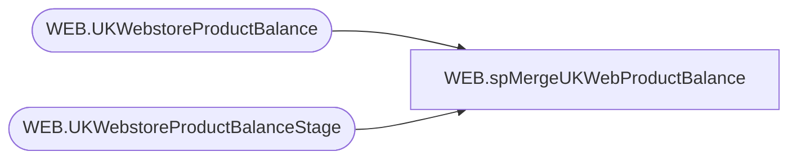

# WEB.spMergeUKWebProductBalance

**Database:** IntegrationStaging  

## Architecture Diagram



## Table Dependencies

| Referenced Table |
|---|
| WEB.UKWebstoreProductBalance |
| WEB.UKWebstoreProductBalanceStage |

## Stored Procedure Code

```sql
CREATE   proc [WEB].[spMergeUKWebProductBalance]
as


set nocount on

-- Added 8/10/2023
-- Remove Additional Records if more than one file was present at time of job execution 
-- We only want to include the records with the Max Recent File Name 

declare @MaxFileName  varchar (50) 
;

set @MaxFileName = (

select max ([FileName]) as MaxFileName 
from [WEB].[UKWebstoreProductBalanceStage] 
) 
;

delete 
--select * -- For Testing 
from [WEB].[UKWebstoreProductBalanceStage] 
where [FileName] <> @MaxFileName


-- Original Code Below


merge into [WEB].[UKWebstoreProductBalance] as target
Using [WEB].[UKWebstoreProductBalanceStage] as source

on 
	( 
		target.StyleCode=source.StyleCode
		and
		cast (target.InventoryDate as date)=cast(source.Date as date)
	)

when MATCHED and 

(


isnull(target.[ARRQuantity],0)<>isnull(source.[ARRQuantity],0)OR
isnull(target.[AVLQuantity],0)<>isnull(source.[AVLQuantity],0)OR
isnull(target.[TRAQuantity],0)<>isnull(source.[TRAQuantity],0)OR
isnull(target.[ORDQuantity],0)<>isnull(source.[ORDQuantity],0)OR
isnull(target.[PCKQuantity],0)<>isnull(source.[PCKQuantity],0)OR
isnull(target.[AWPQuantity],0)<>isnull(source.[AWPQuantity],0)OR
isnull(target.[ALLQuantity],0)<>isnull(source.[ALLQuantity],0)OR
isnull(target.[ADVQuantity],0)<>isnull(source.[ADVQuantity],0)OR
isnull(target.[HLDQuantity],0)<>isnull(source.[HLDQuantity],0)

)

Then Update 

set 

target.[ARRQuantity]=source.[ARRQuantity],
target.[AVLQuantity]=source.[AVLQuantity],
target.[TRAQuantity]=source.[TRAQuantity],
target.[ORDQuantity]=source.[ORDQuantity],
target.[PCKQuantity]=source.[PCKQuantity],
target.[AWPQuantity]=source.[AWPQuantity],
target.[ALLQuantity]=source.[ALLQuantity],
target.[ADVQuantity]=source.[ADVQuantity],
target.[HLDQuantity]=source.[HLDQuantity], 
target.[UpdateDate]=getdate(), 
target.[UpdatedByFileName]=source.[FileName]+'.txt'


when NOT MATCHED by Target 
	then 
		Insert 
			(
			InventoryDate,
			StyleCode,
			ARRQuantity,
			AVLQuantity,
			TRAQuantity,
			ORDQuantity,
			PCKQuantity,
			AWPQuantity,
			ALLQuantity,
			ADVQuantity,
			HLDQuantity,
			InsertDate, 
			UpdatedByFileName
			) 
		Values 
			(
				cast(source.Date as date),
				source.[StyleCode],
				source.[ARRQuantity] ,
				source.[AVLQuantity] ,
				source.[TRAQuantity] ,
				source.[ORDQuantity] ,
				source.[PCKQuantity] ,
				source.[AWPQuantity] ,
				source.[ALLQuantity] ,
				source.[ADVQuantity] ,
				source.[HLDQuantity] , 
				getdate(), 
				source.[FileName]+'.txt'
			) 
		;
```

