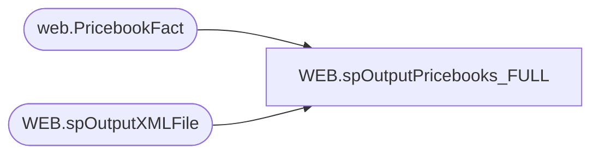

# WEB.spOutputPricebooks_FULL

**Database:** IntegrationStaging  

## Architecture Diagram



## Table Dependencies

| Referenced Table |
|---|
| web.PricebookFact |
| WEB.spOutputXMLFile |

## Stored Procedure Code

```sql
CREATE proc [WEB].[spOutputPricebooks_FULL]
 @FileNameDate datetime = NULL

as

set nocount on

-- =====================================================================================================
-- Name:  WEB.spOutputPricebooks
--
-- Description:	Outputs master catalog XML file for ecommerce integration, runs WEB.spOutputXMLFile (reusable proc for generating xml files)
--				 
-- Revision History
--		Name:			Date:			Comments:
--		Dan Tweedie		2017-06-15		Created proc
--- 2023-08-28 - Tim Callahan - Created for Feedonomics Integration
-- =====================================================================================================


declare 
	@dateString varchar(20),
	@file varchar(100)

select @dateString = case when @FileNameDate is NULL 
							then replace(replace(replace(replace(convert(varchar, getdate(), 121), '-', ''), ':', ''), '.', ''),' ', '')
							else replace(replace(replace(replace(convert(varchar, @FileNameDate, 121), '-', ''), ':', ''), '.', ''),' ', '')
					end

select @file = @datestring + '_pricebooks_usd.xml'

if 
(select count (*)
from web.PricebookFact
where 1=1
--and (exported is null and ExportDate is null ) -- Remarked Out for Full Load
and (CurrentPrice <> 0.00 and isnull(SalePrice,0.01) <> 0.00)
and Catalog = 'US' ) > 0 
Begin 


	exec WEB.spOutputXMLFile
	 @Query = 'select XMLData from IntegrationStaging.WEB.vwPricebooksUSXML_FULL', 
	 @FileLocation = '\\stl-ssis-p-01\IntegrationStaging\WEB\Outbound\Feedonomics\PriceBook\', 
	 @FileName = @file
End 


if 
(select count (*)
from web.PricebookFact
where 1=1
--and (exported is null and ExportDate is null ) -- Remarked Out for Full Load
and (CurrentPrice <> 0.00 and isnull(SalePrice,0.01) <> 0.00)
and Catalog = 'UK' ) > 0 

Begin 

 select @file = @datestring + '_pricebooks_gbp.xml'

	 exec WEB.spOutputXMLFile
	 @Query = 'select XMLData from IntegrationStaging.WEB.vwPricebooksUKXML_FULL', 
	 @FileLocation = '\\stl-ssis-p-01\IntegrationStaging\WEB\Outbound\Feedonomics\PriceBook\', 
	 @FileName = @file

End 


WEB,spOutputStorefrontCatalogs,CREATE proc [WEB].[spOutputStorefrontCatalogs]
@LoadType varchar(5)

as

set nocount on

-- =====================================================================================================
-- Name:  WEB.spOutputStorefrontCatalogs
--
-- Description:	Outputs storefront catalog XML file for ecommerce integration, runs WEB.spOutputXMLFile (reusable proc for generating xml files)
--				 
-- Revision History
--		Name:			Date:			Comments:
--		Dan Tweedie		2017-06-15		Created proc
-- =====================================================================================================


declare 
	@dateString varchar(20),
	@file varchar(100),
	@viewUS varchar(50),
	@viewUK varchar(50),
	@sqlUS varchar(100),
	@sqlUK varchar(100),
	@USRowsToSend int,
	@UKRowsToSend int

Select @USRowsToSend =
	case 
		when @LoadType = 'FULL' 
		then 1
		else sum(x.RowsToSend) 
	end
from 
	(
		select count(*) RowsToSend
		from WEB.ProductCatalogStorefrontCategory
		where left(CategoryID, 2) = 'US'
		and CategoryID <> 'US'
		and SendData = 1
		UNION
		select count(*) RowsToSend
		from WEB.ProductCatalogStorefrontCategoryArchive
		where left(CategoryID, 2) = 'US'
		and CategoryID <> 'US'
		and ChangeType = 'DELETE'
		and CurrentBatch = 1
		UNION
		select count(*) RowsToSend
		from WEB.ProductStorefrontCategoryMap
		where left(CategoryID, 2) = 'US'
		and CategoryID <> 'US'
		and SendData = 1
		UNION
		select count(*) RowsToSend
		from WEB.ProductStorefrontCategoryMapArchive
		where left(CategoryID, 2) = 'US'
		and CategoryID <> 'US'
		and ChangeType = 'DELETE'
		and CurrentBatch = 1
	) x

Select @UKRowsToSend =
	case 
		when @LoadType = 'FULL' 
		then 1
		else sum(x.RowsToSend) 
	end
from 
	(
		select count(*) RowsToSend
		from WEB.ProductCatalogStorefrontCategory
		where left(CategoryID, 2) = 'UK'
		and CategoryID <> 'UK'
		and SendData = 1
		UNION
		select count(*) RowsToSend
		from WEB.ProductCatalogStorefrontCategoryArchive
		where left(CategoryID, 2) = 'UK'
		and CategoryID <> 'UK'
		and ChangeType = 'DELETE'
		and CurrentBatch = 1
		UNION
		select count(*) RowsToSend
		from WEB.ProductStorefrontCategoryMap
		where left(CategoryID, 2) = 'UK'
		and CategoryID <> 'UK'
		and SendData = 1
		UNION
		select count(*) RowsToSend
		from WEB.ProductStorefrontCategoryMapArchive
		where left(CategoryID, 2) = 'UK'
		and CategoryID <> 'UK'
		and ChangeType = 'DELETE'
		and CurrentBatch = 1
	) x

select 
	@dateString = replace(replace(replace(replace(convert(varchar, getdate(), 121), '-', ''), ':', ''), '.', ''),' ', ''),
	@LoadType = lower(@LoadType),
	@file = @datestring + '_catalog_buildabear-storefront-us_' + @LoadType + '.xml',
	@viewUS = case when @LoadType = 'delta' 
					then 'vwProductStorefrontCatalogUSdeltaXML'
					else 'vwProductStorefrontCatalogUSfullXML'
			end,
	@viewUK = case when @LoadType = 'delta' 
					then 'vwProductStorefrontCatalogUKdeltaXML'
					else 'vwProductStorefrontCatalogUKfullXML'
			end,
	@sqlUS = 'select XMLData from IntegrationStaging.WEB.' + @viewUS,
	@sqlUK = 'select XMLData from IntegrationStaging.WEB.' + @viewUK

	if @USRowsToSend > 0
	begin
		exec WEB.spOutputXMLFile 
			@Query = @sqlUS, 
			@FileLocation = '\\STL-SSIS-P-01\IntegrationStaging\WEB\Outbound\ProductCatalogStoreFront\', 
			@FileName = @file
	end

	if @UKRowsToSend > 0
	begin
	
		select @file = @datestring + '_catalog_buildabear-storefront-uk_' + @LoadType + '.xml'

		exec WEB.spOutputXMLFile 
			@Query = @sqlUK, 
			@FileLocation = '\\STL-SSIS-P-01\IntegrationStaging\WEB\Outbound\ProductCatalogStoreFront\', 
			@FileName = @file
	end


WEB,spOutputXMLFile,CREATE proc [WEB].[spOutputXMLFile]
	@Query varchar(1000),
    @FileLocation varchar(100),
	@FileName varchar(100)

as

-- =====================================================================================================
-- Name: WEB.spOutputXMLFile
--
-- Description:	Outputs XML file in UTF-8 format, accepts Query, FileLocation and FileName parameters
--		
--				 
-- Revision History
--		Name:			Date:			Comments:
--		Dan Tweedie		05-15-2017		Created proc.	
-- =====================================================================================================

set nocount on


declare 
	@bcp varchar(1000)

set @bcp = 'bcp "' + @query + '" queryout "' + @FileLocation + @FileName + '"  -T -c -C65001' ----c -C65001 means to use UTF-8, otherwise -w means Unicode

exec master..xp_cmdshell @bcp
```

