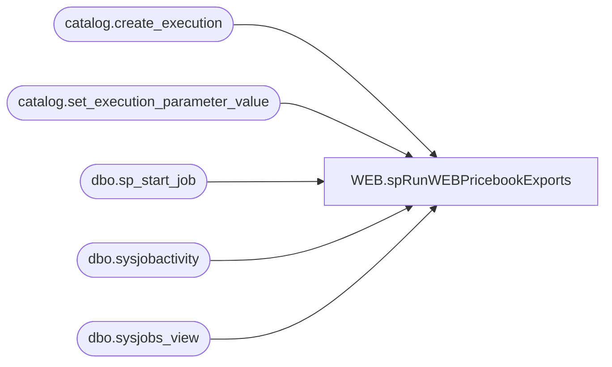

# WEB.spRunWEBPricebookExports

**Database:** IntegrationStaging  

## Architecture Diagram



## Table Dependencies

| Referenced Table |
|---|
| catalog.create_execution |
| catalog.set_execution_parameter_value |
| dbo.sp_start_job |
| dbo.sysjobactivity |
| dbo.sysjobs_view |

## Stored Procedure Code

```sql
CREATE PROCEDURE [WEB].[spRunWEBPricebookExports]
@onDemandDate AS DATE = GETDATE, @output_execution_id bigint output
-- =============================================================================================================
-- Name:  WEB.spRunWEBPricebookExports
--
-- Description:	Run Job WEB - PricebookExports
--
-- Revision History
--		Name:			Date:			Comments:
--		BenBarud		02/06/2018		Creation
-- =============================================================================================================
--WITH EXECUTE AS 'BAB\SQLServices'
AS
BEGIN

	DECLARE @strExecution VARCHAR(1000), @result int, @dateStr NVARCHAR(12)

	SET @dateStr = '''' + CAST(@onDemandDate AS NVARCHAR(10)) + ''''

	SET NOCOUNT ON;
 
    declare @execution_id bigint
    exec ssisdb.catalog.create_execution 
    @folder_name = 'SSIS'
   ,@project_name = 'WebPricebook'
   ,@package_name = 'WebPricebook.dtsx'
   ,@execution_id = @execution_id output


   exec ssisdb.catalog.set_execution_parameter_value
   @execution_id
  ,@object_type = 30
  ,@parameter_name = 'PricebookRunDate'
  ,@parameter_value = @dateStr

--   exec ssisdb.catalog.set_execution_parameter_value
--   @execution_id
--  ,@object_type = 50
--  ,@parameter_name = 'LOGGING_LEVEL'
--  ,@parameter_value = 3

	IF (SELECT COUNT(*) 
			FROM [stl-ssis-p-01].msdb.dbo.sysjobs_view job
			INNER JOIN [stl-ssis-p-01].msdb.dbo.sysjobactivity activity ON (job.job_id = activity.job_id)
			WHERE run_Requested_date IS NOT NULL AND stop_execution_date IS NULL
			AND job.name = 'WEB - onDemandWebPriceBookExport')  = 0
	BEGIN
		EXEC [stl-ssis-p-01].msdb..sp_start_job 
			@job_name = 'WEB - onDemandWebPriceBookExport'
		set @output_execution_id = @execution_id
	END
END
```

