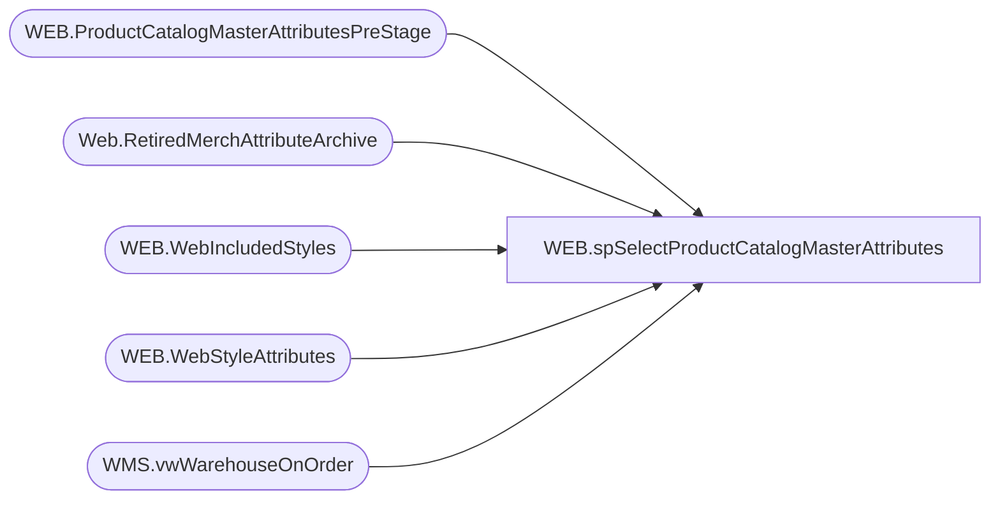

# WEB.spSelectProductCatalogMasterAttributes

**Database:** IntegrationStaging  

## Architecture Diagram



## Table Dependencies

| Referenced Table |
|---|
| WEB.ProductCatalogMasterAttributesPreStage |
| Web.RetiredMerchAttributeArchive |
| WEB.WebIncludedStyles |
| WEB.WebStyleAttributes |
| WMS.vwWarehouseOnOrder |

## Stored Procedure Code

```sql
CREATE PROC [WEB].[spSelectProductCatalogMasterAttributes]
AS

-- =====================================================================================================
-- Name: spSelectProductCatalogMasterAttributes
--
-- Description:	Outputs one row per style, all of the web product catalog attributes. This is used for integration to Lyons/Salesforce, but is part of larger ETL procedure
--
-- Revision History
--		Name:			Date:			Comments:
--		Lizzy Timm		07/09/2025		Created stored procedure based on BEDROCKDB02's spWEBSelectProductCatalogMasterAttributes.
-- =====================================================================================================


TRUNCATE TABLE WEB.ProductCatalogMasterAttributesPreStage

--PRE STAGE 
IF (Object_ID('tempdb..#Styles') IS NOT null) DROP TABLE #Styles;
WITH 
OnOrder as
	(
		SELECT DISTINCT ItemNumber AS StyleCode
		FROM WMS.vwWarehouseOnOrder
	)
select 
	s.BaseId,		
	s.StyleCode,	
	s.SKUDescription,	
	s.Color,	
	s.UPC,	
	s.SellingGeography,	
	s.StoreFrontEligible,
	s.Department,	
	s.Class,	
	s.SubClass,	
	s.DepartmentCode,	
	s.ClassCode,	
	s.SubClassCode,	
	s.SubClassHierarchyGroupID,
	case 
		when oo.StyleCode is null 
		then 0
		else 1
	end as OnOrderFlag
into #Styles 
from WEB.WebIncludedStyles s with (nolock)
left join OnOrder oo on s.StyleCode = oo.StyleCode
--where s.StyleCode<>'528747'
group by 
	s.BaseId,		
	s.StyleCode,	
	s.SKUDescription,	
	s.Color,	
	s.UPC,	
	s.SellingGeography,	
	s.StoreFrontEligible,
	s.Department,	
	s.Class,	
	s.SubClass,	
	s.DepartmentCode,	
	s.ClassCode,	
	s.SubClassCode,	
	s.SubClassHierarchyGroupID,
	case 
		when oo.StyleCode is null 
		then 0
		else 1
	end;


IF (Object_ID('tempdb..#Attributes') IS NOT null) DROP TABLE #Attributes
SELECT  
	s.StyleCode,
	a.Type,
	a.Field,
	a.[Value]
into #Attributes
FROM #Styles s 
join WEB.WebStyleAttributes a with (nolock) ON s.StyleCode = a.StyleCode
where a.Field in
	(
		'AMAZON','AMLTYP','ANSOLD','ASTHMA','AVAILB',
		'BODY','BOTTOM','BOY', 'BRF',
		'COO',
		'EMBCAN','EMBMUS','EYECLR',
		'GFTBOX','GFTCOM','GIRL',
		'INTSHP',
		'LICEN','LICNSR',
		'MSTAT',
		'NEUTRA',
		'OUTFIT','OTHRLC',
		'PURSES',
		'QTYRST',
		'REFUND',
		'SAC','SEAS','SNC',
		'TEAMS','TOPS',
		'UKTRF','USTRF',
		'WARN','WEBEXC', 'WOCCAS', 'WEBBUF',
		'WEBPAC', 'WEBLIN', 'WEB',
		'WMLB','WBBALL','WNFL','WNHL','WUKFB',
		'HEIGHT',
		'IDATE',
		'KEYSTY',
		'WEIGHT',
		'INLINE',
		'ODATE'
	)
group by 
	s.StyleCode,
	a.Type,
	a.Field,
	a.[Value]

-- Replaced below with Web.RetiredMerchAttributeArchive
/*
IF (Object_ID('tempdb..#OldAttributes') IS NOT null) DROP TABLE #OldAttributes
SELECT  RIGHT(s.Style_Code,5) BaseId,
	s.Style_Code StyleCode,
	a.attribute_code,
	a.attribute_label,
	ats.attribute_set_code,
	ats.attribute_set_label
INTO #OldAttributes
FROM BEDROCKTESTDB02.me_01.dbo.Style s  with (nolock)
join BEDROCKTESTDB02.me_01.dbo.entity_attribute_set eas with (nolock) on eas.parent_id = s.style_id
join BEDROCKTESTDB02.me_01.dbo.attribute_set ats with (nolock) on eas.attribute_set_id = ats.attribute_set_id
join BEDROCKTESTDB02.me_01.dbo.attribute a with (nolock) on ats.attribute_id = a.attribute_id and a.parent_type = 1
where a.attribute_code in
	(
		'AMAZON', 'ANSOLD', 'GFTBOX', 'GFTCOM', 'OTHRLC', 'QTYRST', 'REFUND', 'WEBPAC', 'WEBLIN', 'WMLB', 'WBBALL', 'WNFL', 'WNHL', 'WUKFB'
	)
	AND s.active_flag = 1
	AND LEN(s.Style_Code) = 6
	AND ats.attribute_set_code <> 'NA'
group by 
	s.Style_Code,
	a.attribute_code,
	a.attribute_label,
	ats.attribute_set_code,
	ats.attribute_set_label
*/

IF (Object_ID('tempdb..#AnimalSoldSeparately') IS NOT null) DROP TABLE #AnimalSoldSeparately
select
	s.StyleCode
into #AnimalSoldSeparately
from #Styles s
JOIN Web.RetiredMerchAttributeArchive a on s.StyleCode = a.StyleCode
where a.attribute_code = 'ANSOLD' 
and a.attribute_set_code = 'N'
group by s.StyleCode

IF (Object_ID('tempdb..#AsthmaFriendly') IS NOT null) DROP TABLE #AsthmaFriendly
select
	s.StyleCode
into #AsthmaFriendly
from #Styles s
join #Attributes a with (nolock) on s.StyleCode = a.StyleCode
where a.Field = 'ASTHMA' 
and a.[Value] = 'Y'
group by s.StyleCode	

IF (Object_ID('tempdb..#LicensedCollection') IS NOT null) DROP TABLE #LicensedCollection
select
s.StyleCode,
isnull(min(ats.attribute_set_code),min(a.[Value])) as LICNSR
into #LicensedCollection
from #Styles s
left join #Attributes a on s.StyleCode = a.StyleCode and a.Field = 'LICNSR' and a.[Value] <> 'SOUNDS'
left JOIN Web.RetiredMerchAttributeArchive ats on s.StyleCode = ats.StyleCode and ats.attribute_code ='OTHRLC' and ats.attribute_set_code <> 'SOUNDS'
group by s.StyleCode HAVING isnull(min(ats.attribute_set_code),min(a.[Value])) IS NOT NULL


------=======================================================================================================================================
IF (Object_ID('tempdb..#BodyType') IS NOT null) DROP TABLE #BodyType
select
	s.StyleCode,
	a.[Value] as BodyType
into #BodyType
from #Styles s
join #Attributes a on s.StyleCode = a.StyleCode
where a.Field = 'BODY'
group by 
	s.StyleCode,
	a.[Value]

IF (Object_ID('tempdb..#Bottoms') IS NOT null) DROP TABLE #Bottoms
select
	s.StyleCode
into #Bottoms
from #Styles s
join #Attributes a on s.StyleCode = a.StyleCode
where a.Field = 'BOTTOM'
and a.[Value] = 'Y'
group by s.StyleCode


IF (Object_ID('tempdb..#Boy') IS NOT null) DROP TABLE #Boy
select
	s.StyleCode
into #Boy
from #Styles s
join #Attributes a on s.StyleCode = a.StyleCode
where a.Field = 'BOY'
and a.[Value] = 'Y'
group by s.StyleCode

IF (Object_ID('tempdb..#CommodityCode') IS NOT null) DROP TABLE #CommodityCode
select
	s.StyleCode,
	us.[Value] as USTRF,
	uk.[Value] as UKTRF
into #CommodityCode
from #Styles s
join #Attributes us on s.StyleCode = us.StyleCode and us.field = 'USTRF'
join #Attributes uk on s.StyleCode = uk.StyleCode and uk.Field = 'UKTRF'
group by 
	s.StyleCode,
	us.[Value],
	uk.[Value]

IF (Object_ID('tempdb..#DisplayOnAmazon') IS NOT null) DROP TABLE #DisplayOnAmazon
select
	s.StyleCode
into #DisplayOnAmazon
from #Styles s
JOIN Web.RetiredMerchAttributeArchive a on s.StyleCode = a.StyleCode
where a.attribute_code = 'AMAZON'
and a.attribute_set_code = 'Y'
group by s.StyleCode

IF (Object_ID('tempdb..#EyeColor') IS NOT null) DROP TABLE #EyeColor
select
	s.StyleCode,
	a.[Value] as EyeColor
into #EyeColor
from #Styles s
join #Attributes a on s.StyleCode = a.StyleCode
where a.Field = 'EYECLR'
group by 
	s.StyleCode,
	a.[Value]

IF (Object_ID('tempdb..#WebExclusive') IS NOT null) DROP TABLE #WebExclusive
select
	s.StyleCode
into #WebExclusive
from #Styles s
join #Attributes a on s.StyleCode = a.StyleCode
where a.Field = 'WEBEXC'
and a.[Value] = 'Y'
group by s.StyleCode

IF (Object_ID('tempdb..#Girl') IS NOT null) DROP TABLE #Girl
select
	s.StyleCode
into #Girl
from #Styles s
join #Attributes a on s.StyleCode = a.StyleCode
where a.Field = 'GIRL'
and a.[Value] = 'Y'
group by s.StyleCode

IF (Object_ID('tempdb..#Neutral') IS NOT null) DROP TABLE #Neutral
select
	s.StyleCode
into #Neutral
from #Styles s
join #Attributes a on s.StyleCode = a.StyleCode
where a.Field = 'NEUTRA'
and a.[Value] = 'Y'
group by s.StyleCode

IF (Object_ID('tempdb..#Outfits') IS NOT null) DROP TABLE #Outfits
select
	s.StyleCode
into #Outfits
from #Styles s
join #Attributes a on s.StyleCode = a.StyleCode
where a.Field = 'OUTFIT'
and a.[Value] = 'Y'
group by s.StyleCode

IF (Object_ID('tempdb..#GiftBoxType') IS NOT null) DROP TABLE #GiftBoxType
select
	s.StyleCode
into #GiftBoxType
from #Styles s
JOIN Web.RetiredMerchAttributeArchive a on s.StyleCode = a.StyleCode
where a.attribute_code = 'GFTBOX'
and a.attribute_set_code = 'LARGE'
group by s.StyleCode

IF (Object_ID('tempdb..#KeyStory') IS NOT null) DROP TABLE #KeyStory
select 
	s.StyleCode,
	min(cp.[Value]) as KeyStory 
into #KeyStory
from #Styles s
join #Attributes cp on s.StyleCode = cp.StyleCode
where cp.Field = 'KEYSTY'
group by s.StyleCode

IF (Object_ID('tempdb..#COO') IS NOT null) DROP TABLE #COO
select
	s.StyleCode,
	a.[Value] as COO
into #COO
from #Styles s
join #Attributes a on s.StyleCode = a.StyleCode
where a.Field = 'COO'
group by 
	s.StyleCode,
	a.[Value]

IF (Object_ID('tempdb..#MerchInDate') IS NOT null) DROP TABLE #MerchInDate
select 
	s.StyleCode,
	MIN(cast(
			case 
				when isdate(cp.[Value]) = 1
				then cp.[Value]
				else '1999-12-31'
			end 
	as date)) MerchInDate
into #MerchInDate
from #Styles s
join #Attributes cp on s.StyleCode = cp.StyleCode
where cp.Field = 'IDATE'
group by s.StyleCode

IF (Object_ID('tempdb..#NoInternationalShipping') IS NOT null) DROP TABLE #NoInternationalShipping
select
	s.StyleCode
into #NoInternationalShipping
from #Styles s
join #Attributes a on s.StyleCode = a.StyleCode
where a.Field = 'INTSHP'
and a.[Value] = 'Y'
group by s.StyleCode

IF (Object_ID('tempdb..#SAC') IS NOT null) DROP TABLE #SAC
select
	s.StyleCode
into #SAC
from #Styles s
join #Attributes a on s.StyleCode = a.StyleCode
where a.Field = 'SAC'
and a.[Value] = 'Y'
group by s.StyleCode

IF (Object_ID('tempdb..#SNC') IS NOT null) DROP TABLE #SNC
select
	s.StyleCode
into #SNC
from #Styles s
join #Attributes a on s.StyleCode = a.StyleCode
where a.Field = 'SNC'
and a.[Value] = 'Y'
group by s.StyleCode

IF (Object_ID('tempdb..#QuantityRestriction') IS NOT null) DROP TABLE #QuantityRestriction
select 
	s.StyleCode,
	case 
		when a.attribute_set_code = 'NONE'
		then 0
		else a.attribute_set_code
	end as QuantityRestriction
into #QuantityRestriction
from #Styles s
JOIN Web.RetiredMerchAttributeArchive a on s.StyleCode = a.StyleCode
where a.attribute_code = 'QTYRST'
and a.attribute_set_code not in ('10')
group by 
	s.StyleCode,
	case 
		when a.attribute_set_code = 'NONE'
		then 0
		else a.attribute_set_code
	end

IF (Object_ID('tempdb..#RefundEligible') IS NOT null) DROP TABLE #RefundEligible
select
	s.StyleCode 
into #RefundEligible
from #Styles s
JOIN Web.RetiredMerchAttributeArchive a on s.StyleCode = a.StyleCode
where a.attribute_code = 'REFUND'
and a.attribute_set_code = 'Y'
group by s.StyleCode

IF (Object_ID('tempdb..#Seasonal') IS NOT null) DROP TABLE #Seasonal
select
	s.StyleCode
into #Seasonal
from #Styles s
join #Attributes a on s.StyleCode = a.StyleCode
where a.Field = 'SEAS'
and a.[Value] = 'Y'
group by s.StyleCode

IF (Object_ID('tempdb..#ThirdPartySiteEligible') IS NOT null) DROP TABLE #ThirdPartySiteEligible
select
	s.StyleCode
into #ThirdPartySiteEligible
from #Styles s
JOIN Web.RetiredMerchAttributeArchive a on s.StyleCode = a.StyleCode
where a.attribute_code = 'GFTCOM'
and a.attribute_set_code = 'Y'
group by s.StyleCode

IF (Object_ID('tempdb..#Tops') IS NOT null) DROP TABLE #Tops
select
	s.StyleCode
into #Tops
from #Styles s
join #Attributes a on s.StyleCode = a.StyleCode
where a.Field = 'TOPS'
and a.[Value] = 'Y'
group by s.StyleCode

IF (Object_ID('tempdb..#WarningLabel') IS NOT null) DROP TABLE #WarningLabel
select
	s.StyleCode,
	max(a.[Value]) as WarningLabel
into #WarningLabel
from #Styles s
join #Attributes a on s.StyleCode = a.StyleCode
where a.Field = 'WARN'
group by 
	s.StyleCode

IF (Object_ID('tempdb..#SkinType') IS NOT null) DROP TABLE #SkinType
select
	s.StyleCode,
	a.[Value] as SkinType
into #SkinType
from #Styles s
join #Attributes a on s.StyleCode = a.StyleCode
where a.Field = 'AMLTYP'
group by 
	s.StyleCode,
	a.[Value]

IF (Object_ID('tempdb..#FriendHeight') IS NOT null) DROP TABLE #FriendHeight
;with 
Rounded as
	(
		select 
			s.StyleCode,
			--cp.[Value] as FriendHeight
			case 
				when s.SellingGeography = 'UK'
					--then cast(round((cast(cp.[Value] as numeric(10,2)) * 2.54),0,0) as int) 
					then round((cast(cp.[Value] as numeric(10,2)) * 2.54),0,0)
				else cp.[Value]
			end as FriendHeight
		from #Styles s
		join #Attributes cp on s.StyleCode = cp.StyleCode
		where cp.Field = 'HEIGHT'
	)
select StyleCode, 
	   cast(FriendHeight as int) as FriendHeight
into #FriendHeight
from Rounded 
group by 
	StyleCode, 
	cast(FriendHeight as int)

	
IF (Object_ID('tempdb..#FriendWeight') IS NOT null) DROP TABLE #FriendWeight
select 
	s.StyleCode,
	cp.[Value] as FriendWeight
into #FriendWeight
from #Styles s
join #Attributes cp on s.StyleCode = cp.StyleCode
where cp.Field = 'WEIGHT'
group by 
	s.StyleCode,
	cp.[Value]

IF (Object_ID('tempdb..#MSTAT') IS NOT null) DROP TABLE #MSTAT
select
	s.StyleCode,
	a.[Value] as MSTAT
into #MSTAT
from #Styles s
join #Attributes a on s.StyleCode = a.StyleCode
where a.Field = 'MSTAT'
group by 
	s.StyleCode,
	a.[Value]

IF (Object_ID('tempdb..#ProductCanBeEmbroidered') IS NOT null) DROP TABLE #ProductCanBeEmbroidered
select
	s.StyleCode
into #ProductCanBeEmbroidered
from #Styles s
join #Attributes a on s.StyleCode = a.StyleCode
where a.Field = 'EMBCAN'
and a.[Value] = 'Y'
group by s.StyleCode

IF (Object_ID('tempdb..#ProductMustBeEmbroidered') IS NOT null) DROP TABLE #ProductMustBeEmbroidered
select
	s.StyleCode
into #ProductMustBeEmbroidered
from #Styles s
join #Attributes a on s.StyleCode = a.StyleCode
where a.Field = 'EMBMUS'
and a.[Value] = 'Y'
group by s.StyleCode

IF (Object_ID('tempdb..#EmbroideryProductList') IS NOT null) DROP TABLE #EmbroideryProductList
select 
	StyleCode
into #EmbroideryProductList
from #ProductCanBeEmbroidered
group by StyleCode
UNION
select
	StyleCode
from #ProductMustBeEmbroidered
group by StyleCode

IF (Object_ID('tempdb..#Purses') IS NOT null) DROP TABLE #Purses
select
	s.StyleCode
into #Purses
from #Styles s
join #Attributes a on s.StyleCode = a.StyleCode
where a.Field = 'PURSES'
and a.[Value] = 'Y'
group by s.StyleCode

IF (Object_ID('tempdb..#LICEN') IS NOT null) DROP TABLE #LICEN
select
	s.StyleCode
into #LICEN
from #Styles s
join #Attributes a on s.StyleCode = a.StyleCode
where a.Field = 'LICEN'
and a.[Value] = 'NO'
group by s.StyleCode

IF (Object_ID('tempdb..#sportsTeams') IS NOT null) DROP TABLE #sportsTeams
select
	s.StyleCode,
	a.[Value] as sportsTeam
into #sportsTeams
from #Styles s
join #Attributes a on s.StyleCode = a.StyleCode
where a.Field = 'TEAMS'
group by 
	s.StyleCode,
	a.[Value]

IF (Object_ID('tempdb..#occasion') IS NOT null) DROP TABLE #occasion
select 
	StyleCode,
	--attribute_set_label as occasion,
	'placeholder' as occasion,
	[Value] as OccasionCode
into #occasion
from #Attributes 
where Field = 'woccas'
and [Value] <> 'NA'
group by
	StyleCode,
	--attribute_set_label,
	[Value]

IF (Object_ID('tempdb..#buffer') IS NOT null) DROP TABLE #buffer
select 
	StyleCode,
	replace([Value], 'units', '') as InventoryBuffer
into #buffer
from #Attributes 
where Field = 'WEBBUF'
group by 
	StyleCode,
	replace([Value], 'units', '')

IF (Object_ID('tempdb..#PackageOption') IS NOT null) DROP TABLE #PackageOption
select 
	StyleCode,
	attribute_set_code as PackageOption 
into #PackageOption 
from Web.RetiredMerchAttributeArchive
where attribute_code = 'WEBPAC' 
group by	
	StyleCode,
	attribute_set_code

IF (Object_ID('tempdb..#dropShipCustLines') IS NOT null) DROP TABLE #dropShipCustLines
select 
	StyleCode,
	attribute_set_code as dropShipCustLines 
into #dropShipCustLines 
FROM Web.RetiredMerchAttributeArchive
where attribute_code = 'WEBLIN'  
group by 
	StyleCode,
	attribute_set_code

IF (Object_ID('tempdb..#WEB') IS NOT null) DROP TABLE #WEB
select 
	StyleCode,
	[Value] as WEB 
into #WEB
from #Attributes
where Field = 'WEB'  
group by 
	StyleCode,
	[Value]

IF (Object_ID('tempdb..#BRF') IS NOT null) DROP TABLE #BRF
select 
	StyleCode,
	[Value] as BRF 
into #BRF
from #Attributes
where Field = 'BRF'  
group by 
	StyleCode,
	[Value]

IF (Object_ID('tempdb..#AVAILB') IS NOT null) DROP TABLE #AVAILB
/*
select 
	StyleCode,
	[Value] as AVAILB 
into #AVAILB
from #Attributes
where Field = 'AVAILB'  
and [Value] in ('USWEB', 'UKWEB')
group by 
	StyleCode,
	[Value]
*/

;	
WITH BaseStyles AS (
    SELECT StyleCode, [Value]
    FROM #Attributes
    WHERE Field = 'AVAILB'
),

-- Break into prefix and core
ParsedStyles AS (
    SELECT 
        StyleCode,
        LEFT(StyleCode, 1) AS Prefix,
        RIGHT(StyleCode, 5) AS CoreCode,
        [Value]
    FROM BaseStyles
),

-- Find valid 0-prefix counterparts
ValidCounterparts AS (
    SELECT DISTINCT CoreCode, [Value]
    FROM ParsedStyles
    WHERE Prefix IN ('0','4') AND [Value] IN ('USWEB', 'UKWEB')
),

-- Final selection logic
FinalStyles AS (
    SELECT ps.StyleCode, ps.[Value]
    FROM ParsedStyles ps
    WHERE ps.[Value] IN ('USWEB', 'UKWEB')  
        -- Include 2 or 3 if 0-prefix counterpart has USWEB
        OR (ps.Prefix IN ('2', '3') AND EXISTS (
            SELECT 1 FROM ValidCounterparts vc 
            WHERE vc.CoreCode = ps.CoreCode AND vc.[Value] = 'USWEB'
        ))

        -- Include 5 or 6 if 4-prefix counterpart has UKWEB
        OR (ps.Prefix IN ('5', '6') AND EXISTS (
            SELECT 1 FROM ValidCounterparts vc 
            WHERE vc.CoreCode = ps.CoreCode AND vc.[Value] = 'UKWEB'
        ))
)

SELECT DISTINCT StyleCode, [Value] AS AVAILB
INTO #AVAILB
FROM FinalStyles


IF (Object_ID('tempdb..#INLINE') IS NOT null) DROP TABLE #INLINE
select 
	StyleCode,
	[Value] as INLINE 
into #INLINE
from #Attributes
where Field = 'INLINE'  
group by 
	StyleCode,
	Field,
	[Value]

IF (Object_ID('tempdb..#MerchOutDate') IS NOT null) DROP TABLE #MerchOutDate
select 
	StyleCode,
	cast([Value] as date) as MerchOutDate
into #MerchOutDate
from #Attributes
where Field='ODATE'
and isdate([Value])=1

IF (Object_ID('tempdb..#MLBTeams') IS NOT null) DROP TABLE #MLBTeams
select
	StyleCode,
	attribute_set_code MLBTeams
into #MLBTeams
FROM Web.RetiredMerchAttributeArchive
where attribute_code='WMLB'

IF (Object_ID('tempdb..#NBATeams') IS NOT null) DROP TABLE #NBATeams
select
	StyleCode,
	attribute_set_code as NBATeams
into #NBATeams
FROM Web.RetiredMerchAttributeArchive
where attribute_code='WBBALL'

IF (Object_ID('tempdb..#NFLTeams') IS NOT null) DROP TABLE #NFLTeams
select
	StyleCode,
	attribute_set_code as NFLTeams
into #NFLTeams
FROM Web.RetiredMerchAttributeArchive
where attribute_code='WNFL'

IF (Object_ID('tempdb..#NHLTeams') IS NOT null) DROP TABLE #NHLTeams
select
	StyleCode,
	attribute_set_code as NHLTeams
into #NHLTeams
FROM Web.RetiredMerchAttributeArchive
where attribute_code='WNHL'

IF (Object_ID('tempdb..#UKFootball') IS NOT null) DROP TABLE #UKFootball
select
	StyleCode,
	attribute_set_code as UKFootball
into #UKFootball
FROM Web.RetiredMerchAttributeArchive
where attribute_code='WUKFB'

--FINAL STAGE
insert WEB.ProductCatalogMasterAttributesPreStage
select 
	s.StyleCode,
	s.SKUDescription,
	s.UPC,
	NULL as DefaultDisplayName,
	case 
		when s.ClassCode in 
							(
								'W-C-K-08-02', 
								'W-C-K-08-03',
								'W-D-K-08-02', 
								'W-D-K-08-03',
								'W-E-K-08-02', 
								'W-E-K-08-03',
								'W-F-K-08-02', 
								'W-F-K-08-03'
							)
		then CAST(s.SubClass AS nvarchar (40))
		ELSE NULL
	end as AccessoryType,
	case 
		when exists (select ass.StyleCode from #AnimalSoldSeparately ass where ass.StyleCode = s.StyleCode)
		then 'false'
		else 'true'
	end as AnimalSoldSeparately,
	case 
		when exists (select af.StyleCode from #AsthmaFriendly af where af.StyleCode = s.StyleCode)
		then 'true'
		else 'false'
	end as AsthmaFriendly,
	s.Color as ColorCode,
	lc.LICNSR as LicensedCollection,
	s.StyleCode as BABWProductID,
	case when s.DepartmentCode in ('W-C-J-02', 'W-D-J-02', 'W-E-J-02', 'W-F-J-02') --Unstuffed - Per Mark D, use DepartmentCode instead of name
		then 'true' 
		else 'false'
	end as BirthCertificateRequired,
	CAST(bt.BodyType AS nvarchar (6)) BodyType,
	case 
		when exists (select b.StyleCode from #Bottoms b where b.StyleCode = s.StyleCode)
		then 'true'
		else 'false'
	end as Bottoms,
	case 
		when exists (select boy.StyleCode from #Boy boy where boy.StyleCode = s.StyleCode)
		then 'true'
		else 'false'
	end as Boy,
	CAST(s.Class AS nvarchar (40)) as ClassName,
	case 
		when s.SellingGeography = 'UK' 
			then cct.UKTRF
		else cct.USTRF
	end as CommodityCode,
	s.Department,
	cast(case s.Department
			when 'Unstuffed' then 1
			when 'Clothes' then 3
			when 'Footwear' then 4
			when 'Stuffers' then 5
			when 'Accessories' then 6
			when 'Friend' then 7
			when 'Stuffed' then 8
			when 'Human Clothes' then 9
			when 'Human' then 10
			when 'Cookies' then 11
			when 'Candy' then 12
			end
		as int) as DepartmentSortOrder,

	case
		when exists (select doa.StyleCode from #DisplayOnAmazon doa where doa.StyleCode = s.StyleCode)
		then 'true'
		else 'false'
	end as DisplayOnAmazon,
	CAST(ec.EyeColor AS nvarchar (6)) EyeColor,
	case 
		when exists (select we.StyleCode from #WebExclusive we where we.StyleCode = s.StyleCode)
		then 'true'
		else 'false'
	end as WebExclusive,
	case
		when exists (select g.StyleCode from #Girl g where g.StyleCode = s.StyleCode)
		then 'true'
		else 'false'
	end as Girl,
	case
		when exists (select n.StyleCode from #Neutral n where n.StyleCode = s.StyleCode)
		then 'true'
		else 'false'
	end as Neutral,
	case 
		when exists (select o.StyleCode from #Outfits o where o.StyleCode = s.StyleCode)
		then 'true'
		else 'false'
	end as Outfits,
	case 
		when exists (select gbt.StyleCode from #GiftBoxType gbt where gbt.StyleCode = s.StyleCode)
		then 'Large'
		else 'Regular'
	end as GiftBoxType,
	CAST(s.SubClassCode AS nvarchar (20)) as HierarchyGroupCode,
	CAST(ks.KeyStory AS nvarchar (30)) KeyStory,
	CAST(coo.COO AS nvarchar (6)) as ManufacturerCountry,
	isnull(mid.MerchInDate, '1999-12-31') as MerchInDate,
	case 
		when s.DepartmentCode in ('W-C-J-04','W-D-J-04','W-E-J-04','W-F-J-04') --stuffed
		then 'true' 
		else 'false'
	end as Mini,
	case 
		when s.SubClassCode in 
			(
				'W-C-K-12-01-02',
				'W-C-K-12-01-04',
				'W-D-K-12-01-02',
				'W-D-K-12-01-04',
				'W-E-K-12-01-02',
				'W-E-K-12-01-04',
				'W-F-K-12-01-02',
				'W-F-K-12-01-04'
			)
		then 'true'
		else 'false'
	end as Music,
	case
		when exists (select nis.StyleCode from #NoInternationalShipping nis where nis.StyleCode = s.StyleCode)
		then 'true'
		else 'false'
	end as NoInternationalShipping,
	case
		when exists (select sac.StyleCode from #SAC sac where sac.StyleCode = s.StyleCode)
		then 'true'
		else 'false'
	end as SAC,
	case
		when exists (select snc.StyleCode from #SNC snc where snc.StyleCode = s.StyleCode)
		then 'true'
		else 'false'
	end as SNC,
	CAST(s.SellingGeography AS varchar (2)) as ProductSellingGeography,
	isnull(qr.QuantityRestriction,10) as QuantityRestriction,
	case 
		when exists (select re.StyleCode from #RefundEligible re where re.StyleCode = s.StyleCode)
		then 'true'
		else 'false'
	end as RefundEligible,
	case 
		when exists (select snl.StyleCode from #Seasonal snl where snl.StyleCode = s.StyleCode)
		then 'true'
		else 'false'
	end as Seasonal,
	case 
		when exists (select tpse.StyleCode from #ThirdPartySiteEligible tpse where tpse.StyleCode = s.StyleCode)
		then 'true'
		else 'false'
	end as ThirdPartySiteEligible,
	case when s.DepartmentCode in ('W-C-J-02', 'W-D-J-02', 'W-E-J-02', 'W-F-J-02') 
		then 'AnimalShip' 
		else 'AccessoryShip'
	end as ShippingClass,
	case when s.DepartmentCode in ('W-C-J-02', 'W-D-J-02', 'W-E-J-02', 'W-F-J-02') --Unstuffed - Per Mark D, use DepartmentCode instead of name
		then 'true' 
		else 'false'
	end as Stuffable,
	case
		when exists (select Tops.StyleCode from #Tops Tops where Tops.StyleCode = s.StyleCode)
		then 'true'
		else 'false'
	end as Tops,
	CAST(isnull(wl.WarningLabel, 'None') AS nvarchar (6)) as WarningLabel,
	case when s.DepartmentCode in ('W-C-J-02', 'W-D-J-02', 'W-E-J-02', 'W-F-J-02') 
		then 'true' 
		else 'false'
	end as AccessoryEligible,
	CAST(st.SkinType AS nvarchar (6)) SkinType,
	fh.FriendHeight,
	CAST(fw.FriendWeight AS nvarchar (30)) FriendWeight,
	case when s.DepartmentCode in ('W-C-J-02', 'W-D-J-02', 'W-E-J-02', 'W-F-J-02') 
		then 'true'
		else 'false'
	end as SoundEligible,
	CAST(ms.MSTAT AS nvarchar (6)) MSTAT,
	case
		when exists (select epl.StyleCode from #EmbroideryProductList epl where epl.StyleCode = s.StyleCode)
		then 'true'
		else 'false'
	end as EmbroideryProductList,
	case
		when exists (select cbe.StyleCode from #ProductCanBeEmbroidered cbe where cbe.StyleCode = s.StyleCode)
		then 'true'
		else 'false'
	end as ProductCanBeEmbroidered,
	case
		when exists (select mbe.StyleCode from #ProductMustBeEmbroidered mbe where mbe.StyleCode = s.StyleCode)
		then 'true'
		else 'false'
	end as ProductMustBeEmbroidered,
	case 
		when exists (select p.StyleCode from #Purses p where p.StyleCode = s.StyleCode)
		then 'true'
		else 'false'
	end as Purses,
	NULL as EnableEmailAFriend,
	NULL as CopyStatus,
	NULL as GoogleTag1,
	NULL as GoogleTag2,
	NULL as GoogleTag3,
	NULL as GoogleTag4,
	NULL as GoogleTag5,
	NULL as NewProduct,
	NULL as PrimaryCategoryDerived,
	NULL as ChildSKUs,
	NULL as DisplayableSkuAttributes,
	NULL as PreOrderable,
	NULL as PreorderEndDate,
	NULL as DefaultKeywords,
	lower(s.Department
		+ '-' + s.Class 
		+ '-' + s.SubClass)
	as CategoryTree,
	case 
		when exists (select ass.StyleCode from #LICEN ass where ass.StyleCode = s.StyleCode)
		then 'NO'
		ELSE NULL
	end as LICEN,
	spt.sportsTeam,
	o.occasion,
	o.OccasionCode,
	s.StoreFrontEligible,
	s.OnOrderFlag,
	isnull(b.InventoryBuffer,0) as InventoryBuffer,
	1 as SearchableFlag,
	1 as SearchableIfUnavailableFlag,
	case 
		when s.DepartmentCode in ('R-B-D-80','R-B-U-80')
			then 
				case 
					when s.SubClassCode in ('R-B-D-80-02-00', 'R-B-U-80-02-00')
						then 'EGC'
					when s.SubClassCode in ('R-B-D-80-01-04', 'R-B-U-80-01-04 ')
						then NULL
					else 'PGC'
				end 
		ELSE NULL
	end as giftCardType,
	po.PackageOption,
	dscl.dropShipCustLines,
	CAST(web.Web AS varchar (10)) Web,
	case when brf.StyleCode is null then 'False' else 'True' end as BRF,
	i.Inline,
	case when ab.StyleCode is null then 'False' else 'True' end as AvailB,
	s.SubClass as SubClassLabel,
	CAST(case 
		when left(s.StyleCode, 1) in ('2','3') then s.StyleCode
		when left(s.StyleCode,1) in ('0','4') then right(s.StyleCode,5) 
		when left(s.StyleCode,1)='5' then concat(cast('2' as varchar), cast(right(s.StyleCode,5) as varchar))
		when left(s.StyleCode,1)='6' then concat(cast('3' as varchar), cast(right(s.StyleCode,5) as varchar))
		Else s.StyleCode
	end AS varchar (6)) as BaseID,
	case when s.Department='Footwear' then 1 else 0 end as 'Shoes',
	case when s.Class='Sound' then 1 else 0 end as 'Sound',
	case when bt.BodyType in ('4LEGG','POSED') then 1 else 0 end as fourLeggedAnimal,	
	mo.merchOutDate,	
	ISNULL(mlb.MLBTeams,'NA') MLBTeams,
	ISNULL(nba.NBATeams,'NA') NBATeams,
	ISNULL(nfl.NFLTeams,'NA') NFLTeams,
	ISNULL(NHL.NHLTeams,'NA') NHLTeams,
	ISNULL(UKF.UKFootball,'NA') UKFootball,
	getdate() [date]
from #Styles s
left join #LicensedCollection lc on s.StyleCode = lc.StyleCode
left join #BodyType bt on s.StyleCode = bt.StyleCode
left join #CommodityCode cct on s.StyleCode = cct.StyleCode
left join #EyeColor ec on s.StyleCode = ec.StyleCode
left join #KeyStory ks on s.StyleCode = ks.StyleCode
left join #COO COO on s.StyleCode = COO.StyleCode
left join #MerchInDate mid on s.StyleCode = mid.StyleCode
left join #QuantityRestriction qr on s.StyleCode = qr.StyleCode
left join #WarningLabel wl on s.StyleCode = wl.StyleCode
left join #SkinType st on s.StyleCode = st.StyleCode
left join #FriendHeight fh on s.StyleCode = fh.StyleCode
left join #FriendWeight fw on s.StyleCode = fw.StyleCode
left join #MSTAT ms on s.StyleCode = ms.StyleCode
left join #sportsTeams spt on s.StyleCode = spt.StyleCode
left join #occasion o on s.StyleCode = o.StyleCode 
left join #buffer b on s.StyleCode = b.StyleCode
left join #PackageOption po on s.StyleCode = po.StyleCode 
left join #dropShipCustLines dscl on s.StyleCode = dscl.StyleCode 
left join #WEB web on s.StyleCode=web.StyleCode
--left join #WEBBUF wb on s.StyleCode=wb.StyleCode
left join #BRF brf on s.StyleCode=brf.StyleCode
left join #AVAILB ab on s.StyleCode=ab.StyleCode
left join #Inline i on s.StyleCode=i.StyleCode
left join #MerchOutDate mo on s.StyleCode=mo.StyleCode
left join #MLBTeams	mlb on s.StyleCode=mlb.StyleCode
left join #NBATeams	nba on s.StyleCode=nba.StyleCode
left join #NFLTeams	nfl on s.StyleCode=nfl.StyleCode
left join #NHLTeams	nhl on s.StyleCode=nhl.StyleCode
left join #UKFootball ukf on s.StyleCode=ukf.StyleCode


if (select DISTINCT count(*) from WEB.ProductCatalogMasterAttributesPreStage group by Style_Code having count(*) >1) >0

RAISERROR ('Multiple Rows Per Style found - Please Correct', 18,1);
```

