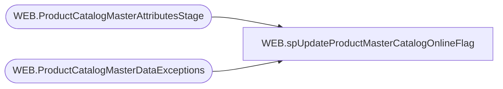

# WEB.spUpdateProductMasterCatalogOnlineFlag

**Database:** IntegrationStaging  

## Architecture Diagram



## Table Dependencies

| Referenced Table |
|---|
| WEB.ProductCatalogMasterAttributesStage |
| WEB.ProductCatalogMasterDataExceptions |

## Stored Procedure Code

```sql
CREATE proc [WEB].[spUpdateProductMasterCatalogOnlineFlag]

as 

set nocount on

-------------------------------------------------------------------------
-- spUpdateProductMasterCatalogOnlineFlag - Uses logic to set OnlineFlag for web product master catalog
-- 05-18-2017 - Dan Tweedie - Created Proc
-------------------------------------------------------------------------

begin
	with 
	OnlineTrue as
		(
			select 
				BABWProductID 
			from WEB.ProductCatalogMasterAttributesStage 
			where StoreFrontEligible = 1 --1 MEANS YES. THIS HAS BEEN PRESET BASED ON THE AVAILB / WEBNO FILTERING. 
			and MerchInDate <= cast(getdate() as date) --THE MERCHINDATE IS SET BY IDATE, UNLESS THE EXCEPTION DATE LOOKUP DATE EXISTS, NULLS WILL BE 1999-12-31
			and	Inventory >= InventoryBuffer
			UNION
			select 
				BABWProductID 
			from WEB.ProductCatalogMasterAttributesStage 
			where StoreFrontEligible = 1
			and	Inventory <= InventoryBuffer 
			and MerchInDate <= cast(getdate() as date)
			and MSTAT in ('DISC', 'REPL', 'SEAS', 'REPL-C')
			and OnOrderFlag = 1 --- MEANS ON ORDER IS >= 100
		)
	update a
	set a.OnlineFlag =
		case when exists (select f.BABWProductID from OnlineTrue f where f.BABWProductID = a.BABWProductID)
			then 1
			else 0
		end
	from WEB.ProductCatalogMasterAttributesStage a
end
--------------------------------------------------------------
begin
	update a
	set a.searchableFlag = 0
	from WEB.ProductCatalogMasterAttributesStage a
	join WEB.ProductCatalogMasterDataExceptions x on a.BABWProductID = x.style_code and x.searchable = 'NO'

	update a
	set a.SearchableIfUnavailableFlag = 0
	from WEB.ProductCatalogMasterAttributesStage a
	join WEB.ProductCatalogMasterDataExceptions x on a.BABWProductID = x.style_code and x.SearchableIfUnavailable = 'NO'

end

WEB,spUpdateProductMasterDataXtras,CREATE proc [WEB].[spUpdateProductMasterDataXtras]

as 

set nocount on

-------------------------------------------------------------------------
-- spUpdateProductMasterDataXtras - Cleans up / replaces characters in Display Name and Description from ATG file
-- 05-18-2017 - Dan Tweedie - Created Proc
-------------------------------------------------------------------------

update WEB.ProductMasterDataXtras
set 
	display_name = dbo.udf_StripHTML(display_name),
	Description = dbo.udf_StripHTML(Description)

update WEB.ProductMasterDataXtras
set 
	display_name = replace(display_name, '&copy', '©'),
	Description = replace(Description, '&copy', '©')
where
	Display_name like '%&copy%'
	or Description like '%&copy%'

update WEB.ProductMasterDataXtras
set 
	display_name = replace(display_name, '&trade', '™'),
	Description = replace(Description, '&trade', '™')
where 
	Display_name like '%&trade%'
	or Description like '%&trade%'

update WEB.ProductMasterDataXtras
set 
	display_name = replace(display_name, '&reg', '®'),
	Description = replace(Description, '&reg', '®')
where 
	Display_name like '%&reg%'
	or Description like '%&reg%'

update WEB.ProductMasterDataXtras
set 
	display_name = replace(display_name, ';', ''),
	Description = replace(Description, ';', '')
where 
	Display_Name like '%;%'  
	or Description like '%;%'  

update WEB.ProductMasterDataXtras
set 
	display_name = replace(display_name, '&rsquos', ''),
	Description = replace(Description, '&rsquos', '')
where 
	Display_name like '%&rsquos%'
	or Description like '%&rsquos%'

update WEB.ProductMasterDataXtras
set 
	display_name = replace(display_name, '&nbsp', ''),
	Description = replace(Description, '&nbsp', '')
where 
	Display_name like '%&nbsp%'
	or Description like '%&nbsp%'

update WEB.ProductMasterDataXtras
set 
	display_name = replace(display_name, '&#153', '™'),
	Description = replace(Description, '&#153', '™')
where 
	Display_name like '%&#153%'
	or Description like '%&#153%'

update WEB.ProductMasterDataXtras
set 
	display_name = replace(display_name, substring(display_name, patindex('%&#%', display_name), 5), '')
from WEB.ProductMasterDataXtras
where Display_name like '%&#%'

update WEB.ProductMasterDataXtras
set 
	Description = replace(Description, substring(Description, patindex('%&#%', Description), 5), '')
from WEB.ProductMasterDataXtras
where Description like '%&#%'

update WEB.ProductMasterDataXtras
set 
	Display_Name = replace(Display_Name, '[new]', ''),
	Description = replace(Description, '[new]', '')
where 
	left(Display_Name,5) = '[new]'
	or left(Description,5) = '[new]'

update WEB.ProductMasterDataXtras
set 
	display_name = replace(display_name, '&amp', '&'),
	Description = replace(Description, '&amp', '&')
where 
	Display_name like '%&amp%'
	or Description like '%&amp%'

update WEB.ProductMasterDataXtras
set 
	display_name = replace(display_name, 'é', 'é'),
	Description = replace(Description, 'é', 'é')
where 
	Display_name like '%é%'
	or Description like '%é%'

update WEB.ProductMasterDataXtras
set 
	display_name = replace(display_name, '–', '-'),
	Description = replace(Description, '–', '-')
where 
	Display_name like '%–%'
	or Description like '%–%'

update WEB.ProductMasterDataXtras
set 
	display_name = replace(display_name, '�', 'é'),
	Description = replace(Description, '�', 'é')
where 
	Display_name like '%�%'
	or Description like '%�%'	

update WEB.ProductMasterDataXtras
set 
	display_name = replace(display_name, '’', ''''),
	Description = replace(Description, '’', '''')
where 
	Display_name like '%’%'
	or Description like '%’%'	

update WEB.ProductMasterDataXtras
set
	display_name = replace(display_name, 'â€', ' in.'),
	Description = replace(Description, 'â€', ' in.')
where 
	display_name like '%â€%'
	or Description like '%â€%'

update WEB.ProductMasterDataXtras
set
	display_name = replace(display_name, 'â„¢', '™'),
	Description = replace(Description, 'â„¢', '™')
where 
	display_name like '%â„¢%'
	or Description like '%â„¢%'

update WEB.ProductMasterDataXtras
set
	display_name = replace(display_name, '€¿', ''''),
	Description = replace(Description, '€¿', '''')
where 
	display_name like '%€¿%'
	or Description like '%€¿%'

update WEB.ProductMasterDataXtras
set
	display_name = replace(display_name, 'Â', '™'),
	Description = replace(Description, 'Â', '™')
where 
	display_name like '%Â%'
	or Description like '%Â%'

update WEB.ProductMasterDataXtras
set
	display_name = replace(display_name, '&quot', '"'),
	Description = replace(Description, '&quot', '"')
where 
	display_name like '%&quot%'
	or Description like '%&quot%'

update WEB.ProductMasterDataXtras
set
	display_name = replace(display_name, '&eacute', 'é'),
	Description = replace(Description, '&eacute', 'é')
where 
	display_name like '%&eacute%'
	or Description like '%&eacute%'

update WEB.ProductMasterDataXtras
set
	display_name = replace(display_name, '&ndash', '-'),
	Description = replace(Description, '&ndash', '-')
where 
	display_name like '%&ndash%'
	or Description like '%&ndash%'

update WEB.ProductMasterDataXtras
set
	display_name = replace(display_name, '&middot', ''),
	Description = replace(Description, '&middot', '')
where 
	display_name like '%&middot%'
	or Description like '%&middot%'
```

