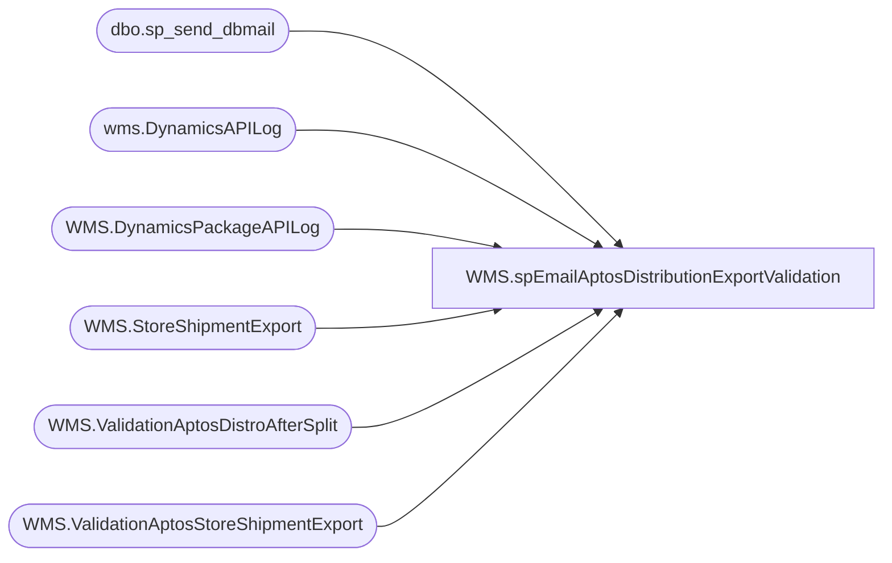

# WMS.spEmailAptosDistributionExportValidation

**Database:** IntegrationStaging  

## Architecture Diagram



## Table Dependencies

| Referenced Table |
|---|
| dbo.sp_send_dbmail |
| wms.DynamicsAPILog |
| WMS.DynamicsPackageAPILog |
| WMS.StoreShipmentExport |
| WMS.ValidationAptosDistroAfterSplit |
| WMS.ValidationAptosStoreShipmentExport |

## Stored Procedure Code

```sql
CREATE proc [WMS].[spEmailAptosDistributionExportValidation]

as

--======================================================================================================
--	Dan Tweedie	2019-08-30	Created proc to validate Aptos distro export process end to end to Dynamics
--	Tim Callahan 2022-08-02 Temp added me as BCC during 3PW Cutover 
--======================================================================================================

set nocount on 

IF (Object_ID('tempdb..#AfterSplitVsShipmentStage') IS NOT NULL) DROP TABLE #AfterSplitVsShipmentStage
select 
	distribution_number,
	distribution_line_number,
	SourceID,
	DestID,
	style_code,
	rec_type,
	release_date
into #AfterSplitVsShipmentStage
from WMS.ValidationAptosDistroAfterSplit 
where StoreShipmentNumber is NULL
and datediff(dd, release_date, getdate()) <= 3
and datepart(hh, getdate()) in (8, 10, 12, 14, 16, 18, 20) -- Temp Mark out 
and datepart(mi, getdate()) between 5 and 15 -- Temp Mark out 

IF (Object_ID('tempdb..#ShipStageVsStoreShipmentExport') IS NOT NULL) DROP TABLE #ShipStageVsStoreShipmentExport
select
	v.distribution_number,	
	v.distribution_line_number,
	v.warehouse,
	v.location_code,
	v.style_code,
	v.rec_type,
	v.release_date,
	v.StoreShipmentNumber
into #ShipStageVsStoreShipmentExport
from WMS.ValidationAptosStoreShipmentExport v
left join WMS.StoreShipmentExport sse with (nolock)
	on v.StoreShipmentNumber=sse.AptosShipmentNumber
	and v.distribution_number=sse.AptosDistroNumber
	and v.distribution_line_number=sse.AptosDistroLineNumber
	and v.style_code=sse.ItemNumber
where sse.AptosShipmentNumber is null
and datediff(dd, v.release_date, getdate()) <= 3
and datepart(hh, getdate()) in (8, 10, 12, 14, 16, 18, 20) -- Temp Mark out 
and datepart(mi, getdate()) between 5 and 15 -- Temp Mark out 

IF (Object_ID('tempdb..#StoreShipmentExportVsDynamicsAPI') IS NOT NULL) DROP TABLE #StoreShipmentExportVsDynamicsAPI;
with 
MaxDate as
	(
		select StoreShipmentNumber, max(InsertDate) as MaxDate
		from wms.DynamicsAPILog with (nolock)
		where IntegrationName in ('WMS_TransferOrderCreateFromAptos', 'WMS_POtoSOIntercompanyOrderCreate')
		and datediff(dd, InsertDate, getdate()) <= 3
		group by StoreShipmentNumber
		union
		select AptosShipmentNumber, max(BlobDate) as MaxDate
		from WMS.DynamicsPackageAPILog api with (nolock)
		where api.IntegrationName='WMS_TransferOrderCreateFromAptos'
		and datediff(dd, api.BlobDate, getdate()) <= 3
		group by AptosShipmentNumber
	),
APILog as
	(
		select 
			api.StoreShipmentNumber, 
			case 
				when api.ResponseBody like '%Transfer order%was created successully%' then 1 
				when api.ResponseBody like '%Intercompany sales order%has been created%' then 1
			else 0 end as APISuccess,
			case 
				when api.ResponseBody like '%Transfer order%was created successully%'
					then substring(api.ResponseBody, charindex('Transfer order ', api.ResponseBody, 1)+15, 12)
				when api.ResponseBody like '%Intercompany sales order%has been created%'
					then replace(substring(api.ResponseBody, charindex('Intercompany sales order ', api.ResponseBody, 1)+24, 16), ' ha', '')
				else NULL
			end as DynamicsOrder,
			api.responseBody,
			api.BatchID,
			api.InsertDate
		from wms.DynamicsAPILog api with (nolock)
		join MaxDate md 
			on api.StoreShipmentNumber=md.StoreShipmentNumber 
			and api.InsertDate=md.MaxDate
		where api.IntegrationName in ('WMS_TransferOrderCreateFromAptos', 'WMS_POtoSOIntercompanyOrderCreate')
		and datediff(dd, InsertDate, getdate()) <= 3
		UNION
		select
			api.AptosShipmentNumber,
			case
				when api.StatusResponse='Succeeded'
					then 1
				else 0
			end as APISuccess,
			'Unknown' as DynamicsOrder,
			case 
				when api.StatusResponse is NULL
					then api.TriggerResponse
				else StatusResponse
			end as responseBody,
			api.BatchID,
			api.BlobDate
		from WMS.DynamicsPackageAPILog api with (nolock)
		join MaxDate md 
			on api.AptosShipmentNumber=md.StoreShipmentNumber 
			and api.BlobDate=md.MaxDate
		where api.IntegrationName='WMS_TransferOrderCreateFromAptos'
		and datediff(dd, api.BlobDate, getdate()) <= 3
	)
select 
	sse.AptosShipmentNumber,
	sse.AptosDistroNumber,
	sse.ShipDate as DistroReleaseDate,
	isnull(api.APISuccess,0) APISuccess,
	isnull(api.DynamicsOrder,'not found') as DynamicsOrder,
	isnull(api.responseBody,'not found') as APIResponse,
	isnull(api.BatchID,'not found') as BatchID,
	isnull(api.InsertDate, getdate()) as APIDate
into #StoreShipmentExportVsDynamicsAPI
from WMS.StoreShipmentExport sse with (nolock)
left join APILog api on sse.AptosShipmentNumber=api.StoreShipmentNumber
where datediff(dd, sse.ShipDate, getdate()) <= 3
and isnull(api.APISuccess,0) = 0
and datepart(hh, getdate()) in (8, 10, 12, 14, 16, 18, 20)
and datepart(mi, getdate()) between 5 and 15
and sse.quantity <> 0
Group by 
	sse.AptosShipmentNumber,
	sse.AptosDistroNumber,
	sse.ShipDate,
	api.APISuccess,
	api.DynamicsOrder,
	api.responseBody,
	api.BatchID,
	api.InsertDate


if (select count(*) from #AfterSplitVsShipmentStage) > 0
begin
	declare @text1 nvarchar(max)
	set @text1 = 
		'<font face =arial size = 2><B>Aptos Distro Validation - Shipments Not PreStaged to me_01..store_shipment_export</B><br><br></font>' +
			'<table border="1">' +
				'<tr><th><font face =arial size = 2>distribution_number</font></th>' +
					'<th><font face =arial size = 2>distribution_line_number</font></th>' +
					'<th><font face =arial size = 2>SourceID</font></th>' +
					'<th><font face =arial size = 2>DestID</font></th>' +
					'<th><font face =arial size = 2>style_code</font></th>' + 
					'<th><font face =arial size = 2>rec_type</font></th>' + 
					'<th><font face =arial size = 2>release_date</font></th></tr>' +
		'<font face =arial size = 2>' +
			CAST ( ( SELECT td = distribution_number,'',
							td = distribution_line_number, '',
							td = SourceID, '',
							td = DestID, '',
							td = style_code, '',
							td = rec_type, '',
							td = release_date, ''
					  from #AfterSplitVsShipmentStage
					  order by distribution_number,distribution_line_number, DestID
					  FOR XML PATH('tr'), TYPE 
					) AS NVARCHAR(MAX) ) +
			'</font></table></font></p></p>
			<br>
			<font face =arial size = 1><B>This report was run from stl-ssis-p-01.IntegrationStaging.WMS.spEmailAptosDistributionExportValidation vis SSIS WMS_TransferOrderCreateFromAptos.</B></font>
			<br>
			<br>
		<font face =arial size = 1><i>The information in this message may be privileged, “confidential” and protected from disclosure and/or intended only for the addressee(s) named above.  If the reader of this message is not the intended recipient, or an employee or agent responsible for delivering this message to the intended recipient, you are hereby notified that any dissemination, distribution or copying of the communication is strictly prohibited.  If you have received this communication in error, please notify us immediately by replying to the message and deleting it from your computer.  Thank you beary much.</i></font>'

		exec msdb.dbo.sp_send_dbmail
		@profile_name = 'biadmin',
		@recipients = 'EntSysSupport@buildabear.com',
		@blind_copy_recipients = 'TimC@buildabear.com',		
		@body = @text1,
		@subject = 'Aptos Distro Validation - Shipments Not PreStaged',
		@body_format = 'HTML'
end


if (select count(*) from #ShipStageVsStoreShipmentExport where not (warehouse='0980' and location_code='9980')) > 0
begin
	declare @text2 nvarchar(max)
	set @text2 = 
		'<font face =arial size = 2><B>Aptos Distro Validation - Shipments Not Staged for API</B><br><br></font>' +
			'<table border="1">' +
				'<tr><th><font face =arial size = 2>distribution_number</font></th>' +
					'<th><font face =arial size = 2>distribution_line_number</font></th>' +
					'<th><font face =arial size = 2>warehouse</font></th>' +
					'<th><font face =arial size = 2>location_code</font></th>' +
					'<th><font face =arial size = 2>style_code</font></th>' + 
					'<th><font face =arial size = 2>rec_type</font></th>' + 
					'<th><font face =arial size = 2>release_date</font></th>' +
					'<th><font face =arial size = 2>StoreShipmentNumber</font></th></tr>' +
		'<font face =arial size = 2>' +
			CAST ( ( SELECT td = distribution_number,'',
							td = distribution_line_number, '',
							td = warehouse, '',
							td = location_code, '',
							td = style_code, '',
							td = rec_type, '',
							td = release_date, '',
							td = StoreShipmentNumber, ''
					  from #ShipStageVsStoreShipmentExport
					  where not (warehouse='0980' and location_code='9980')--added per lizzy's request
					  order by StoreShipmentNumber,distribution_number,distribution_line_number
					  FOR XML PATH('tr'), TYPE 
					) AS NVARCHAR(MAX) ) +
			'</font></table></font></p></p>
			<br>
			<font face =arial size = 1><B>This report was run from stl-ssis-p-01.IntegrationStaging.WMS.spEmailAptosDistributionExportValidation vis SSIS WMS_TransferOrderCreateFromAptos.</B></font>
			<br>
			<br>
		<font face =arial size = 1><i>The information in this message may be privileged, “confidential” and protected from disclosure and/or intended only for the addressee(s) named above.  If the reader of this message is not the intended recipient, or an employee or agent responsible for delivering this message to the intended recipient, you are hereby notified that any dissemination, distribution or copying of the communication is strictly prohibited.  If you have received this communication in error, please notify us immediately by replying to the message and deleting it from your computer.  Thank you beary much.</i></font>'

		exec msdb.dbo.sp_send_dbmail
		@profile_name = 'biadmin',
		@recipients = 'enterprisesystemsalerts@buildabear.com',
		@blind_copy_recipients = 'TimC@buildabear.com',		
		@body = @text2,
		@subject = 'Aptos Distro Validation - Shipments Not Staged for API',
		@body_format = 'HTML'
end

if (select count(*) from #StoreShipmentExportVsDynamicsAPI) > 0
begin
	declare @text3 nvarchar(max)
	set @text3 = 
		'<font face =arial size = 2><B>Aptos Distro Validation - Shipments Not In Dynamics</B><br><br></font>' +
			'<table border="1">' +
				'<tr><th><font face =arial size = 2>AptosShipmentNumber</font></th>' +
					'<th><font face =arial size = 2>AptosDistributionNumber</font></th>' +
					'<th><font face =arial size = 2>DistroReleaseDate</font></th>' +
					'<th><font face =arial size = 2>APIResponse</font></th>' +
					'<th><font face =arial size = 2>BatchID</font></th></tr>' +
		'<font face =arial size = 2>' +
			CAST ( ( SELECT td = AptosShipmentNumber,'',
							td = AptosDistroNumber,'',
							td = DistroReleaseDate, '',
							td = APIResponse, '',
							td = BatchID, ''
					  from #StoreShipmentExportVsDynamicsAPI
					  order by DistroReleaseDate,AptosShipmentNumber
					  FOR XML PATH('tr'), TYPE 
					) AS NVARCHAR(MAX) ) +
			'</font></table></font></p></p>
			<br>
			<font face =arial size = 1><B>This report was run from stl-ssis-p-01.IntegrationStaging.WMS.spEmailAptosDistributionExportValidation vis SSIS WMS_TransferOrderCreateFromAptos.</B></font>
			<br>
			<br>
		<font face =arial size = 1><i>The information in this message may be privileged, “confidential” and protected from disclosure and/or intended only for the addressee(s) named above.  If the reader of this message is not the intended recipient, or an employee or agent responsible for delivering this message to the intended recipient, you are hereby notified that any dissemination, distribution or copying of the communication is strictly prohibited.  If you have received this communication in error, please notify us immediately by replying to the message and deleting it from your computer.  Thank you beary much.</i></font>'

		exec msdb.dbo.sp_send_dbmail
		@profile_name = 'biadmin',
		@recipients = 'EntSysSupport@buildabear.com',
		@blind_copy_recipients = 'TimC@buildabear.com',		
		@body = @text3,
		@subject = 'Aptos Distro Validation - Shipments Not In Dynamics',
		@body_format = 'HTML'
end
```

