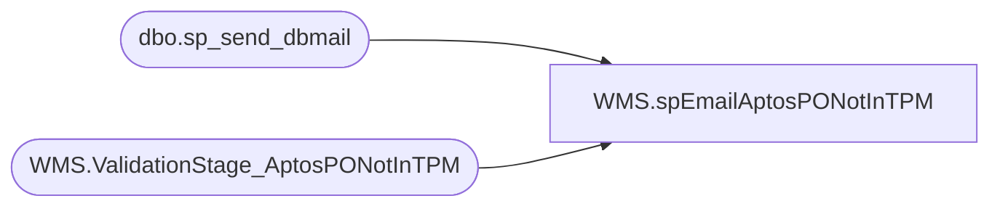

# WMS.spEmailAptosPONotInTPM

**Database:** IntegrationStaging  

## Architecture Diagram



## Table Dependencies

| Referenced Table |
|---|
| dbo.sp_send_dbmail |
| WMS.ValidationStage_AptosPONotInTPM |

## Stored Procedure Code

```sql
CREATE proc [WMS].[spEmailAptosPONotInTPM]

as 


--=======================================================================================================
--	Dan Tweedie	2019-08-20	Created proc to validate that PO's are in TPM if they were sent to Dynamics
--======================================================================================================

set nocount on

IF (Object_ID('tempdb..#PO') IS NOT null) DROP TABLE #PO

select 
	AptosPONumber,
	StageDate
into #PO 
from WMS.ValidationStage_AptosPONotInTPM

if (select count(*) from #PO ) > 0

begin

declare 
	@text nvarchar(max)

	set @text = 
		'<font face =arial size = 2><B>Aptos PO Not in TPM</B><br><br></font>' +
			'<table border="1">' +
				'<tr><th><font face =arial size = 2>AptosPONumber</font></th>' +
					'<th><font face =arial size = 2>StageDate</font></th></tr>' +
		'<font face =arial size = 2>' +
			CAST ( ( SELECT td = AptosPONumber,'',
							td = StageDate, ''
					  from #PO
					  order by StageDate, AptosPONumber
					  FOR XML PATH('tr'), TYPE 
					) AS NVARCHAR(MAX) ) +
			'</font></table></font></p></p>
			<br>
			<font face =arial size = 1><B>This report was run from stl-ssis-t-01.IntegrationStaging.WMS.spEmailAptosPONotInTPM vis SSIS WMS_Validation_AptosPOvsTPM.</B></font>
			<br>
			<br>
		<font face =arial size = 1><i>The information in this message may be privileged, “confidential” and protected from disclosure and/or intended only for the addressee(s) named above.  If the reader of this message is not the intended recipient, or an employee or agent responsible for delivering this message to the intended recipient, you are hereby notified that any dissemination, distribution or copying of the communication is strictly prohibited.  If you have received this communication in error, please notify us immediately by replying to the message and deleting it from your computer.  Thank you beary much.</i></font>'

		exec msdb.dbo.sp_send_dbmail
		@profile_name = 'biadmin',
		@recipients = 'dant@buildabear.com;elizabethw@buildabear.com;lizzyt@buildabear.com;timc@buildabear.com',
		@body = @text,
		@subject = 'Aptos PO Not in TPM',
		@body_format = 'HTML'


end
```

